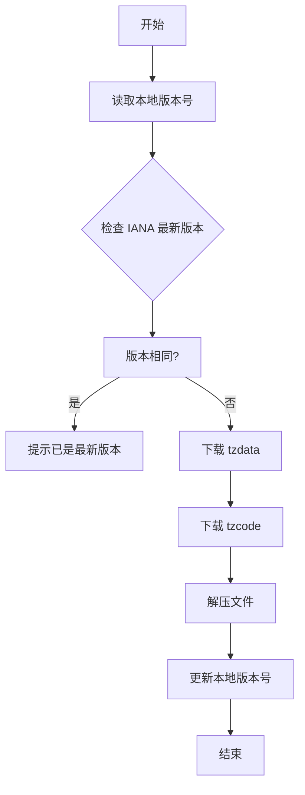
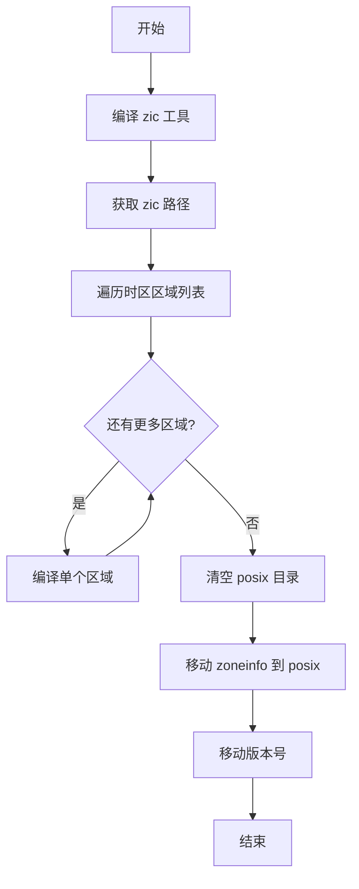

# 架构说明

## 整体架构

时区数据管理模块采用**分层架构**，分为三个主要层次：

```
┌─────────────────────────────────────────────────────────────┐
│                    应用层 (Tool Layer)                     │
│  ┌─────────────────┐        ┌─────────────────────────────┐│
│  │ download_iana.py│        │        compile.sh            ││
│  │  (数据下载工具)  │        │       (数据编译工具)         ││
│  └────────┬────────┘        └──────────────┬──────────────┘│
└───────────┼───────────────────────────────────┼─────────────┘
            │                                   │
            ▼                                   ▼
┌─────────────────────────────────────────────────────────────┐
│                   数据层 (Data Layer)                        │
│  ┌─────────────────────────────────────────────────────┐   │
│  │                    data/iana/                       │   │
│  │         (IANA 原始时区数据下载目录)                  │   │
│  └─────────────────────────────────────────────────────┘   │
└─────────────────────────────────────────────────────────────┘
            │                                   │
            ▼                                   ▼
┌─────────────────────────────────────────────────────────────┐
│                   产出层 (Output Layer)                     │
│  ┌─────────────────────┐      ┌───────────────────────────┐ │
│  │   data/prebuild/    │      │     data/prebuild/       │ │
│  │       posix/        │      │         icu/             │ │
│  │  (POSIX 时区数据)   │      │    (ICU 时区数据)        │ │
│  └─────────────────────┘      └───────────────────────────┘ │
└─────────────────────────────────────────────────────────────┘
            │                                   │
            ▼                                   ▼
┌─────────────────────────────────────────────────────────────┐
│                   系统层 (System Layer)                     │
│  ┌─────────────────────┐      ┌───────────────────────────┐ │
│  │  /usr/share/zoneinfo│     │     /etc/icu_tzdata/     │ │
│  │   (POSIX 标准路径)  │      │    (ICU 数据安装路径)    │ │
│  └─────────────────────┘      └───────────────────────────┘ │
└─────────────────────────────────────────────────────────────┘
```

## 组件说明

### 1. 时区数据下载工具 (download_iana.py)

**位置**: `tool/update_tool/download_iana.py`

**职责**:
- 从 IANA 官网下载最新时区数据
- 管理本地版本号
- 自动检测并下载更新

**核心流程**:



**关键代码片段**:

```python
# 第29-34行: 读取当前版本
def find_current_version(path):
    with os.fdopen(os.open(path, os.O_RDONLY, stat.S_IWUSR | stat.S_IRUSR), 'r') as file:
        version = file.readline().strip()
        return version

# 第59-81行: 版本遍历下载
def download(file_type, save_path, version):
    local_time = time.localtime(time.time())
    year = local_time[0]
    version_suffixes = "zyxwvutsrqponmlkjihgfedcba"
    version_index = 0
    # 从当前年份向前遍历尝试下载
```

### 2. 时区数据编译工具 (compile.sh)

**位置**: `tool/compile_tool/compile.sh`

**职责**:
- 编译 zic 工具
- 生成 POSIX 时区二进制数据

**核心流程**:



**关键代码片段**:

```bash
# 第23-27行: 编译各区域时区数据
state_name=('africa' 'antarctica' 'asia' 'australasia' 'europe' 'etcetera' 'northamerica' 'southamerica' 'backward')
for name in ${state_name[@]}
do
    ${zic_path}/zic -d ${iana_path}/zoneinfo ${iana_path}/$name
done
```

**时区区域列表**:
| 区域 | 说明 |
|------|------|
| africa | 非洲时区 |
| antarctica | 南极洲时区 |
| asia | 亚洲时区 |
| australasia | 大洋洲时区 |
| europe | 欧洲时区 |
| etcetera | UTC 和特殊时区 |
| northamerica | 北美洲时区 |
| southamerica | 南美洲时区 |
| backward | 向后兼容的旧时区定义 |

### 3. GN 构建配置 (BUILD.gn)

**位置**: `data/BUILD.gn`

**职责**:
- 定义 OpenHarmony 构建目标
- 配置安装路径

**构建目标依赖关系**:

```
icu_tzdata (group)
├── metaZones (prebuilt_etc) → /etc/icu_tzdata/
├── timezoneTypes (prebuilt_etc) → /etc/icu_tzdata/
├── windowsZones (prebuilt_etc) → /etc/icu_tzdata/
└── zoneinfo64 (prebuilt_etc) → /etc/icu_tzdata/
```

## 数据流

### 时区数据更新流程

```
┌──────────┐    ┌──────────┐    ┌──────────┐    ┌──────────┐
│  IANA    │───▶│ download  │───▶│   data/  │───▶│compile   │
│ Database │    │_iana.py  │    │   iana/  │    │   .sh    │
└──────────┘    └──────────┘    └──────────┘    └──────────┘
                                              │
                                              ▼
                                      ┌──────────────┐
                                      │  prebuild/   │
                                      │  posix/      │
                                      └──────────────┘
```

### 部署流程

```
┌──────────────┐    ┌──────────────┐    ┌──────────────┐
│ prebuild/icu │───▶│   BUILD.gn   │───▶│  /etc/icu_   │
│    *.res     │    │   (GN)      │    │   tzdata/    │
└──────────────┘    └──────────────┘    └──────────────┘
```

## 线程模型

本模块为**单线程工具模块**，不涉及复杂的多线程场景：

| 组件 | 线程模型 | 说明 |
|------|----------|------|
| download_iana.py | 主线程 | 顺序执行下载-解压-版本更新 |
| compile.sh | 主进程 | 顺序执行编译操作 |
| BUILD.gn | 构建时 | GN 构建系统管理并行编译 |

## 稳定性标注

| 组件 | 稳定性 | 说明 |
|------|--------|------|
| download_iana.py | 稳定 | 核心工具，接口稳定 |
| compile.sh | 稳定 | 核心工具，接口稳定 |
| BUILD.gn | 稳定 | OpenHarmony 标准配置 |
| 时区数据 | 更新时变化 | 随 IANA 版本更新 |

## 相关文档

- [构建指南](./02_Build.md)
- [使用指南](./04_Usage.md)
- [安全评审](./03_Security.md)
