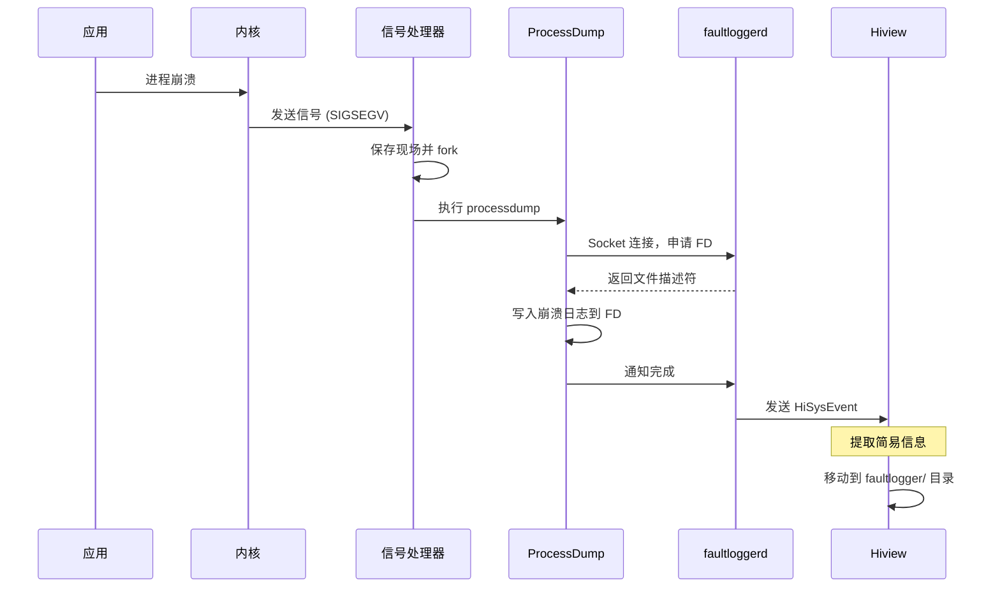
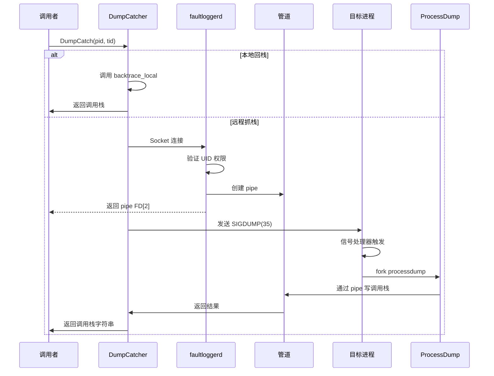
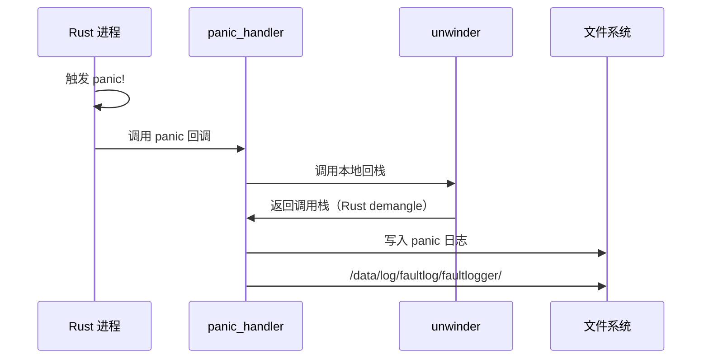

# FaultLoggerd 架构设计

## 目的

本文档介绍 faultloggerd 组件的架构设计、数据流、线程模型和关键时序。

## 适用范围

- 目标读者：系统开发者、架构设计师
- 内容范围：生产代码（排除测试目录）

## 组件架构图

```
┌─────────────────────────────────────────────────────────────────────────┐
│                         应用进程 (Application)                    │
└─────────────────────────────┬───────────────────────────────────────┘
                              │
                              │ 调用 API
                              ↓
┌─────────────────────────────────────────────────────────────────────┐
│                   Signal Handler / DumpCatcher                   │
│                   (interfaces/innerkits/)                      │
└─────────────────────────────┬─────────────────────────────────────┘
                          │
                          │ 本地/远程
                          ↓
              ┌─────────┴─────────┐
              │                         │
         [本地回栈]             [Socket 通信]
              │                         │
              │                  │ /dev/unix/socket/
              │                  ↓
              │         ┌─────────────────────────┐
              │         │   FaultLogger Daemon   │
              │         │    (services/)          │
              │         └─────────┬─────────┘
              │                   │
              │         ┌─────────┴─────────┐
              │         │  Main Server Helper│
              │         └─────────┬─────────┘
              │                   │
              │      ┌────────────┴─────────┬────────────┐
              │      │                       │          │
              │      │               [服务模块]          │
              │      │                       │          │
              │      │  FileDesService      │          │
              │      │  ExceptionReport      │          │
              │      │  StatsService        │          │
              │      │  SdkDumpService      │          │
              │      │  PipeService         │          │
              │      │  CoredumpService    │          │
              │      │                       │          │
              │      │         ┌─────────────┴─────────┐
              │      │         │  TempFileManager        │
              │      │         │  KernelSnapshotService  │
              │      │         └─────────────┬─────────┘
              │      │                   │
              │      │                   ↓ fork
              │      │         ┌─────────────────────────┐
              │      │         │  ProcessDump           │
              │      │         │  (tools/process_dump/)  │
              │      │         └─────────┬───────────────┘
              │      │                   │
              │      │                   │ 生成崩溃日志
              │      │                   ↓
              │      │         /data/log/faultlog/temp/
              │      │
              └──────────────────────────┴──────────────────────────────────
```

## 模块职责

### 1. 应用层 (Application Layer)

**职责**：使用 faultloggerd 提供的 API

**关键模块**：
- `interfaces/innerkits/dump_catcher/` - 主动抓栈 SDK
- `interfaces/innerkits/backtrace/` - 本地回栈 API
- `interfaces/innerkits/signal_handler/` - 信号处理器

### 2. 接口层 (Interface Layer)

**职责**：提供统一的 Native API 接口

**关键模块**：
- `interfaces/innerkits/unwinder/` - 符号解析和栈回退引擎
- `interfaces/innerkits/procinfo/` - 进程信息查询
- `interfaces/innerkits/formatter/` - 格式化输出
- `interfaces/rust/` - Rust Panic 处理器

### 3. 守护服务层 (Daemon Layer)

**职责**：运行 faultloggerd 守护进程，处理客户端请求

**关键模块**：
- `services/fault_logger_daemon.cpp` - 服务入口和生命周期管理
- `services/fault_logger_server.cpp` - Socket 服务器框架
- `services/fault_logger_service.cpp` - 业务逻辑处理

### 4. 工具层 (Tool Layer)

**职责**：独立可执行工具

**关键模块**：
- `tools/process_dump/` - 崩溃日志生成工具
- `tools/dump_catcher/` - 命令行抓栈工具

## 通信机制

### Socket 通信架构

faultloggerd 使用 **Unix Domain Socket** 进行进程间通信，而非传统的 IPC/SA 框架。

#### Socket 列表

| Socket 名称 | 用途 | 路径 |
|------------|------|--------|
| `faultloggerd.server` | 通用服务请求 | `/dev/unix/socket/faultloggerd.server` |
| `faultloggerd.crash.server` | 崩溃日志请求 | `/dev/unix/socket/faultloggerd.crash.server` |
| `faultloggerd.sdkdump.server` | SDK dump 请求 | `/dev/unix/socket/faultloggerd.sdkdump.server` |

#### 客户端类型（`interfaces/common/dfx_socket_request.h:50-80`）

```cpp
typedef enum FaultLoggerClientType : int8_t {
    LOG_FILE_DES_CLIENT,           // 请求 debug 文件描述符
    SDK_DUMP_CLIENT,               // 请求 SDK dump
    PIPE_FD_CLIENT,                // 请求管道描述符
    REPORT_EXCEPTION_CLIENT,       // 上报崩溃异常
    DUMP_STATS_CLIENT,             // 上报统计信息
    COREDUMP_CLIENT,               // 请求 core dump
    COREDUMP_PROCESS_DUMP_CLIENT,  // 上报 coredump 状态
    PIPE_FD_LITEPERF_CLIENT,       // 请求 lite perf 管道
    LIMITED_PROCESS_DUMP_CLIENT,   // 限制性进程 dump
    PIPE_FD_LIMITED_CLIENT,        // 限制性管道
} FaultLoggerClientType;
```

#### 请求结构

**基础请求头**（`interfaces/common/dfx_socket_request.h:21-27`）：
```cpp
typedef struct RequestDataHead {
    int8_t clientType;    // 客户端类型
    int32_t clientPid;    // 目标进程 ID
} __attribute__((packed)) RequestDataHead;
```

**SDK Dump 请求**（`interfaces/common/dfx_socket_request.h`）：
```cpp
typedef struct SdkDumpRequestData {
    RequestDataHead head;
    int32_t pid;        // 目标进程 ID
    int32_t sigCode;    // 信号码
    int32_t tid;         // 目标线程 ID
    int32_t callerTid;  // 调用者线程 ID
    uint64_t time;       // 请求时间戳
    uint64_t endTime;    // dump 结束时间戳（ms）
} __attribute__((packed)) SdkDumpRequestData;
```

**Core Dump 请求**（`interfaces/common/dfx_socket_request.h`）：
```cpp
typedef struct CoreDumpRequestData {
    RequestDataHead head;
    int32_t pid;              // 目标进程 ID
    uint64_t endTime;         // 请求时间戳
    int32_t coredumpAction;  // 动作：DO_CORE_DUMP, CANCEL_CORE_DUMP
} __attribute__((packed)) CoreDumpRequestData;
```

### 权限控制与隔离

#### UID 白名单（`services/fault_logger_service.cpp:72-78`）

```cpp
const uint32_t whitelist[] = {
    0,      // rootUid
    1000,    // bmsUid
    1201,    // hiviewUid
    1212,    // hidumperServiceUid
    5523,    // foundationUid
    7400,    // dev_assistant
};
```

#### 凭证验证（`services/fault_logger_service.cpp:88-103`）

```cpp
bool CheckRequestCredential(int32_t connectionFd, int32_t requestPid)
{
    struct ucred creds{};
    if (!FaultCommonUtil::GetUcredByPeerCred(creds, connectionFd)) {
        return false;
    }
    if (CheckCallerUID(creds.uid)) {
        return true;
    }
    if (creds.pid != requestPid) {
        DFXLOGW("Failed to check request credential request:%{public}d: cred:%{public}d fd:%{public}d",
                requestPid, creds.pid, connectionFd);
        return false;
    }
    return true;
}
```

#### SO_PEERCRED 机制

Socket 使用 `SO_PEERCRED` 选项获取对端凭据：
- **uid**：调用者用户 ID
- **pid**：调用者进程 ID
- **gid**：调用者组 ID

验证流程：
1. 检查调用者 UID 是否在白名单中
2. 对于非白名单 UID，验证请求 PID 等于连接 PID
3. 拒绝未授权请求（`ResponseCode::REQUEST_REJECT`）

## 处理流程

### 进程崩溃抓栈流程

**时序图**：
```
应用进程    内核      信号处理器      fork    ProcessDump    FaultLoggerd    Hiview
   │            │            │              │              │             │          │
   │ 崩溃      │            │              │              │             │          │
   ├───────────→  信号 (SIGSEGV 等)
   │                         │              │              │             │          │
   │                         │ fork 子进程    │              │             │          │
   │                         └────────→       │              │             │          │
   │                                      │ 申请 FD      │             │          │
   │                                      ├─────────────→ │             │          │
   │                                      │              │ Socket 请求    │          │
   │                                      │              ├─────────────→ │          │
   │                                      │              │              │ 权限验证  │          │
   │                                      │              ├─────────────→ │          │
   │                                      │              │              │ 返回 FD    │          │
   │                                      │              ├─────────────→ │          │
   │                                      │              │              │             │          │
   │                                      │ 写崩溃日志     │             │          │
   │                                      │              ├─────────────→ │          │
   │                                      │              │  /data/log/  │          │
   │                                      │              │  faultlog/temp/ │          │
   │                                      │              │              │             │          │
   │                                      │              │             │          │  上报事件     │          │
   │                                      │              ├───────────────────────────────────────→│
   │                                      │              │              │             │          │  HiSysEvent  │
```

**步骤详解**：

1. **信号接收**（`interfaces/innerkits/signal_handler/`）
   - 应用启动时加载 `dfx_signalhandler` 库
   - 注册信号处理器（SIGSEGV、SIGABRT 等）

2. **现场保存与 fork**
   - 信号处理器触发
   - 保存寄存器、栈等上下文
   - fork 子进程执行 `processdump`

3. **ProcessDump 执行**（`tools/process_dump/`）
   - 子进程读取父进程内存（`/proc/<pid>/`）
   - 生成崩溃日志（寄存器、调用栈、maps、栈内存）
   - 写入临时目录

4. **Socket 通信**
   - ProcessDump 连接 faultloggerd 服务
   - 申请文件描述符
   - 写入崩溃数据

5. **上报 Hiview**
   - faultloggerd 发送 HiSysEvent 事件
   - Hiview 提取简易信息到 `/data/log/faultlog/faultlogger`

### DumpCatcher 主动抓栈流程

**时序图**：
```
应用进程    DumpCatcher API    Socket 连接    FaultLoggerd    目标进程    ProcessDump
   │                │               │              │             │          │
   │  调用接口       │               │              │             │          │
   ├────────────────→  初始化 Socket     │              │             │          │
   │                  └─────────────→  │              │             │          │
   │                                 发送 dump 请求  │             │          │
   │                                 ├─────────────→ │          │
   │                                 │              │ 权限验证  │          │
   │                                 │              ├─────────────→ │          │
   │                                 │              │  管道分配   │          │
   │                                 │              ├─────────────→ │          │
   │                                 │              │             │          │
   │                                 │ 返回 pipe FD  │             │          │
   │                                 ├─────────────→──────────────────────┼────────→│
   │                                 │              │              │          │  发送 SIGDUMP(35) │
   │                                 │              │          │          │
   │                                 │              ├─────────────────────────────────────→│
   │                                 │              │          │          │
   │                                 │              │             │
   │                                 │              │ fork processdump         │          │
   │                                 │              ├─────────────────────────────────────→│
   │                                 │              │          │          │
   │                                 │              │             │
   │                                 │ 写调用栈到 pipe   │          │
   │                                 │              ├─────────────────────────────────────────────────────────→
   │                                 │              │          │          │
   │                                 │              │             │
   │                                 │ 返回结果          │          │
   │                                 ├─────────────────────────────────────────────────────────────────────→│
```

**关键点**：

1. **本地 vs 远程**
   - **本地回栈**：调用者进程自己，直接调用 `backtrace_local`
   - **远程抓栈**：目标进程不同，通过 socket 请求 faultloggerd

2. **管道机制**
   - faultloggerd 创建 pipe（`services/fault_logger_pipe.h:73-81`）
   - `LitePerfPipePair::CreatePipePair(uid, timeout)`
   - 通过 pipe 传递抓栈结果

3. **SIGDUMP 信号**
   - 自定义信号 `SIGDUMP (35)`（`interfaces/common/dfx_define.h`）
   - 目标进程接收到信号后触发 dump

### Rust Panic 处理流程

**时序图**：
```
Rust 进程    panic_handler    本地处理      FaultLoggerd    文件系统
   │                │               │              │             │
   │  panic!       │               │              │             │
   ├────────────────→  注册的 panic 回调  │              │             │
   │                  └─────────────→  │              │             │
   │                                 触发回栈        │             │
   │                                 ├─────────────→  │          │
   │                                 │              │             │
   │                                 │ 调用 unwinder   │             │
   │                                 ├─────────────→──────────────────────→│
   │                                                │
   │                                                │
   │                                                │ 生成 Rust panic 日志
   │                                                ├─────────────────────────────────────────────────→│
   │                                                │             │
   │                                                │             │  /data/log/faultlog/faultlogger/
   │                                                │             │
   │                                                │             │
   │                                                │             │
```

**关键 API**（`interfaces/rust/panic_handler`）：
```rust
pub fn init() {
    // 注册 panic handler
    // 设置回栈回调
    // 配置日志路径
}
```

## 线程模型

### 服务端线程结构

**主线程**（`services/main.cpp:18-27`）：
```cpp
std::thread([] {
    auto& helper = OHOS::HiviewDFX::EpollManager::GetInstance();
    helper.Init(maxEpollEvent);
    OHOS::HiviewDFX::FaultLoggerDaemon::GetInstance().InitHelperServer();
    helper.StartEpoll(maxConnection);
}).detach();
```

**Epoll 事件循环**（`services/epoll_manager.cpp`）：
- 使用 `epoll_wait` 监听多个文件描述符
- 单线程事件驱动模型
- 最大连接数：30（`services/main.cpp:18`）
- 最大 epoll 事件：1024

### ProcessDump 线程

**fork 后子进程**（`tools/process_dump/`）：
- 单线程执行 dump
- 读取父进程 `/proc/[pid]/` 信息
- 调用 unwinder 解析符号
- 写入 pipe 或文件

### 并发控制

**Pipe 并发限制**（`services/fault_logger_pipe.cpp:167-180`）：
```cpp
constexpr int32_t uidPerfLimit = 20;
if (perfCount >= uidPerfLimit) {
    DFXLOGW("%{public}s :: perf resource is limited for uid %{public}d.",
              FAULTLOGGERD_SERVICE_TAG, uid);
    return false;
}
```

**Lite Dump 限制**（`services/fault_logger_service.cpp:51-62`）：
```cpp
constexpr int LITE_DUMP_LIMIT_ONE_DAY = 60;
constexpr int ONE_DAY_SEC = 24 * 60 * 60;
```

## 数据流

### 崩溃日志数据结构

```
cppcrash-{pid}-{timestamp}
├── 进程信息
│   ├── Pid: <进程号>
│   ├── Uid: <用户ID>
│   └── Process name: <进程名>
├── 故障信息
│   ├── Reason: Signal:SIGSEGV(SEGV_MAPERR)@0x<地址>
│   └── Fault thread info:
│       ├── Tid: <线程号>, Name: <线程名>
│       └── 调用栈
├── 寄存器
│   └── r0-r15: <寄存器值>
├── FaultStack
│   └── <栈帧内存 dump>
└── Maps
    └── <虚拟内存映射>
```

### HiSysEvent 事件

**CPP_CRASH 事件**（`services/fault_logger_service.cpp:128-142`）：
```cpp
HiSysEventWrite(
    HiSysEvent::Domain::RELIABILITY,
    "CPP_CRASH_EXCEPTION",
    HiSysEvent::EventType::FAULT,
    "PID", requestData.pid,
    "UID", requestData.uid,
    "HAPPEN_TIME", requestData.time,
    "ERROR_CODE", requestData.error,
    "ERROR_MSG", requestData.message);
```

**DUMP_CATCHER_STATS 事件**（`services/fault_logger_service.cpp:154-176`）：
```cpp
HiSysEventWrite(
    HiSysEvent::Domain::HIVIEWDFX,
    "DUMP_CATCHER_STATS",
    HiSysEvent::EventType::STATISTIC,
    "CALLER_PROCESS_NAME", stat.callerProcessName,
    "CALLER_FUNC_NAME", stat.callerElfName,
    "TARGET_PROCESS_NAME", stat.targetProcessName,
    "RESULT", stat.result,
    "SUMMARY", stat.summary,
    "PID", stat.pid,
    "REQUEST_TIME", stat.requestTime,
    ...
    "PSS_MEMORY", stat.pssMemory);
```

## 关键时序

### 1. 应用崩溃 → 崩溃日志



### 2. DumpCatcher 主动抓栈



### 3. Rust Panic 处理



## 配置管理

### 服务配置（`services/config/faultlogger.conf`）

```
displayRigister=true          # 是否显示寄存器
displayBacktrace=true          # 是否显示调用栈
displayMaps=true               # 是否显示内存映射
displayFaultStack.switch=true  # 是否显示崩溃栈内存
displayFaultStack.lowAddressStep=16
displayFaultStack.highAddressStep=4
dumpOtherThreads=false        # 是否转储非崩溃线程信息
```

### 服务能力配置（`services/config/faultloggerd.cfg:22-75`）

```
{
    "services": [{
        "name": "faultloggerd",
        "path": ["/system/bin/faultloggerd"],
        "uid": "faultloggerd",
        "gid": ["system", "log", "faultloggerd", "readproc"],
        "socket": [{
            "name": "faultloggerd.server",
            "family": "AF_UNIX",
            "type": "SOCK_STREAM",
            "permissions": "0666",
            "option": ["SOCKET_OPTION_PASSCRED"]
        }],
        "caps": ["CAP_DAC_READ_SEARCH", "CAP_KILL"]
    }]
}
```

## TODO

- [ ] 📋 补充服务端各模块的详细时序图
- [ ] 📋 添加临时文件管理器的时序图
- [ ] 📋 补充 kernel snapshot 处理流程

## 相关跳转

- [项目定位与核心能力](00_Overview.md) - 项目概览和核心能力
- [目录结构与模块职责](01_Directory_Structure.md) - 代码组织
- [对外 API](03_External_API.md) - API 详细文档
- [安全风险评审](07_Security_Review.md) - 安全模型和权限控制
