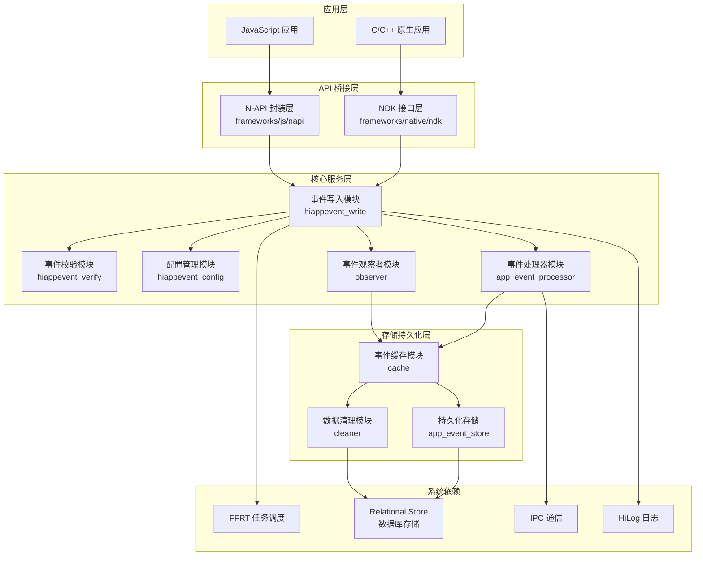
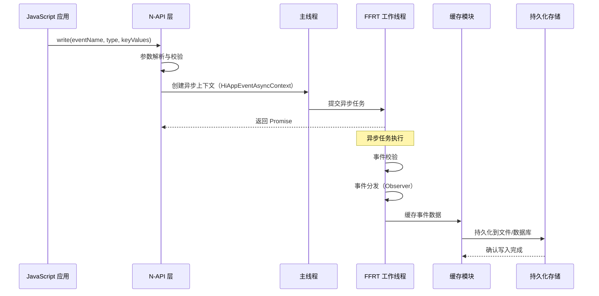

# 架构设计

## 2.1 整体架构概览

HiAppEvent 组件采用分层架构设计，从上至下依次为应用接入层、API 桥接层、核心服务层和存储持久化层。这种分层设计清晰地划分了各层的职责边界，使得系统具有良好的可维护性和可扩展性。以下通过 Mermaid 图示展示 HiAppEvent 的整体架构：



**应用接入层**：位于架构的最顶层，直接面向应用开发者。该层提供两种主要的接入方式：一是面向 JavaScript 开发者的 N-API 接口，通过 `@ohos.hiAppEvent` 模块暴露；二是面向 C/C++ 开发者的 NDK 接口，通过 `hiappevent/hiappevent.h` 头文件暴露。两种接入方式在功能上保持一致，开发者可根据应用的技术栈选择合适的接口。

**API 桥接层**：负责处理应用层与核心服务层之间的数据转换和协议适配。对于 N-API 接口，该层负责解析 JavaScript 类型的参数，将其转换为 C++ 内部可识别的数据结构；同时负责将异步操作结果封装为 Promise 或 Callback 形式返回给 JavaScript 调用方。对于 NDK 接口，该层主要进行参数校验和错误码转换，确保 Native 调用者能够正确获取操作结果。

**核心服务层**：包含 HiAppEvent 的核心业务逻辑，是整个组件的功能中枢。主要模块包括：
- **事件写入模块**：接收来自 API 桥接层的事件数据，调用事件校验模块完成参数校验后，触发后续的事件分发和持久化流程
- **事件校验模块**：对事件的参数进行完整性校验，包括参数名称长度检查、参数值类型检查、参数值范围检查等
- **配置管理模块**：管理 HiAppEvent 的运行时配置，包括打点开关、存储配额等
- **事件观察者模块**：管理事件观察者的注册和注销，当匹配条件的事件发生时，异步通知所有已注册的观察者
- **事件处理器模块**：管理事件处理器的配置和路由，支持将事件数据上报至远程服务器

**存储持久化层**：负责事件数据的持久化存储和管理。包括事件缓存（内存中的事件队列）、数据清理（存储空间管理）和持久化存储（文件或数据库落盘）三个子模块。

**系统依赖层**：HiAppEvent 依赖的底层系统能力，包括 FFRT（任务调度）、IPC（进程间通信）、RDB（关系型数据库存储）和 HiLog（日志输出）等。

## 2.2 模块职责与依赖关系

本节详细描述 HiAppEvent 各核心模块的职责定义、对外接口和模块间的依赖方向。

### 2.2.1 事件写入模块（hiappevent_write）

**模块职责**：事件写入模块是 HiAppEvent 的核心入口模块，负责接收外部的事件写入请求，完成参数校验后，触发事件的异步处理流程。该模块对外提供 C++ 接口 `HiAppEvent::Write()` 和 C 接口 `OH_HiAppEvent_Write()`，是所有事件写入操作的统一入口。

**头文件位置**：`frameworks/native/libhiappevent/include/hiappevent_write.h`

**核心接口**：
```cpp
// C++ 接口
namespace OHOS {
namespace HiviewDFX {
namespace HiAppEvent {
    int Write(const Event& event);
}
}
}

// C 接口
int OH_HiAppEvent_Write(const char* domain, const char* name, 
                        enum EventType type, const ParamList list);
```

**依赖关系**：该模块依赖以下内部模块和系统服务：
- 依赖 `hiappevent_verify` 模块进行参数校验
- 依赖 `hiappevent_config` 模块获取运行时配置
- 依赖 `observer` 模块进行事件分发
- 依赖 `cache` 模块进行事件缓存和持久化
- 依赖 FFRT 进行异步任务调度
- 依赖 HiLog 进行日志输出

**调用链**：N-API Write → C++ Write → Verify → Observer.Dispatch → Cache.Persist

### 2.2.2 事件校验模块（hiappevent_verify）

**模块职责**：事件校验模块负责对事件的各项参数进行完整性校验，确保写入的事件数据符合预定义的规范。该模块的校验规则可配置，支持通过配置文件定义白名单事件列表、参数名称规则、参数值限制等。

**头文件位置**：`frameworks/native/libhiappevent/include/hiappevent_verify.h`

**核心接口**：
```cpp
int VerifyAppEvent(const AppEventPack& eventPack);
```

**校验规则**：校验模块执行以下检查项目：
- 事件名称（name）非空检查
- 事件名称长度限制（最大 128 字符）
- 参数名称（key）长度限制（最大 256 字符）
- 参数值长度限制（字符串类型最大 4096 字符）
- 参数数量限制（单事件最大 100 个参数）
- 白名单事件校验（若启用白名单模式）

**依赖关系**：该模块主要依赖配置模块获取校验规则，不涉及其他业务模块。

### 2.2.3 配置管理模块（hiappevent_config）

**模块职责**：配置管理模块负责管理 HiAppEvent 的运行时配置，包括全局打点开关、存储配额、清理策略等。该模块提供了配置读取、配置更新和配置持久化等功能。

**头文件位置**：`frameworks/native/libhiappevent/include/hiappevent_config.h`

**核心配置项**：
| 配置项名称 | 类型 | 默认值 | 说明 |
|-----------|------|--------|------|
| disable | bool | false | 打点功能开关，true 表示关闭打点 |
| maxStorage | string | "10M" | 事件存储目录配额大小 |
| eventTypeSwitch | string | "1,2,3,4" | 各类型事件开关位 |

**依赖关系**：该模块依赖以下系统服务：
- 依赖配置文件解析（jsoncpp）
- 依赖首选项存储（Preferences）

### 2.2.4 事件观察者模块（observer）

**模块职责**：事件观察者模块实现了观察者设计模式，允许应用注册对特定条件事件的监听。当满足过滤条件的事件发生时，系统会异步触发观察者的回调函数。该机制常用于实现事件实时监控、日志转发、远程上报等场景。

**头文件位置**：`frameworks/native/libhiappevent/observer/include/app_event_observer.h`

**核心接口**：
```cpp
// 创建观察者
HiAppEvent_Watcher* OH_HiAppEvent_CreateWatcher(const char* name);

// 设置事件过滤条件
int OH_HiAppEvent_SetAppEventFilter(HiAppEvent_Watcher* watcher, 
                                    const char* domain, uint8_t eventTypes,
                                    const char* const *names, int namesLen);

// 设置触发条件
int OH_HiAppEvent_SetTriggerCondition(HiAppEvent_Watcher* watcher, 
                                      int row, int size, int timeOut);

// 设置接收回调
int OH_HiAppEvent_SetWatcherOnReceive(HiAppEvent_Watcher* watcher, 
                                      OH_HiAppEvent_OnReceive onReceive);

// 添加观察者
int OH_HiAppEvent_AddWatcher(HiAppEvent_Watcher* watcher);
```

**依赖关系**：该模块依赖以下组件：
- 依赖事件写入模块进行事件分发
- 依赖 FFRT 进行异步回调调度

### 2.2.5 事件处理器模块（app_event_processor）

**模块职责**：事件处理器模块负责将事件数据上报至远程服务器，支持配置上报路由、上报策略、用户身份等。该模块是 HiAppEvent 支持云端事件分析的关键组件。

**头文件位置**：`interfaces/native/kits/include/hiappevent/hiappevent.h`

**核心接口**：
```cpp
// 创建处理器
HiAppEvent_Processor* OH_HiAppEvent_CreateProcessor(const char* name);

// 设置上报路由
int OH_HiAppEvent_SetReportRoute(HiAppEvent_Processor* processor, 
                                 const char* appId, const char* routeInfo);

// 设置上报策略
int OH_HiAppEvent_SetReportPolicy(HiAppEvent_Processor* processor, 
                                  int periodReport, int batchReport,
                                  bool onStartReport, bool onBackgroundReport);

// 添加处理器
int64_t OH_HiAppEvent_AddProcessor(HiAppEvent_Processor* processor);
```

**依赖关系**：该模块依赖以下组件：
- 依赖 IPC 进行远程通信
- 依赖配置模块获取服务器路由信息

## 2.3 线程模型与并发控制

HiAppEvent 组件的线程模型设计充分考虑了多线程环境下的性能要求和数据一致性要求。以下从不同维度分析组件的线程模型设计。

### 2.3.1 线程角色划分

**主线程（JS 线程）**：N-API 接口的主要调用线程，负责接收来自 JavaScript 应用的事件写入请求。由于 N-API 接口本身运行在 JS 线程上，因此事件写入的入口函数（Write、Configure 等）首先在主线程执行参数解析和校验，然后通过异步任务调度将耗时操作转移到工作线程。

**FFRT 工作线程**：HiAppEvent 使用 FFRT（Function Flow Runtime）作为异步任务调度框架。所有涉及 I/O 操作（如文件写入、数据库操作）和 CPU 密集型操作（如 JSON 序列化）的任务，都会被调度到 FFRT 工作线程执行，避免阻塞主线程影响应用响应性。

**IPC 线程**：事件处理器模块在进行远程服务器通信时，涉及 IPC 调用，这部分操作运行在专门的 IPC 线程上。IPC 线程由系统 IPC 框架管理，与应用进程的主线程相互独立。

### 2.3.2 异步处理流程

事件写入的完整异步处理流程如下：



### 2.3.3 线程安全设计

HiAppEvent 内部采用以下机制保证线程安全：

**无锁队列**：事件写入使用无锁队列（Lock-free Queue）作为线程间数据传输的缓冲，避免频繁的锁竞争带来的性能开销。

**读写锁保护**：配置信息、观察者列表等共享数据结构使用读写锁（RWLock）进行保护，允许并发读取但互斥写入。

**原子操作**：配置开关、统计计数器等简单变量使用原子变量（std::atomic）实现线程安全的读写操作。

## 2.4 数据流设计

本节从数据流角度分析事件信息在 HiAppEvent 组件内部的流转路径。

### 2.4.1 事件写入数据流

```
┌─────────────┐     ┌──────────────┐     ┌─────────────────┐
│ JavaScript  │────▶│ N-API 解析层 │────▶│ 参数校验模块    │
│ 应用代码    │     │              │     │                 │
└─────────────┘     └──────────────┘     └─────────────────┘
                                                    │
                                                    ▼
┌─────────────┐     ┌──────────────┐     ┌─────────────────┐
│ 本地存储    │◀────│ 持久化模块    │◀────│ 事件缓存模块    │
│             │     │              │     │                 │
└─────────────┘     └──────────────┘     └─────────────────┘
        │                                         │
        │                                         ▼
        │                               ┌─────────────────┐
        │                               │ 观察者回调模块  │
        │                               │                 │
        └───────────────────────────────└─────────────────┘
```

### 2.4.2 数据格式定义

事件数据在内部以 JSON 格式存储，示例结构如下：

```json
{
  "domain": "hiappevent",
  "name": "user_login",
  "type": 4,
  "time": 1640995200000,
  "pid": 12345,
  "tid": 67890,
  "uid": 10000,
  "bundleName": "com.example.myapp",
  "params": {
    "user_id": "U123456",
    "login_type": "password",
    "device_id": "DABCDEF"
  }
}
```

**字段说明**：
- **domain**：事件领域（字符串）
- **name**：事件名称（字符串）
- **type**：事件类型（整数，1-FAULT、2-STATISTIC、3-SECURITY、4-BEHAVIOR）
- **time**：事件发生时间戳（毫秒）
- **pid**：进程 ID
- **tid**：线程 ID
- **uid**：用户 ID
- **bundleName**：应用包名
- **params**：事件参数字典（键值对）

## 2.5 配置与扩展机制

HiAppEvent 提供了灵活的配置和扩展机制，支持在不修改核心代码的情况下定制组件行为。

### 2.5.1 配置文件机制

组件支持通过配置文件（JSON 格式）调整运行时行为，配置文件位于：
```
/data/service/el2/100/hiappevent/hiappevent.cfg
```

**配置项示例**：
```json
{
  "disable": false,
  "maxStorage": "10M",
  "eventTypeSwitch": "1,2,3,4",
  "whiteList": {
    "domain_name": ["event1", "event2"]
  },
  "paramRules": {
    "maxParamCount": 100,
    "maxParamKeyLength": 256,
    "maxParamValueLength": 4096
  }
}
```

### 2.5.2 事件处理器扩展

通过 Processor 机制，HiAppEvent 支持扩展不同的事件上报处理器。内置支持的处理器类型包括：

**本地存储处理器**：将事件数据持久化到本地存储（默认启用）

**远程上报处理器**：通过 HTTP/HTTPS 协议将事件上报至远程服务器

**SysEvent 上报处理器**：将事件转发至系统事件服务（HiSysEvent）

### 2.5.3 模块热加载

HiAppEvent 支持处理器配置的热加载，当配置文件发生变更时，无需重启应用即可生效。热加载机制由 `module_loader.cpp` 和 `processor_config_loader.cpp` 实现。
