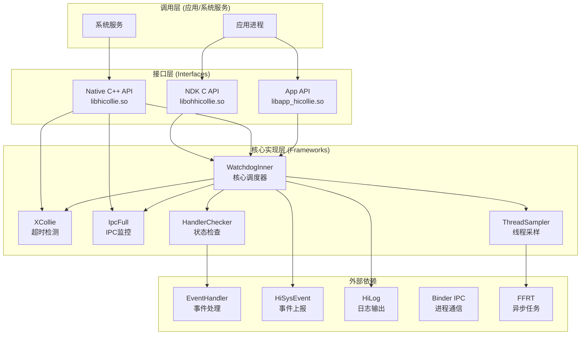
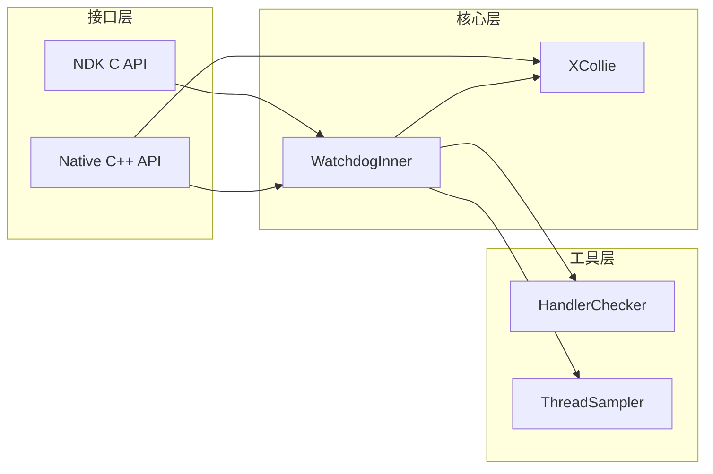

# HiCollie 项目概览

> 项目定位、核心能力、运行环境与关键概念

---

## 目的与适用范围

### 文档目的
本文档帮助新人快速理解 HiCollie 软件看门狗组件的定位、核心能力和架构设计。

### 适用读者
- **应用开发者** - 需要在应用中集成 HiCollie 进行故障检测
- **系统服务开发者** - 需要在系统服务中使用 HiCollie 进行线程监控
- **安全审计员** - 需要理解 HiCollie 的安全机制和攻击面
- **构建工程师** - 需要了解 HiCollie 的构建系统和依赖关系

### 不适用场景
- ❌ JavaScript/ArkTS 应用 - HiCollie 不提供 N-API 接口
- ❌ 实时性要求极高的场景 - HiCollie 采用周期性检测，存在 3-15 秒检测延迟
- ❌ 需要跨进程看门狗的场景 - HiCollie 是单进程内检测框架

---

## 项目定位

### 所属子系统
HiCollie 属于 **OpenHarmony DFX (Debugging and Fault Analysis) 子系统**，与以下组件协同工作：

| 组件 | 职责 |
|------|------|
| **HiLog** | 日志输出 |
| **HiSysEvent** | 系统事件上报 |
| **HiTrace** | 性能追踪 |
| **HiDumper** | 信息转储 |
| **faultloggerd** | 故障日志收集 |

### 核心能力

#### 1. 软件看门狗 (Software Watchdog)
**证据**: `interfaces/native/innerkits/include/xcollie/watchdog.h:35-42`

提供周期性线程监控，检测 EventHandler 是否及时处理事件：
- 检测主线程阻塞
- 支持自定义检测间隔（默认 30 秒）
- 支持优先级队列

#### 2. 超时检测 (Timeout Detection)
**证据**: `interfaces/native/innerkits/include/xcollie/xcollie.h:39-45`

提供定时器机制，监控业务流程超时：
- 单进程最多支持 128 个定时器
- 支持计数器模式（事件次数 + 时间窗口）
- 支持恢复策略（日志、进程退出）

#### 3. IPC Full 监控 (IPC Full Detection)
**证据**: `interfaces/native/innerkits/include/xcollie/ipc_full.h:28-33`

监控 Binder IPC 缓冲区使用情况：
- 检测 IPC 调用阻塞
- 检测 Binder 空间不足
- 支持杀死对端进程恢复

#### 4. 卡顿检测 (Jank Detection)
**证据**: `interfaces/ndk/include/hicollie.h:99-120`

检测业务线程卡顿：
- 支持 Stuck 检测（业务线程阻塞 6 秒）
- 支持 Jank 检测（事件处理时长超标）
- 自动收集堆栈信息

#### 5. 线程堆栈采样 (Thread Stack Sampling)
**证据**: `frameworks/native/thread_sampler/include/thread_sampler.h`

通过信号机制进行线程栈采样：
- 无侵入式采样（使用 SIGURG 信号）
- 支持双缓冲设计
- 集成 libunwind 进行栈回溯

---

## 运行环境

### 系统能力 (SysCap)
**证据**: `bundle.json:21-23`

```json
"syscap": [
    "SystemCapability.HiviewDFX.HiCollie"
]
```

### 依赖组件

| 依赖组件 | 依赖原因 | BUILD.gn 位置 |
|---------|---------|---------------|
| `c_utils:utils` | 工具函数 | `frameworks/native/BUILD.gn:40` |
| `hilog:libhilog` | 日志输出 | `frameworks/native/BUILD.gn:44` |
| `ipc:ipc_core` | IPC 监控 | `frameworks/native/BUILD.gn:47` |
| `ffrt:libffrt` | FFRT 任务框架 | `frameworks/native/BUILD.gn:43` |
| `faultloggerd:libbacktrace_local` | 堆栈回溯 | `frameworks/native/BUILD.gn:41` |
| `eventhandler:libeventhandler` | EventHandler 支持 | `frameworks/native/BUILD.gn:73` |
| `ability_runtime:app_manager` | 应用故障上报 | `interfaces/ndk/BUILD.gn:28` |

### 配置开关
**证据**: `hicollie.gni:18-23`

| 配置项 | 默认值 | 说明 |
|-------|---------|------|
| `hicollie_jank_detection_enable` | `true` | 启用卡顿检测 |
| `hicollie_suspend_check_enable` | `false` | 启用暂停检查 |
| `hicollie_kick_watchdog_enable` | `false` | 启用喂狗功能 |
| `hicollie_asyncbinderspacefull_enable` | `false` | 启用异步 Binder 空间满检测 |

---

## 关键概念

### 1. 单例模式 (Singleton Pattern)
HiCollie 中多个核心类采用单例模式：
- **Watchdog** - 对外 C++ 接口单例
- **XCollie** - 超时检测单例
- **WatchdogInner** - 核心调度器单例
- **IpcFull** - IPC 监控单例
- **ThreadSampler** - 线程采样器单例

**证据**: `watchdog.h:23-26`
```cpp
class Watchdog : public Singleton<Watchdog> {
    DECLARE_SINGLETON(Watchdog);
    // ...
};
```

### 2. 优先级任务队列 (Priority Queue)
核心调度器 `WatchdogInner` 使用优先级队列管理检测任务：
- 任务按 `nextTickTime` 排序
- 支持延迟执行
- 最大 128 个任务限制

**证据**: `watchdog_inner.h:164`
```cpp
std::priority_queue<WatchdogTask> checkerQueue_;
```

### 3. Handler 检查机制 (Handler Checker)
通过向目标 EventHandler 投递探测任务来检测响应：
- **COMPLETED** - Handler 及时处理任务
- **WAITING** - Handler 未处理
- **WAITED_HALF** - Handler 响应延迟（警告）

**证据**: `handler_checker.h:28-32`
```cpp
enum CheckStatus {
    COMPLETED = 0,
    WAITING = 1,
    WAITED_HALF = 2,
};
```

### 4. UID 权限隔离
HiCollie 通过 UID 区分系统服务和普通应用：
- `UID < 20000` - 系统服务
- `UID >= 20000` - 普通应用（受限操作）

**证据**: `watchdog_task.cpp:46`
```cpp
constexpr int UID_TYPE_THRESHOLD = 20000;
```

### 5. FFRT (Foundation Fault Response Task)
故障响应任务框架，用于异步 Trace 采集和任务监控。

---

## 系统架构图

### 整体架构



**证据**: `watchdog_inner.h:38-96` - WatchdogInner 核心类声明

### 模块依赖关系



---

## 关键结论

### 功能定位
HiCollie 是**单进程内的故障检测框架**，提供：
- ✅ 软件看门狗（线程监控）
- ✅ 超时检测（定时器 + 计数器）
- ✅ IPC Full 监控（Binder 状态）
- ✅ 卡顿检测（Stuck + Jank）
- ✅ 线程堆栈采样（无侵入式）

### API 暴露
- ✅ **NDK C API** - `libohhicollie.so` (兼容纯 C 开发)
- ✅ **Native C++ API** - `libhicollie.so` (C++ 开发首选)
- ✅ **App API** - `libapp_hicollie.so` (应用层专用)
- ❌ **N-API** - 不提供 JavaScript 绑定

### 安全机制
- ✅ UID 权限隔离（20000 阈值）
- ✅ 参数校验（空指针、范围、长度）
- ✅ 进程名白名单/黑名单
- ✅ 安全内存操作（memcpy_s, snprintf_s）

### 性能影响
- 周期性检测开销（3-30 秒间隔）
- 线程栈采样开销（信号处理）
- 动态库加载（libthread_sampler.z.so, libasync_stack.z.so）

---

## 相关跳转

- [目录结构](01_Directory_Structure.md) - 了解代码组织
- [架构说明](02_Architecture.md) - 深入理解设计
- [NDK C API](03_NDK_API.md) - 学习接口使用
- [安全评审](07_Security_Review.md) - 了解安全机制
