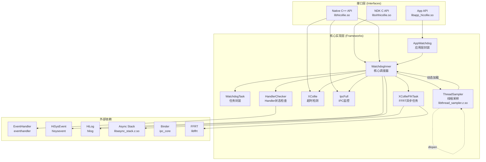
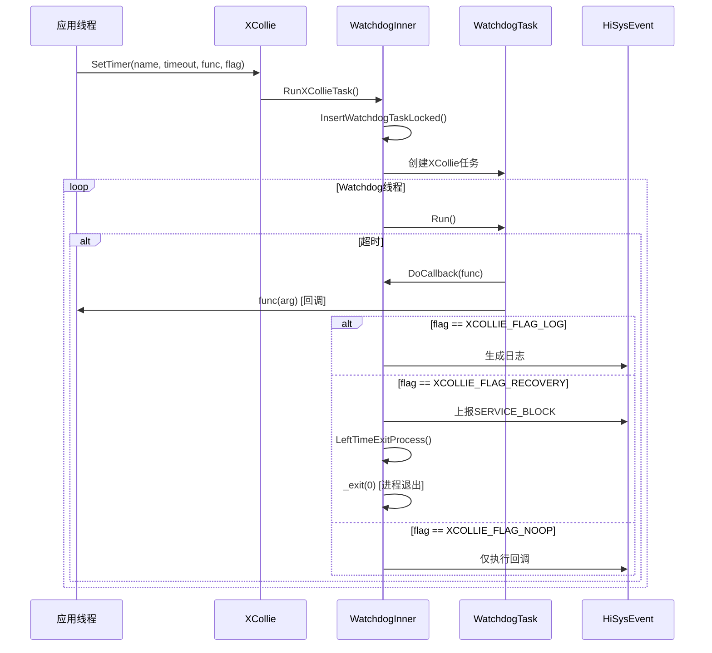
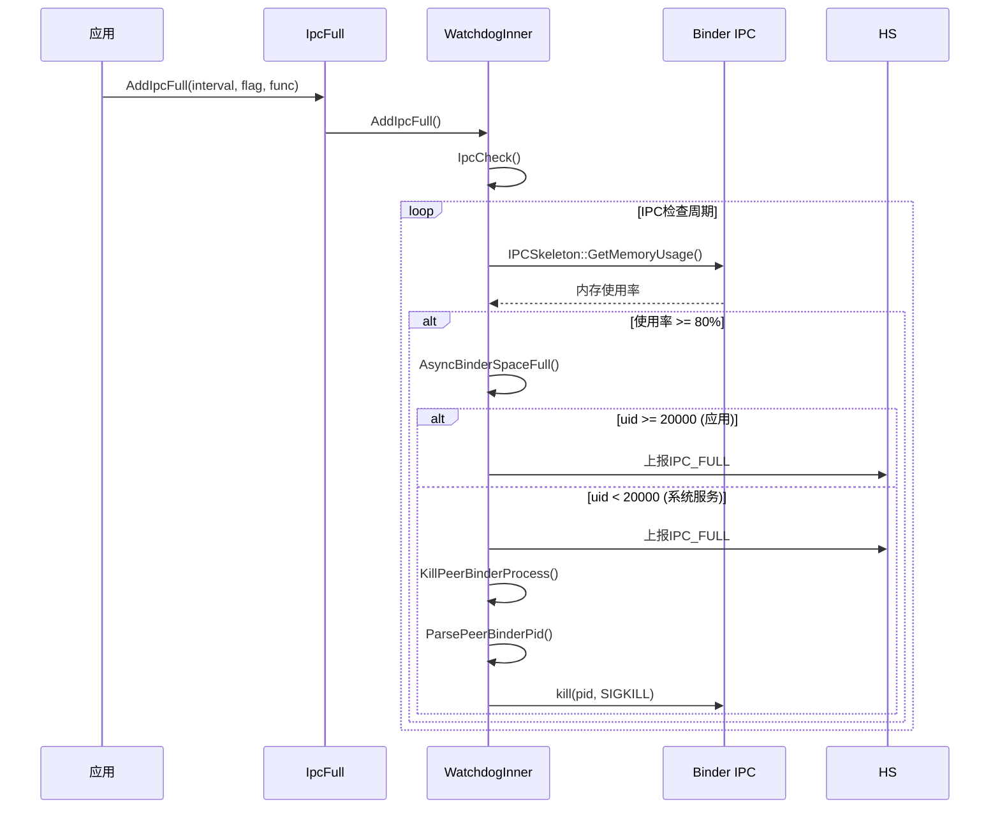
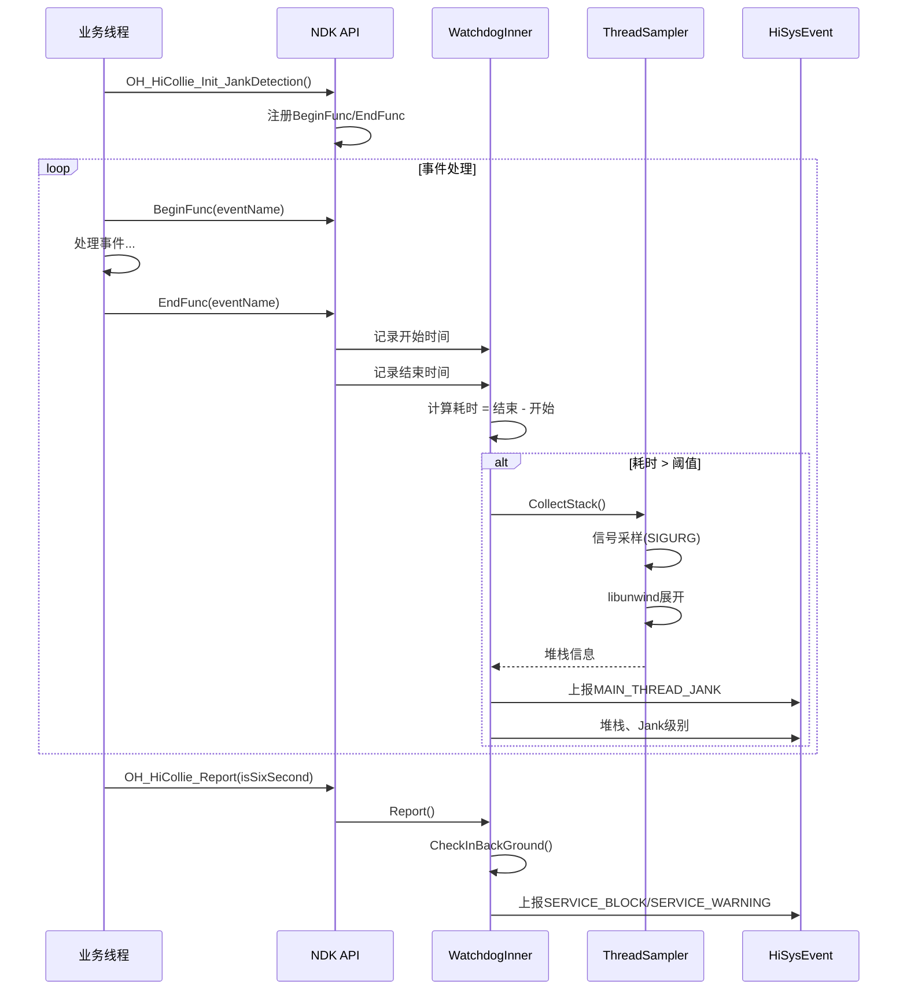
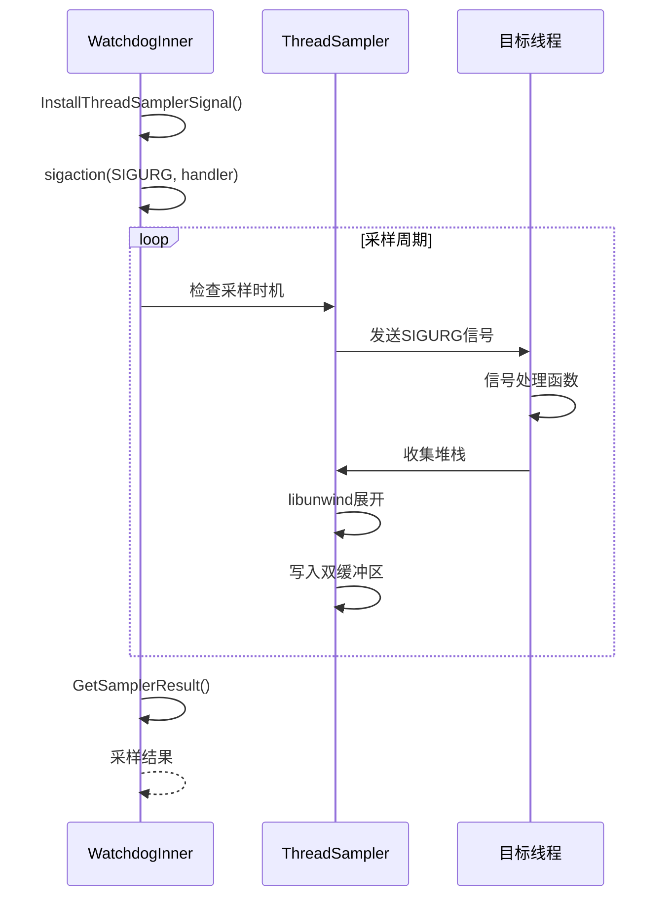
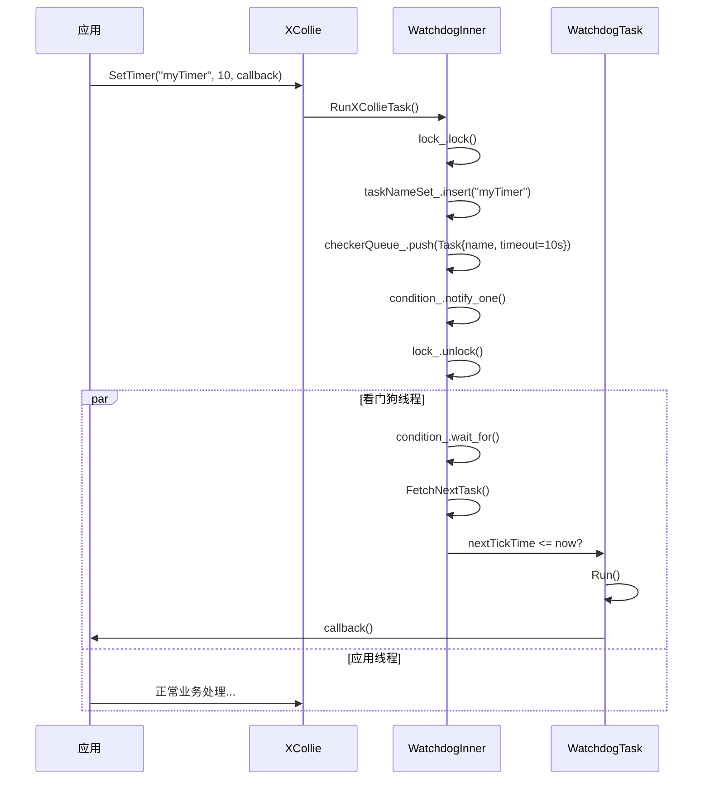
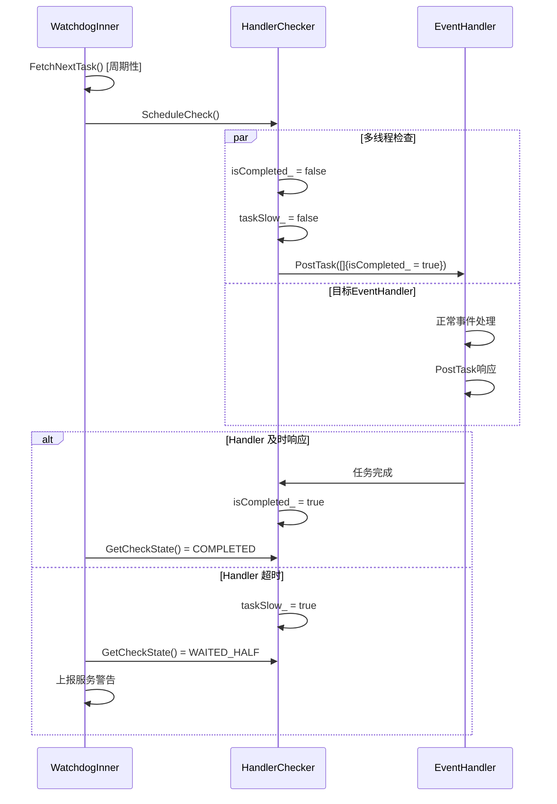
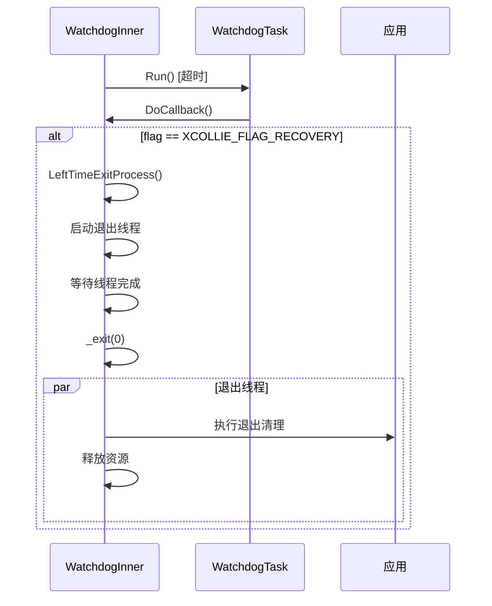

# HiCollie 架构说明

> 组件图、数据流、线程模型、关键时序

---

## 目的与适用范围

### 文档目的
本文档帮助开发者深入理解 HiCollie 的架构设计，包括组件关系、数据流向、线程模型和关键执行流程。

### 适用场景
- 🏗️ **架构分析** - 理解组件交互和依赖关系
- 🔍 **问题调试** - 跟踪代码执行路径
- 🔄 **性能优化** - 理解并发和同步机制

---

## 组件架构图

### 整体架构



**证据**: 
- `watchdog_inner.h:38` - WatchdogInner 单例类
- `watchdog_task.h` - WatchdogTask 任务封装
- `handler_checker.h:34` - HandlerChecker 检查器
- `xcollie.h:25` - XCollie 单例类

---

## 数据流

### 1. Watchdog 监控流程

```mermaid
sequenceDiagram
    participant App as 应用线程
    participant WD as WatchdogInner
    participant HC as HandlerChecker
    participant EH as EventHandler
    participant Queue as 任务队列

    App->>WD: AddThread(handler, interval)
    WD->>WD: InsertWatchdogTaskLocked()
    WD->>Queue: 添加任务(优先级排序)
    WD->>WD: CreateWatchdogThreadIfNeed()
    WD->>WD: Start() [后台线程]

    loop 每 interval 秒
        WD->>Queue: FetchNextTask()
        WD->>HC: ScheduleCheck()
        HC->>EH: PostTask(检测任务)
        EH-->>HC: 任务完成
        HC->>WD: GetCheckState()
        alt 超时
            WD->>App: TimeOutCallback()
            WD->>HS: 上报SERVICE_TIMEOUT
        else 正常
            WD->>WD: ReInsertTaskIfNeed()
    end
```

**证据**: `watchdog_inner.cpp:985-1007` - AddThread 实现

### 2. XCollie 超时检测流程



**证据**: `xcollie.cpp:32-36` - SetTimer 实现

### 3. IPC Full 监控流程



**证据**: `watchdog_inner.cpp:1501-1554` - IpcCheck 实现

### 4. Jank 检测流程



**证据**: `interfaces/ndk/hicollie.cpp:59-128` - JankDetection 实现

---

## 线程模型

### 线程清单

| 线程名称 | 创建位置 | 优先级 | 用途 |
|----------|----------|--------|------|
| **OS_DfxWatchdog** | `watchdog_inner.cpp:1309` | 高 | 主看门狗调度线程 |
| **退出线程** | `watchdog_task.cpp:196-202` | 普通 | 进程退出时执行 |
| **FFRT队列线程** | `xcollie_ffrt_task.cpp:38` | 高 | 异步Trace采集 |

**证据**: `watchdog_inner.cpp:1309` - `threadLoop_ = std::make_unique<std::thread>(&WatchdogInner::Start, this);`

### 线程同步机制

```mermaid
graph LR
    subgraph "WatchdogInner 线程模型"
        T1[主看门狗线程]
        T2[业务线程]
        T3[FFRT队列线程]
    end

    subgraph "同步原语"
        CV[condition_variable<br/>条件变量]
        M1[lock_<br/>任务队列锁]
        M2[lockFfrt_<br/>FFRT专用锁]
        M3[businessLock_<br/>业务信息锁]
        A1[isNeedStop_<br/>原子标志]
    end

    T1 --|wait_for| CV
    T1 --|lock/unlock| M1
    T2 --|add task| M1
    T3 --|submit task| M2
    T1 --|notify_one| CV
    T1 --|check| A1
```

**证据**: `watchdog_inner.h:164-171` - 锁和原子变量声明

### 线程采样机制



**证据**: `thread_sampler.cpp` - 信号处理和堆栈展开

---

## 关键时序

### 1. 定时器启动时序



**证据**: `watchdog_inner.cpp:739-764` - InsertWatchdogTaskLocked

### 2. Handler 检查时序



**证据**: `handler_checker.cpp:50-68` - ScheduleCheck 实现

### 3. 进程退出恢复时序



**证据**: `watchdog_task.cpp:196-202` - 退出线程创建

---

## 数据结构

### 任务队列结构

```cpp
// 文件: watchdog_inner.h:164
std::priority_queue<WatchdogTask> checkerQueue_;  // 优先级队列
std::set<std::string> taskNameSet_;             // 防重名
constexpr unsigned int MAX_WATCH_NUM = 128;        // 最大任务数
```

### 任务类型定义

```cpp
// 文件: watchdog_task.h:28-63
class WatchdogTask {
public:
    std::string name;                                  // 任务名称
    Task task;                                        // 执行函数
    std::shared_ptr<HandlerChecker> checker;         // Handler检查器
    uint64_t timeout;                                 // 超时时长（毫秒）
    uint64_t checkInterval;                           // 检查间隔（毫秒）
    uint64_t nextTickTime;                            // 下次执行时间
    bool isOneshotTask;                              // 是否一次性任务
    unsigned int flag;                                // XCOLLIE_FLAG_* 标志
};
```

### 任务队列结构

```cpp
// 文件: watchdog_inner.h:164-170
std::priority_queue<WatchdogTask> checkerQueue_;    // 优先级队列（按 nextTickTime 排序）
std::set<std::string> taskNameSet_;                 // 任务名称集合（防重名）
constexpr unsigned int MAX_WATCH_NUM = 128;          // 最大任务数
```

### 同步原语结构

```cpp
// 文件: watchdog_inner.h:150-162
std::mutex lock_;                                    // 任务队列锁
std::condition_variable condition_;                  // 条件变量（等待/通知）
std::mutex lockFfrt_;                               // FFRT 专用锁
std::mutex businessLock_;                           // 业务信息锁
std::atomic<bool> isNeedStop_{false};              // 停止标志（原子操作）
```

### 线程采样缓冲区结构

```cpp
// 文件: thread_sampler.h
class SamplerBuffer {
    static constexpr size_t MAX_SAMPLE_COUNT = 32;   // 最大采样数
    static constexpr size_t MAX_STACK_DEPTH = 32;    // 最大栈深度
    std::array<StackFrame, MAX_SAMPLE_COUNT> samples_;  // 采样数据数组
    std::atomic<size_t> writeIndex_{0};             // 写索引（原子操作）
    std::atomic<size_t> readIndex_{0};              // 读索引（原子操作）
};
```

### 事件内容结构

```cpp
// 文件: watchdog_inner_data.h
struct TimeContent {
    uint64_t checkInterval;                         // 检查间隔
    uint64_t timeout;                               // 超时时间
    uint64_t nextTickTime;                          // 下次检查时间
};

struct StackContent {
    std::string stack;                              // 堆栈信息
    uint32_t sampleCount;                           // 采样次数
};

struct TraceContent {
    std::string trace;                              // 追踪信息
    uint32_t traceId;                               // 追踪 ID
};
```

### Handler 检查状态

```cpp
// 文件: handler_checker.h:28-32
enum CheckStatus {
    COMPLETED = 0,                                  // 正常完成
    WAITING = 1,                                    // 等待中
    WAITED_HALF = 2,                                // 半等待（延迟）
};
```

**证据**: `watchdog_task.h:28-63` - WatchdogTask 类定义

---

## 关键结论

### 架构特点
1. **单例模式** - 所有核心类使用单例模式，确保全局唯一实例
2. **优先级队列** - 任务按 nextTickTime 排序，支持延迟执行
3. **条件变量同步** - 使用 condition_variable 实现高效的等待/通知机制
4. **动态库加载** - Thread Sampler 通过 dlopen 动态加载
5. **多线程安全** - 使用多种锁保护共享数据

### 数据流特点
1. **单向依赖** - 接口层 → 实现层，无循环依赖
2. **回调驱动** - 大量使用回调机制通知超时事件
3. **事件上报** - 统一通过 HiSysEvent 上报故障事件
4. **异步处理** - FFRT 队列用于异步 Trace 采集

### 性能考虑
1. **最小化锁范围** - 临界区尽可能小
2. **无阻塞等待** - condition_variable 支持超时等待
3. **双缓冲采样** - Thread Sampler 使用读写索引避免锁竞争

---

## 相关跳转

- [目录结构](01_Directory_Structure.md) - 查找代码位置
- [NDK C API](03_NDK_API.md) - 接口调用链
- [安全评审](07_Security_Review.md) - 线程安全机制
