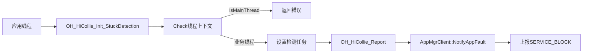
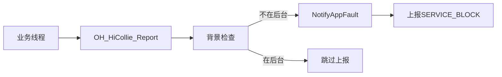
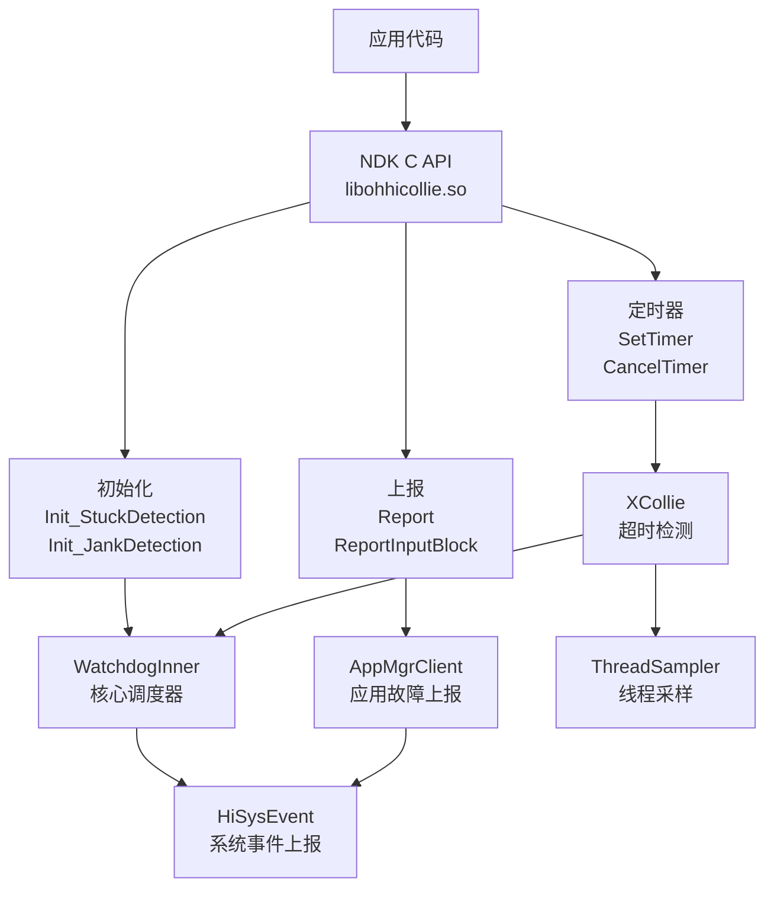

# HiCollie NDK C API 文档

> NDK C API 完整清单、参数、错误码、调用链

---

## 目的与适用范围

### 文档目的
本文档提供 HiCollie NDK C API 的完整参考，包括函数签名、参数说明、错误码和调用链。

### 适用场景
- 🔌 **C 语言开发** - 使用 NDK C API 集成 HiCollie
- 🔧 **跨语言集成** - 通过 C ABI 从其他语言调用（Rust、Go 等）
- 📊 **应用性能分析** - 使用 Jank 检测分析应用性能

---

## API 概览

HiCollie 提供 **NDK C API**（`libohhicollie.so`），支持以下功能：

| 功能类别 | API 数量 | 库文件 |
|---------|----------|---------|
| Stuck 检测 | 2 | `libohhicollie.so` |
| Jank 检测 | 1 | `libohhicollie.so` |
| 超时检测 | 2 | `libohhicollie.so` |
| 故障上报 | 2 | `libohhicollie.so` |

**证据**: `interfaces/ndk/include/hicollie.h:42-263` - API 函数声明

---

## 错误码定义

### 完整错误码清单

| 错误码 | 值 | 说明 | 使用场景 |
|---------|-----|------|---------|
| `HICOLLIE_SUCCESS` | 0 | 成功 | 所有 API |
| `HICOLLIE_INVALID_ARGUMENT` | 401 | 无效参数 | 参数校验失败 |
| `HICOLLIE_WRONG_THREAD_CONTEXT` | 29800001 | 错误线程上下文 | 在主线程调用 |
| `HICOLLIE_REMOTE_FAILED` | 29800002 | 远程调用失败 | AppMgrClient 通信失败 |
| `HICOLLIE_INVALID_TIMER_NAME` | 29800003 | 无效定时器名称 | 名称为空或过长 |
| `HICOLLIE_INVALID_TIMEOUT_VALUE` | 29800004 | 无效超时值 | 超出有效范围 |
| `HICOLLIE_WRONG_PROCESS_CONTEXT` | 29800005 | 错误进程上下文 | 在 appspawn/native 调用 |
| `HICOLLIE_WRONG_TIMER_ID_OUTPUT_PARAM` | 29800006 | 定时器 ID 参数错误 | id 指针为 NULL |

**证据**: `interfaces/ndk/include/hicollie.h:56-85` - HiCollie_ErrorCode 枚举

---

## API 详细说明

### 1. OH_HiCollie_Init_StuckDetection

#### 函数签名
```c
HiCollie_ErrorCode OH_HiCollie_Init_StuckDetection(OH_HiCollie_Task task);
```

#### 参数说明
| 参数 | 类型 | 说明 | 校验规则 |
|-----|------|------|---------|
| `task` | `OH_HiCollie_Task` | 周期性检测任务，每 3 秒执行一次 | 不能为 NULL |

#### 返回值
| 返回值 | 说明 |
|---------|------|
| `HICOLLIE_SUCCESS` | 初始化成功 |
| `HICOLLIE_WRONG_THREAD_CONTEXT` | 在主线程调用（主线程不能使用）|

#### 调用链


**证据**: `interfaces/ndk/hicollie.cpp:149-169` - 实现位置

---

### 2. OH_HiCollie_Init_StuckDetectionWithTimeout

#### 函数签名
```c
HiCollie_ErrorCode OH_HiCollie_Init_StuckDetectionWithTimeout(
    OH_HiCollie_Task task, uint32_t stuckTimeout);
```

#### 参数说明
| 参数 | 类型 | 说明 | 校验规则 |
|-----|------|------|---------|
| `task` | `OH_HiCollie_Task` | 周期性检测任务 | 不能为 NULL |
| `stuckTimeout` | `uint32_t` | 检测间隔（秒） | 3-15 秒 |

#### 返回值
| 返回值 | 说明 |
|---------|------|
| `HICOLLIE_SUCCESS` | 初始化成功 |
| `HICOLLIE_INVALID_ARGUMENT` | stuckTimeout 不在 [3, 15] 范围 |
| `HICOLLIE_WRONG_THREAD_CONTEXT` | 在主线程调用 |

**证据**: `interfaces/ndk/hicollie.cpp:171-197` - 实现位置

---

### 3. OH_HiCollie_Init_JankDetection

#### 函数签名
```c
HiCollie_ErrorCode OH_HiCollie_Init_JankDetection(
    OH_HiCollie_BeginFunc* beginFunc,
    OH_HiCollie_EndFunc* endFunc,
    HiCollie_DetectionParam param);
```

#### 参数说明
| 参数 | 类型 | 说明 | 校验规则 |
|-----|------|------|---------|
| `beginFunc` | `OH_HiCollie_BeginFunc*` | 事件处理前的桩函数 | 必须与 endFunc 同时为空或有值 |
| `endFunc` | `OH_HiCollie_EndFunc*` | 事件处理后的桩函数 | 必须与 beginFunc 同时为空或有值 |
| `param` | `HiCollie_DetectionParam` | 检测参数（API 12 预留）| 当前版本忽略 |

#### 返回值
| 返回值 | 说明 |
|---------|------|
| `HICOLLIE_SUCCESS` | 初始化成功 |
| `HICOLLIE_INVALID_ARGUMENT` | beginFunc 和 endFunc 状态不一致 |
| `HICOLLIE_WRONG_THREAD_CONTEXT` | 在主线程调用 |

**证据**: `interfaces/ndk/hicollie.cpp:199-219` - 实现位置

---

### 4. OH_HiCollie_Report

#### 函数签名
```c
HiCollie_ErrorCode OH_HiCollie_Report(bool* isSixSecond);
```

#### 参数说明
| 参数 | 类型 | 说明 | 校验规则 |
|-----|------|------|---------|
| `isSixSecond` | `bool*` | 布尔指针：true=卡6秒，false=卡3秒 | 不能为 NULL |

#### 返回值
| 返回值 | 说明 |
|---------|------|
| `HICOLLIE_SUCCESS` | 上报成功 |
| `HICOLLIE_INVALID_ARGUMENT` | isSixSecond 为 NULL |
| `HICOLLIE_WRONG_THREAD_CONTEXT` | 不在检测线程调用 |
| `HICOLLIE_REMOTE_FAILED` | AppMgrClient 通信失败 |

#### 调用链


**证据**: `interfaces/ndk/hicollie.cpp:81-128` - 实现位置

---

### 5. OH_HiCollie_ReportInputBlock

#### 函数签名
```c
HiCollie_ErrorCode OH_HiCollie_ReportInputBlock();
```

#### 参数说明
无参数

#### 返回值
| 返回值 | 说明 |
|---------|------|
| `HICOLLIE_SUCCESS` | 上报成功 |
| `HICOLLIE_REMOTE_FAILED` | AppMgrClient 通信失败 |

**证据**: `interfaces/ndk/hicollie.cpp:130-145` - 实现位置

---

### 6. OH_HiCollie_SetTimer

#### 函数签名
```c
HiCollie_ErrorCode OH_HiCollie_SetTimer(
    HiCollie_SetTimerParam param, int* id);
```

#### 参数说明
| 参数 | 类型 | 说明 | 校验规则 |
|-----|------|------|---------|
| `param` | `HiCollie_SetTimerParam` | 定时器参数结构 | 各字段见下表 |
| `id` | `int*` | 用于返回定时器 ID | 不能为 NULL |

#### param 结构体字段

| 字段 | 类型 | 说明 | 校验规则 |
|-----|------|------|---------|
| `name` | `const char*` | 定时器名称 | 不能为 NULL 或空字符串 |
| `timeout` | `unsigned int` | 超时时间（秒）| 必须 > 0 |
| `func` | `OH_HiCollie_Callback` | 超时回调函数 | - |
| `arg` | `void*` | 回调参数 | - |
| `flag` | `HiCollie_Flag` | 超时行为标志 | 见下方 Flag 说明 |

#### flag 标志位

| 标志 | 值 | 说明 |
|-----|-----|------|
| `HICOLLIE_FLAG_DEFAULT` | `~0` | 默认：生成日志 + 执行回调 + 恢复（进程退出）|
| `HICOLLIE_FLAG_NOOP` | `0` | 仅执行回调 |
| `HICOLLIE_FLAG_LOG` | `1 << 0` | 生成日志文件 |
| `HICOLLIE_FLAG_RECOVERY` | `1 << 1` | 进程退出恢复 |

#### 返回值
| 返回值 | 说明 |
|---------|------|
| `HICOLLIE_SUCCESS` | 定时器设置成功 |
| `HICOLLIE_INVALID_TIMER_NAME` | name 为 NULL 或空 |
| `HICOLLIE_INVALID_TIMEOUT_VALUE` | timeout 为 0 |
| `HICOLLIE_WRONG_PROCESS_CONTEXT` | 错误进程上下文（appspawn/native）|
| `HICOLLIE_WRONG_TIMER_ID_OUTPUT_PARAM` | id 指针为 NULL |

**证据**: `interfaces/ndk/hicollie.cpp:234-263` - 实现位置

---

### 7. OH_HiCollie_CancelTimer

#### 函数签名
```c
void OH_HiCollie_CancelTimer(int id);
```

#### 参数说明
| 参数 | 类型 | 说明 | 校验规则 |
|-----|------|------|---------|
| `id` | `int` | 定时器 ID（从 SetTimer 返回） | - |

#### 返回值
无返回值

**证据**: `interfaces/ndk/hicollie.cpp:265-271` - 实现位置

---

## 类型定义

### OH_HiCollie_Task

```c
typedef void (*OH_HiCollie_Task)(void);
```
**说明**: 周期性检测任务函数指针，每 3 秒执行一次。

**证据**: `interfaces/ndk/include/hicollie.h:96`

### OH_HiCollie_BeginFunc / EndFunc

```c
typedef void (*OH_HiCollie_BeginFunc)(const char* eventName);
typedef void (*OH_HiCollie_EndFunc)(const char* eventName);
```
**说明**: Jank 检测的桩函数，在事件处理前后调用。

**证据**: `interfaces/ndk/include/hicollie.h:108-120`

### OH_HiCollie_Callback

```c
typedef void (*OH_HiCollie_Callback)(void*);
```
**说明**: 定时器超时回调函数指针。

**证据**: `interfaces/ndk/include/hicollie.h:205`

### HiCollie_SetTimerParam

```c
typedef struct HiCollie_SetTimerParam {
    const char *name;
    unsigned int timeout;
    OH_HiCollie_Callback func;
    void *arg;
    HiCollie_Flag flag;
} HiCollie_SetTimerParam;
```

**证据**: `interfaces/ndk/include/hicollie.h:228-239`

### HiCollie_Flag

```c
typedef enum HiCollie_Flag {
    HICOLLIE_FLAG_DEFAULT = (~0),
    HICOLLIE_FLAG_NOOP = (0),
    HICOLLIE_FLAG_LOG = (1 << 0),
    HICOLLIE_FLAG_RECOVERY = (1 << 1)
} HiCollie_Flag;
```

**证据**: `interfaces/ndk/include/hicollie.h:212-221`

---

## 调用链总览



---

## 使用示例

### 示例 1: Stuck 检测

```c
#include "hicollie.h"

void MyCheckTask() {
    // 发送消息到业务线程
    bool isStuck = SendCheckMessageToBusinessThread();
    bool isSixSecond = false;

    if (isStuck) {
        // 业务线程卡住，上报
        OH_HiCollie_Report(&isSixSecond);
    }
}

int main() {
    // 初始化 Stuck 检测
    if (OH_HiCollie_Init_StuckDetection(MyCheckTask) != HICOLLIE_SUCCESS) {
        return -1;
    }

    // 正常业务处理...
    return 0;
}
```

### 示例 2: Jank 检测

```c
#include "hicollie.h"

void OnEventBegin(const char* eventName) {
    // 记录事件开始时间
}

void OnEventEnd(const char* eventName) {
    // 记录事件结束时间
}

int main() {
    // 初始化 Jank 检测
    HiCollie_DetectionParam param = {0, 0};
    if (OH_HiCollie_Init_JankDetection(OnEventBegin, OnEventEnd, param) != HICOLLIE_SUCCESS) {
        return -1;
    }

    // 处理事件
    while (1) {
        OnEventBegin("TouchEvent");
        ProcessTouchEvent();
        OnEventEnd("TouchEvent");
    }
}
```

### 示例 3: 超时检测

```c
#include "hicollie.h"

void OnTimeout(void* arg) {
    printf("Timeout occurred! arg=%p\n", arg);
}

int main() {
    int timerId;
    HiCollie_SetTimerParam param = {
        .name = "MyTimer",
        .timeout = 10,
        .func = OnTimeout,
        .arg = NULL,
        .flag = HICOLLIE_FLAG_LOG
    };

    if (OH_HiCollie_SetTimer(param, &timerId) != HICOLLIE_SUCCESS) {
        return -1;
    }

    // 执行耗时操作
    DoTimeConsumingOperation();

    // 操作完成，取消定时器
    OH_HiCollie_CancelTimer(timerId);
}
```

---

## 限制与约束

| 约束 | 值 | 说明 |
|------|-----|------|
| 最大定时器数 | 128 | 单进程最多注册 128 个定时器 |
| 检测间隔范围 | 3-15 秒 | Stuck 检测间隔必须在 [3, 15] 范围 |
| 主线程限制 | 不能在主线程调用 | Init_* 函数不能在主线程调用 |
| 进程上下文 | 不能在 appspawn/native 进程调用 | SetTimer 有此限制 |

**证据**: `README_zh.md:27-29` - 单进程最多 128 个定时器

---

## 关键结论

### API 特点
1. **纯 C 接口** - 无 C++ 依赖，适合跨语言集成
2. **回调驱动** - 大量使用回调函数通知超时事件
3. **错误码完善** - 提供详细的错误码便于调试
4. **上下文校验** - 严格校验线程上下文和进程上下文

### 兼容性
- ✅ **C** - 原生支持
- ✅ **C++** - 可通过 `extern "C"` 链接
- ✅ **Rust** - 通过 FFI 绑定（已提供 Rust 接口）
- ❌ **JavaScript/ArkTS** - 不支持（需要单独的 N-API 层）

### 性能影响
- 最小：API 调用开销
- 中等：回调执行开销
- 较高：Jank 检测的事件前后桩函数

---

## 相关跳转

- [项目概览](00_Overview.md) - 了解项目定位
- [架构说明](02_Architecture.md) - 了解调用链
- [内部 API](04_Internal_API.md) - Native C++ 接口
- [安全评审](07_Security_Review.md) - 了解输入校验
