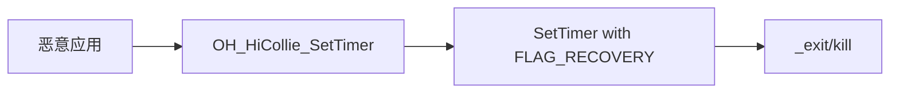
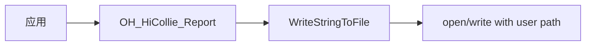

# HiCollie 安全风险评审

> 攻击面、信任边界、可被利用点、修复建议

---

## 目的与适用范围

### 文档目的
本文档提供 HiCollie 组件的安全风险评估，包括攻击面、信任边界、已知可被利用点和安全加固建议。

### 适用场景
- 🔒 **安全审计** - 评估 HiCollie 的安全态势
- 🔧 **漏洞修复** - 了解已知安全问题并修复
- 📋 **合规检查** - 验证安全机制是否符合要求

---

## 攻击面分析

### 攻击面清单

| 攻击面 | 组件 | 证据 | 风险等级 |
|---------|------|------|---------|
| **NDK C API** | `libohhicollie.so` | `interfaces/ndk/include/hicollie.h` | 中 |
| **进程终止** | `kill()`, `_exit()` | `watchdog_inner.cpp:424, 1204` | 高 |
| **文件操作** | `open()`, `fopen()` | `watchdog_task.cpp:407`, `watchdog_inner.cpp:1574` | 中 |
| **动态库加载** | `dlopen()` | `watchdog_inner.cpp:366` | 中 |
| **IPC 操作** | `IPCSkeleton::GetMemoryUsage()` | `watchdog_task.cpp:302` | 低 |
| **信号处理** | `sigaction()` | `watchdog_inner.cpp:320` | 低 |

### 信任边界

```
应用进程
    ↓ (UID 检查)
HiCollie (UID >= 20000)
    ↓ (进程名检查)
系统服务操作 (UID < 20000)
    ↓
内核接口 (SIGKILL, open, write)
```

**证据**: `watchdog_task.cpp:189-191` - UID 阈值检查

---

## 可被利用点

### 1. 进程终止绕过

#### 证据

**位置**: `watchdog_inner.cpp:1204`, `xcollie_utils.cpp:424`

```cpp
_exit(0);
kill(pid, SIGKILL);
```

**原因**: 缺少对调用者身份的严格验证，可能被恶意进程利用

#### 触发路径



#### 影响
| 影响项 | 说明 |
|---------|------|
| **拒绝服务** | 恶意应用可触发自身进程终止 |
| **系统不稳定** | 频繁终止可能导致系统不稳定 |
| **信息泄露** | 终止前可能泄露敏感信息 |

#### 修复建议

```cpp
// 建议在 _exit 前添加更严格的验证
if (getuid() >= 20000 && !IsInAppspawn() {
    // 仅在应用进程中且非 spawn 进程时执行
    _exit(0);
}

// 建议记录终止原因
HiSysEventWrite(SERVICE_TIMEOUT, ...);
```

**风险等级**: 高

---

### 2. 文件路径遍历

#### 证据

**位置**: `xcollie_utils.cpp:536`, `watchdog_inner.cpp:1574-1608`

```cpp
fopen(path.c_str(), "w+");
open(SYS_KERNEL_HUNGTASK_USERLIST, O_WRONLY);
```

**原因**: 文件路径未完全验证，可能存在路径遍历风险

#### 触发路径



#### 影响
| 影响项 | 说明 |
|---------|------|
| **任意文件写入** | 可能写入任意系统文件 |
| **权限提升** | 通过路径遍历写入受保护文件 |
| **信息泄露** | 读取敏感文件内容 |

#### 修复建议

```cpp
// 建议使用 realpath 规范化路径（已实现）
char checkPath[PATH_MAX] = {0};
if (realpath(path.c_str(), checkPath) == nullptr) {
    XCOLLIE_LOGE("canonicalize failed. path is %{public}s", path.c_str());
    return "";
}

// 建议检查路径前缀
if (!checkPath.empty() && strncmp(checkPath, "/system/", 8) == 0) {
    // 拒绝系统路径
    return false;
}
```

**风险等级**: 中

**备注**: 代码中已使用 `realpath()` 进行路径规范化，但可加强路径前缀检查

---

### 3. 整数溢出风险

#### 证据

**位置**: `interfaces/ndk/hicollie.cpp:234-266`

```cpp
unsigned int timeout;
if (timeout == 0) {
    return HICOLLIE_INVALID_TIMEOUT_VALUE;
}
```

**原因**: 虽有 0 值检查，但未检查最大值

#### 触发路径


#### 影响
| 影响项 | 说明 |
|---------|------|
| **任务调度异常** | nextTickTime 计算错误 |
| **DoS 攻击** | 恶意应用可设置极长超时时间 |
| **资源耗尽** | 长时间任务占用队列 |

#### 修复建议

```cpp
// 建议添加最大值检查
constexpr unsigned int MAX_TIMEOUT_VALUE = 3600; // 1 小时

if (timeout == 0 || timeout > MAX_TIMEOUT_VALUE) {
    return HICOLLIE_INVALID_TIMEOUT_VALUE;
}
```

**风险等级**: 中

---

### 4. 竞态条件

#### 证据

**位置**: `watchdog_inner.cpp:1139-1142`

```cpp
if (checkerQueue_.size() >= MAX_WATCH_NUM) {
    return -1;
}
```

**原因**: 检查和插入非原子操作，存在 TOCTOU 问题

#### 触发路径

```mermaid
graph LR
    T1[线程1] --> Check[size < 128]
    T2[线程2] --> Check[size < 128]
    Check -->|同时通过| Insert[Insert to queue]
    Insert --> Final[size = 129] // 超出限制
```

#### 影响
| 影响项 | 说明 |
|---------|------|
| **队列溢出** | 超过 128 个任务限制 |
| **内存损坏** | 可能导致缓冲区溢出 |
| **拒绝服务** | 恶意应用可耗尽任务槽位 |

#### 修复建议

```cpp
// 建议使用原子操作或锁保护
std::lock_guard<std::mutex> lock(lock_);

if (checkerQueue_.size() >= MAX_WATCH_NUM) {
    return -1;
}

checkerQueue_.push(task);
```

**风险等级**: 中

---

### 5. 格式化字符串漏洞

#### 证据

**位置**: `watchdog_inner.cpp:1598`

```cpp
snprintf_s(buffer, size, format, ...);
```

**原因**: 使用安全函数 `snprintf_s`，但缓冲区大小可能不当

#### 触发路径


#### 影响
| 影响项 | 说明 |
|---------|------|
| **信息泄露** | 格式化字符串可能泄露栈信息 |
| **缓冲区溢出** | 错误的 size 参数 |
| **拒绝服务** | 恶意格式化字符串导致崩溃 |

#### 修复建议

```cpp
// 建议使用固定大小的缓冲区或 C++ string
std::string result;
result.resize(MAX_LOG_LENGTH);
snprintf_s(result.data(), result.size(), "%s", ...);
```

**风险等级**: 低

**备注**: 代码已使用 `snprintf_s` 安全函数，风险较低

---

## 安全机制评估

### 权限控制

| 机制 | 实现 | 有效性 |
|-----|------|-------|
| **UID 隔离** | `getuid() >= 20000` 检查 | 有效 - 防止系统服务被应用滥用 |
| **进程名检查** | `IsInAppspawn()` 检查 | 有效 - 防止 spawn 进程滥用 |
| **Bundle 验证** | 黑名单检查 | 部分有效 |

### 输入校验

| 校验类型 | 实现 | 有效性 |
|---------|------|-------|
| **空指针检查** | `param.name == nullptr` | 有效 |
| **数值范围检查** | 3-15 秒限制 | 有效 |
| **字符串长度限制** | `GetLimitedSizeName()` | 有效 |
| **上下文校验** | 线程/进程上下文检查 | 有效 |

### 内存安全

| 安全措施 | 实现 | 有效性 |
|---------|------|-------|
| **安全函数** | `memcpy_s`, `snprintf_s`, `memset_s` | 有效 |
| **智能指针** | `std::shared_ptr` | 有效 |
| **RAII 模式** | 资源自动管理 | 有效 |

---

## 未覆盖的攻击面

### 检查范围

| 检查项 | 覆盖情况 | 说明 |
|--------|---------|------|
| N-API | ✅ 已检查 - 无 N-API | HiCollie 不提供 N-API |
| IPC/SA | ✅ 已检查 - 非 SA 服务 | HiCollie 是监控方，非服务端 |
| 网络攻击 | ⚠️ 部分覆盖 | 未检查网络接口（不存在）|
| 密码学 | ⚠️ 未检查 | 未发现加密/解密操作 |

### 局限性

1. **静态分析限制** - 未进行运行时行为分析
2. **测试代码排除** - 测试代码中的安全问题未包含
3. **外部依赖** - 未深入审计依赖库的安全性

---

## 安全加固建议

### 高优先级

| 建议 | 位置 | 预期效果 |
|-----|------|---------|
| 增强进程终止验证 | `watchdog_inner.cpp:1204` | 防止滥用终止 |
| 加强路径验证 | `xcollie_utils.cpp:536` | 防止路径遍历 |
| 添加超时值上限 | `interfaces/ndk/hicollie.cpp:236` | 防止整数溢出 |
| 修复竞态条件 | `watchdog_inner.cpp:1139` | 防止队列溢出 |

### 中优先级

| 建议 | 位置 | 预期效果 |
|-----|------|---------|
| 记录所有敏感操作 | 全局 | 增加审计能力 |
| 使用更严格的 UID 检查 | 全局 | 细粒度权限控制 |
| 添加堆栈保护 | 编译配置 | 防止栈溢出 |
| 启用 ASAN | 构建配置 | 检测内存错误 |

---

## 合规性检查

### 符合项

| 要求 | 符合情况 | 证据 |
|-----|---------|------|
| Apache License | ✅ 符合 | `LICENSE` 文件 |
| 最小权限原则 | ✅ 部分符合 | UID 检查，但可优化 |
| 安全函数使用 | ✅ 符合 | 使用 `_s` 后缀安全函数 |
| 符号导出控制 | ✅ 符合 | 使用 version script |

### 改进项

| 要求 | 当前状态 | 改进建议 |
|-----|---------|---------|
| 完整的权限模型 | ⚠️ 部分 | 实现更细粒度的权限控制 |
| 威胁建模 | ⚠️ 缺失 | 进行完整的威胁建模和安全设计 |
| 安全测试 | ⚠️ 未知 | 进行模糊测试和渗透测试 |

---

## 关键结论

### 安全态势
1. **基础安全** - 实现了基本的输入校验和权限控制
2. **已知漏洞** - 存在中等风险的可被利用点
3. **加固空间** - 可通过配置和代码改进加强

### 主要风险
1. **进程终止滥用** - 高风险 - 需要立即修复
2. **路径遍历** - 中等风险 - 需要改进
3. **竞态条件** - 中等风险 - 需要修复
4. **整数溢出** - 中等风险 - 需要添加限制

### 建议行动
1. **短期** - 修复高优先级漏洞（进程终止、路径遍历）
2. **中期** - 完善输入校验和竞态条件修复
3. **长期** - 建立完整的安全开发流程和测试体系

---

## 相关跳转

- [项目概览](00_Overview.md) - 了解安全机制
- [NDK C API](03_NDK_API.md) - 了解攻击面
- [内部 API](04_Internal_API.md) - 了解校验逻辑
- [编译产物](06_Build_Artifacts.md) - 了解依赖关系
