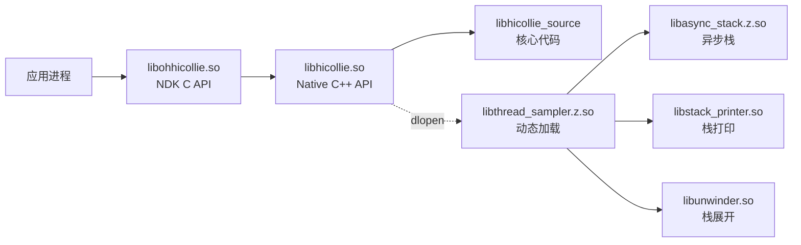

# HiCollie 编译产物文档

> 编译产物、安装路径、运行时加载关系

---

## 目的与适用范围

### 文档目的
本文档详细说明 HiCollie 编译产生的所有产物、它们的安装位置、依赖关系和运行时加载机制。

### 适用场景
- 📦 **集成部署** - 了解产物依赖和安装路径
- 🔧 **问题定位** - 排查运行时加载失败问题
- 🔍 **依赖分析** - 理解产物之间的依赖关系

---

## 编译产物清单

### 主要产物

| 产物名称 | 类型 | 构建目标 | 用途 |
|---------|------|----------|------|
| `libhicollie.so` | 共享库 | `interfaces/native/innerkits:libhicollie` | Native C++ API |
| `libapp_hicollie.so` | 共享库 | `interfaces/app:libapp_hicollie` | 应用层 API |
| `libthread_sampler.z.so` | 共享库（压缩）| `frameworks/native/thread_sampler:libthread_sampler` | 线程采样器 |
| `libthread_sampler_static.a` | 静态库 | `frameworks/native/thread_sampler:libthread_sampler_static` | 仅供内部链接 |
| `libohhicollie.so` | NDK 共享库 | `interfaces/ndk:ohhicollie` | NDK C API |
| `libhicollie_rust.dylib` | Rust 动态库 | `interfaces/rust:hicollie_rust` | Rust 语言绑定 |

**证据**: `bundle.json:50-57` - sub_component 定义

---

## 安装路径

### 系统库路径

| 产物 | 安装路径 | 说明 |
|-----|---------|------|
| `libhicollie.so` | `/system/lib64/libhicollie.so` | Native C++ API 库 |
| `libapp_hicollie.so` | `/system/lib64/libapp_hicollie.so` | 应用层 API 库 |
| `libthread_sampler.z.so` | `/system/lib64/libthread_sampler.z.so` | 线程采样器库 |
| `libohhicollie.so` | `/system/lib64/ndk/libohhicollie.so` | NDK C API 库（NDK 目录）|
| `libhicollie_rust.dylib` | `/system/lib64/libhicollie_rust.dylib` | Rust 语言绑定库 |

### 头文件路径

| 接口类型 | 头文件路径 | 说明 |
|---------|-----------|------|
| Native C++ | `/usr/include/xcollie/` | watchdog.h, xcollie.h, ipc_full.h 等 |
| NDK C | `/usr/include/hicollie.h` | NDK C API 头文件 |
| App | `/usr/include/app_watchdog.h` | 应用层头文件 |

**证据**: `bundle.json:58-87` - inner_kits 定义中的 header 路径

---

## 运行时加载关系

### 加载顺序



**证据**: `watchdog_inner.cpp:366-396` - dlopen 调用

### 动态库加载点

#### 1. Thread Sampler 加载

**代码位置**: `watchdog_inner.cpp:366`

```cpp
threadSamplerFuncHandler_ = dlopen(LIB_THREAD_SAMPLER_PATH, RTLD_LAZY);
```

| 库 | 符号 | 用途 |
|-----|------|------|
| `libthread_sampler.z.so` | `Init()`, `Start()`, `Stop()` | 线程采样 API |
| `libasync_stack.z.so` | 异步栈处理 | FFRT 采集 |
| `libstack_printer.so` | 栈格式化 | 日志输出 |
| `libunwinder.so` | 栈回溯 | 堆栈展开 |

#### 2. 外部系统库

| 依赖库 | 用途 | 加载方式 |
|---------|------|---------|
| `libhilog.so` | 日志输出 | 动态链接 |
| `libipc_core.so` | IPC 调用 | 动态链接 |
| `libffrt.so` | FFRT 框架 | 动态链接 |
| `libeventhandler.so` | 事件处理 | 动态链接（条件）|
| `libucollection_client.so` | 事件收集 | 动态链接 |
| `libbacktrace_local.so` | 堆栈回溯 | 动态链接 |

**证据**: `frameworks/native/BUILD.gn:40-47` - external_deps

---

## 依赖解析

### 静态链接依赖

```
libohhicollie.so
    ↓ 静态链接
libhicollie.so
    ↓ 静态链接
libhicollie_source (source_set)
    ├── hilog:libhilog
    ├── ipc:ipc_core
    ├── ffrt:libffrt
    ├── faultloggerd:libbacktrace_local
    ├── eventhandler:libeventhandler (条件）
    ├── hiview:libucollection_client
    └── init:libbegetutil
```

### 动态链接依赖

```
libohhicollie.so (运行时)
    ↓ 动态链接
    ├── libhilog.so
    ├── libipc_core.so
    ├── samgr_proxy.so (通过 ability_runtime)
    └── c_utils.so

libthread_sampler.z.so (运行时）
    ↓ 动态链接
    ├── libhilog.so
    ├── libasync_stack.z.so
    ├── libstack_printer.so
    └── libunwinder.so
```

**证据**: 各 BUILD.gn 文件中的 deps 和 external_deps

---

## 符号导出控制

### 符号导出文件

| 库 | Version Script | 导出策略 |
|-----|---------------|---------|
| `libhicollie.so` | `libhicollie.map` | 限制内部符号导出 |
| `libapp_hicollie.so` | `libapp_hicollie.map` | 限制内部符号导出 |
| `libthread_sampler.z.so` | `libthread_sampler.map` | 仅导出公共 API |
| `libohhicollie.so` | `libohhicollie.map` | 仅导出 NDK C API |

**导出符号示例**:

**libhicollie.so**:
```linker
{
    global:
        OHOS::HiviewDFX::Watchdog::*;
        OHOS::HiviewDFX::XCollie::*;
        OHOS::HiviewDFX::IpcFull::*;
    local: *;
};
```

**libohhicollie.so**:
```linker
{
    global:
        OH_HiCollie_*;
    local: *;
};
```

**证据**: `interfaces/native/innerkits/libhicollie.map` - 符号导出文件

---

## 运行时初始化

### 初始化顺序

```
应用启动
    ↓
链接 libohhicollie.so
    ↓
构造全局对象（延迟初始化）
    ↓
首次 API 调用（如 OH_HiCollie_Init_*)
    ↓
触发 WatchdogInner 单例初始化
    ↓
创建看门狗线程
    ↓
动态加载 libthread_sampler.z.so
    ↓
初始化 ThreadSampler
```

### 单例初始化

**单例类**: `WatchdogInner`、`Watchdog`、`XCollie`、`IpcFull`、`ThreadSampler`

**证据**: `watchdog_inner.h:38-39` - DECLARE_SINGLETON 宏

---

## 产品形态

### 标准系统

| 产品类型 | 支持的产物 | 说明 |
|---------|-------------|------|
| 标准系统 | 全部产物 | 支持所有功能 |
| 小型系统 | 部分产物（基于配置）| 可能禁用部分功能 |

### SysCap

```
SystemCapability.HiviewDFX.HiCollie
```

**证据**: `bundle.json:21-23` - syscap 定义

---

## 版本信息

### 版本号

**当前版本**: 3.1

**证据**: `bundle.json:4` - version 字段

### 兼容性

| API | 兼容性 | 说明 |
|-----|---------|------|
| NDK C API | 稳定 | 向后兼容 |
| Native C++ API | 稳定 | 向后兼容 |
| Rust API | 开发中 | 非稳定 |

---

## 构建配置

### 调试版本

```bash
# ASAN 构建
hb build --define is_asan=true

# 调试符号
hb build --define is_debug=true
```

### 发布版本

```bash
# 标准发布构建
hb build

# 优化构建
hb build --release
```

**证据**: `frameworks/native/BUILD.gn:40-42` - is_asan 条件编译

---

## 常见问题

### 问题 1: 库找不到

**现象**: `error while loading shared libraries: libohhicollie.so`

**原因**: 库未正确安装或路径错误

**解决**:
```bash
# 检查库是否存在
ls -l /system/lib64/libohhicollie.so

# 检查依赖
ldd libohhicollie.so
```

### 问题 2: 符号未定义

**现象**: `undefined reference to xxx`

**原因**: 依赖库未链接

**解决**:
```bash
# 检查 BUILD.gn 中 external_deps 是否包含所有依赖
# 检查版本 script 是否正确导出符号
```

### 问题 3: 动态库加载失败

**现象**: `dlopen failed: libthread_sampler.z.so`

**原因**: 动态库路径错误或依赖缺失

**解决**:
```bash
# 检查库路径
find /system/lib64 -name "libthread_sampler*"

# 检查依赖
ldd libthread_sampler.z.so
```

**证据**: `watchdog_inner.cpp:366-396` - dlopen 错误处理

---

## 关键结论

### 产物特点
1. **多语言支持** - 支持 C、C++、Rust 三种语言绑定
2. **分层设计** - NDK → Native → Source 逐层封装
3. **动态加载** - Thread Sampler 作为插件动态加载
4. **符号控制** - 使用 version script 限制导出

### 依赖特点
1. **静态链接** - 核心代码静态链接到最终产物
2. **动态链接** - 外部库在运行时动态链接
3. **DFX 依赖** - 依赖多个 DFX 子系统组件

### 部署建议
1. **检查依赖** - 使用 ldd 验证所有依赖可用
2. **验证符号** - 使用 nm 或 readelf 验证导出符号
3. **测试加载** - 使用 dlopen 测试动态库加载

---

## 相关跳转

- [目录结构](01_Directory_Structure.md) - 找源代码位置
- [GN Targets](05_GN_Targets.md) - 了解构建配置
- [项目概览](00_Overview.md) - 了解运行环境
