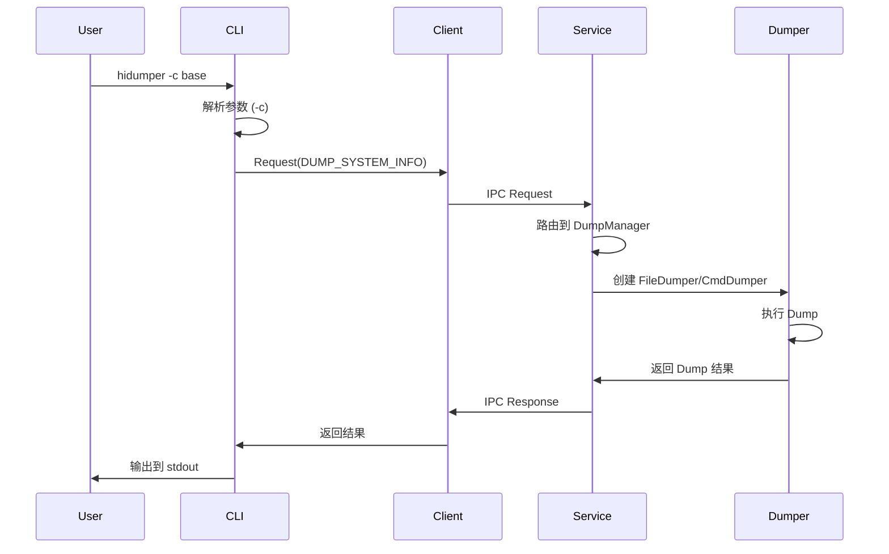

# 系统架构

> 目的：理解 HiDumper 内部组件关系、数据流向、线程模型

## 1. 架构概览

### 整体架构图

```
┌─────────────────────────────────────────────────────────────────┐
│                        HiDumper 架构                              │
├─────────────────────────────────────────────────────────────────┤
│  客户端层                                                          │
│  ┌──────────────┐     ┌──────────────┐                          │
│  │ hidumper CLI │────▶│ DumpManager  │                          │
│  │ (可执行文件)   │     │ Client       │                          │
│  └──────────────┘     └──────────────┘                          │
│                              │                                   │
│                              ▼ IPC                              │
│  服务层                                                           │
│  ┌─────────────────────────────────────────────────────────┐   │
│  │            DumpManagerService (SA 1212)                   │   │
│  │  ┌─────────────┐  ┌─────────────┐  ┌─────────────────┐   │   │
│  │  │ DumpManager │  │ DumpController│ │ IDumpBroker     │   │   │
│  │  │             │  │             │ │ (IPC Stub)      │   │   │
│  │  └──────┬──────┘  └──────┬──────┘  └─────────────────┘   │   │
│  └────────┼────────────────┼──────────────────────────────────┘   │
│           │                │                                        │
│           ▼                ▼                                        │
│  ┌─────────────────────────────────────────────────────────────┐ │
│  │                    Dumpers / Executors                         │ │
│  │  ┌──────────┐ ┌──────────┐ ┌──────────┐ ┌────────────────┐  │ │
│  │  │FileDumper│ │CmdDumper │ │CpuDumper │ │ MemDumper       │  │ │
│  │  │          │ │          │ │          │ │ - SmapsParser  │  │ │
│  │  │          │ │          │ │          │ │ - HeapInfo     │  │ │
│  │  └──────────┘ └──────────┘ └──────────┘ └────────────────┘  │ │
│  └─────────────────────────────────────────────────────────────┘ │
│                              │                                    │
│                              ▼                                    │
│                    Output (FdOutput/ZipOutput)                    │
└─────────────────────────────────────────────────────────────────┘

┌─────────────────────────────────────────────────────────────────┐
│  CPU 专用服务                                                     │
│  ┌─────────────────────────────────────────────────────────┐   │
│  │          DumpManagerCpuService (SA 1215)                   │   │
│  │  ┌─────────────────────┐  ┌─────────────────────────┐    │   │
│  │  │ HidumperCpuService  │  │ CpuUsageCollector      │    │   │
│  │  │ (IPC Stub)          │  │                        │    │   │
│  │  └─────────────────────┘  └─────────────────────────┘    │   │
│  └─────────────────────────────────────────────────────────┘   │
└─────────────────────────────────────────────────────────────────┘
```

## 2. 组件职责

### 2.1 客户端层

| 组件 | 文件 | 职责 |
|-----|------|-----|
| DumpClientMain | `client/native/dump_client_main.cpp` | CLI 入口，参数解析 |
| DumpManagerClient | `services/native/src/dump_manager_client.cpp` | IPC 客户端封装 |

### 2.2 服务层

| 组件 | 文件 | 职责 |
|-----|------|-----|
| DumpManagerService | `services/native/src/dump_manager_service.cpp` | 主 SA 实现 |
| DumpManagerCpuService | `services/native/src/dump_manager_cpu_service.cpp` | CPU 专用 SA |
| DumpBrokerStub | `services/zidl/src/dump_broker_stub.cpp` | IPC 消息分发 |

### 2.3 框架层

| 组件 | 文件 | 职责 |
|-----|------|-----|
| DumpManager | `frameworks/native/src/manager/dump_manager.cpp` | Dump 流程编排 |
| DumpController | `frameworks/native/src/manager/dump_controller.cpp` | Dump 控制 |
| DumpImplement | `frameworks/native/src/manager/dump_implement.cpp` | Dump 实现 |

### 2.4 Dumpers (按策略分类)

| 策略 | 类名 | 功能 |
|-----|------|-----|
| 文件导出 | FileDumper | 导出文件内容 |
| 命令执行 | CmdDumper | 执行 shell 命令 |
| CPU 信息 | CpuDumper / CpuUsageDumper | CPU 使用率/频率 |
| 内存信息 | MemDumper | 内存使用、smaps |
| 进程信息 | ProcessInfoDumper | 进程/线程列表 |
| 网络信息 | NetDumper | 网络流量统计 |
| 存储信息 | StorageDumper | IO 统计 |
| SA 信息 | SystemAbilityDumper | System Ability 状态 |
| 事件日志 | EventListDumper | Faultlog 事件 |

## 3. 数据流

### 3.1 典型 Dump 请求流程

```
1. 用户执行: hidumper -c base
            │
2. dump_client_main.cpp: 参数解析
            │
3. DumpManagerClient::Request() ──IPC──▶ DumpManagerService
            │
4. DumpManagerService::Request()
            │
5. DumpController::PreDump() ──识别 Dump 策略──▶ DumpStrategyFactory
            │
6. 创建对应 Dumper 实例 (FileDumper, CmdDumper, etc.)
            │
7. Dumper::Dump() ──执行导出──▶ 各类信息源
            │
8. Output (FdOutput/ZipOutput) ──输出到终端或文件
```

### 3.2 IPC 调用序列

```
DumpManagerClient                              DumpManagerService
     │                                               │
     │──── GetSystemAbility(1212) ──────────────────▶│
     │◀──── IRemoteObject ───────────────────────────│
     │                                               │
     │──── Request(DumpRequest) ────────────────────▶│ OnRemoteRequest()
     │◀──── DumpResponse ────────────────────────────│
     │                                               │
```

## 4. 线程模型

### 4.1 服务端线程

- **主线程**: `OnStart()` 初始化，`OnStop()` 清理
- **IPC 调用线程**: Binder 线程池处理请求
- **Dump 执行线程**: 视具体 Dumper，可能阻塞

### 4.2 线程安全考量

| 组件 | 线程安全机制 |
|-----|------------|
| DumpManager | 单线程处理请求 |
| Singleton | DelayedSpSingleton 延迟单例 |
| ConfigData | 配置文件只读 |

### 4.3 生命周期

```
┌────────────────────────────────────────────────────────────┐
│                    DumpManagerService                       │
├────────────────────────────────────────────────────────────┤
│  OnStart() ──▶ Ready ──▶ [Idle 120s] ──▶ OnStop()        │
│     │              │                                     │
│  Publish()     自动卸载                                    │
└────────────────────────────────────────────────────────────┘
```

## 5. 依赖方向

```
┌─────────────────────────────────────────────────────────────┐
│                        依赖关系                               │
├─────────────────────────────────────────────────────────────┤
│                                                             │
│   interfaces/innerkits                                      │
│         │                                                   │
│         ▼                                                   │
│   frameworks/native                                         │
│         │                                                   │
│         ├────────────────────┐                              │
│         ▼                    ▼                              │
│   services/zidl          services/native                     │
│         │                    │                              │
│         └────────────────────┤                              │
│                              ▼                              │
│                        client/native                        │
│                                                             │
└─────────────────────────────────────────────────────────────┘
```

## 6. 关键时序图

### 6.1 系统信息导出流程



## 7. 稳定性标注

| 接口 | 稳定性 | 证据 |
|-----|-------|------|
| IDumpBroker (IPC) | 稳定 | `interfaces/native/innerkits/include/idump_broker.h` |
| DumpManagerClient | 稳定 | `interfaces/native/innerkits/include/dump_manager_client.h` |
| DumpUsage | 稳定 | `interfaces/innerkits/include/dump_usage.h` |
| 内部 Dumper 实现 | 不稳定 | `frameworks/native/src/executor/` |

## 相关文档

- [API 参考](./02_API_Reference.md)
- [构建系统](./03_Build_System.md)
- [编译产物](./04_Outputs.md)
