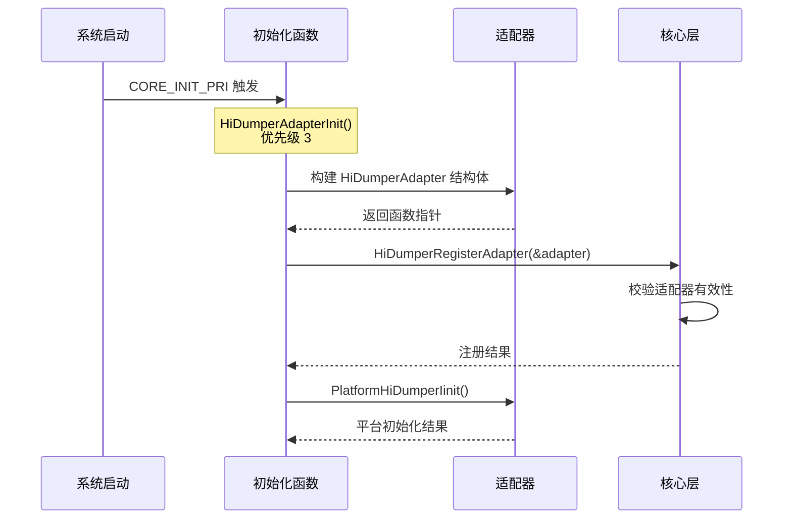
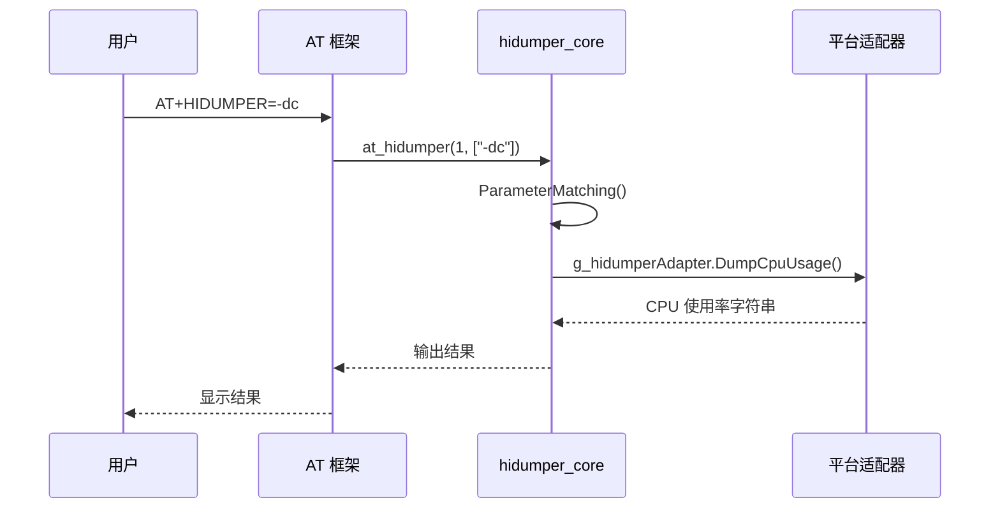
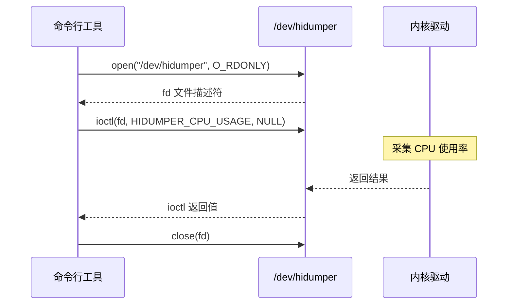
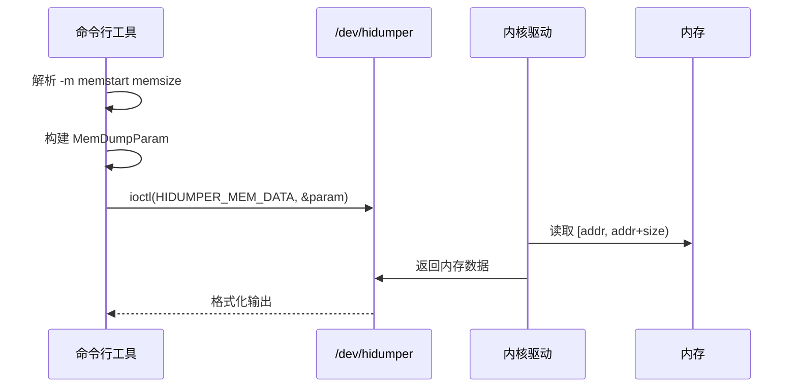

# 架构说明

## 整体架构

### 架构概述

`hidumper_lite` 采用分层架构设计，将平台无关的逻辑与平台相关的实现分离。主要分为以下层次：

| 层次 | 名称 | 职责 | 文件位置 |
|------|------|------|----------|
| 应用层 | 命令行工具 | 提供用户交互入口，解析参数，调用内核接口 | `lite/hidumper.c` |
| 框架层 | AT 命令解析 | AT 命令解析、分发、适配器管理 | `mini/hidumper_core.c` |
| 适配层 | 平台适配器 | 提供默认实现，由平台重写 | `mini/hidumper_adapter.c` |
| 平台层 | 平台实现 | 各芯片平台的具体实现 | 芯片平台代码 |

### 架构图

```mermaid
graph TB
    subgraph 用户空间
        A[命令行工具] --> B[/dev/hidumper 设备节点]
        C[AT 命令框架] --> D[hidumper_core]
        D --> E[hidumper_adapter]
    end
    
    subgraph 内核空间
        B --> F[hidumper 内核驱动]
        F --> G[CPU 使用率采集]
        F --> H[内存使用率采集]
        F --> I[任务信息采集]
        F --> J[故障日志读取]
    end
    
    subgraph 平台实现
        E --> K[DumpSysInfo 平台实现]
        E --> L[DumpCpuUsage 平台实现]
        E --> M[DumpMemUsage 平台实现]
        E --> N[DumpTaskInfo 平台实现]
    end
    
    style A fill:#e1f5fe
    style C fill:#e1f5fe
    style B fill:#fff3e0
    style F fill:#fff3e0
    style K fill:#f3e5f5
    style L fill:#f3e5f5
    style M fill:#f3e5f5
    style N fill:#f3e5f5
```

## 组件说明

### 1. 命令行工具（lite/hidumper.c）

**职责**：提供独立的命令行工具入口，通过 `/dev/hidumper` 设备节点与内核通信。

**关键组件**：

| 组件 | 职责 | 证据位置 |
|------|------|----------|
| `main()` | 程序入口，负责打开设备、解析参数 | `lite/hidumper.c:205-217` |
| `ParameterMatching()` | 解析命令行参数并分发 | `lite/hidumper.c:156-203` |
| `Usage()` | 打印帮助信息 | `lite/hidumper.c:64-83` |
| `ExecAction()` | 执行 IOCTL 命令 | `lite/hidumper.c:85-96` |
| `DumpXXX()` | 各种信息转储函数 | `lite/hidumper.c:98-145` |

### 2. AT 命令核心层（mini/hidumper_core.c）

**职责**：实现 AT 命令解析逻辑，管理适配器注册，处理命令分发。

**关键组件**：

| 组件 | 职责 | 证据位置 |
|------|------|----------|
| `HiDumperRegisterAdapter()` | 注册平台适配器 | `mini/hidumper_core.c:79-103` |
| `at_hidumper()` | AT 命令入口函数 | `mini/hidumper_core.c:155-165` |
| `ParameterMatching()` | 解析 AT 参数并分发 | `mini/hidumper_core.c:105-153` |
| `DumpAllInfo()` | 一次性输出所有信息 | `mini/hidumper_core.c:57-67` |

### 3. 适配层（mini/hidumper_adapter.c）

**职责**：提供默认的弱函数实现，由各芯片平台重写。

**关键组件**：

| 组件 | 职责 | 证据位置 |
|------|------|----------|
| `HiDumperAdapterInit()` | 初始化适配器并注册 | `mini/hidumper_adapter.c:84-101` |
| `DumpSysInfo()` | 系统信息（弱函数） | `mini/hidumper_adapter.c:33-37` |
| `DumpCpuUsage()` | CPU 使用率（弱函数） | `mini/hidumper_adapter.c:39-43` |
| `DumpMemUsage()` | 内存使用率（弱函数） | `mini/hidumper_adapter.c:45-50` |
| `DumpTaskInfo()` | 任务信息（弱函数） | `mini/hidumper_adapter.c:52-56` |
| `DumpFaultLog()` | 故障日志（弱函数） | `mini/hidumper_adapter.c:58-62` |
| `DumpMemRegion()` | 指定内存区域（弱函数） | `mini/hidumper_adapter.c:64-70` |
| `DumpAllMem()` | 所有内存数据（弱函数） | `mini/hidumper_adapter.c:72-76` |
| `PlatformHiDumperIinit()` | 平台初始化（弱函数） | `mini/hidumper_adapter.c:78-82` |

## 数据流

### LiteOS_A 版本数据流

```
用户输入
    │
    ▼
┌─────────────────┐
│  命令行工具      │
│  (hidumper.c)   │
│  - 参数解析      │
│  - 参数校验      │
└────────┬────────┘
         │ ioctl()
         ▼
┌─────────────────┐
│ /dev/hidumper   │  设备节点
│   内核驱动      │
└────────┬────────┘
         │
    ┌────┴────┬──────────┬──────────┐
    ▼         ▼          ▼          ▼
┌───────┐ ┌───────┐ ┌────────┐ ┌────────┐
│ CPU   │ │ 内存  │ │ 任务   │ │ 故障   │
│ 信息  │ │ 信息  │ │ 信息   │ │ 日志   │
└───────┘ └───────┘ └────────┘ └────────┘
```

### LiteOS_M 版本数据流

```
AT 命令串口输入
    │
    ▼
┌─────────────────┐
│   AT 框架       │
└────────┬────────┘
         │
         ▼
┌─────────────────┐
│ at_hidumper()  │  入口函数
└────────┬────────┘
         │
         ▼
┌─────────────────┐
│ ParameterMatching() │ 参数解析
└────────┬────────┘
         │
         ▼
┌─────────────────┐
│ HiDumperAdapter │  适配器
│      .DumpXXX() │  平台实现
└────────┬────────┘
         │
    ┌────┴────┬──────────┬──────────┐
    ▼         ▼          ▼          ▼
┌───────┐ ┌───────┐ ┌────────┐ ┌────────┐
│ Dump  │ │ Dump  │ │ Dump   │ │ Dump   │
│ Sys   │ │ CPU   │ │ Mem    │ │ Task   │
│ Info  │ │ Usage │ │ Usage  │ │ Info   │
└───────┘ └───────┘ └────────┘ └────────┘
```

## 线程模型

### 线程/任务模型

`hidumper_lite` 本身不创建独立线程，其运行模型如下：

| 版本 | 运行模型 | 说明 |
|------|----------|------|
| LiteOS_A | 独立进程 | 作为独立进程运行，通过 IOCTL 与内核通信 |
| LiteOS_M | AT 回调 | 在 AT 任务中回调执行，无独立任务 |

### 初始化流程



### 运行时序图



## 关键时序

### 1. 适配器注册时序

```mermaid
sequenceDiagram
    participant P as 平台实现
    participant A as hidumper_adapter
    participant C as hidumper_core
    
    Note over P,A,C: 系统初始化阶段
    P->>A: 调用 CORE_INIT_PRI 注册
    A->>A: HiDumperAdapterInit() 执行
    A->>A: 构建适配器结构体
    A->>C: HiDumperRegisterAdapter()
    Note over C: 校验 pAdapter != NULL
    Note over C: 校验所有函数指针 != NULL
    C->>A: 返回注册结果
```

### 2. 命令执行时序



### 3. 内存转储时序（调试版本）



---

## 模块依赖关系

### 依赖方向图

```mermaid
graph LR
    A[lite/hidumper.c] --> B[/dev/hidumper]
    C[mini/hidumper_core.c] --> D[HiDumperAdapter]
    D --> E[mini/hidumper_adapter.c]
    E --> F[平台实现]
    
    A --> G[libsec_shared]
    C --> G
    C --> H[内核接口]
    
    style A fill:#e1f5fe
    style C fill:#e1f5fe
    style D fill:#fff3e0
    style E fill:#f3e5f5
    style F fill:#f3e5f5
```

### 依赖清单

| 依赖项 | 类型 | 用途 | 证据位置 |
|--------|------|------|----------|
| bounds_checking_function | 第三方库 | 安全字符串操作 | `lite/BUILD.gn:17-18`、`mini/BUILD.gn:28` |
| kernel/liteos_m | 系统组件 | 任务、内存等内核操作 | `mini/BUILD.gn:20-24` |
| kernel/liteos_m/utils | 系统组件 | utils_lite 工具 | `mini/BUILD.gn:22` |
| commonlibrary/utils_lite | 系统组件 | 公共工具库 | `mini/BUILD.gn:25` |

---

## 稳定性标注

### 稳定接口

以下接口为稳定接口，预期长期保持不变：

| 接口 | 稳定性 | 证据位置 |
|------|--------|----------|
| `HiDumperRegisterAdapter()` | 稳定 | `mini/interfaces/native/innerkits/hidumper.h:35` |
| `at_hidumper()` | 稳定 | `mini/interfaces/native/innerkits/hidumper.h:36` |
| `HiDumperAdapter` 结构体 | 稳定 | `mini/interfaces/native/innerkits/hidumper.h:25-33` |
| `DumpSysInfo` 函数指针 | 稳定 | `mini/interfaces/native/innerkits/hidumper.h:26` |
| `DumpCpuUsage` 函数指针 | 稳定 | `mini/interfaces/native/innerkits/hidumper.h:27` |
| `DumpMemUsage` 函数指针 | 稳定 | `mini/interfaces/native/innerkits/hidumper.h:28` |
| `DumpTaskInfo` 函数指针 | 稳定 | `mini/interfaces/native/innerkits/hidumper.h:29` |

### 不稳定接口

以下接口为不稳定接口，可能在不同版本间发生变化：

| 接口 | 稳定性 | 原因 |
|------|--------|------|
| `DumpFaultLog` 函数指针 | 不稳定 | 故障日志格式可能变化 |
| `DumpMemRegion` 函数指针 | 不稳定 | 地址和大小参数语义可能变化 |
| `DumpAllMem` 函数指针 | 不稳定 | 输出格式和范围可能变化 |
| `PlatformHiDumperIinit` 函数指针 | 不稳定 | 平台初始化流程可能变化 |

---

## 相关文档

| 文档 | 描述 |
|------|------|
| [01_Overview.md](01_Overview.md) | 项目概览 |
| [03_API.md](03_API.md) | 接口使用说明 |
| [04_Build.md](04_Build.md) | 构建配置说明 |
| [appendix/Callgraphs.md](appendix/Callgraphs.md) | 关键调用链 |
| [appendix/Config_Flags.md](appendix/Config_Flags.md) | 关键配置项 |

---

## 更新日志

| 版本 | 日期 | 更新内容 |
|------|------|----------|
| 1.0.0 | 2026-02-06 | 初始版本 |
