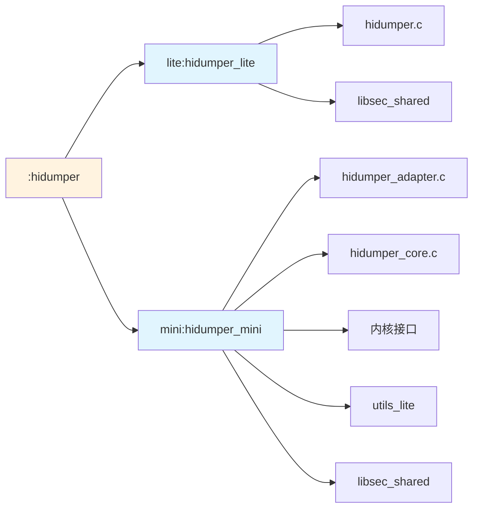

# 构建配置

## 概述

本文档描述 `hidumper_lite` 项目的构建系统配置，包括 GN 构建文件、模块配置以及编译产物说明。`hidumper_lite` 使用 OpenHarmony 的 GN（Generate Ninja）构建系统。

---

## 构建系统概述

### 构建工具链

| 组件 | 版本/要求 | 说明 |
|------|-----------|------|
| GN | 最新版本 | 生成 Ninja 构建文件 |
| Ninja | 最新版本 | 执行构建 |
| GCC/Clang | ARM Cortex-M/A 交叉编译器 | 目标平台编译器 |
| Python | 3.x | 构建脚本支持 |

### 构建环境

- **开发主机**：Linux/macOS/Windows（需配置交叉编译工具链）
- **目标设备**：LiteOS_A 或 LiteOS_M 开发板

---

## GN 构建文件

### 根 BUILD.gn

**文件位置**：`BUILD.gn`

**功能**：根据内核类型选择对应的构建目标

```gn
# Copyright (c) 2020 Huawei Device Co., Ltd.
# Licensed under the Apache License, Version 2.0 (the "License");
# you may not use this file except in compliance with the License.
# You may obtain a copy of the License at
#
#     http://www.apache.org/licenses/LICENSE-2.0
#
# Unless required by applicable law or agreed to in writing, software
# distributed under the License is distributed on an "AS IS" BASIS,
# WITHOUT WARRANTIES OR CONDITIONS OF ANY KIND, either express or implied.
# See the License for the specific language governing permissions and
# limitations under the License.

import("//build/lite/config/component/lite_component.gni")

group("hidumper") {
  deps = []
  if (ohos_kernel_type == "liteos_a") {
    deps += [ "lite:hidumper_lite" ]
  } else if (ohos_kernel_type == "liteos_m") {
    deps += [ "mini:hidumper_mini" ]
  }
}
```

**逻辑说明**：

| 条件 | 构建目标 | 产物 |
|------|----------|------|
| `ohos_kernel_type == "liteos_a"` | `lite:hidumper_lite` | libhidumper_lite.a |
| `ohos_kernel_type == "liteos_m"` | `mini:hidumper_mini` | libhidumper_mini.a |

**证据位置**：`BUILD.gn:18-22`

### lite/BUILD.gn

**文件位置**：`lite/BUILD.gn`

**功能**：构建 LiteOS_A 版本的静态库

```gn
# Copyright (c) 2020 Huawei Device Co., Ltd.
# Licensed under the Apache License, Version 2.0 (the "License");
# you may not use this file except in compliance with the License.
# You may obtain a copy of the License at
#
#     http://www.apache.org/licenses/LICENSE-2.0
#
# Unless required by applicable law or agreed to in writing, software
# distributed under the License is distributed on an "AS IS" BASIS,
# WITHOUT WARRANTIES OR CONDITIONS OF ANY KIND, either express or implied.
# See the License for the specific language governing permissions and
# limitations under the License.

static_library("hidumper_lite") {
  sources = [ "hidumper.c" ]
  cflags = [ "-Wall" ]
  include_dirs = [ "//third_party/bounds_checking_function/include" ]
  deps = [ "//third_party/bounds_checking_function:libsec_shared" ]
}
```

**Target 配置说明**：

| 属性 | 值 | 说明 |
|------|-----|------|
| target_type | static_library | 静态库 |
| sources | ["hidumper.c"] | 源文件列表 |
| cflags | ["-Wall"] | C 编译器警告标志 |
| include_dirs | ["//third_party/bounds_checking_function/include"] | 包含目录 |
| deps | ["//third_party/bounds_checking_function:libsec_shared"] | 依赖 |

**产物**：`out/{product}/libs/libhidumper_lite.a`

**证据位置**：`lite/BUILD.gn:14-29`

### mini/BUILD.gn

**文件位置**：`mini/BUILD.gn`

**功能**：构建 LiteOS_M 版本的静态库

```gn
# Copyright (c) 2020 Huawei Device Co., Ltd.
# Licensed under the Apache License, Version 2.0 (the "License");
# you may not use this file except in compliance with the License.
# You may obtain a copy of the License at
#
#     http://www.apache.org/licenses/LICENSE-2.0
#
# Unless required by applicable law or agreed to in writing, software
# distributed under the License is distributed on an "AS IS" BASIS,
# WITHOUT WARRANTIES OR CONDITIONS OF ANY KIND, either express or implied.
# See the License for the specific language governing permissions and
# limitations under the License.

static_library("hidumper_mini") {
  sources = [
    "hidumper_adapter.c",
    "hidumper_core.c",
  ]
  include_dirs = [
    "//base/hiviewdfx/hidumper_lite/mini/interfaces/native/kits",
    "//kernel/liteos_m/kernel/include",
    "//kernel/liteos_m/utils",
    "//kernel/liteos_m/kernel/arch/include",
    "//kernel/liteos_m/kal/posix/include",
    "//commonlibrary/utils_lite/include",
  ]
  cflags = [ "-Wall" ]
  deps = [ "//third_party/bounds_checking_function:libsec_shared" ]
}
```

**Target 配置说明**：

| 属性 | 值 | 说明 |
|------|-----|------|
| target_type | static_library | 静态库 |
| sources | ["hidumper_adapter.c", "hidumper_core.c"] | 源文件列表 |
| include_dirs | 7 个目录 | 头文件搜索路径 |
| cflags | ["-Wall"] | C 编译器警告标志 |
| deps | ["//third_party/bounds_checking_function:libsec_shared"] | 依赖 |

**包含目录详解**：

| 目录 | 用途 |
|------|------|
| //base/hiviewdfx/hidumper_lite/mini/interfaces/native/kits | 接口头文件 |
| //kernel/liteos_m/kernel/include | 内核头文件 |
| //kernel/liteos_m/utils | utils_lite 头文件 |
| //kernel/liteos_m/kernel/arch/include | 架构相关头文件 |
| //kernel/liteos_m/kal/posix/include | POSIX 兼容层 |
| //commonlibrary/utils_lite/include | 公共工具库 |

**产物**：`out/{product}/libs/libhidumper_mini.a`

**证据位置**：`mini/BUILD.gn:14-29`

---

## 模块配置

### bundle.json

**文件位置**：`bundle.json`

**功能**：声明模块的元数据、依赖和构建配置

```json
{
    "name": "@ohos/hidumper_lite",
    "description": "System information dump service for liteos-a kernel and liteos-m kernel.",
    "optional": "false",
    "version": "4.0.2",
    "license": "Apache License 2.0",
    "publishAs": "code-segment",
    "homePage": "https://gitee.com/openharmony",
    "repository": "https://gitee.com/openharmony/hiviewdfx_hidumper_lite",
    "supplier": "Organization: OpenHarmony",
    "segment": {
        "destPath": "base/hiviewdfx/hidumper_lite"
    },
    "dirs": {},
    "scripts": {},
    "component": {
        "name": "hidumper_lite",
        "subsystem": "hiviewdfx",
        "adapted_system_type": [
            "mini"
        ],
        "rom": "26KB",
        "ram": "~10KB",
        "deps": {
            "components": [
                "liteos_m",
                "utils_lite"
            ],
            "third_party": [
                "bounds_checking_function"
            ]
        },
        "build": {
            "sub_component": [
                "//base/hiviewdfx/hidumper_lite:hidumper"
            ]
        }
    }
}
```

**配置说明**：

| 字段 | 值 | 说明 |
|------|-----|------|
| name | @ohos/hidumper_lite | 模块名称 |
| subsystem | hiviewdfx | 所属子系统 |
| adapted_system_type | ["mini"] | 适配的系统类型 |
| version | 4.0.2 | 版本号 |
| rom | 26KB | ROM 占用 |
| ram | ~10KB | RAM 占用 |

**依赖配置**：

| 依赖类型 | 依赖项 | 用途 |
|----------|--------|------|
| components | liteos_m | 轻量级内核接口 |
| components | utils_lite | 基础工具库 |
| third_party | bounds_checking_function | 安全字符串函数 |

**证据位置**：`bundle.json`

---

## Targets 清单

### 构建目标列表

| 目标名称 | 类型 | 源文件 | 依赖 | 产物 |
|----------|------|--------|------|------|
| :hidumper | group | 无 | lite:hidumper_lite / mini:hidumper_mini | 无 |
| lite:hidumper_lite | static_library | hidumper.c | libsec_shared | libhidumper_lite.a |
| mini:hidumper_mini | static_library | hidumper_adapter.c, hidumper_core.c | libsec_shared | libhidumper_mini.a |

### 产物映射

| 目标 | 中间产物 | 最终产物 | 安装路径 |
|------|----------|----------|----------|
| lite:hidumper_lite | out/{product}/libs/libhidumper_lite.a | libhidumper_lite.a | system/lib |
| mini:hidumper_mini | out/{product}/libs/libhidumper_mini.a | libhidumper_mini.a | system/lib |

---

## 编译选项

### 编译器标志

| 标志 | 值 | 作用 |
|------|-----|------|
| -Wall | 启用 | 启用所有常见警告 |

### 预定义宏

| 宏名称 | 定义位置 | 说明 |
|--------|----------|------|
| OHOS_DEBUG | 用户定义 | 调试版本启用崩溃注入等功能 |

**证据位置**：
- `lite/hidumper.c:120`（OHOS_DEBUG 条件编译）
- `lite/hidumper.c:134`（OHOS_DEBUG 条件编译）

---

## 编译步骤

### 完整编译

```bash
# 设置编译环境
source build.sh

# 选择产品
hb set

# 编译 hidumper_lite
hb build -f
```

### 单独编译

```bash
# 在项目根目录下执行
hb build //base/hiviewdfx/hidumper_lite
```

### 查看构建产物

```bash
# 查看生成的 ninja 文件
cat out/{product}/build.ninja | grep hidumper

# 查看产物
ls out/{product}/libs/libhidumper*.a
```

---

## 依赖关系图



---

## 常见构建问题

### 问题一：找不到头文件

**错误信息**：
```
fatal error: xxx.h: No such file or directory
```

**解决方案**：
1. 检查 include_dirs 配置是否完整
2. 确保依赖的子系统已编译
3. 清理并重新构建：`hb clean && hb build`

### 问题二：链接失败

**错误信息**：
```
undefined reference to xxx
```

**解决方案**：
1. 检查 deps 配置是否包含所需库
2. 确保依赖库已编译
3. 检查链接顺序

### 问题三：条件分支未编译

**错误信息**：调试功能未生效

**解决方案**：
1. 定义 `OHOS_DEBUG` 宏
2. 在产品配置中添加：`defines += ["OHOS_DEBUG"]`

**证据位置**：`lite/hidumper.c:120, 134, 147`

---

## 性能指标

| 指标 | 值 | 说明 |
|------|-----|------|
| ROM 占用 | 26KB | 模块代码和数据总大小 |
| RAM 占用 | ~10KB | 运行时内存占用 |
| 启动时间 | < 1ms | 命令执行耗时 |
| 额外线程 | 0 | 不创建额外线程 |

**证据位置**：`bundle.json:22-23`

---

## 相关文档

| 文档 | 描述 |
|------|------|
| [01_Overview.md](01_Overview.md) | 项目概览 |
| [02_Architecture.md](02_Architecture.md) | 架构说明 |
| [03_API.md](03_API.md) | 接口文档 |
| [05_Security.md](05_Security.md) | 安全评审 |
| [06_Troubleshooting.md](06_Troubleshooting.md) | 问题排查指南 |

---

## 更新日志

| 版本 | 日期 | 更新内容 |
|------|------|----------|
| 1.0.0 | 2026-02-06 | 初始版本 |
