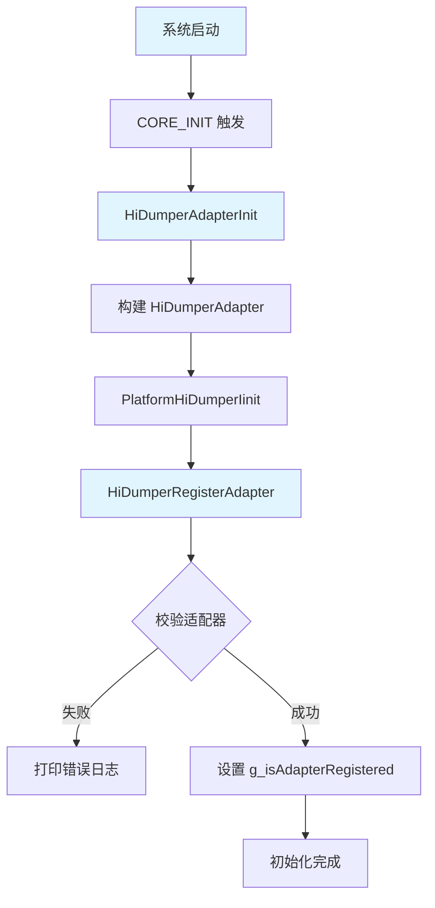
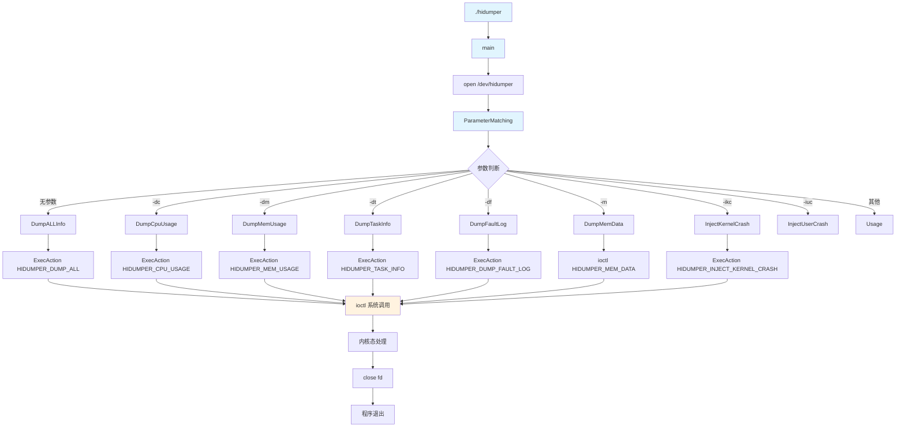
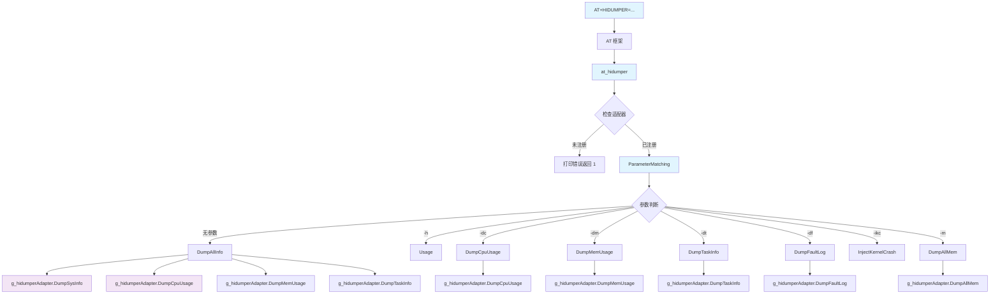
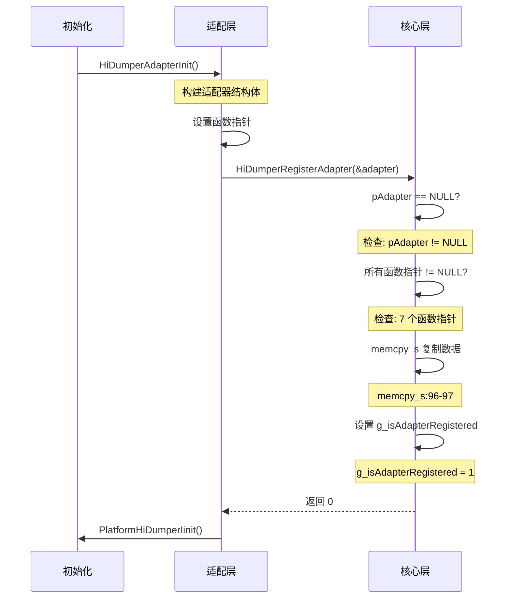

# 关键调用链

## 概述

本文档描述 `hidumper_lite` 项目中的关键调用链，包括初始化流程、命令执行流程和数据流向。

---

## 初始化调用链

### LiteOS_M 初始化流程



**调用序列详解**：

| 步骤 | 函数调用 | 源文件 | 行号 |
|------|----------|--------|------|
| 1 | 系统启动触发 | - | - |
| 2 | CORE_INIT_PRI 宏 | `hidumper_adapter.c` | 102 |
| 3 | HiDumperAdapterInit | `hidumper_adapter.c` | 84-101 |
| 4 | 构建适配器结构体 | `hidumper_adapter.c` | 86-94 |
| 5 | PlatformHiDumperIinit | `hidumper_adapter.c` | 100 |
| 6 | HiDumperRegisterAdapter | `hidumper_core.c` | 96 |
| 7 | 校验适配器 | `hidumper_core.c` | 81-95 |
| 8 | 设置标志位 | `hidumper_core.c` | 100 |

---

## 命令执行调用链

### LiteOS_A 命令行执行流程



**调用序列详解**：

| 步骤 | 函数调用 | 源文件 | 行号 |
|------|----------|--------|------|
| 1 | main | `hidumper.c` | 205-217 |
| 2 | open | `hidumper.c` | 208 |
| 3 | ParameterMatching | `hidumper.c` | 156-203 |
| 4-10 | DumpXXX 函数 | `hidumper.c` | 98-145 |
| 11 | ExecAction/ioctl | `hidumper.c` | 85-96 |
| 12 | close | `hidumper.c` | 215 |

---

### LiteOS_M AT 命令执行流程



**调用序列详解**：

| 步骤 | 函数调用 | 源文件 | 行号 |
|------|----------|--------|------|
| 1 | AT 命令输入 | AT 框架 | - |
| 2 | at_hidumper | `hidumper_core.c` | 155-165 |
| 3 | 适配器检查 | `hidumper_core.c` | 157-160 |
| 4 | ParameterMatching | `hidumper_core.c` | 105-153 |
| 5-10 | DumpXXX 函数 | `hidumper_core.c` | 57-130 |
| 11 | 适配器函数调用 | `hidumper_core.c` | 调用点 |

---

## 适配器注册调用链



---

## 数据流向

### 内存转储数据流

```
用户输入地址/大小
       │
       ▼
┌────────────────┐
│ ParameterMatching │ ────▶ 参数校验
└────────────────┘
       │
       ▼
┌────────────────┐
│ MemDumpParam    │ ◀──── 填充结构体
└────────────────┘
       │
       ▼
┌────────────────┐
│ ioctl(HIDUMPER_ │ ◀──── 系统调用
│    MEM_DATA)   │
└────────────────┘
       │
       ▼
┌────────────────┐
│ 内核驱动       │ ◀──── 内核态读取内存
└────────────────┘
       │
       ▼
    返回数据
```

### 信息采集数据流

```
平台适配器 .DumpXXX()
       │
       ▼
┌────────────────┐
│ 平台特定实现   │ ◀──── 采集系统信息
└────────────────┘
       │
       ▼
    输出到 stdout
```

---

## 关键路径分析

### 最长执行路径

| 路径 | 步骤数 | 主要耗时操作 |
|------|--------|--------------|
| 完整信息转储 | 6 | 4 次信息采集 |
| 内存转储 | 4 | 内核态内存读取 |
| AT 命令解析 | 5 | 适配器函数调用 |

### 最关键路径

| 路径 | 关键性 | 说明 |
|------|--------|------|
| HiDumperRegisterAdapter | 高 | 适配器注册失败导致所有功能不可用 |
| at_hidumper | 高 | AT 命令入口，失败则命令无响应 |
| ioctl 调用 | 高 | 内核通信桥梁，失败则无法获取信息 |

---

## 相关文档

| 文档 | 描述 |
|------|------|
| [02_Architecture.md](../02_Architecture.md) | 架构说明 |
| [03_API.md](../03_API.md) | 接口文档 |
| [appendix/Config_Flags.md](Config_Flags.md) | 关键配置项 |

---

## 更新日志

| 版本 | 日期 | 更新内容 |
|------|------|----------|
| 1.0.0 | 2026-02-06 | 初始版本 |
