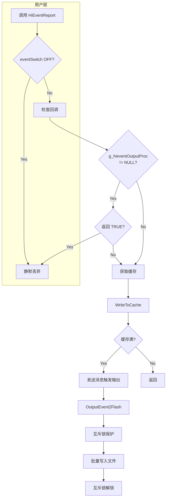

# 01_架构设计

> hievent_lite 组件架构、模块职责与数据流说明

## 1. 整体架构

```
┌─────────────────────────────────────────────────────────────────────────────┐
│                           hievent_lite 架构                                   │
├─────────────────────────────────────────────────────────────────────────────┤
│                                                                              │
│  ┌─────────────────────────────────────────────────────────────────────┐   │
│  │                        API Layer (接口层)                             │   │
│  │  ┌──────────────────────────────────────────────────────────────┐   │   │
│  │  │ 宏接口                     │  函数接口                         │   │   │
│  │  │ HIEVENT_FAULT_REPORT()    │ HiEventCreate()                  │   │   │
│  │  │ HIEVENT_UE_REPORT()       │ HiEventPutInteger()               │   │   │
│  │  │ HIEVENT_STAT_REPORT()     │ HiEventReport()                   │   │   │
│  │  │ HIEVENT_CREATE()          │ HiEventFlush()                    │   │   │
│  │  └──────────────────────────────────────────────────────────────┘   │   │
│  └─────────────────────────────────────────────────────────────────────┘   │
│                                    │                                         │
│                                    ▼                                         │
│  ┌─────────────────────────────────────────────────────────────────────┐   │
│  │                     Event Layer (事件层)                              │   │
│  │                                                                      │   │
│  │   HiEventCreate() ──▶ HiEventPutInteger() ──▶ HiEventReport()        │   │
│  │        │                      │                      │              │   │
│  │        ▼                      ▼                      ▼              │   │
│  │   ┌─────────┐         ┌─────────────┐        ┌─────────────┐        │   │
│  │   │ 分配    │         │ TLV 编码    │        │ 输出并释放  │        │   │
│  │   │ 内存    │         │ 1-4 字节    │        │             │        │   │
│  │   └─────────┘         └─────────────┘        └─────────────┘        │   │
│  └─────────────────────────────────────────────────────────────────────┘   │
│                                    │                                         │
│                                    ▼                                         │
│  ┌─────────────────────────────────────────────────────────────────────┐   │
│  │                     Output Layer (输出层)                             │   │
│  │                                                                      │   │
│  │    ┌──────────────────────────────────────────────────────────┐    │   │
│  │    │                   OutputEvent()                           │    │   │
│  │    │  ┌─────────────┬─────────────┬─────────────┐            │    │   │
│  │    │  │ 回调检查    │  缓存写入    │  触发输出   │            │    │   │
│  │    │  │ g_hievent  │ WriteToCache │ HiviewSend  │            │    │   │
│  │    │  │ OutputProc │              │ Message()   │            │    │   │
│  │    │  └─────────────┴─────────────┴─────────────┘            │    │   │
│  │    └──────────────────────────────────────────────────────────┘    │   │
│  │                                  │                                   │   │
│  │               ┌──────────────────┼──────────────────┐              │   │
│  │               ▼                  ▼                  ▼              │   │
│  │        ┌────────────┐    ┌────────────┐    ┌────────────┐         │   │
│  │        │ UART 输出  │    │ Flash 缓存 │    │ Flash 文件 │         │   │
│  │        │ (调试)     │    │ 批量写入   │    │ 持久化     │         │   │
│  │        └────────────┘    └────────────┘    └────────────┘         │   │
│  └─────────────────────────────────────────────────────────────────────┘   │
│                                                                              │
│  ┌─────────────────────────────────────────────────────────────────────┐   │
│  │                     Command Layer (命令层)                             │   │
│  │                                                                      │   │
│  │     HieventCmdProc() ──▶ HieventHelpProc() / HieventSetProc()       │   │
│  │                                                                      │   │
│  └─────────────────────────────────────────────────────────────────────┘   │
│                                                                              │
└─────────────────────────────────────────────────────────────────────────────┘
```

## 2. 模块职责

### 2.1 API 层 (interfaces/)

**职责**: 定义对外 C 接口

| 文件 | 职责 |
|------|------|
| `interfaces/native/innerkits/hiview_event.h` | 主 API 头文件，定义事件类型、结构体、函数声明 |
| `interfaces/native/innerkits/event.h` | 兼容头文件 |

**核心定义**:

```c
// 事件类型 (hiview_event.h:27-38)
HIEVENT_FAULT  = 1  // 故障事件
HIEVENT_UE     = 2  // 用户行为事件
HIEVENT_STAT   = 4  // 统计事件

// 事件结构体 (hiview_event.h:40-53)
typedef struct {
    HiEventCommon common;  // 公共头部 (8字节)
    uint8 type;            // 事件类型
    uint8 *payload;        // TLV 编码数据
} HiEvent;
```

### 2.2 事件层 (frameworks/hiview_event.c)

**职责**: 事件对象的创建、管理与序列化

| 函数 | 职责 | 行号 |
|------|------|------|
| `HiEventInit()` | 模块初始化 | 40 |
| `HiEventPrintf()` | 单参数事件快速上报 | 51 |
| `HiEventCreate()` | 创建多参数事件 | 73 |
| `HiEventPutInteger()` | 添加参数 | 97 |
| `HiEventReport()` | 上报并释放 | 114 |
| `HiEventEncode()` | TLV 编码 | 129 |
| `HiEventFlush()` | 刷新事件 | 173 |

### 2.3 输出层 (frameworks/hiview_output_event.c)

**职责**: 事件缓存、文件管理、输出分发

| 模块 | 职责 | 关键变量 |
|------|------|----------|
| **缓存管理** | 内存缓冲，批量写入 | `g_faultEventCache`, `g_ueEventCache`, `g_statEventCache` |
| **文件管理** | Flash 持久化存储 | `g_faultEventFile`, `g_ueEventFile`, `g_statEventFile` |
| **输出分发** | 决定输出目标 | `OutputEvent()`, `OutputEvent2Flash()`, `OutputEventRealtime()` |
| **线程安全** | 互斥锁保护 | `g_outputEventInfo.mutex` |

### 2.4 命令层 (command/)

**职责**: Shell 命令行接口

| 函数 | 职责 | 行号 |
|------|------|------|
| `HieventCmdProc()` | 命令入口 | 39 |
| `HieventHelpProc()` | 帮助信息 | 69 |
| `HieventSetProc()` | 开关切换 | 76 |
| `SwitchEvent()` | 实际切换 | 104 |

## 3. 线程模型

### 3.1 初始化阶段

```
系统启动
    │
    ▼
CORE_INIT_PRI(HiEventInit, 1)  // 优先级 1
    │
    ├─▶ InitCoreEventOutput()  // 初始化输出核心
    │      ├─▶ HIVIEW_MutexInit()  // 初始化互斥锁
    │      └─▶ HiviewRegisterMsgHandle()  // 注册消息处理
    │
    └─▶ HiviewRegisterInitFunc()  // 注册延迟初始化
           │
           ▼
       系统就绪后
           │
           ▼
       InitEventOutput()  // 初始化三类事件输出
              ├─▶ InitFaultEventOutput()
              ├─▶ InitUeEventOutput()
              └─▶ InitStatEventOutput()
```

**证据**: `frameworks/hiview_event.c:40-49`, `hiview_output_event.c:101-114`

### 3.2 运行阶段（事件上报）

```
用户调用 HiEventReport()
         │
         ▼
    ┌─────────────┐
    │ 参数校验    │──▶ 返回（eventSwitch == OFF）
    └──────┬──────┘
           │
           ▼
    ┌─────────────┐
    │ 回调检查    │──▶ g_hieventOutputProc 返回 TRUE → 直接返回
    └──────┬──────┘
           │
           ▼
    ┌─────────────┐
    │ 缓存写入    │──▶ WriteToCache()
    └──────┬──────┘
           │
           ▼
    ┌─────────────┐
    │ 输出触发    │──▶ 缓存满 或 DEBUG 模式
    └──────┬──────┘           │
           │                  ▼
           │           ┌─────────────┐
           │           │ 发送消息     │
           │           │ HiviewSend  │
           │           │ Message()   │
           │           └──────┬──────┘
           │                  │
           ▼                  ▼
    ┌─────────────────────────────────────┐
    │          OutputEvent2Flash()        │  // 异步执行
    │  ┌───────────┐  ┌───────────┐      │
    │  │ 互斥锁锁定 │  │ 批量写入   │      │
    │  └─────┬─────┘  └─────┬─────┘      │
    │        │              │             │
    │        ▼              ▼             │
    │  ┌─────────────────────────────┐    │
    │  │ WriteToFile(f, data, len)  │    │  // 写入 Flash
    │  └─────────────────────────────┘    │
    └─────────────────────────────────────┘
```

**证据**: `frameworks/hiview_event.c:114-127`, `hiview_output_event.c:220-277`

### 3.3 线程安全机制

| 保护对象 | 机制 | 代码位置 |
|----------|------|----------|
| **输出事件** | `g_outputEventInfo.mutex` | `hiview_output_event.c:81-83` |
| **刷新操作** | `g_eventFlushInfo.mutex` | `hiview_output_event.c:72-76` |
| **消息发送** | `HiviewSendMessage()` | `hiview_output_event.c:256,260` |

## 4. 核心数据流

### 4.1 事件上报数据流



### 4.2 事件类型分流

```
事件类型 (event->type)
        │
        ├─────────────────────────────────────────────────────┐
        │                                                     │
        ▼                                                     ▼
┌───────────────────┐                              ┌───────────────────┐
│  HIEVENT_FAULT    │                              │  HIEVENT_UE       │
│  故障事件          │                              │  用户行为事件      │
├───────────────────┤                              ├───────────────────┤
│ 缓存: g_fault     │                              │ 缓存: g_ue        │
│     EventCache   │                              │     EventCache   │
├───────────────────┤                              ├───────────────────┤
│ 文件: g_fault     │                              │ 文件: g_ue        │
│     EventFile    │                              │     EventFile    │
└───────────────────┘                              └───────────────────┘
        │
        └─────────────────────────────────────────────────────┐
                                                          │
                                                          ▼
                                              ┌───────────────────┐
                                              │  HIEVENT_STAT     │
                                              │  统计事件          │
                                              ├───────────────────┤
                                              │ 缓存: g_stat      │
                                              │     EventCache   │
                                              ├───────────────────┤
                                              │ 文件: g_stat      │
                                              │     EventFile    │
                                              └───────────────────┘
```

**证据**: `frameworks/hiview_output_event.c:448-463` - `GetEventCache()`

### 4.3 TLV 编码流程

```
输入参数
    │
    ├── key (0-15) ─────────────┐
    │                           │
    └── value (int32) ──────────┼──▶ HiEventEncode()
                                │
                                ▼
                    ┌───────────────────────┐
                    │   Value 范围判断      │
                    └───────────────────────┘
                                │
            ┌───────────────────┼───────────────────┐
            ▼                   ▼                   ▼
    ┌─────────────┐     ┌─────────────┐     ┌─────────────┐
    │ 0-255      │     │ 256-65535   │     │ > 65535     │
    │ 1 字节编码 │     │ 2 字节编码  │     │ 4 字节编码  │
    └──────┬──────┘     └──────┬──────┘     └──────┬──────┘
           │                   │                   │
           └───────────────────┴───────────────────┘
                                │
                                ▼
                    ┌───────────────────────┐
                    │   输出格式:            │
                    │   [1bit:last][3bit:   │
                    │    key][4bit:len]     │
                    │   [1-4 bytes:value]   │
                    └───────────────────────┘
```

**证据**: `frameworks/hiview_event.c:129-171`

## 5. 初始化序列

### 5.1 静态初始化 (CORE_INIT_PRI)

```
1. 编译时宏定义
   └── CORE_INIT_PRI(HiEventInit, 1)
           │
           ▼
2. 系统启动时自动调用
   └── HiEventInit()
           │
           ├─▶ g_hiviewConfig.eventSwitch == HIVIEW_FEATURE_ON ?
           │
           ├─ NO ──▶ 直接返回
           │
           └─ YES ──▶
               ├─▶ InitCoreEventOutput()
               │      ├─▶ HIVIEW_MutexInit() × 2
               │      └─▶ HiviewRegisterMsgHandle()
               │             ├─ HIVIEW_MSG_OUTPUT_EVENT_BIN_FILE
               │             └─ HIVIEW_MSG_OUTPUT_EVENT_FLOW
               │
               └─▶ HiviewRegisterInitFunc()
                      ├─ HIVIEW_CMP_TYPE_EVENT
                      └─ InitEventOutput (延迟调用)
```

**证据**: `frameworks/hiview_event.c:40-49`

### 5.2 延迟初始化

```
InitEventOutput() 在系统就绪后被调用
        │
        ├─▶ InitFaultEventOutput()
        │      ├─▶ InitHiviewCache() - 分配故障事件缓存
        │      └─▶ InitHiviewFile() - 打开故障事件文件
        │
        ├─▶ InitUeEventOutput()
        │      ├─▶ InitHiviewCache() - 分配用户事件缓存
        │      └─▶ InitHiviewFile() - 打开用户事件文件
        │
        └─▶ InitStatEventOutput()
               ├─▶ InitHiviewCache() - 分配统计事件缓存
               └─▶ InitHiviewFile() - 打开统计事件文件
```

**证据**: `frameworks/hiview_output_event.c:109-114`

## 6. 关键时序

### 6.1 事件创建到上报

```
时间线
  │
  │  1. HiEventCreate()      2. HiEventPutInteger()   3. HiEventReport()
  │       │                        │                      │
  │       ▼                        ▼                      ▼
  │  ┌─────────┐            ┌──────────┐           ┌───────────┐
  │  │ 分配     │    ───▶    │ TLV 编码 │    ───▶   │ 输出并释放 │
  │  │ HiEvent │            │ 加入 payload │       │           │
  │  └─────────┘            └──────────┘           └───────────┘
  │       │                        │                      │
  │       ▼                        ▼                      ▼
  │  返回事件指针           事件添加数据              事件写入缓存
  │                                                        │
  │                                                        ▼
  │                                               ┌───────────────┐
  │                                               │ 缓存满时触发   │
  │                                               │ OutputEvent2  │
  │                                               │ Flash()       │
  │                                               └───────────────┘
```

### 6.2 文件满处理

```
事件文件达到阈值
        │
        ▼
HiEventFileAddWatcher() 注册的回调被触发
        │
        ▼
   ┌─────────────────────────────────────────┐
   │ 场景: 设备重启前 HiEventFlush(true)     │
   └─────────────────────────────────────────┘
        │
        ▼
Output2Flash() 被调用
        │
        ├─▶ 互斥锁锁定
        │
        ├─▶ 读取缓存数据
        │
        ├─▶ 写入 Flash 文件
        │
        └─▶ 互斥锁解锁
```

---

**跳转**: [00_Overview.md](00_Overview.md) | [02_API_Reference.md](02_API_Reference.md) | [SUMMARY.md](SUMMARY.md)
