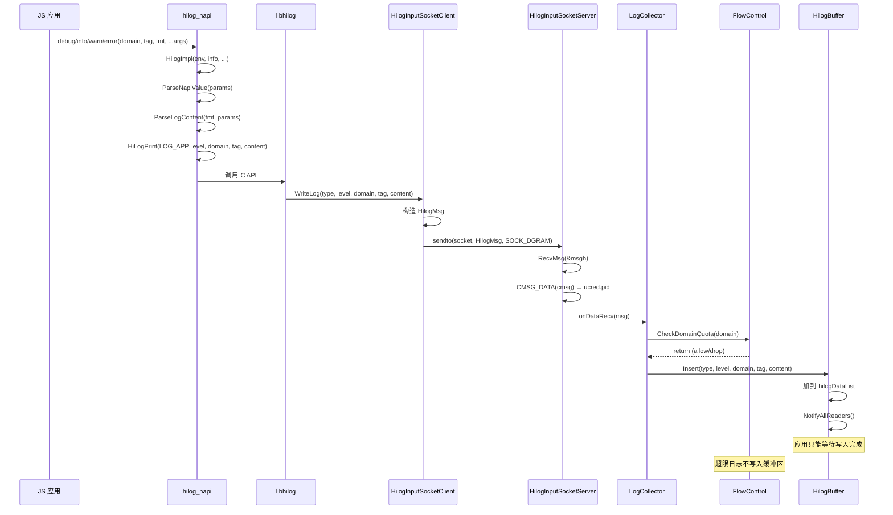
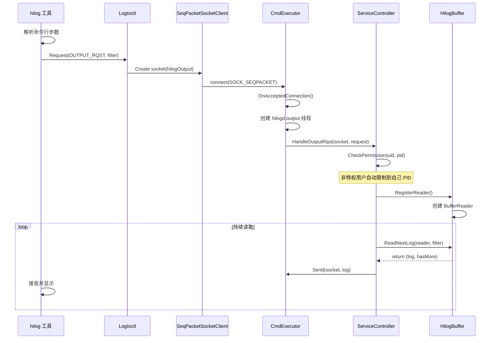

# HiLog 架构说明

> 生成时间: 2026-02-06
> 相关证据: `services/hilogd/`, `frameworks/libhilog/socket/`, `interfaces/js/kits/napi/src/`

---

## 目的

本文档详细描述 HiLog 的架构设计、组件交互、数据流、线程模型。

## 适用范围

涵盖 hilogd 服务、libhilog 客户端库、N-API 绑定的架构设计。

---

## 组件架构图

```mermaid
graph TB
    subgraph Applications["应用层"]
        JS_App[JS 应用<br/>@ohos.hilog]
        Native_App[Native 应用<br/>libhilog]
        SystemService[系统服务<br/>LOG_CORE]

    subgraph Interface["接口层"]
        NAPI[hilog_napi<br/>12 个 JS 方法]
        NDK[hilog_ndk<br/>C/C++ API]
        Rust[hilog_rust<br/>Rust FFI]
        ETS[ani_hilog<br/>ArkTS ANI]

    subgraph ClientLib["客户端库"]
        libhilog[libhilog.so<br/>日志 API + Socket 客户端]
        SocketClient[Unix Domain Socket<br/>SOCK_DGRAM]
        LogIoctl[LogIoctl<br/>命令控制包装]

    subgraph DaemonService["hilogd 服务"]
        InputSocket[HilogInputSocketServer<br/>SOCK_DGRAM]
        OutputSocket[Output/Control<br/>SOCK_SEQPACKET]
        Collector[LogCollector<br/>日志接收+流控]
        Buffer[HilogBuffer<br/>环行缓冲区]
        Controller[ServiceController<br/>命令处理]
        Persister[LogPersister<br/>落盘线程]

    subgraph Storage["存储层"]
        LogFiles[/data/log/hilog<br/>*.gz 压缩日志]
        Config[hilogd.cfg<br/>服务配置]

    Applications --> NAPI
    Applications --> NDK
    Applications --> Rust
    Applications --> ETS

    NAPI --> libhilog
    NDK -->|调用|libhilog
    Rust --> libhilog
    ETS --> libhilog

    libhilog --> SocketClient
    SocketClient -->|写入|InputSocket

    SystemService --> |直接写入|InputSocket

    InputSocket --> Collector
    Collector --> Buffer
    Buffer --> |新日志通知|Controller

    OutputSocket --> Controller
    Controller --> Buffer
    Controller --> |查询+过滤|Buffer

    Buffer --> |新日志|Persister
    Persister --> LogFiles

    Controller --> |读取|Config
```

---

## 核心组件职责

### 1. 应用层组件

| 组件 | 职责 | 语言 |
|------|------|------|
| **hilog_napi** | N-API 绑定，提供 12 个 JS 方法 | JavaScript |
| **hilog_ndk** | NDK 接口封装 | C/C++ |
| **hilog_rust** | Rust FFI 绑定 | Rust |
| **ani_hilog** | ArkTS ANI 绑定 | ArkTS |

### 2. 客户端库（libhilog）

| 组件 | 职责 | 证据 |
|------|------|------|
| **HilogInputSocketClient** | 通过 SOCK_DGRAM 发送日志到 hilogd | `frameworks/libhilog/socket/hilog_input_socket_client.cpp` |
| **LogIoctl** | 封装 SeqPacketSocket，发送控制命令 | `frameworks/libhilog/ioctl/log_ioctl.cpp` |
| **HiLog C++ API** | 提供 Debug/Info/Warn/Error/Fatal 方法 | `frameworks/libhilog/hilog.cpp` |
| **HiLog C API** | 提供 HILOG_DEBUG/INFO/WARN/ERROR/FATAL 宏 | `frameworks/libhilog/hilog_printf.cpp` |

### 3. hilogd 服务组件

| 组件 | 职责 | 线程模型 | 证据 |
|------|------|---------|----------|
| **HilogInputSocketServer** | SOCK_DGRAM 服务端，接收日志 | 单线程（hilogd.server） | `frameworks/libhilog/socket/hilog_input_socket_server.cpp` |
| **CmdExecutor** | 管理 Output/Control socket 连接 | 每连接一个线程 | `services/hilogd/cmd_executor.cpp` |
| **LogCollector** | 接收日志，应用流控，插入缓冲区 | 共享到 InputSocket | `services/hilogd/log_collector.cpp` |
| **HilogBuffer** | 环形缓冲区存储，管理 readers | 主线程操作，mutex 保护 | `services/hilogd/log_buffer.cpp` |
| **ServiceController** | 处理所有 IOCTL 命令 | CmdExecutor 回调 | `services/hilogd/service_controller.cpp` |
| **LogPersister** | 后台线程落盘，压缩日志 | 每任务一个线程 | `services/hilogd/log_persister.cpp` |
| **LogKmsg** | 读取内核消息（/proc/kmsg） | 单线程（hilogd.rd_kmsg） | `services/hilogd/log_kmsg.cpp` |
| **FlowControl** | Domain 级别流控策略 | 单线程，per-domain map | `services/hilogd/flow_control.cpp` |

---

## 线程模型

### hilogd 线程架构

```
┌──────────────────────────────────────────────────┐
│           hilogd 进程                      │
├───────────────────────────────────────────────┤
│  主线程（初始化）                        │
│  ├── main() - 初始化所有组件                     │
│  ├── 启动 InputSocketServer                │
│  ├── 启动 CmdExecutor（2 个 socket）        │
│  ├── 启动 LogKmsg（可选）                 │
│  └── 启动 Persister（后台任务）           │
├───────────────────────────────────────────────┤
│  输入线程（hilogd.server）                  │
│  ├── HilogInputSocketServer::ServingThread()   │
│  ├── 接收 DGRAM 消息                   │
│  └── 调用 LogCollector::onDataRecv()        │
├───────────────────────────────────────────────┤
│  控制线程（每连接）                        │
│  ├── CmdExecutor::OnAcceptedConnection()        │
│  ├── 为每个 hilogd.cmd 连接创建线程      │
│  └── 为每个 hilogd.output 连接创建线程   │
├───────────────────────────────────────────────┤
│  输出线程（CmdExecutor main loop）         │
│  ├── 接收控制命令                         │
│  ├── 调用 ServiceController                 │
│  └── 发送缓冲区数据到客户端                │
├───────────────────────────────────────────────┤
│  内核日志线程（可选）                      │
│  ├── LogKmsg::ReadAllKmsg()                │
│  ├── 读取 /proc/kmsg 或 /dev/kmsg          │
│  └── 调用 HiLogPrint (LOG_KMSG)      │
├───────────────────────────────────────────────┤
│  Persister 线程（每任务）                    │
│  ├── LogPersister::ReceiveLogLoop()           │
│  ├── 等待新日志通知                       │
│  ├── 查询缓冲区                           │
│  └── 压缩并写入文件                       │
└───────────────────────────────────────────────────┘
```

### 线程同步机制

| 锁/条件变量 | 保护对象 | 用途 | 证据 |
|-------------|---------|------|----------|
| `hilogBufferMutex` | HilogBuffer 的 hilogDataList | 缓冲区读写互斥 | `services/hilogd/log_buffer.cpp` |
| `m_logReaderMtx` | 缓冲区 readers 映射 | 读者注册表保护 | `services/hilogd/log_buffer.cpp` |
| `m_notifyNewDataCv` | 通知条件变量 | 通知输出线程有新日志 | `services/hilogd/log_buffer.cpp` |
| `m_receiveLogCv` | Persister 条件变量 | Persister 线程等待/通知 | `services/hilogd/log_persister.cpp` |
| `m_stopRequest` | 原子变量 | 线程停止信号 | 各组件 |

---

## 数据流：日志写入

### 完整调用链



### 关键步骤说明

1. **N-API 层**:
   - 参数解析：domain (int32), tag (string), format (string), ...args
   - 类型转换：number/bigint/string/object → string
   - 隐私处理：`%{public}`/`%{private}` 标记

   **证据**: `interfaces/js/kits/napi/src/hilog/src/hilog_napi_base.cpp:275-334`

2. **libhilog 层**:
   - 构造 `HilogMsg` 结构（传输格式）
   - 包含：len, version, type, level, tagLen, tv_sec, tv_nsec, pid, tid, domain, tag + content

   **证据**: `frameworks/libhilog/include/hilog_base.h`

3. **Socket 传输**:
   - 通过 `SOCK_DGRAM` 发送
   - 无连接开销，fire-and-forget 模式
   - `SO_PASSCRED` 选项传递 PID/UID

   **证据**: `frameworks/libhilog/socket/dgram_socket_client.cpp`

4. **hilogd 接收**:
   - 接收 `HilogMsg` 结构
   - 从 `ucred` 提取真实 PID
   - 流控检查：每个 domain 的配额

   **证据**: `services/hilogd/log_collector.cpp`

---

## 数据流：日志查询

### 完整调用链



### 关键步骤说明

1. **权限检查**:
   - 检查 socket UID（`GetUid()`）
   - 非 ROOT/SHELL/HIVIEW/PROFILER: 自动限制到 own PID + parent PID

   **证据**: `services/hilogd/service_controller.cpp:487-498`

2. **过滤处理**:
   - 类型过滤：types bitmask
   - 级别过滤：levels bitmask
   - Domain 过滤：domains 数组（最多 5 个）
   - Tag 过滤：tags 数组（最多 5 个）
   - PID 过滤：pids 数组（最多 5 个）
   - 正则过滤：regex 字符串

   **证据**: `frameworks/libhilog/include/hilog_cmd.h` - LogFilter 结构

3. **缓冲区查询**:
   - 使用 `std::list<HilogData>` 的迭代器
   - 每个读者维护独立位置
   - 支持并发多个查询

   **证据**: `services/hilogd/log_buffer.cpp` - HilogBuffer::Query()

---

## 数据流：日志落盘

### 完整调用链

```mermaid
sequenceDiagram
    participant Buffer as HilogBuffer
    participant Persister as LogPersister
    participant Rotator as LogPersisterRotator
    participant Compress as LogCompress
    participant File as /data/log/hilog

    Note over Buffer: 缓冲区有新日志时
    Buffer->>Persister: OnNewItem(reader, data)

    Persister->>Persister: ReceiveLogLoop(job)
    loop 持续轮询
        Persister->>Buffer: QueryBuffer(reader, filter)
        Buffer-->>Persister: return (logs, hasMore)

        Persister->>Rotator: CompressAndWrite(job, logs)
        Rotator->>Rotator: 检查文件大小/数量限制
        Rotator->>Rotator: CheckRotateNeeded()

        Rotator->>Compress: CompressBuffer(job, logs)
        alt zlib or zstd

        Compress->>File: 写入(filename, compressed_data)
        Note over File: 文件命名格式: hilog.000.20170805-170154.gz
    end
```

### 关键步骤说明

1. **压缩算法**:
   - 支持 zlib（`.gz`）和 zstd（`.zst`）
   - 通过 `-m` 命令选择
   - 压缩缓冲区大小：64KB

   **证据**: `services/hilogd/log_compress.cpp`

2. **文件轮转**:
   - 文件大小限制：64KB - 512MB
   - 文件数量限制：2 - 1000 个
   - 索引范围：[0, 999]，超过回绕到 0

   **证据**: `frameworks/libhilog/include/hilog_common.h:40-41`

3. **任务管理**:
   - 支持最多 10 个并发落盘任务（`MAX_JOBS`）
   - 每个 task 有独立线程
   - 任务 ID 范围：[10, UINT_MAX]

   **证据**: `frameworks/libhilog/include/hilog_common.h:34`

---

## Unix Domain Socket 通信架构

### Socket 类型对比

| 属性 | hilogInput | hilogOutput | hilogControl |
|--------|------------|------------|--------------|
| **类型** | SOCK_DGRAM | SOCK_SEQPACKET | SOCK_SEQPACKET |
| **路径** | /dev/unix/socket/hilogInput | /dev/unix/socket/hilogOutput | /dev/unix/socket/hilogControl |
| **模式** | 无连接 | 面向连接，保持消息边界 | 面向连接，保持消息边界 |
| **权限** | 0222 (只写) | 0666 (读/写) | 0660 (读/写) |
| **凭证** | SO_PASSCRED | SO_PEERCRED | SO_PEERCRED |
| **用途** | 日志提交 | 日志查询 | 控制命令 |

### 为什么不用标准 IPC

| 原因 | 说明 |
|------|------|
| **性能** | Unix socket 比 Binder 开销更低，适合高频日志写入 |
| **简单性** | 无需 SA 注册、代理/桩生成 |
| **兼容性** | 在原生级别工作，无需 JS 运行时 |
| **凭证传递** | `SO_PASSCRED` 直接从内核获取 PID/UID |

---

## 关键数据结构

### HilogMsg（传输格式）

```cpp
struct HilogMsg {
    uint16_t len;           // 总消息长度（包括 tagLen + tag + content）
    uint16_t version : 3;   // 协议版本
    uint16_t type : 4;      // 日志类型（LOG_APP/LOG_CORE/LOG_INIT/LOG_KMSG）
    uint16_t level : 3;     // 日志级别（DEBUG/INFO/WARN/ERROR/FATAL）
    uint16_t tagLen : 6;    // Tag 长度（包括 '\0'）
    uint32_t tv_sec;        // 实时秒数
    uint32_t tv_nsec;       // 实时纳秒
    uint32_t mono_sec;      // 单调秒数（相对于启动时间）
    uint32_t pid;           // 进程 ID（从 ucred 获取）
    uint32_t tid;           // 线程 ID
    uint32_t domain;        // 日志域（0x0-0xFFFF for APP, 0xD000000-0xD0FFFFF for SYSTEM）
    char tag[];             // 变长：tag + content（都 null 终止）
};
```

**证据**: `frameworks/libhilog/include/hilog_base.h`

### HilogData（内存格式）

```cpp
struct HilogData {
    uint16_t len;           // tagLen + contentLen
    uint16_t version : 3;
    uint16_t type : 3;
    uint16_t level : 4;
    uint16_t tagLen : 6;
    uint32_t tv_sec, tv_nsec, mono_sec;
    uint32_t pid, tid;
    uint32_t domain;
    char* tag;              // 指向 tag 内容
    char* content;          // 指向 tag + tagLen 处
};
```

**证据**: `services/hilogd/include/log_data.h`

---

## 相关跳转链接

- [目录结构](02_Directory_Structure.md)
- [N-API 接口](04_NAPI_Interface.md)
- [内部 API](05_Internal_API.md)
- [GN Targets](06_GN_Targets.md)

---

## 证据索引

| 主题 | 文件路径 | 行号/符号 |
|------|---------|----------|
| hilogd 初始化 | services/hilogd/main.cpp | 全文 |
| LogBuffer 类 | services/hilogd/log_buffer.cpp | 全文 |
| LogCollector 类 | services/hilogd/log_collector.cpp | 全文 |
| ServiceController 类 | services/hilogd/service_controller.cpp | 全文 |
| LogPersister 类 | services/hilogd/log_persister.cpp | 全文 |
| Socket 实现 | frameworks/libhilog/socket/ | 多个文件 |
| HilogMsg 结构 | frameworks/libhilog/include/hilog_base.h | 全文 |
| HilogData 结构 | services/hilogd/include/log_data.h | 全文 |
| N-API 实现 | interfaces/js/kits/napi/src/hilog/src/hilog_napi_base.cpp | 全文 |
