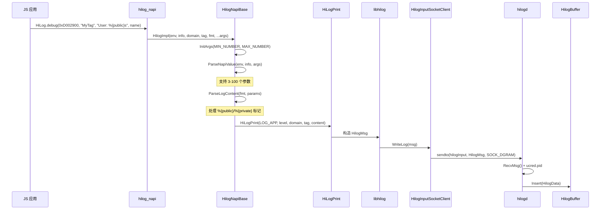
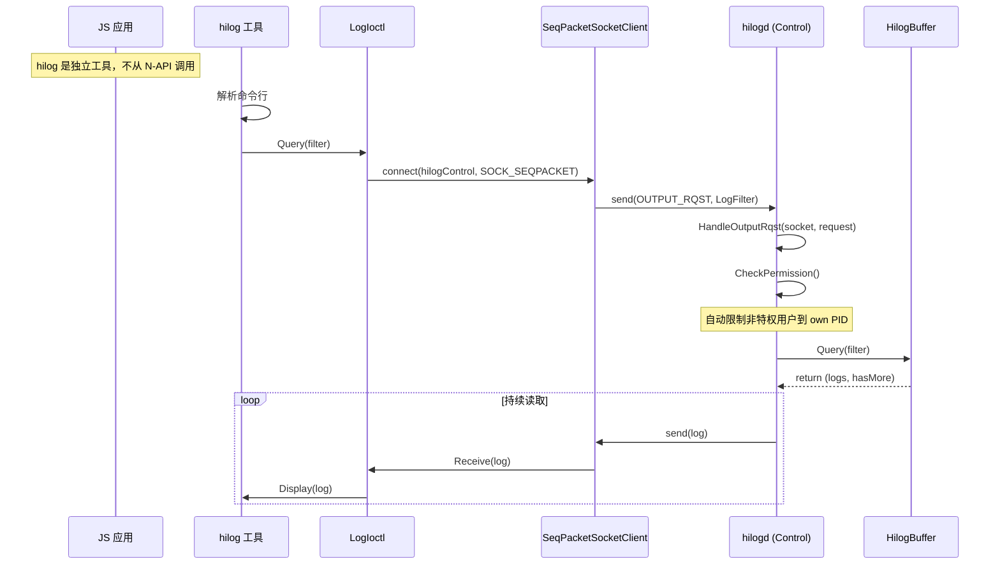
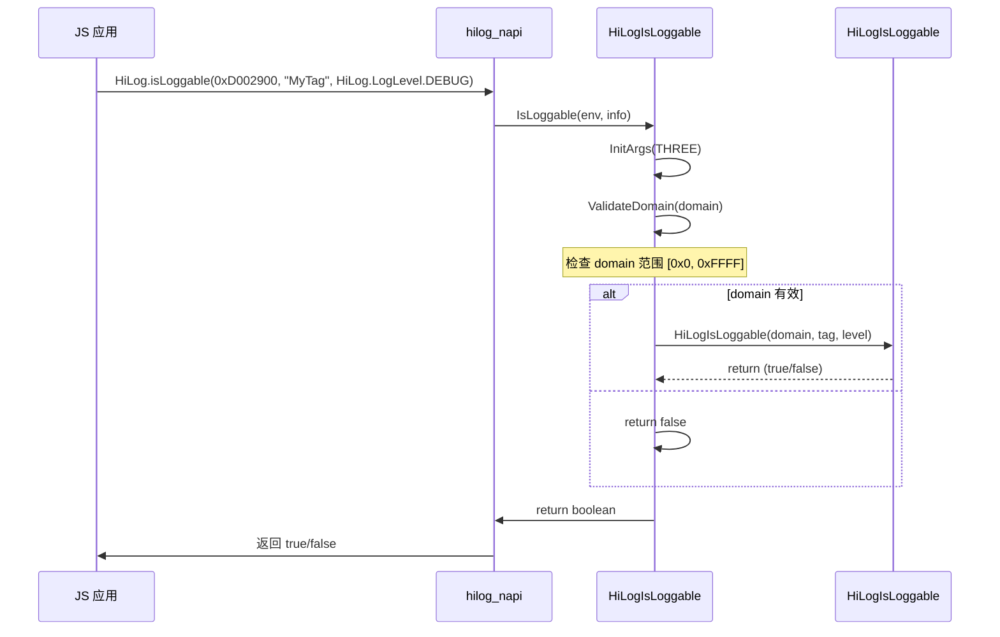
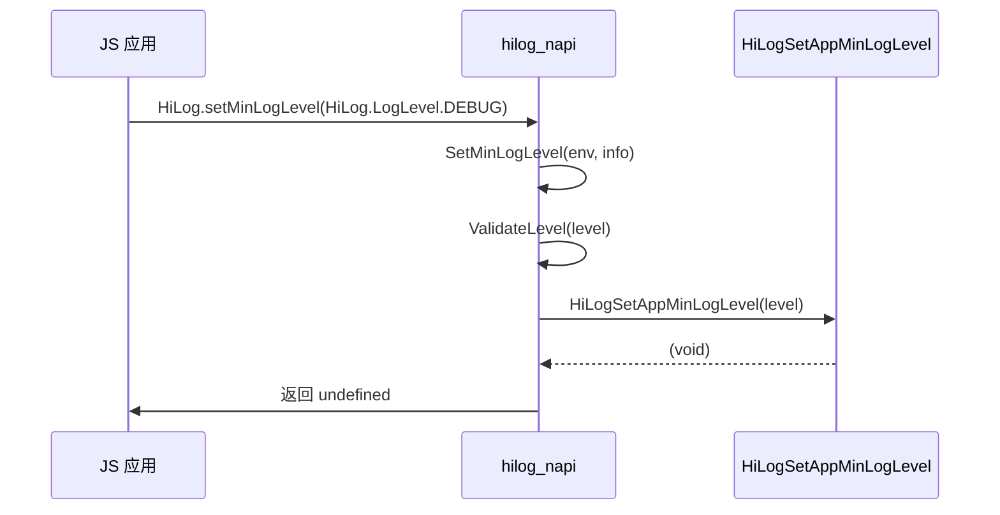

# HiLog N-API 接口文档

> 生成时间: 2026-02-06
> 相关证据: `interfaces/js/kits/napi/src/hilog/module.cpp`, `interfaces/js/kits/napi/src/hilog/src/hilog_napi.cpp`

---

## 目的

本文档详细描述 HiLog 暴露的 JavaScript N-API 接口，包括方法清单、参数、错误码、调用链。

## 适用范围

适用于 JS 应用开发者，通过 `@ohos.hilog` 模块调用 HiLog。

---

## N-API 模块注册

### 注册点

**文件**: `interfaces/js/kits/napi/src/hilog/module.cpp`

```cpp
NAPI_MODULE(hilog, Export)
```

**说明**:
- 模块名：`"hilog"`
- 导出函数：`Export()`
- 创建 `HilogNapi` 实例并调用 `Export()`

**证据**: `interfaces/js/kits/napi/src/hilog/module.cpp:37`

---

## API 清单表

### 1. 日志打印方法（5 个）

| JS 方法 | C++ 函数 | 参数 | 同步/异步 | 说明 |
|---------|-----------|------|----------|------|
| `debug(domain, tag, fmt, ...args)` | `HilogNapiBase::Debug()` | domain: int32, tag: string, fmt: string, args: rest | 同步 | 打印 DEBUG 级别日志 |
| `info(domain, tag, fmt, ...args)` | `HilogNapiBase::Info()` | 同上 | 同步 | 打印 INFO 级别日志 |
| `warn(domain, tag, fmt, ...args)` | `HilogNapiBase::Warn()` | 同上 | 同步 | 打印 WARN 级别日志 |
| `error(domain, tag, fmt, ...args)` | `HilogNapiBase::Error()` | 同上 | 同步 | 打印 ERROR 级别日志 |
| `fatal(domain, tag, fmt, ...args)` | `HilogNapiBase::Fatal()` | 同上 | 同步 | 打印 FATAL 级别日志 |

**证据**: `interfaces/js/kits/napi/src/hilog/src/hilog_napi.cpp:185-209`

### 2. 系统日志方法（5 个）

| JS 方法 | C++ 函数 | 参数 | 同步/异步 | 说明 |
|---------|-----------|------|----------|------|
| `sLogD(domain, tag, fmt, ...args)` | `HilogNapiBase::SysLogDebug()` | domain: int32, tag: string, fmt: string, args: rest | 同步 | 打印 DEBUG 级别系统日志（LOG_CORE） |
| `sLogI(domain, tag, fmt, ...args)` | `HilogNapiBase::SysLogInfo()` | 同上 | 同步 | 打印 INFO 级别系统日志（LOG_CORE） |
| `sLogW(domain, tag, fmt, ...args)` | `HilogNapiBase::SysLogWarn()` | 同上 | 同步 | 打印 WARN 级别系统日志（LOG_CORE） |
| `sLogE(domain, tag, fmt, ...args)` | `HilogNapiBase::SysLogError()` | 同上 | 同步 | 打印 ERROR 级别系统日志（LOG_CORE） |
| `sLogF(domain, tag, fmt, ...args)` | `HilogNapiBase::SysLogFatal()` | 同上 | 同步 | 打印 FATAL 级别系统日志（LOG_CORE） |

**证据**: `interfaces/js/kits/napi/src/hilog/src/hilog_napi.cpp:210-233`

### 3. 配置方法（2 个）

| JS 方法 | C++ 函数 | 参数 | 同步/异步 | 返回值 | 说明 |
|---------|-----------|------|----------|--------|------|
| `isLoggable(domain, tag, level)` | `HilogNapiBase::IsLoggable()` | domain: int32, tag: string, level: LogLevel | 同步 | boolean | 检查指定 domain/tag/level 的日志是否可打印 |
| `setMinLogLevel(level)` | `HilogNapiBase::SetMinLogLevel()` | level: LogLevel | 同步 | undefined | 设置当前应用的最低日志级别 |
| `setLogLevel(level, prefer)` | `HilogNapiBase::SetLogLevel()` | level: LogLevel, prefer: PreferStrategy | 同步 | undefined | 设置当前应用的日志级别和偏好策略 |

**证据**: `interfaces/js/kits/napi/src/hilog/src/hilog_napi.cpp:117-145`

---

## 导出枚举

### LogLevel

| JS 常量 | C++ 值 | 说明 |
|-----------|---------|------|
| `HiLog.LogLevel.DEBUG` | 3 | 最低优先级，调试信息 |
| `HiLog.LogLevel.INFO` | 4 | 普通信息，记录关键流程节点 |
| `HiLog.LogLevel.WARN` | 5 | 警告信息，严重但非预期情况 |
| `HiLog.LogLevel.ERROR` | 6 | 错误信息，影响功能正常运行 |
| `HiLog.LogLevel.FATAL` | 7 | 致命信息，程序即将崩溃 |

**证据**: `interfaces/js/kits/napi/src/hilog/src/hilog_napi.cpp:44-68`

### PreferStrategy

| JS 常量 | C++ 值 | 说明 |
|-----------|---------|------|
| `HiLog.PreferStrategy.UNSET_LOGLEVEL` | 0 | 取消之前的级别设置 |
| `HiLog.PreferStrategy.PREFER_CLOSE_LOG` | 1 | 采用更严格的级别（max(新级别, 系统级别)） |
| `HiLog.PreferStrategy.PREFER_OPEN_LOG` | 2 | 采用更宽松的级别（min(新级别, 系统级别)） |

**证据**: `interfaces/js/kits/napi/src/hilog/src/hilog_napi.cpp:71-91`

---

## 参数解析与校验

### 参数范围

| 参数 | 类型 | 最小值 | 最大值 | 说明 |
|------|------|-------|-------|------|
| `domain` | int32 | 0x0 (0) | 0xFFFF (65535) | 应用 domain 范围 |
| `tag` | string | - | - | 日志标签字符串 |
| `fmt` | string | - | - | 格式化字符串 |
| `args` | rest | 3 | 100 | 可变参数，最少 3 个，最多 100 个 |
| `level` | LogLevel | 3 (DEBUG) | 7 (FATAL) | 日志级别 |

**证据**: `interfaces/js/kits/napi/src/hilog/src/hilog_napi_base.cpp:34-35`

### Domain 验证

```cpp
// interfaces/js/kits/napi/src/hilog/src/hilog_napi_base.cpp:130-131
if ((domain < static_cast<int32_t>(DOMAIN_APP_MIN)) ||
    (domain > static_cast<int32_t>(DOMAIN_APP_MAX))) {
    return NVal::CreateBool(env, false).val_;
}
```

**说明**:
- 应用只能使用 domain 范围：`[0x0, 0xFFFF]`
- 系统 domain `[0xD000000, 0xD0FFFFF]` 保留给系统服务

### 参数数量验证

```cpp
// interfaces/js/kits/napi/src/hilog/src/hilog_napi_base.cpp:278
funcArg.InitArgs(MIN_NUMBER, MAX_NUMBER);
```

**说明**:
- 最少参数：3 个（domain, tag, fmt）
- 最多参数：100 个
- 参数可以是可变列表或数组

---

## 隐私处理机制

### 隐私标识符

| 标识符 | 用途 | 示例 |
|--------|------|------|
| `%{public}s` | 始终显示明文 | `HiLog.debug(0xD002900, "MyTag", "User: %{public}s", userName)` |
| `%{private}s` | 发布版本显示 `<private>` | `HiLog.debug(0xD002900, "MyTag", "Password: %{private}s", password)` |

### 隐私模式检查

```cpp
// interfaces/js/kits/napi/src/hilog/src/hilog_napi_base.cpp:52-54
bool isPrivateEnable = true;
#if not (defined(__WINDOWS__) || defined(__MAC__) || defined(__LINUX__))
    isPrivateEnable = IsPrivateModeEnable();
#endif
```

**说明**:
- 默认隐私模式启用（`true`）
- debug 应用可通过参数关闭
- 非 OpenHarmony 平台（Windows/Mac/Linux）禁用隐私

### 隐私替换逻辑

```cpp
// interfaces/js/kits/napi/src/hilog/src/hilog_napi_base.cpp:41-115
if (formatStr[pos + PROPERTY_POS + PUBLIC_LEN] == "public") {
    showPriv = false;
} else if (formatStr[pos + PROPERTY_POS + PRIVATE_LEN] == "private") {
    // 保持 showPriv = true
}

// 格式化时
if (isPrivateEnable && showPriv) {
    logContent += PRIV_STR;  // "<private>"
} else {
    logContent += params[count].val;
}
```

**证据**: `interfaces/js/kits/napi/src/hilog/src/hilog_napi_base.cpp:39, 57`

---

## 调用链：日志写入

### 完整流程



### 关键代码位置

| 步骤 | 文件路径 | 函数 |
|------|---------|--------|
| N-API 入口 | interfaces/js/kits/napi/src/hilog/module.cpp | Export() |
| N-API 实现 | interfaces/js/kits/napi/src/hilog/src/hilog_napi_base.cpp | HilogImpl() |
| 参数解析 | interfaces/js/kits/napi/src/hilog/src/hilog_napi_base.cpp | ParseNapiValue(), ParseLogContent() |
| Native API | frameworks/libhilog/hilog_printf.cpp | HiLogPrint() |
| Socket 客户端 | frameworks/libhilog/socket/hilog_input_socket_client.cpp | WriteLog() |

---

## 调用链：日志查询

### 完整流程



### 关键代码位置

| 步骤 | 文件路径 | 函数 |
|------|---------|--------|
| 命令工具入口 | services/hilogtool/main.cpp | 解析命令行 |
| IO 控制包装 | frameworks/libhilog/ioctl/log_ioctl.cpp | Request() |
| Socket 客户端 | frameworks/libhilog/socket/seq_packet_socket_client.cpp | connect(), send() |
| 命令处理 | services/hilogd/service_controller.cpp | HandleOutputRqst() |
| 缓冲区查询 | services/hilogd/log_buffer.cpp | Query() |

---

## 调用链：配置方法

### isLoggable 流程



**证据**: `interfaces/js/kits/napi/src/hilog/src/hilog_napi_base.cpp:117-145`

### setMinLogLevel/setLogLevel 流程



**证据**:
- `interfaces/js/kits/napi/src/hilog/src/hilog_napi_base.cpp:147-161`
- C API: `interfaces/native/innerkits/include/hilog/log_c.h:197`

---

## 错误码与异常处理

### N-API 层错误处理

| 错误类型 | 处理方式 | 返回值 |
|-----------|---------|--------|
| 参数数量错误 | InitArgs() 失败 | undefined |
| 参数类型错误 | ToInt32()/ToUTF8String() 失败 | undefined |
| Domain 范围错误 | `isLoggable()` 检查 | false |
| 格式字符串过长 | 内部截断 | 截断的日志 |

**说明**:
- N-API 方法**不抛出异常**
- 失败返回 `undefined` 或 `null`
- 部分错误会打印内部日志（`HiLog::Info(LABEL, ...)`）

**证据**: `interfaces/js/kits/napi/src/hilog/src/hilog_napi_base.cpp:281-290`

### 参数校验代码示例

```cpp
// interfaces/js/kits/napi/src/hilog/src/hilog_napi_base.cpp:278
if (!funcArg.InitArgs(MIN_NUMBER, MAX_NUMBER)) {
    HiLog::Info(LABEL, "%{public}s", "domain mismatch");
    return nullptr;
}
```

**证据**: `interfaces/js/kits/napi/src/hilog/src/hilog_napi_base.cpp:283-284`

---

## 同步/异步模式

### 当前状态

**所有 N-API 方法均为同步调用**，不支持异步模式。

| 方法 | 异步支持 | 说明 |
|------|---------|------|
| 所有日志方法 | ❌ 无 | 同步写入到 hilogd，无 Promise/Callback |
| `isLoggable()` | ❌ 无 | 同步查询 |
| `setMinLogLevel()` | ❌ 无 | 同步设置 |
| `setLogLevel()` | ❌ 无 | 同步设置 |

**说明**:
- 日志写入是 fire-and-forget 模式，不等待响应
- 性能优化：无回调开销

---

## 权限要求

| 操作 | 权限要求 |
|------|---------|
| 写入日志 | 无（任何进程都可） |
| 读取所有日志 | ROOT/SHELL/HIVIEW/PROFILER UID |
| 按自己的 PID 过滤 | 任何 UID |
| 配置日志级别 | 任何 UID |
| 设置系统日志级别 | 权限受限于 domain 范围 |

**证据**: `services/hilogd/service_controller.cpp:444-498`

---

## 相关跳转链接

- [项目概览](01_Overview.md)
- [架构说明](03_Architecture.md)
- [内部 API](05_Internal_API.md)
- [调用链图](appendix/Callgraphs.md)

---

## 证据索引

| 主题 | 文件路径 | 行号/符号 |
|------|---------|----------|
| N-API 注册 | interfaces/js/kits/napi/src/hilog/module.cpp | NAPI_MODULE(hilog, Export) |
| N-API 导出 | interfaces/js/kits/napi/src/hilog/src/hilog_napi.cpp | Export(), AddProp() |
| N-API 实现 | interfaces/js/kits/napi/src/hilog/src/hilog_napi_base.cpp | HilogImpl(), ParseLogContent() |
| C API 头文件 | interfaces/native/innerkits/include/hilog/log_c.h | HiLogIsLoggable(), HiLogSetAppMinLogLevel() |
| 日志类型定义 | interfaces/native/innerkits/include/hilog/log_c.h:61-76 | LogType, LogLevel |
