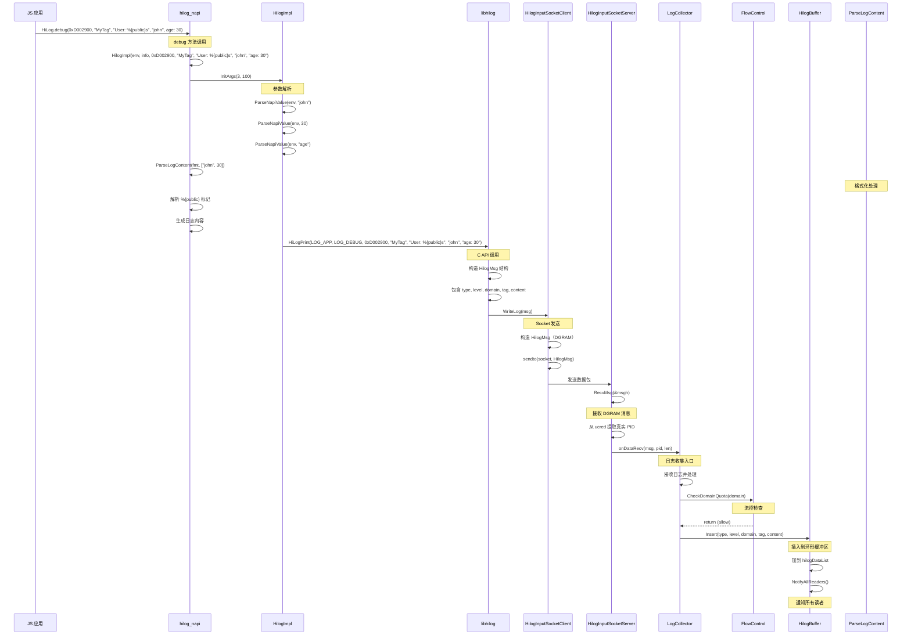
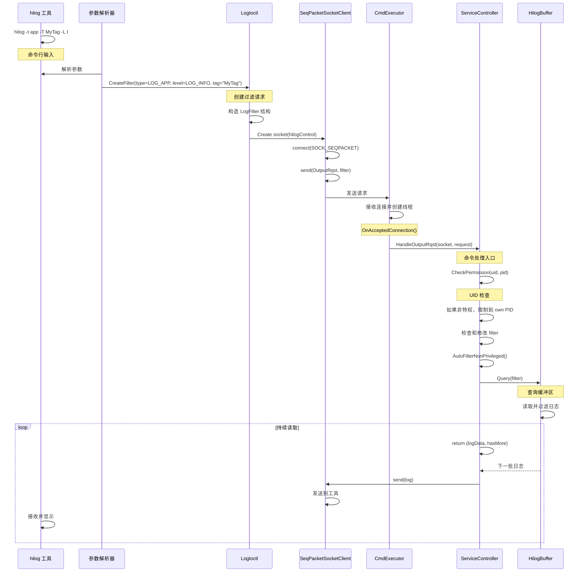

# HiLog 调用链图

> 生成时间: 2026-02-06
> 相关证据: `interfaces/js/kits/napi/src/hilog/src/hilog_napi_base.cpp`, `frameworks/libhilog/hilog_printf.cpp`, `services/hilogd/log_collector.cpp`

---

## 目的

本文档提供 HiLog 关键功能调用链，帮助理解数据从入口到核心逻辑的完整流程。

## 适用范围

涵盖日志写入、查询、配置等关键流程。

---

## 调用链 1：JS 应用 → hilogd（日志写入）

### 完整流程



### 关键步骤说明

| 步骤 | 代码位置 | 说明 |
|------|----------|------|
| 1. JS API 调用 | `interfaces/js/kits/napi/src/hilog/module.cpp` | `debug()` → `Export()` |
| 2. 参数解析 | `interfaces/js/kits/napi/src/hilog/src/hilog_napi_base.cpp:278-290` | `ParseNapiValue()`, `ParseLogContent()` |
| 3. 格式化处理 | `interfaces/js/kits/napi/src/hilog/src/hilog_napi_base.cpp:41-115` | 隐私标记处理 |
| 4. C API 调用 | `interfaces/native/innerkits/include/hilog/log_c.h:107` | `HiLogPrint()` |
| 5. Socket 发送 | `frameworks/libhilog/socket/hilog_input_socket_client.cpp` | `WriteLog()` |
| 6. 流控检查 | `services/hilogd/flow_control.cpp` | `CheckDomainQuota()` |
| 7. 缓冲区插入 | `services/hilogd/log_buffer.cpp` | `Insert()` |

### 代码位置

| 步骤 | 文件路径 | 函数/类 |
|------|----------|----------|
| N-API 注册 | interfaces/js/kits/napi/src/hilog/module.cpp | `Export()` |
| N-API 实现 | interfaces/js/kits/napi/src/hilog/src/hilog_napi.cpp | `HilogImpl()`, `Export()` |
| 参数解析 | interfaces/js/kits/napi/src/hilog/src/hilog_napi_base.cpp | `ParseNapiValue()`, `ParseLogContent()` |
| C API | interfaces/native/innerkits/include/hilog/log_c.h | `HiLogPrint()` |
| Socket 客户端 | frameworks/libhilog/socket/hilog_input_socket_client.cpp | `HilogInputSocketClient::WriteLog()` |
| Socket 服务端 | frameworks/libhilog/socket/hilog_input_socket_server.cpp | `HilogInputSocketServer::RecvMsg()` |
| 日志收集器 | services/hilogd/log_collector.cpp | `LogCollector::onDataRecv()` |
| 流控 | services/hilogd/flow_control.cpp | `FlowControl::CheckDomainQuota()` |
| 缓冲区 | services/hilogd/log_buffer.cpp | `HilogBuffer::Insert()` |

---

## 调用链 2：hilog 工具 → hilogd（日志查询）

### 完整流程



### 关键步骤说明

| 步骤 | 代码位置 | 说明 |
|------|----------|------|
| 1. 命令解析 | services/hilogtool/main.cpp | 解析命令行参数 |
| 2. 过滤构造 | frameworks/libhilog/ioctl/log_ioctl.cpp | 创建 LogFilter 结构 |
| 3. Socket 连接 | frameworks/libhilog/socket/seq_packet_socket_client.cpp | connect(), send() |
| 4. 权限检查 | services/hilogd/service_controller.cpp:487-498 | CheckOutputRqst() |
| 5. 自动过滤 | services/hilogd/service_controller.cpp:500-510 | LogFilterFromOutputRqst() |
| 6. 缓冲区查询 | services/hilogd/log_buffer.cpp | Query() |
| 7. 数据发送 | frameworks/libhilog/socket/seq_packet_socket_client.cpp | send() |

### 代码位置

| 步骤 | 文件路径 | 函数/类 |
|------|----------|----------|
| 命令入口 | services/hilogtool/main.cpp | main() |
| IO 控制包装 | frameworks/libhilog/ioctl/include/log_ioctl.h | LogIoctl 类 |
| 命令处理 | services/hilogd/service_controller.cpp | HandleOutputRqst() |
| Socket 客户端 | frameworks/libhilog/socket/seq_packet_socket_client.cpp | SeqPacketSocketClient |
| 缓冲区操作 | services/hilogd/log_buffer.cpp | HilogBuffer::Query() |

---

## 调用链 3：日志落盘

### 完整流程

```mermaid
sequenceDiagram
    participant Buffer as HilogBuffer
    participant Notifier as 通知机制
    participant Persister as LogPersister
    participant Rotator as LogPersisterRotator
    participant Compress as LogCompress
    participant File as /data/log/hilog

    Note over Buffer: 缓冲区有新日志

    Buffer->>Notifier: OnNewItem(reader, data)

    Note over Notifier: 通知新日志

    Persister->>Persister: ReceiveLogLoop(job)

    Note over Persister: 后台线程轮询
    Persister->>Persister: 查询缓冲区

    loop 持续轮询
        Persister->>Buffer: QueryBuffer(reader, filter)

        Buffer-->>Persister: return (logs, hasMore)

        Note over Persister: 有日志需要处理

        Persister->>Rotator: CompressAndWrite(job, logs)

        Rotator->>Rotator: 检查轮转条件

        Rotator->>Rotator: CheckRotateNeeded(job)

        Rotator->>Rotator: GetPersistFileName(job)

        Note over Rotator: 生成文件名
        Rotator->>Rotator: hilog.000.20250206-120000.gz

        Rotator->>Compress: CompressBuffer(job, logs)

        Note over Compress: 压缩日志
        Compress->>Compress: 选择 zlib 或 zstd

        Compress->>File: 写入压缩数据
        File-->>Compress: /data/log/hilog/hilog.000.20250206-120000.gz

        Rotator->>Rotator: 更新任务状态
        Rotator->>Rotator: UpdateJobInfo(job)

        Note over Rotator: 文件写入完成

        Rotator->>Rotator: 检查是否还有日志

        loop 持续
            Persister->>Buffer: QueryBuffer(...)
            Buffer-->>Persister: 下一批日志
    end
```

### 关键步骤说明

| 步骤 | 代码位置 | 说明 |
|------|----------|------|
| 1. 新日志通知 | services/hilogd/log_buffer.cpp | OnNewItem() 回调 |
| 2. 落盘线程启动 | services/hilogd/main.cpp | FFRT 任务创建 |
| 3. 缓冲区查询 | services/hilogd/log_persister.cpp | ReceiveLogLoop() |
| 4. 文件名生成 | services/hilogd/log_persister_rotator.cpp | GetPersistFileName() |
| 5. 压缩 | services/hilogd/log_compress.cpp | CompressBuffer() |
| 6. 文件写入 | services/hilogd/log_persister_rotator.cpp | 写入文件 |
| 7. 轮转检查 | services/hilogd/log_persister_rotator.cpp | CheckRotateNeeded() |

### 代码位置

| 步骤 | 文件路径 | 函数/类 |
|------|----------|----------|
| 新日志通知 | services/hilogd/log_buffer.cpp | HilogBuffer::NotifyAllReaders() |
| 落盘实现 | services/hilogd/log_persister.cpp | LogPersister::ReceiveLogLoop() |
| 文件名生成 | services/hilogd/log_persister_rotator.cpp | GetPersistFileName() |
| 压缩 | services/hilogd/log_compress.cpp | LogCompress::CompressBuffer() |
| 文件写入 | services/hilogd/log_persister_rotator.cpp | CompressAndWrite() |

---

## 相关跳转链接

- [架构说明](03_Architecture.md)
- [N-API 接口](04_NAPI_Interface.md)
- [内部 API](05_Internal_API.md)

---

## 证据索引

| 主题 | 文件路径 | 行号/符号 |
|------|---------|----------|
| N-API 参数解析 | interfaces/js/kits/napi/src/hilog/src/hilog_napi_base.cpp:278-290 | ParseNapiValue(), ParseLogContent() |
| C API 调用 | interfaces/native/innerkits/include/hilog/log_c.h:107 | HiLogPrint() |
| Socket 发送 | frameworks/libhilog/socket/hilog_input_socket_client.cpp | WriteLog() |
| 日志收集器 | services/hilogd/log_collector.cpp | onDataRecv() |
| 流控检查 | services/hilogd/flow_control.cpp | CheckDomainQuota() |
| 缓冲区插入 | services/hilogd/log_buffer.cpp | Insert() |
| 缓冲区查询 | services/hilogd/log_buffer.cpp | Query() |
| 落盘线程 | services/hilogd/log_persister.cpp | ReceiveLogLoop() |
| 文件名生成 | services/hilogd/log_persister_rotator.cpp | GetPersistFileName() |
| 压缩 | services/hilogd/log_compress.cpp | CompressBuffer() |
| 文件写入 | services/hilogd/log_persister_rotator.cpp | CompressAndWrite() |
