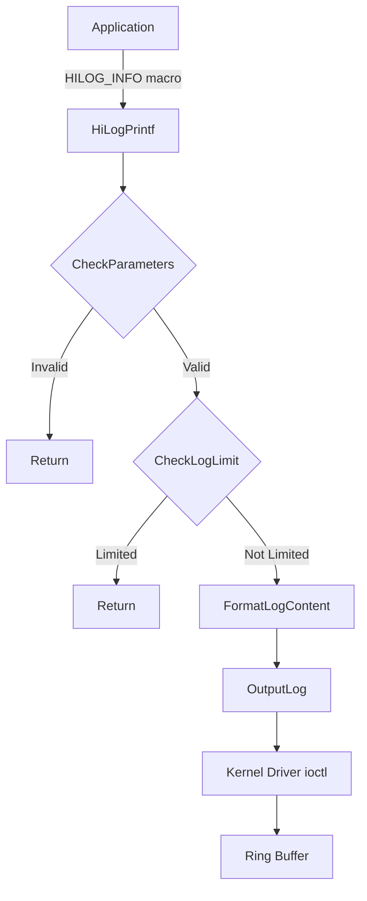
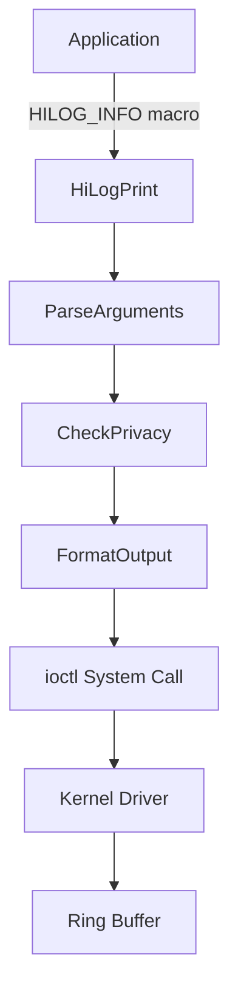

# Hilog Lite 关键调用链

本文档展示 hilog_lite 组件的关键调用链图示。

## 调用链概览

### 日志打印调用链 (轻量系统)



### 日志打印调用链 (小型系统)



---

## 详细调用链

### 1. 轻量系统日志打印

```
HILOG_INFO(HILOG_MODULE_APP, "msg: %d", value)
        │
        ▼
┌───────────────────────────────────────────────┐
│ HiLogPrintf(module=APP, level=INFO, ...)      │
│ Frameworks/mini/hiview_log.c:111              │
└────────────────────┬──────────────────────────┘
                     │
                     ▼
┌───────────────────────────────────────────────┐
│ CheckParameters(module, level)                │
│ Frameworks/mini/hiview_log.c:69               │
│                                               │
│ ├─ level < g_hiviewConfig.level ─→ FALSE     │
│ ├─ level < HILOG_COMPILE_LEVEL ─→ FALSE      │
│ ├─ module >= HILOG_MODULE_MAX ─→ FALSE       │
│ └─ g_logModuleInfo[module].name == NULL ─→ FALSE │
└────────────────────┬──────────────────────────┘
                     │
                     ▼
┌───────────────────────────────────────────────┐
│ OutputLog(pCommon, size)                     │
│ Frameworks/mini/hiview_output_log.c           │
│                                               │
│ ├─ InitCoreLogOutput()                        │
│ └─ Write to kernel via ioctl                  │
└────────────────────┬──────────────────────────┘
                     │
                     ▼
┌───────────────────────────────────────────────┐
│ Kernel hilogtask                             │
│ (Ring Buffer Management)                     │
└────────────────────┬──────────────────────────┘
                     │
        ┌────────────┼────────────┐
        ▼            ▼            ▼
   [hilogcat]   [apphilogcat]  [Console]
```

### 2. 小型系统日志打印

```
HiLog::Info(label, "msg: %s", str)
        │
        ▼
┌───────────────────────────────────────────────┐
│ HiLogPrint(type=LOG_CORE, level=LOG_INFO,    │
│            domain=label.domain,               │
│            tag=label.tag, fmt="...")          │
│ Frameworks/featured/hiview_log.c              │
└────────────────────┬──────────────────────────┘
                     │
                     ▼
┌───────────────────────────────────────────────┐
│ FormatLogContent(fmt, args, ...)              │
│                                               │
│ ├─ ParsePrivacyIdentifier(fmt)               │
│ │    └─ %{public} / %{private} detection     │
│ └─ FormatArguments(args, ...)                 │
└────────────────────┬──────────────────────────┘
                     │
                     ▼
┌───────────────────────────────────────────────┐
│ WriteToIoctl(logContent)                     │
│                                               │
│ ├─ Prepare iovec (domain, tag, content)     │
│ └─ ioctl(HILOG_WRITE, iovec)                 │
└────────────────────┬──────────────────────────┘
                     │
                     ▼
┌───────────────────────────────────────────────┐
│ Kernel Driver                                 │
│                                               │
│ ├─ Validate parameters                        │
│ ├─ Write to Ring Buffer                      │
│ └─ Signal waiting readers                    │
└────────────────────┬──────────────────────────┘
                     │
        ┌────────────┼────────────┐
        ▼            ▼            ▼
   [hilogcat]   [apphilogcat]  [Console]
```

### 3. JS/ACE Lite 日志打印

```
hilog.info(domain, tag, fmt, ...)
        │
        ▼
┌───────────────────────────────────────────────┐
│ HilogModule::Info(thisVal, args, argsNum)    │
│ Frameworks/js/builtin/src/hilog_module.cpp:150│
└────────────────────┬──────────────────────────┘
                     │
                     ▼
┌───────────────────────────────────────────────┐
│ HilogModule::HilogImpl(..., LogLevel::LOG_INFO)│
│ Frameworks/js/builtin/src/hilog_module.cpp:242│
└────────────────────┬──────────────────────────┘
                     │
                     ▼
┌───────────────────────────────────────────────┐
│ ParseNapiValue(args)                          │
│                                               │
│ ├─ Extract domain (number)                    │
│ ├─ Extract tag (string)                       │
│ └─ Extract format string & args               │
└────────────────────┬──────────────────────────┘
                     │
                     ▼
┌───────────────────────────────────────────────┐
│ ParseLogContent(formatStr, params, logContent)│
│                                               │
│ ├─ Handle %{public}/%{private}               │
│ ├─ Format parameters                          │
│ └─ Build final log string                     │
└────────────────────┬──────────────────────────┘
                     │
                     ▼
┌───────────────────────────────────────────────┐
│ HiLogPrint(domain, tag, formattedContent)    │
│ (调用小型系统 API)                            │
└────────────────────┬──────────────────────────┘
                     │
                     ▼
[后续流程同小型系统日志打印]
```

### 4. 模块注册调用链

```
HiLogRegisterModule(id, name)
        │
        ▼
┌───────────────────────────────────────────────┐
│ HiLogRegisterModule(uint16 id, const char *name)│
│ Frameworks/mini/hiview_log.c:79              │
└────────────────────┬──────────────────────────┘
                     │
                     ▼
┌───────────────────────────────────────────────┐
│ 参数校验                                       │
│                                               │
│ ├─ id < HILOG_MODULE_MAX ─→ continue         │
│ ├─ name != NULL ─→ continue                 │
│ ├─ len < LOG_MODULE_NAME_LEN ─→ continue    │
│ └─ 仅英文字母 [a-zA-Z] ─→ continue           │
└────────────────────┬──────────────────────────┘
                     │
                     ▼
┌───────────────────────────────────────────────┐
│ g_logModuleInfo[id].name = name              │
│ g_logModuleInfo[id].id = id                  │
│ (全局模块信息表更新)                          │
└───────────────────────────────────────────────┘
```

### 5. 日志查看调用链 (hilogcat)

```
hilogcat [command]
        │
        ▼
┌───────────────────────────────────────────────┐
│ main()                                        │
│ Services/hilogcat/hiview_logcat.c             │
└────────────────────┬──────────────────────────┘
                     │
                     ▼
┌───────────────────────────────────────────────┐
│ Open /dev/hilog (kernel driver)               │
│                                               │
│ └─ fd = open("/dev/hilog", O_RDONLY)          │
└────────────────────┬──────────────────────────┘
                     │
                     ▼
┌───────────────────────────────────────────────┐
│ ReadLoop                                      │
│                                               │
│ ├─ ioctl(fd, HILOG_GET_RING_MSG, ...)         │
│ ├─ Parse log message                          │
│ └─ Print to stdout                            │
└────────────────────┬──────────────────────────┘
```

---

## 调用关系矩阵

### 框架 → 服务

| 框架 | 服务 | 调用场景 |
|------|------|----------|
| frameworks/featured | services/hilogcat | 日志查看 |
| frameworks/featured | services/apphilogcat | 日志落盘 |
| frameworks/mini | command | 轻量系统命令 |

### 服务 → 内核

| 服务 | 内核接口 | 功能 |
|------|----------|------|
| hilogcat | /dev/hilog | 读取日志 |
| apphilogcat | /dev/hilog | 读取日志 |

---

## 关键入口点

| 入口 | 文件:行号 | 描述 |
|------|-----------|------|
| `HiLogInit()` | frameworks/mini/hiview_log.c:36 | 轻量系统初始化 |
| `HiLogPrint()` | interfaces/native/kits/hilog/log.h:191 | 日志打印 |
| `HiLog::Info()` | interfaces/native/innerkits/hilog/hilog_cp.h:62 | C++ 打印 |
| `HilogModule::Info()` | frameworks/js/builtin/src/hilog_module.cpp:150 | JS 打印 |
| `hilogcat main()` | services/hilogcat/hiview_logcat.c | 日志查看 |
| `apphilogcat main()` | services/apphilogcat/hiview_applogcat.c | 日志落盘 |

---

## 相关文档

- [架构设计](02_Architecture.md)
- [Native API](03_Native_API.md)
- [内部模块](04_Internal_API.md)
