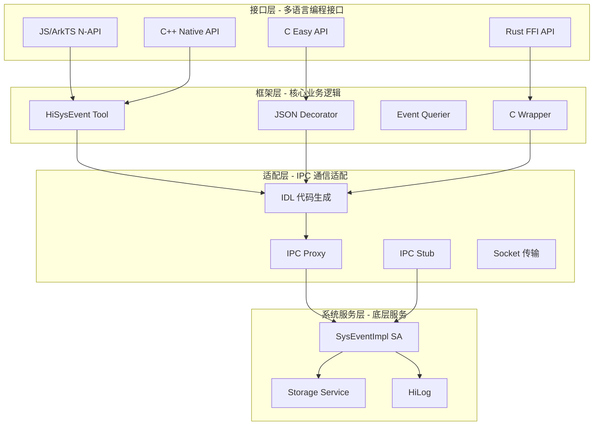
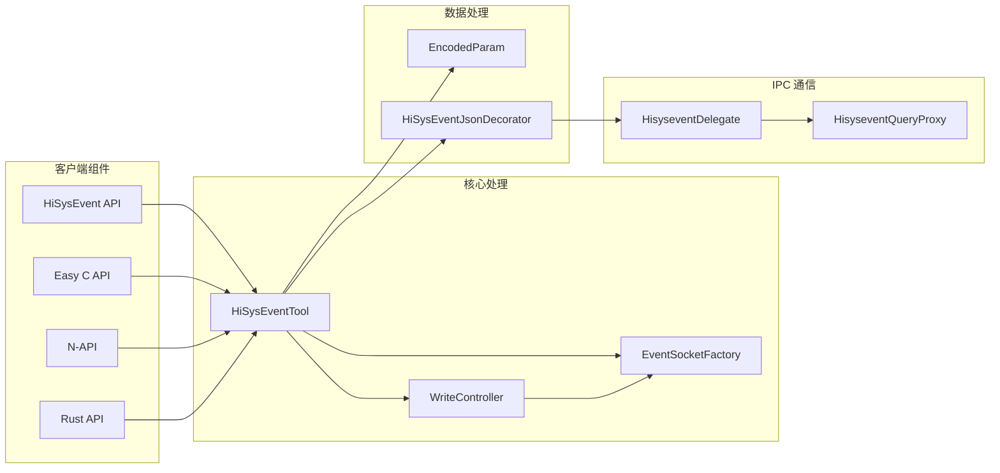
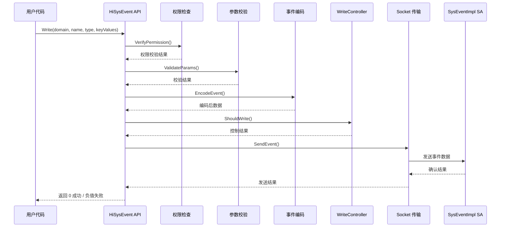
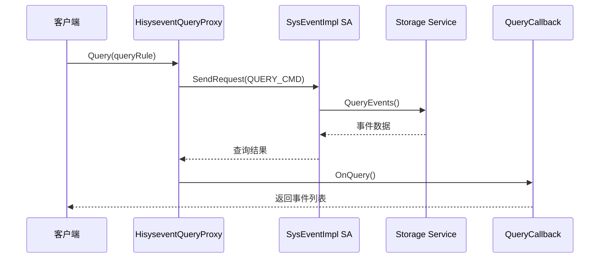
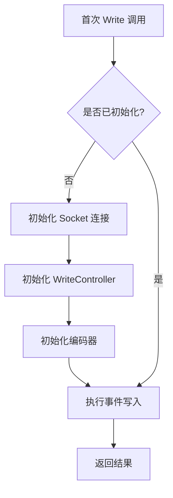
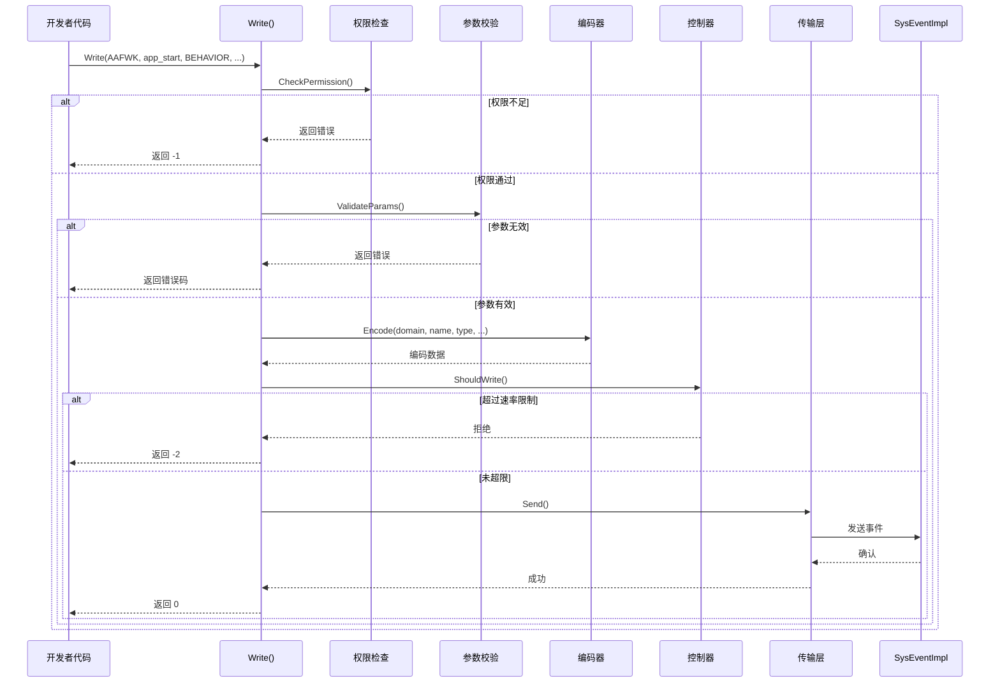
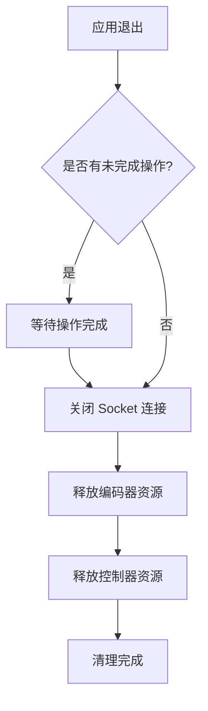

# 架构与数据流

## 2.1 整体架构

### 架构概述

HiSysEvent 采用分层架构设计，从上到下依次为：**接口层 → 框架层 → 适配层 → 系统服务层**。各层职责清晰，接口层提供多语言编程接口，框架层实现核心业务逻辑，适配层负责平台适配和 IPC 通信，系统服务层提供底层事件处理和持久化能力。

该架构的核心设计理念是将**事件生成**与**事件处理**分离。客户端负责构建和发送事件，服务端负责接收、存储和分析事件。这种分离设计使得事件生产者的开销最小化，同时集中处理简化了系统管理和安全控制。



### 架构分层说明

| 层级 | 目录 | 职责 | 主要组件 |
|------|------|------|----------|
| **接口层** | `interfaces/*` | 提供多语言编程接口 | N-API、C API、Rust FFI、ANI |
| **框架层** | `frameworks/native` | 实现核心业务逻辑 | 事件工具、JSON 装饰器、查询器 |
| **适配层** | `adapter/native/idl` | IPC 通信适配 | Proxy、Stub、Socket 传输 |
| **系统服务层** | 外部依赖 | 底层服务能力 | SA 服务、存储、日志 |

---

## 2.2 组件关系

### 核心组件清单

| 组件 | 类型 | 路径 | 职责 |
|------|------|------|------|
| **HiSysEventTool** | 核心类 | `frameworks/native/hisysevent_tool.cpp` | 事件工具，封装核心操作 |
| **HiSysEventJsonDecorator** | 装饰器 | `frameworks/native/hisysevent_json_decorator.cpp` | JSON 格式转换 |
| **WriteController** | 控制器 | `interfaces/native/innerkits/hisysevent/write_controller.cpp` | 写入速率控制 |
| **EventSocketFactory** | 工厂类 | `interfaces/native/innerkits/hisysevent/event_socket_factory.cpp` | Socket 连接管理 |
| **HiSysEventManager** | 管理类 | `interfaces/native/innerkits/hisysevent_manager/hisysevent_manager.cpp` | 事件管理（查询/监听） |
| **HisyseventDelegate** | 适配类 | `adapter/native/idl/src/hisysevent_delegate.cpp` | IPC 通信适配 |

### 组件依赖关系



---

## 2.3 数据流图

### 事件写入流程

事件写入是 HiSysEvent 最核心的操作，其数据流程如下所述。整个流程从用户调用 API 开始，经历参数校验、权限检查、事件编码、传输控制，最终通过 Socket 将事件发送到系统服务。



### 详细步骤说明

| 步骤 | 操作 | 代码位置 | 说明 |
|------|------|----------|------|
| 1 | API 调用 | `hisysevent.h:78` | 模板函数，支持可变参数 |
| 2 | 权限检查 | `hisysevent.cpp` | 验证 access_token 权限 |
| 3 | 参数校验 | `hisysevent.cpp` | 检查 domain、name、keyValues |
| 4 | 事件编码 | `encoded_param.cpp` | 将参数编码为二进制格式 |
| 5 | 速率控制 | `write_controller.cpp` | 检查是否超过写入限制 |
| 6 | Socket 发送 | `transport.cpp` | 通过 Unix Socket 发送事件 |
| 7 | 结果返回 | `hisysevent.cpp` | 返回操作结果 |

### 事件查询流程

事件查询允许客户端根据规则查询历史事件。该流程涉及 IPC 通信，将查询请求发送到系统服务，由服务执行实际查询并返回结果。



---

## 2.4 线程模型

### 线程设计原则

HiSysEvent 的线程模型遵循以下原则：**主线程处理 API 调用，工作线程处理耗时操作，专用线程处理网络通信**。这种设计确保了 API 调用的低延迟，同时不影响系统的响应性能。

| 线程类型 | 用途 | 调用方式 |
|----------|------|----------|
| **主线程** | API 调用、参数校验 | 同步调用 |
| **工作线程** | 事件编码、IPC 通信 | 异步任务 |
| **Socket 线程** | 网络数据发送 | 专用线程 |

### 关键线程安全组件

| 组件 | 文件 | 线程安全机制 |
|------|------|--------------|
| **WriteController** | `write_controller.cpp` | 原子操作控制写入速率 |
| **EventSocketFactory** | `event_socket_factory.cpp` | 单例模式管理 Socket 连接 |
| **Transport** | `transport.cpp` | 线程安全队列缓冲 |

---

## 2.5 初始化流程

### 客户端初始化

HiSysEvent 采用**延迟初始化**策略，在首次调用时完成初始化，避免不必要的启动开销。



### 关键初始化代码

**Socket 连接初始化**（`event_socket_factory.cpp`）：

```cpp
EventSocketFactory& EventSocketFactory::GetInstance() {
    static EventSocketFactory instance;
    return instance;
}

int EventSocketFactory::Init() {
    // 创建 Unix Domain Socket
    socket_ = socket(AF_UNIX, SOCK_STREAM, 0);
    if (socket_ < 0) {
        return -1;
    }
    // 连接 HiSysEvent 服务
    struct sockaddr_un addr;
    memset(&addr, 0, sizeof(addr));
    addr.sun_family = AF_UNIX;
    strcpy(addr.sun_path, "/dev/unix/socket/hisysevent");
    connect(socket_, (struct sockaddr*)&addr, sizeof(addr));
    return 0;
}
```

---

## 2.6 关键时序图

### 事件写入完整时序



### 事件监听时序

```mermaid
sequenceDiagram
    participant Listener as 监听器
    participant Manager as HiSysEventManager
    participant Proxy as QueryProxy
    participant SA as SysEventImpl

    Listener->>Manager: AddListener(rule)
    Manager->>Proxy: AddListener(rule)
    Proxy->>SA: 注册监听器
    SA-->>Proxy: listenerId
    Proxy-->>Manager: listenerId
    Manager-->>Listener: listenerId

    loop 事件触发
        SA->>Proxy: OnEvent(event)
        Proxy->>Manager: Notify(event)
        Manager->>Listener: OnEvent(event)
    end

    Listener->>Manager: RemoveListener(listenerId)
    Manager->>Proxy: RemoveListener(listenerId)
    Proxy->>SA: 移除监听器
    SA-->>Proxy: 确认
    Proxy-->>Manager: 确认
    Manager--Listener: 确认
```

---

## 2.7 IPC 通信机制

### 通信协议

HiSysEvent 使用两种 IPC 机制：**IPC 用于控制命令**（查询、监听管理），**Unix Domain Socket 用于数据传输**（事件写入）。

| 通信类型 | 用途 | 协议 |
|----------|------|------|
| **IPC** | 控制命令（AddListener、Query、RemoveListener） | Binder IPC |
| **Socket** | 事件数据传输 | Unix Domain Socket |

### SA 服务标识

| 属性 | 值 | 证据来源 |
|------|-----|----------|
| **SA ID** | `SA_ID_SYSTEM_EVENT_SERVICE` | `ISysEventService.idl` |
| **服务名** | `system_event_service` | `ISysEventService.idl` |

### IPC 接口方法

| 方法 | 功能 | 参数 | 返回值 |
|------|------|------|--------|
| `AddListener` | 添加事件监听器 | `SysEventRule` | `listenerId` |
| `RemoveListener` | 移除事件监听器 | `listenerId` | `retCode` |
| `Query` | 查询历史事件 | `QueryArgument` | `events` |
| `AddSubscriber` | 添加订阅者 | `SysEventRule` | `subscriberId` |
| `RemoveSubscriber` | 移除订阅者 | `subscriberId` | `retCode` |
| `Export` | 导出事件到文件 | `fileName`, `type` | `retCode` |

**证据来源**：`adapter/native/idl/ISysEventService.idl`

---

## 2.8 资源生命周期

### 对象 Owner 关系

| 对象 | Owner | 生命周期 | 说明 |
|------|-------|----------|------|
| **HiSysEventTool** | 单例 | 应用周期 | 全局唯一实例 |
| **EventSocketFactory** | 单例 | 应用周期 | 管理 Socket 连接 |
| **WriteController** | 单例 | 应用周期 | 控制写入速率 |
| **HiSysEventRecord** | 调用者 | 临时 | 单次查询结果 |

### 资源释放流程



---

## 2.9 架构总结

### 设计亮点

| 亮点 | 说明 |
|------|------|
| **分层架构** | 清晰的职责分离，便于维护和扩展 |
| **多语言支持** | 同时支持 C++、C、Rust、JS、ArkTS |
| **延迟初始化** | 最小化启动开销 |
| **速率控制** | 防止事件洪泛保护系统 |
| **IPC + Socket 混合** | 控制与数据分离优化性能 |

### 架构约束

| 约束 | 说明 |
|------|------|
| **系统服务依赖** | 必须运行在 OpenHarmony 标准系统 |
| **权限要求** | 需要 `ACCESS_SYSTEM_SERVICE` 权限 |
| **进程模型** | 支持跨进程事件收集 |
| **线程安全** | 多线程环境下需同步访问共享资源 |

---

*文档版本：1.0*
*创建时间：2026-02-07*
*最后更新：2026-02-07*
