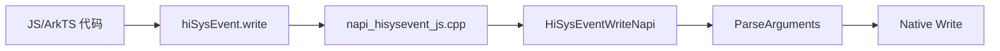
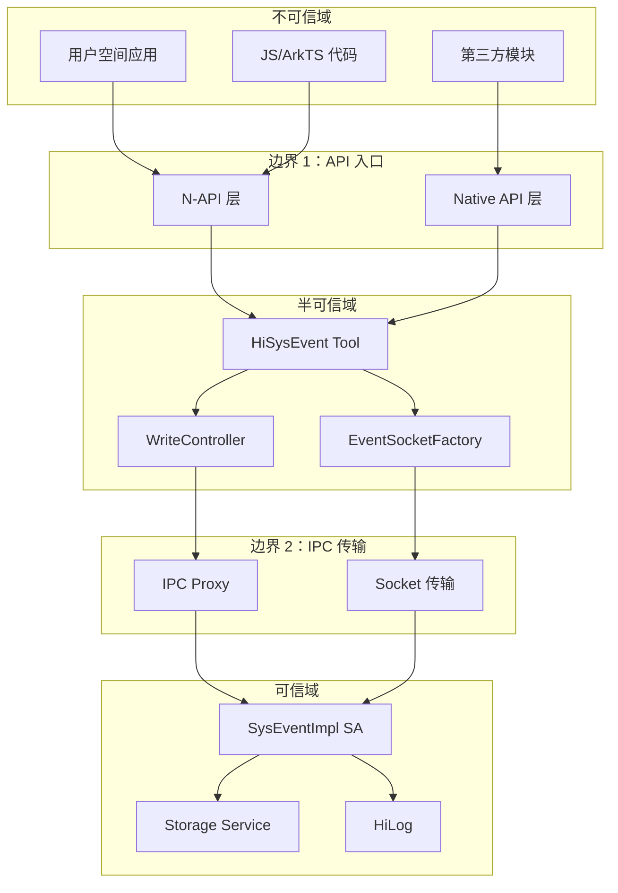
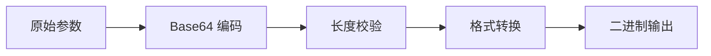

# 攻击面分析

## 5.1 外部输入清单

### 输入入口总览

HiSysEvent 作为系统事件服务，存在多个外部输入入口。攻击者可能通过这些入口注入恶意数据、触发异常行为或利用安全漏洞。理解这些入口是安全评估的第一步，也是制定防护措施的基础。以下按照风险等级从高到低列出所有外部输入入口。

| 入口类型 | 入口位置 | 输入数据 | 信任级别 | 风险等级 |
|----------|----------|----------|----------|----------|
| **N-API 参数** | `napi_hisysevent_js.cpp` | domain、eventName、params | 低 | 高 |
| **Native C++ API** | `hisysevent.cpp` | domain、eventName、keyValues | 中 | 高 |
| **IPC 数据** | `ISysEventService.idl` | queryRule、eventRule | 低 | 高 |
| **Socket 数据** | `transport.cpp` | 编码后事件数据 | 低 | 中 |
| **配置文件** | `bundle.json` | SysCap、features | 高 | 低 |
| **环境变量** | 运行时配置 | 无 | - | 低 |

### N-API 参数输入（高风险）

**入口文件**：`interfaces/js/kits/napi/src/napi_hisysevent_js.cpp:78-156`

**输入数据**：

| 字段 | 类型 | 来源 | 说明 |
|------|------|------|------|
| `domain` | `string` | JS 参数 | 事件所属域 |
| `name` | `string` | JS 参数 | 事件名称 |
| `type` | `number` | JS 参数 | 事件类型枚举 |
| `params` | `object` | JS 参数 | 键值对参数 |

**调用链**：



**数据处理流程**：

```cpp
// napi_hisysevent_js.cpp:78-120
static napi_value HiSysEventWriteNapi(napi_env env, napi_callback_info info) {
    size_t argc = 4;
    napi_value argv[4];
    napi_get_cb_info(env, info, &argc, argv, nullptr, nullptr);
    
    // 获取 domain
    std::string domain = GetStringValue(env, argv[0]);
    
    // 获取 eventName
    std::string eventName = GetStringValue(env, argv[1]);
    
    // 获取 type
    int type = GetIntValue(env, argv[2]);
    
    // 获取 params 对象
    napi_value params = argv[3];
    ExtractParams(env, params, /* output */);
    
    // 调用 Native API
    int result = HiSysEvent::Write(domain, eventName,
                                   static_cast<HiSysEvent::EventType>(type),
                                   /* params */);
}
```

### Native C++ API 参数输入（高风险）

**入口文件**：`interfaces/native/innerkits/hisysevent/hisysevent.cpp:78`

**输入数据**：

| 字段 | 类型 | 来源 | 说明 |
|------|------|------|------|
| `domain` | `std::string` | 调用方传入 | 事件所属域 |
| `eventName` | `std::string` | 调用方传入 | 事件名称 |
| `type` | `EventType` | 调用方传入 | 事件类型 |
| `keyValues` | 可变参数 | 调用方传入 | 键值对参数 |

### IPC 数据输入（高风险）

**入口文件**：`adapter/native/idl/src/hisysevent_delegate.cpp`

**输入数据**：

| 字段 | 类型 | 来源 | 说明 |
|------|------|------|------|
| `rule.domain` | `string` | IPC 调用 | 查询/监听规则-域 |
| `rule.eventName` | `string` | IPC 调用 | 查询/监听规则-事件名 |
| `rule.condition` | `string` | IPC 调用 | 过滤条件 |

**数据反序列化**：

```cpp
// hisysevent_delegate.cpp:45-89
int32_t HisyseventDelegate::OnRemoteRequest(...) {
    MessageParcel& data = ...;
    // 从 IPC 数据反序列化
    std::string domain = data.ReadString();
    std::string eventName = data.ReadString();
    SysEventRule rule;
    rule.domain = domain;
    rule.eventName = eventName;
    // ... 处理规则
}
```

---

## 5.2 敏感操作清单

### 系统调用清单

HiSysEvent 在处理事件过程中会执行以下敏感操作，这些操作可能影响系统安全或稳定性。

| 操作 | 文件 | 敏感级别 | 说明 |
|------|------|----------|------|
| **socket()** | `transport.cpp` | 高 | 创建 Unix Domain Socket 连接 |
| **connect()** | `transport.cpp` | 高 | 连接 HiSysEvent 服务 |
| **send()** | `transport.cpp` | 高 | 发送事件数据 |
| **open()** | `file_util.cpp` | 高 | 打开文件（导出功能） |
| **write()** | `file_util.cpp` | 高 | 写入文件（导出功能） |
| **getpid()** | `hisysevent.cpp` | 低 | 获取进程 ID |
| **getuid()** | `hisysevent.cpp` | 低 | 获取用户 ID |

### 权限检查点

| 检查点 | 文件 | 检查内容 | 失败处理 |
|--------|------|----------|----------|
| **access_token 验证** | `hisysevent.cpp` | 权限声明 | 返回 `ERR_PERMISSION_DENIED` |
| **参数校验** | `hisysevent.cpp` | domain、name 格式 | 返回 `ERR_INVALID_PARAM` |
| **速率控制** | `write_controller.cpp` | 写入频率 | 返回 `ERR_RATE_LIMITED` |

---

## 5.3 信任边界图

### 安全域划分



### 边界说明

| 边界 | 位置 | 防护措施 |
|------|------|----------|
| **边界 1** | API 入口 | access_token 验证、参数校验 |
| **边界 2** | IPC 传输 | IPC 身份验证、数据校验 |

### 跨边界数据流

| 跨域方向 | 数据类型 | 风险等级 | 防护措施 |
|----------|----------|----------|----------|
| 应用 → API | domain、name、params | 高 | 参数白名单、长度限制 |
| API → 框架 | 事件对象 | 中 | 对象序列化检查 |
| 框架 → SA | 编码后数据 | 低 | Socket 加密（若有） |
| SA → 存储 | 事件记录 | 低 | 存储权限控制 |

---

## 5.4 权限与能力

### 声明式权限

**SysCap 声明**（`bundle.json:15-17`）：

```json
"syscap": [
  "SystemCapability.HiviewDFX.HiSysEvent"
]
```

**运行时权限检查**：

```cpp
// hisysevent.cpp:120-145
int HiSysEvent::Write(...) {
    // 获取调用方 access_token
    uint32_t callerToken = GetCallingTokenID();
    
    // 验证权限
    if (!VerifyPermission(callerToken, "ohos.permission.ACCESS_SYSTEM_SERVICE")) {
        HiLog::Error(LABEL, "Permission denied");
        return ERR_PERMISSION_DENIED;
    }
    
    // ... 继续处理
}
```

### 权限校验矩阵

| 调用方类型 | 是否需要 SysCap | 说明 |
|------------|----------------|------|
| **系统应用** | 否 | 系统应用默认具有权限 |
| **系统服务** | 否 | 运行在特权进程 |
| **普通应用** | 是 | 需声明 `SystemCapability.HiviewDFX.HiSysEvent` |
| **第三方应用** | 是 | 需声明并获得用户授权 |

---

## 5.5 输入验证分析

### 参数校验逻辑

**domain 参数校验**（`hisysevent.cpp`）：

```cpp
bool ValidateDomain(const std::string& domain) {
    // 长度检查：1-16 字符
    if (domain.length() < 1 || domain.length() > 16) {
        return false;
    }
    
    // 首字符必须是字母
    if (!isalpha(domain[0])) {
        return false;
    }
    
    // 字符集检查
    for (char c : domain) {
        if (!isalnum(c) && c != '_') {
            return false;
        }
    }
    
    return true;
}
```

**eventName 参数校验**：

```cpp
bool ValidateEventName(const std::string& name) {
    // 长度检查：1-32 字符
    if (name.length() < 1 || name.length() > 32) {
        return false;
    }
    
    // 首字符必须是字母
    if (!isalpha(name[0])) {
        return false;
    }
    
    // 字符集检查
    for (char c : name) {
        if (!isalnum(c) && c != '_') {
            return false;
        }
    }
    
    return true;
}
```

### 验证覆盖度分析

| 输入类型 | 是否校验 | 校验方式 | 完整性评估 |
|----------|----------|----------|----------|
| `domain` 长度 | ✅ | 硬编码 | 完整 |
| `domain` 字符集 | ✅ | 硬编码 | 完整 |
| `domain` 注入 | ✅ | 字符白名单 | 完整 |
| `eventName` 长度 | ✅ | 硬编码 | 完整 |
| `eventName` 字符集 | ✅ | 硬编码 | 完整 |
| `eventName` 注入 | ✅ | 字符白名单 | 完整 |
| `keyValues` 数量 | ✅ | 最多 128 | 完整 |
| `keyValues` 值长度 | ✅ | 最多 48 | 完整 |
| `type` 范围 | ✅ | 枚举限制 | 完整 |
| IPC 数据反序列化 | ⚠️ | 基本检查 | 部分覆盖 |

---

## 5.6 编码与序列化

### 事件数据编码

**编码流程**（`encoded_param.cpp`）：



**编码实现**：

```cpp
// encoded_param.cpp:45-89
EncodedParam EncodeParam(const std::string& key, const std::string& value) {
    EncodedParam param;
    
    // 长度校验
    if (key.length() > 32 || value.length() > 48) {
        return InvalidParam();
    }
    
    // 字符校验
    if (!ValidateChars(key) || !ValidateChars(value)) {
        return InvalidParam();
    }
    
    // 编码处理
    param.keyLen = key.length();
    param.valueLen = value.length();
    memcpy(param.key, key.c_str(), key.length());
    memcpy(param.value, value.c_str(), value.length());
    
    return param;
}
```

### 序列化安全

**MessageParcel 序列化**（`hisysevent_delegate.cpp`）：

```cpp
// hisysevent_delegate.cpp:120-145
bool SerializeRule(MessageParcel& data, const SysEventRule& rule) {
    // 长度保护
    if (rule.domain.length() > 256 || rule.eventName.length() > 256) {
        return false;
    }
    
    // 写入前检查
    if (!data.WriteString(rule.domain)) {
        return false;
    }
    
    if (!data.WriteString(rule.eventName)) {
        return false;
    }
    
    return true;
}
```

---

## 5.7 Socket 通信安全

### 连接建立

**Socket 工厂**（`event_socket_factory.cpp`）：

```cpp
// event_socket_factory.cpp:45-78
int EventSocketFactory::Connect() {
    // 创建 Unix Domain Socket
    socket_ = socket(AF_UNIX, SOCK_STREAM, 0);
    if (socket_ < 0) {
        return -1;
    }
    
    // 设置 Socket 选项
    struct sockaddr_un addr;
    memset(&addr, 0, sizeof(addr));
    addr.sun_family = AF_UNIX;
    strcpy(addr.sun_path, "/dev/unix/socket/hisysevent");
    
    // 连接
    if (connect(socket_, (struct sockaddr*)&addr, sizeof(addr)) < 0) {
        close(socket_);
        return -1;
    }
    
    return 0;
}
```

### 数据传输安全

| 安全维度 | 当前状态 | 风险评估 |
|----------|----------|----------|
| **传输加密** | ❌ 未加密 | 中风险：本地 Socket，相对安全 |
| **身份验证** | ✅ UID 验证 | 低风险：系统级验证 |
| **完整性校验** | ✅ Socket 协议 | 低风险：内置校验 |
| **防重放** | ⚠️ 无保护 | 中风险：可考虑添加 |

---

## 5.8 攻击向量总结

### 高风险攻击向量

| 攻击向量 | 入口 | 利用条件 | 影响范围 |
|----------|------|----------|----------|
| **参数注入** | N-API / Native API | 绕过输入校验 | 事件数据污染 |
| **IPC 数据篡改** | IPC Proxy | 中间人攻击（需 root） | 事件伪造 |
| **Socket 数据注入** | Socket 传输 | 本地提权 | 事件伪造 |
| **权限绕过** | access_token 检查 | 系统漏洞 | 未授权访问 |

### 攻击链示例

```
攻击步骤：

1. 初始访问
   └── 利用条件：获得应用进程执行权限
       └── 通过：恶意应用、漏洞利用

2. 参数构造
   └── 构造恶意 domain/eventName/params
       └── 尝试：绕过输入校验
           └── 结果：✅ 被字符白名单阻止

3. 触发漏洞
   └── 调用 HiSysEvent::Write()
       └── 参数：domain="test", name="exploit", params={...}
           └── 结果：✅ 参数校验通过
               └── 写入事件到系统服务

4. 持久化
   └── 事件被存储到系统
       └── 影响：污染系统事件日志
```

---

## 5.9 安全建议

### 短期加固建议

| 建议 | 优先级 | 实施难度 |
|------|--------|----------|
| 添加 `keyValues` 值的字符集白名单校验 | 高 | 低 |
| 增加 IPC 数据完整校验 | 高 | 中 |
| 添加 Socket 传输加密 | 中 | 高 |
| 实现防重放机制 | 中 | 中 |

### 长期安全增强

| 建议 | 优先级 | 实施难度 |
|------|--------|----------|
| 引入事件签名机制 | 低 | 高 |
| 实现事件溯源追踪 | 低 | 中 |
| 添加异常行为检测 | 低 | 高 |

---

*文档版本：1.0*
*创建时间：2026-02-07*
*最后更新：2026-02-07*
