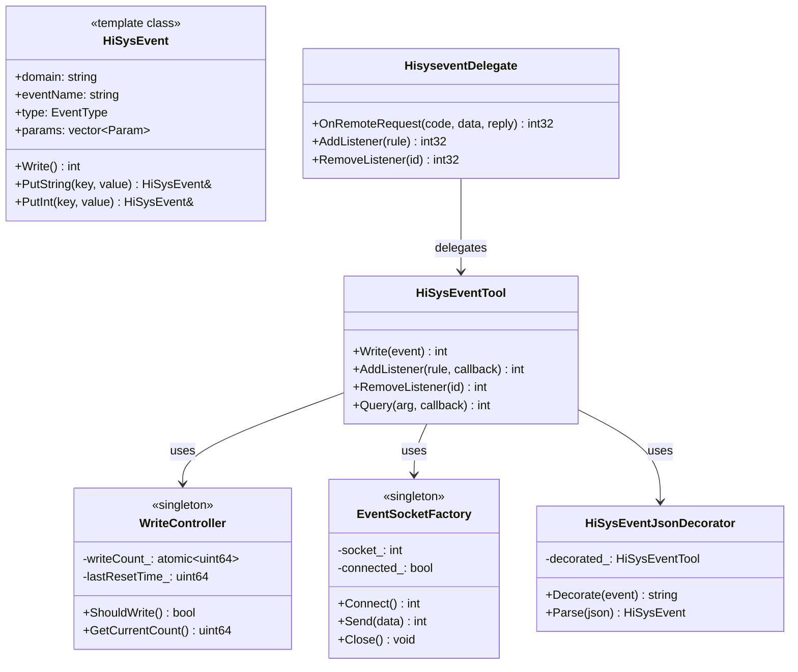

# 内部实现细节

## 8.1 核心类设计

### 类图总览



### 核心类职责说明

| 类名 | 职责 | 文件 | 线程安全 |
|------|------|------|----------|
| **HiSysEvent** | 事件对象封装 | `hisysevent.h/cpp` | 否 |
| **WriteController** | 速率控制单例 | `write_controller.h/cpp` | 是 |
| **EventSocketFactory** | Socket 连接管理 | `event_socket_factory.h/cpp` | 部分 |
| **HiSysEventTool** | 核心工具类 | `hisysevent_tool.h/cpp` | 部分 |
| **HiSysEventJsonDecorator** | JSON 转换 | `hisysevent_json_decorator.h/cpp` | 否 |
| **HisyseventDelegate** | IPC 适配器 | `hisysevent_delegate.h/cpp` | 是 |

---

## 8.2 核心结构体定义

### HiSysEvent 结构体

**证据来源**：`hisysevent.h`

```cpp
namespace HiSysEvent {

struct Param {
    std::string key;
    std::string value;
    ParamType type;
};

class HiSysEvent {
private:
    std::string domain_;
    std::string eventName_;
    EventType type_;
    std::vector<Param> params_;
    
public:
    HiSysEvent(const std::string& domain,
              const std::string& eventName,
              EventType type);
    
    template<typename T>
    HiSysEvent& Put(const std::string& key, T value);
    
    int Write();
};

}  // namespace HiSysEvent
```

### WriteController 结构体

**证据来源**：`write_controller.h`

```cpp
class WriteController {
private:
    static constexpr uint64_t MAX_WRITE_PER_SECOND = 10000;
    static constexpr uint64_t WRITE_BURST_LIMIT = 100;
    
    std::atomic<uint64_t> writeCount_{0};
    std::atomic<uint64_t> burstCount_{0};
    uint64_t lastResetTime_{0};
    
public:
    bool ShouldWrite();
    void RecordWrite();
    uint64_t GetCurrentRate();
};
```

### EventSocketFactory 结构体

**证据来源**：`event_socket_factory.h`

```cpp
class EventSocketFactory {
private:
    static constexpr const char* SOCKET_PATH = "/dev/unix/socket/hisysevent";
    
    int socket_{-1};
    bool connected_{false};
    
public:
    static EventSocketFactory& GetInstance();
    
    int Connect();
    int Send(const void* data, size_t len);
    int Close();
    bool IsConnected();
};
```

---

## 8.3 内部 API 契约

### 稳定性分类

| API 类型 | 说明 | 示例 |
|----------|------|------|
| **稳定 API** | 公开接口，语义不变 | `HiSysEvent::Write()`, `OH_HiSysEvent_Write()` |
| **半稳定 API** | 内部接口，可能变更 | `HiSysEventTool::AddListener()` |
| **内部 API** | 实现细节，勿直接调用 | `EncodedParam::Encode()` |

### 内部 API 清单

#### 半稳定 API（框架层）

| API | 参数 | 返回值 | 说明 |
|-----|------|--------|------|
| `HiSysEventTool::Write()` | `const HiSysEvent&` | `int` | 内部事件写入 |
| `HiSysEventTool::AddListener()` | `rule, callback` | `int` | 添加监听器 |
| `HiSysEventTool::Query()` | `arg, callback` | `int` | 查询事件 |
| `HiSysEventJsonDecorator::Decorate()` | `HiSysEvent` | `string` | JSON 序列化 |

#### 内部 API（适配层）

| API | 参数 | 返回值 | 说明 |
|-----|------|--------|------|
| `HisyseventDelegate::OnRemoteRequest()` | `code, data, reply` | `int32` | IPC 请求处理 |
| `HisyseventQueryProxy::Query()` | `arg, callback` | `int32` | IPC 查询 |
| `HisyseventListenerProxy::Add()` | `rule` | `int32` | IPC 添加监听 |

### API 契约规则

#### 契约 1：参数有效性

```cpp
// 有效契约：参数必须满足约束
HiSysEvent Write(const std::string& domain,    // 1-16 字符，字母开头
                 const std::string& eventName, // 1-32 字符，字母开头
                 EventType type,               // 有效枚举值
                 ...params);                  // 最多 128 个

// 前置条件：
// - domain != empty && domain.length() <= 16
// - eventName != empty && eventName.length() <= 32
// - type ∈ {FAULT, STATISTIC, SECURITY, BEHAVIOR}
// - params.size() <= 128

// 后置条件：
// - 事件成功发送返回 0
// - 失败返回负值错误码
```

#### 契约 2：线程使用

```cpp
// 线程安全规则：
// - Write() 可从任何线程调用
// - AddListener() / RemoveListener() 应从同一线程调用
// - Query() 支持异步回调

class HiSysEventTool {
public:
    // 线程安全：使用原子操作
    bool ShouldWrite();
    
    // 线程安全：内部同步
    int Write(const HiSysEvent& event);
    
    // 建议同一线程调用
    int AddListener(const Rule& rule, Callback callback);
    int RemoveListener(int listenerId);
};
```

#### 契约 3：错误处理

```cpp
// 错误码定义
enum HiSysEventError {
    ERR_OK = 0,
    ERR_INVALID_PARAM = -1,
    ERR_PERMISSION_DENIED = -2,
    ERR_WRITE_FAILED = -3,
    ERR_RATE_LIMITED = -4,
    ERR_BUFFER_FULL = -5,
    ERR_SERVICE_UNAVAILABLE = -6,
};

// 所有 API 必须：
// 1. 返回明确的错误码
// 2. 不抛出异常
// 3. 保持对象状态有效（强异常安全）
```

---

## 8.4 资源生命周期

### 对象创建与销毁

#### 单例对象

| 对象 | 创建方式 | 销毁方式 | Owner |
|------|----------|----------|-------|
| **WriteController** | 懒加载 | 程序结束 | 单例 |
| **EventSocketFactory** | 懒加载 | 程序结束 | 单例 |
| **HiSysEventJsonDecorator** | 需创建 | 显式销毁 | 调用者 |

#### 临时对象

| 对象 | 创建方式 | 销毁方式 | 生命周期 |
|------|----------|----------|----------|
| **HiSysEvent** | 需创建 | RAII | 作用域内 |
| **Param** | 内部创建 | RAII | 作用域内 |
| **Callback** | 需注册 | 显式注销 | 注册期间 |

### 资源管理策略

#### RAII 模式

```cpp
// 良好的 RAII 使用示例
class HiSysEventConnection {
private:
    EventSocketFactory& factory_;
    bool connected_;
    
public:
    HiSysEventConnection() : factory_(EventSocketFactory::GetInstance()) {
        int ret = factory_.Connect();
        connected_ = (ret == 0);
    }
    
    ~HiSysEventConnection() {
        if (connected_) {
            factory_.Close();
        }
    }
    
    // 禁止复制
    HiSysEventConnection(const HiSysEventConnection&) = delete;
    HiSysEventConnection& operator=(const HiSysEventConnection&) = delete;
    
    // 允许移动
    HiSysEventConnection(HiSysEventConnection&& other) noexcept
        : factory_(other.factory_), connected_(other.connected_) {
        other.connected_ = false;
    }
};
```

#### 智能指针使用

```cpp
// 推荐：使用智能指针管理动态分配的对象
#include <memory>

// 事件对象使用 unique_ptr
std::unique_ptr<HiSysEvent> event = 
    std::make_unique<HiSysEvent>(domain, name, type);

auto result = HiSysEventTool::QueryAsync(arg,
    [](const HiSysEventRecord& record) {
        // 回调处理
    });

// 监听器使用 shared_ptr
auto listener = std::make_shared<HiSysEventListener>(
    rule,
    callback
);
int id = HiSysEventTool::AddListener(listener);
```

### 内存管理

#### 栈内存使用

```cpp
// 推荐：优先使用栈分配
void ProcessEvent(const std::string& domain) {
    // 栈对象
    HiSysEvent event(domain, "test_event", EventType::BEHAVIOR);
    event.Put("key", "value");
    
    // 栈上的 Param
    Param p;
    p.key = "test";
    p.value = "123";
    
    event.Write();
}  // 自动释放
```

#### 堆内存使用

```cpp
// 仅必要时使用堆分配
// 大型事件数据
std::unique_ptr<char[]> largeBuffer = 
    std::make_unique<char[]>(BUFFER_SIZE);

// 批量事件处理
std::vector<std::unique_ptr<HiSysEvent>> events;
for (int i = 0; i < batchSize; ++i) {
    events.push_back(std::make_unique<HiSysEvent>(...));
}
```

### Socket 资源管理

```cpp
class SocketResource {
private:
    int socket_{-1};
    
public:
    explicit SocketResource(const char* path) {
        socket_ = socket(AF_UNIX, SOCK_STREAM, 0);
        if (socket_ >= 0) {
            Connect(socket_, path);
        }
    }
    
    ~SocketResource() {
        if (socket_ >= 0) {
            close(socket_);
        }
    }
    
    // 禁止复制
    SocketResource(const SocketResource&) = delete;
    SocketResource& operator=(const SocketResource&) = delete;
    
    // 移动语义
    SocketResource(SocketResource&& other) noexcept
        : socket_(other.socket_) {
        other.socket_ = -1;
    }
};
```

---

## 8.5 异常安全

### 异常策略

HiSysEvent 遵循**无异常**设计原则，所有 API 不抛出异常，使用错误码返回代替。

```cpp
// 标准模式：不抛出异常
class HiSysEventTool {
public:
    // 返回错误码，不抛出
    int Write(const HiSysEvent& event) noexcept {
        try {
            // 实现逻辑
            return ERR_OK;
        } catch (...) {
            return ERR_UNKNOWN;
        }
    }
};
```

### 强异常安全保证

```cpp
// 强异常安全：要么完全成功，要么回滚
int HiSysEvent::Write() noexcept {
    // 步骤 1：参数校验（不修改状态）
    if (!ValidateParams()) {
        return ERR_INVALID_PARAM;
    }
    
    // 步骤 2：编码（复制到内部缓冲区）
    auto encoded = EncodeParams();
    if (!encoded.valid) {
        return ERR_ENCODING_FAILED;
    }
    
    // 步骤 3：发送（修改系统状态）
    int result = SendToSocket(encoded);
    if (result != 0) {
        return result;
    }
    
    return ERR_OK;
}
```

---

## 8.6 并发模型

### 线程分工

| 线程角色 | 职责 | 数据结构 |
|----------|------|----------|
| **主线程** | API 调用、对象创建 | 栈对象 |
| **Socket 线程** | 网络发送 | 专用 Socket |
| **回调线程** | 异步回调 | 线程池 |

### 同步机制

#### 原子操作

```cpp
// 计数器使用原子类型
class WriteController {
    std::atomic<uint64_t> writeCount_{0};
    
public:
    bool ShouldWrite() {
        uint64_t current = writeCount_.load(std::memory_order_acquire);
        if (current >= MAX_RATE) {
            return false;
        }
        return writeCount_.compare_exchange_weak(
            current, current + 1,
            std::memory_order_acq_rel,
            std::memory_order_acquire);
    }
};
```

#### 互斥锁

```cpp
// 状态修改使用互斥锁
class EventSocketFactory {
private:
    std::mutex mutex_;
    int socket_{-1};
    
public:
    int Connect() {
        std::lock_guard<std::mutex> lock(mutex_);
        
        if (socket_ >= 0) {
            return 0;  // 已连接
        }
        
        socket_ = socket(AF_UNIX, SOCK_STREAM, 0);
        // ...
        return 0;
    }
    
    void Close() {
        std::lock_guard<std::mutex> lock(mutex_);
        if (socket_ >= 0) {
            close(socket_);
            socket_ = -1;
        }
    }
};
```

### 无锁设计

```cpp
// 理想情况：使用无锁数据结构
class LockFreeQueue {
private:
    std::atomic<Node*> head_{nullptr};
    std::atomic<Node*> tail_{nullptr};
    
public:
    bool Push(const Data& data) {
        Node* newNode = new Node(data);
        Node* oldTail = tail_.load(std::memory_order_relaxed);
        
        while (!tail_.compare_exchange_weak(
            oldTail, newNode,
            std::memory_order_acq_rel,
            std::memory_order_relaxed)) {
            // 重试
        }
        
        return true;
    }
};
```

---

## 8.7 回调机制

### 回调类型

| 回调类型 | 用途 | 签名 |
|----------|------|------|
| **QueryCallback** | 查询结果回调 | `void(const HiSysEventRecord&)` |
| **ListenCallback** | 监听事件回调 | `void(const HiSysEvent&)` |
| **ErrorCallback** | 错误回调 | `void(int errorCode)` |

### 回调注册与调用

```cpp
// 查询回调示例
class HiSysEventQueryCallback {
public:
    virtual void OnQueryComplete(
        const std::vector<HiSysEventRecord>& records) = 0;
    virtual void OnQueryError(int errorCode) = 0;
};

// 使用
class MyCallback : public HiSysEventQueryCallback {
    void OnQueryComplete(
        const std::vector<HiSysEventRecord>& records) override {
        for (const auto& record : records) {
            // 处理记录
        }
    }
    
    void OnQueryError(int errorCode) override {
        // 处理错误
    }
};
```

### 回调生命周期管理

```cpp
// 确保回调对象生命周期
class HiSysEventTool {
public:
    int QueryAsync(const QueryArgument& arg,
                  std::shared_ptr<HiSysEventQueryCallback> callback) {
        // 使用 shared_ptr 确保回调对象存活
        auto wrapper = std::make_shared<CallbackWrapper>(callback);
        return DoQueryAsync(arg, wrapper);
    }
    
private:
    static void QueryCallbackThunk(
        void* userData,
        const HiSysEventRecord& record) {
        auto* wrapper = static_cast<CallbackWrapper*>(userData);
        wrapper->OnRecord(record);
    }
};
```

---

## 8.8 日志与追踪

### 日志级别

| 级别 | 用途 | 输出条件 |
|------|------|----------|
| **ERROR** | 错误信息 | 始终输出 |
| **WARN** | 警告信息 | 始终输出 |
| **INFO** | 常规信息 | 调试版本 |
| **DEBUG** | 调试信息 | 调试版本 |
| **VERBOSE** | 详细信息 | 详细调试版本 |

### 日志使用示例

```cpp
// 使用 HiLog
#include "hilog/log.h"

static constexpr HiLogLabel LABEL = {
    LOG_CORE, 0xD002D00, "HiSysEvent"
};

void HiSysEvent::Write(...) {
    // 错误日志
    HiLog::Error(LABEL, "HiSysEvent Write failed: %{public}d", errorCode);
    
    // 警告日志
    HiLog::Warn(LABEL, "Rate limit reached, write skipped");
    
    // 信息日志
    HiLog::Info(LABEL, "HiSysEvent Write success: %{public}s.%{public}s",
                domain.c_str(), eventName.c_str());
    
    // 调试日志
    HiLog::Debug(LABEL, "Params count: %{public}zu", params.size());
}
```

### 性能追踪

```cpp
// 使用 HiTrace
#include "hitrace/trace.h"

int HiSysEvent::Write(...) {
    HiTraceChain trace = HiTraceChain::Begin("HiSysEvent::Write");
    
    // ... 业务逻辑
    
    HiTraceChain::End(trace);
    return 0;
}
```

---

## 8.9 内部常量定义

### 数量限制

| 常量名称 | 值 | 说明 | 文件位置 |
|----------|-----|------|----------|
| `MAX_DOMAIN_LEN` | 16 | 域名最大长度 | `def.h` |
| `MAX_EVENT_NAME_LEN` | 32 | 事件名最大长度 | `def.h` |
| `MAX_PARAM_KEY_LEN` | 32 | 参数键最大长度 | `def.h` |
| `MAX_PARAM_VALUE_LEN` | 48 | 参数值最大长度 | `def.h` |
| `MAX_PARAM_COUNT` | 128 | 最大参数数量 | `def.h` |
| `MAX_WRITE_PER_SECOND` | 10000 | 每秒最大写入数 | `write_controller.h` |

### Socket 配置

| 常量名称 | 值 | 说明 | 文件位置 |
|----------|-----|------|----------|
| `SOCKET_PATH` | `/dev/unix/socket/hisysevent` | Socket 路径 | `event_socket_factory.h` |
| `SOCKET_BUFFER_SIZE` | 8192 | 发送缓冲区大小 | `transport.h` |
| `CONNECTION_TIMEOUT` | 5000 | 连接超时（ms） | `event_socket_factory.h` |

---

*文档版本：1.0*
*创建时间：2026-02-07*
*最后更新：2026-02-07*
