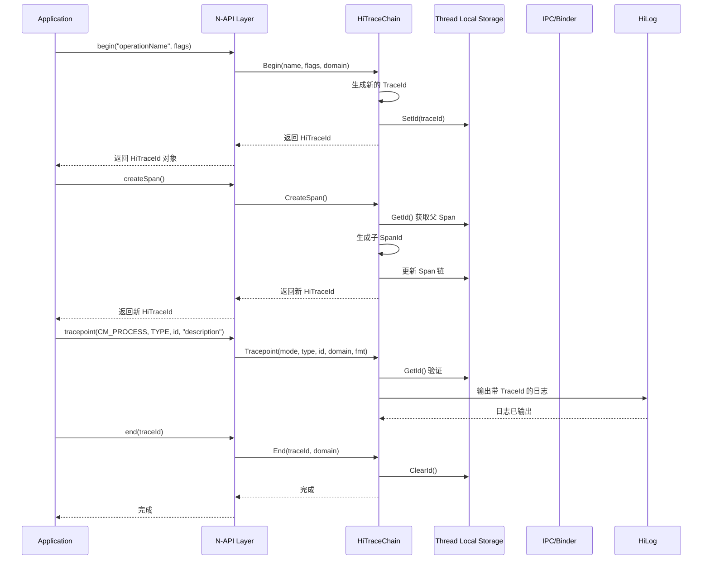
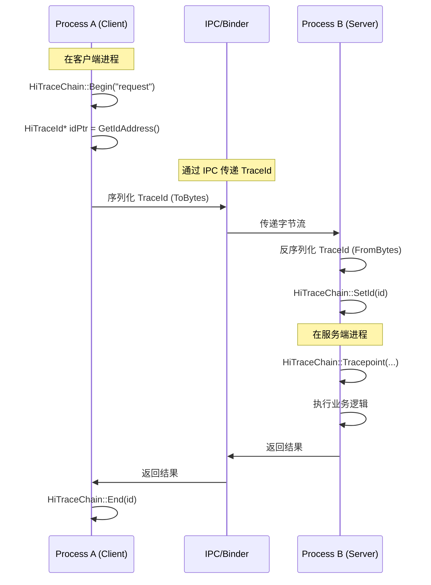

# 架构说明

## 整体架构

```
┌─────────────────────────────────────────────────────────────────┐
│                        Application Layer                        │
│  ┌─────────────────┐  ┌─────────────────┐  ┌─────────────────┐   │
│  │  hiTraceChain   │  │  hiTraceMeter   │  │    bytrace      │   │
│  │   (JS/ArkTS)    │  │   (JS/ArkTS)    │  │   (Legacy JS)   │   │
│  └────────┬────────┘  └────────┬────────┘  └────────┬────────┘   │
└───────────┼────────────────────┼────────────────────┼────────────┘
            │                    │                    │
            ▼                    ▼                    ▼
┌─────────────────────────────────────────────────────────────────┐
│                      N-API Glue Layer                           │
│  ┌─────────────────────────────────────────────────────────┐   │
│  │  napi_hitrace_js.cpp    │  napi_hitrace_meter.cpp        │   │
│  │  - begin/end            │  - startTrace/finishTrace      │   │
│  │  - getId/setId          │  - traceByValue                 │   │
│  │  - createSpan           │  - registerTraceListener        │   │
│  │  - tracepoint           │                                 │   │
│  └─────────────────────────┴─────────────────────────────────┘   │
│                        napi_hitrace_util.cpp                     │
│              (JS ↔ Native 对象转换、类型校验)                    │
└─────────────────────────────┬───────────────────────────────────┘
                              │
                              ▼
┌─────────────────────────────────────────────────────────────────┐
│                    Native Framework Layer                        │
│  ┌─────────────────────────────────────────────────────────┐   │
│  │                  HiTraceChain (C++)                      │   │
│  │  - Begin/End/GetId/SetId/CreateSpan/Tracepoint          │   │
│  │  - TLS 存储管理                                           │   │
│  └─────────────────────────┬───────────────────┬─────────────┘   │
│                            │                   │                   │
│  ┌─────────────────────────┴───────┐   ┌───────┴─────────────┐   │
│  │        HiTraceMeter            │   │    Trace Factory     │   │
│  │  - startTrace/finishTrace     │   │  - TraceBufferMgr    │   │
│  │  - traceByValue               │   │  - TraceSourceFactory │   │
│  │  - 线程安全追踪                │   │  - TraceContent       │   │
│  └───────────────────────────────┘   └───────────────────────┘   │
└─────────────────────────────┬───────────────────────────────────┘
                              │
                              ▼
┌─────────────────────────────────────────────────────────────────┐
│                      System Integration                         │
│  ┌─────────────────┐  ┌─────────────────┐  ┌─────────────────┐   │
│  │   TLS 存储      │  │   IPC/Binder    │  │     Hilog       │   │
│  │  (线程本地存储)  │  │  (跨进程通信)   │  │    (日志输出)   │   │
│  └─────────────────┘  └─────────────────┘  └─────────────────┘   │
└─────────────────────────────────────────────────────────────────┘
```

## 数据流

### 调用链追踪数据流

```
┌──────────┐     ┌──────────┐     ┌──────────┐     ┌──────────┐
│ ProcessA │────▶│  IPC/Binder│────▶│ ProcessB │────▶│ ProcessC │
│  Thread1 │     │           │     │  Thread1 │     │  Thread2 │
└────┬─────┘     └──────────┘     └────┬─────┘     └────┬─────┘
     │                                 │                  │
     │ HiTraceChain::Begin()           │ HiTraceChain::SetId()
     │ (生成 TraceId)                  │ (接收并设置 TraceId)
     │                                 │
     ▼                                 ▼
┌─────────────────────────────────────────────────────────────┐
│                    Thread Local Storage                     │
│                    (TLS 中存储 TraceId)                      │
└─────────────────────────────────────────────────────────────┘
     │                                 │
     │ HiTraceChain::Tracepoint()      │ HiTraceChain::Tracepoint()
     │ (输出带 TraceId 的日志)         │ (输出带 TraceId 的日志)
     ▼                                 ▼
┌─────────────────────────────────────────────────────────────┐
│                         HiLog                                │
│              (自动关联 TraceId 的日志输出)                    │
└─────────────────────────────────────────────────────────────┘
```

**证据来源**: `README.md:26-28` - "Transfers traceid in cross-device, cross-process, and cross-thread communications"

## 线程模型

### TLS 存储机制

```
┌─────────────────────────────────────────────────────────┐
│                    Thread 1                            │
│  ┌─────────────────────────────────────────────────┐   │
│  │  TLS: HiTraceId (spanId=1, parentSpanId=0)     │   │
│  └─────────────────────────────────────────────────┘   │
│                         │                                  │
│         HiTraceChain::Begin("operation1")              │
│                         │                                  │
│         HiTraceChain::CreateSpan()                    │
│                         │                                  │
│         TLS 更新为 (spanId=2, parentSpanId=1)          │
└─────────────────────────────────────────────────────────┘

┌─────────────────────────────────────────────────────────┐
│                    Thread 2                            │
│  ┌─────────────────────────────────────────────────┐   │
│  │  TLS: HiTraceId (无/或旧 TraceId)               │   │
│  └─────────────────────────────────────────────────┘   │
│                         │                                  │
│         HiTraceChain::GetId()                          │
│         (获取当前线程的 TraceId)                        │
│                         │                                  │
│         HiTraceChain::SetId(receivedId)                │
│         (从 IPC 接收并设置 TraceId)                    │
└─────────────────────────────────────────────────────────┘
```

**证据来源**:
- `interfaces/native/innerkits/include/hitrace/hitracechain.h:65` - `GetIdAddress()` 获取 TLS 中 TraceId 地址
- `frameworks/native/hitracechain.cpp:49-51` - `GetIdAddress()` 调用 C 接口

### 跨线程传播

```cpp
// 异步任务中恢复 TraceId
HiTraceId id = HiTraceChain::GetId();  // 主线程获取
HiTraceId saved = HiTraceChain::SaveAndSet(id);  // 保存并设置
// ... 在异步任务中使用 ...
HiTraceChain::Restore(saved);  // 恢复原 TraceId
```

**证据来源**: `interfaces/native/innerkits/include/hitrace/hitracechain.h:114-119`

## 关键时序

### 调用链追踪时序



### 跨进程追踪时序



## 模块职责

| 模块 | 职责 | 稳定性 |
|------|------|--------|
| `hiTraceChain` | 调用链核心管理 | 稳定 |
| `hiTraceMeter` | 性能追踪测量 | 稳定 |
| `TraceFactory` | 追踪数据生产 | 稳定 |
| `TraceDumpExecutor` | 追踪数据转储 | 稳定 |
| `bytrace` | 遗留兼容接口 | 不推荐新使用 |

**证据来源**: 模块目录结构分析

## 关键类与接口

### HiTraceChain (C++)

| 方法 | 说明 |
|------|------|
| `Begin(name, flags)` | 开始追踪 |
| `End(id)` | 结束追踪 |
| `GetId()` | 获取当前 TraceId |
| `SetId(id)` | 设置 TraceId |
| `ClearId()` | 清除 TraceId |
| `CreateSpan()` | 创建 Span |
| `Tracepoint(type, id, fmt, ...)` | 输出追踪点 |
| `SaveAndSet(id)` | 保存并设置 |
| `Restore(id)` | 恢复 |

**证据来源**: `interfaces/native/innerkits/include/hitrace/hitracechain.h:35-119`

### HiTraceMeter (C++)

| 方法 | 说明 |
|------|------|
| `StartTrace(name)` | 开始追踪 |
| `FinishTrace()` | 结束追踪 |
| `TraceByValue(name, count)` | 计数追踪 |
| `IsTraceEnabled()` | 检查是否启用 |

**证据来源**: `interfaces/native/innerkits/include/hitrace_meter/hitrace_meter.h`

### HiTraceId (C++)

| 方法 | 说明 |
|------|------|
| `IsValid()` | 是否有效 |
| `IsFlagEnabled(flag)` | 标志位检查 |
| `EnableFlag(flag)` | 启用标志位 |
| `GetChainId()` | 获取链 ID |
| `GetSpanId()` | 获取 Span ID |
| `GetParentSpanId()` | 获取父 Span ID |
| `ToBytes(buf, len)` | 序列化 |

**证据来源**: `interfaces/native/innerkits/include/hitrace/hitraceid.h:33-89`
