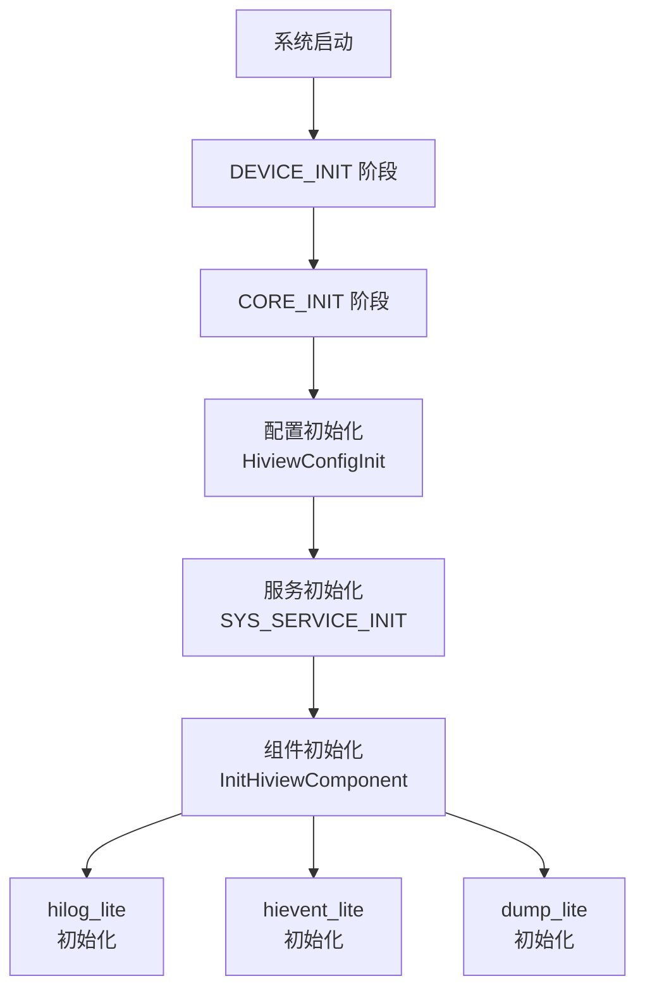

# 项目概览

> **文档版本**: 1.0  
> **最后更新**: 2026-02-07  
> **代码版本**: v3.1

## 1.1 项目定位

### 一句话定义

**hiview_lite** 是 OpenHarmony DFX（Design For X）子系统的核心调度服务，负责在系统启动时按需初始化 log、dump、event 三大 DFX 组件，并通过 SAMGR IPC 协调它们的工作。

**证据来源**：`bundle.json:2-3`

```json
{
  "name": "@ohos/hiview_lite",
  "description": "DFX services for liteos-m kernel"
}
```

### 项目职责

hiview_lite 作为 DFX 子系统的入口，承担以下核心职责：

| 职责 | 描述 | 证据位置 |
|------|------|----------|
| **子系统初始化** | 控制各组件按 DEVICE_INIT 和 CORE_INIT 两个阶段启动 | `README_zh.md:9-27` |
| **组件注册** | 提供回调注册接口，允许 log/dump/event 组件注册初始化函数和消息处理函数 | `hiview_service.c:117-125` |
| **消息路由** | 作为消息中间件，接收并分发 DFX 相关消息 | `hiview_service.c:75-86` |
| **输出协调** | 协调 log/event 的文件输出（循环文件管理） | `hiview_file.c:151-173` |

### 能力边界

| 能力 | 支持 | 说明 |
|------|------|------|
| DFX 组件初始化 | ✅ | 支持 log、dump、event 三大组件 |
| 消息路由 | ✅ | 支持 6 种内置消息类型 |
| 文件输出 | ✅ | 支持文本/二进制文件循环写入 |
| IPC 通信 | ✅ | 通过 SAMGR 进行进程内消息传递 |
| N-API 接口 | ❌ | 无 JS 绑定，不直接暴露给应用层 |
| 网络通信 | ❌ | 不涉及网络功能 |

**证据来源**：`NOTES.md:118-120`

```
- 搜索关键词：napi_、NAPI_MODULE、napi_module_register
- 结果：❌ 未找到
- 结论：本项目没有 N-API（JS API），这是一个纯 C 语言模块
```

---

## 1.2 运行环境

### 系统要求

| 要求 | 详情 |
|------|------|
| **目标内核** | LiteOS-M（轻量级内核） |
| **适配系统类型** | mini（轻量级设备） |
| **依赖子系统** | hiviewdfx（hilog_lite、hievent_lite） |
| **依赖系统服务** | SAMGR Lite（轻量级服务管理器） |

**证据来源**：`bundle.json:15-18`, `bundle.json:36-37`

```json
"adapted_system_type": ["mini"],
"deps": {
  "components": ["liteos_m"]
}
```

### 硬件资源

| 资源 | 占用 | 说明 |
|------|------|------|
| **ROM** | ~10KB | 编译后静态库大小 |
| **RAM** | ~10KB | 运行时缓存和配置占用 |

**证据来源**：`bundle.json:33-34`

```json
"rom": "10KB",
"ram": "~10KB"
```

### 外部依赖

| 依赖类型 | 依赖项 | 说明 |
|----------|--------|------|
| **系统组件** | liteos_m | LiteOS-M 内核接口 |
| **第三方库** | bounds_checking_function | 边界检查函数库 |

**证据来源**：`bundle.json:39-41`

```json
"third_party": ["bounds_checking_function"]
```

---

## 1.3 两阶段初始化

hiview_lite 的初始化分为 **DEVICE_INIT** 和 **CORE_INIT** 两个阶段，这是理解其架构的关键概念。

### 初始化流程图



### DEVICE_INIT 阶段

此阶段在系统早期启动，此时内存管理和文件系统尚未完全就绪。

**执行内容**：

1. **配置模块初始化** - 初始化 DFX 子系统核心配置参数
2. **日志组件初始化** - 不能涉及内存动态分配、文件操作
3. **状态信息记录** - 记录当前 DFX 子系统的状态信息

**关键代码**：`hiview_config.c:29-34`

```c
void HiviewConfigInit(void)
{
    g_hiviewConfig.hiviewInited = FALSE;  // 标记未完成初始化
    g_hiviewConfig.logOutputModule = 0xFFFFFFFFFFFFFFFF;  // 默认全部模块
}
```

**初始化宏**：`hiview_config.c:37`

```c
CORE_INIT_PRI(HiviewConfigInit, 0)  // 优先级 0，最高优先级
```

### CORE_INIT 阶段

此阶段在系统完全启动后执行，此时内存管理和文件系统已就绪。

**执行内容**：

1. **根据配置按需初始化** - log、dump、event 及对应的 output 组件
2. **内存申请** - 可按需申请内存
3. **文件创建** - 可创建日志和事件文件

**关键代码**：`hiview_service.c:45-51`

```c
static void Init(void)
{
    SAMGR_GetInstance()->RegisterService((Service *)&g_hiviewService);
    SAMGR_GetInstance()->RegisterDefaultFeatureApi(HIVIEW_SERVICE, GET_IUNKNOWN(g_hiviewService));
    InitHiviewComponent();  // 调用注册的组件初始化函数
}
SYS_SERVICE_INIT(Init);  // 系统服务初始化宏
```

**初始化宏**：`hiview_service.c:51`

```c
SYS_SERVICE_INIT(Init)  // 在系统服务初始化阶段执行
```

### 两阶段设计的原因

| 阶段 | 约束 | 设计原因 |
|------|------|----------|
| DEVICE_INIT | 无动态内存分配、无文件操作 | 确保在系统早期就能输出日志，便于调试 |
| CORE_INIT | 内存和文件系统就绪 | 完整功能初始化，包括文件持久化 |

---

## 1.4 快速开始

### 获取源码

```bash
# 克隆 OpenHarmony 仓库
git clone https://gitee.com/openharmony/manifest.git
cd manifest
# 初始化子仓库
repo init -u https://gitee.com/openharmony/manifest.git -b master --no-repo-verify
repo sync -c
```

### 编译 hiview_lite

```bash
# 进入构建目录
cd build

# 配置构建
python build.py -p ipcamera_hi3516dv300 -b debug

# hiview_lite 将作为 hiviewdfx 子系统的一部分被编译
```

### 集成到项目

hiview_lite 作为静态库集成，链接方式如下：

**GN 配置**：`BUILD.gn:40-72`

```gn
static_library("hiview_lite_static") {
  sources = [
    "hiview_cache.c",
    "hiview_config.c",
    "hiview_file.c",
    "hiview_service.c",
    "hiview_util.c",
  ]
  
  defines = [
    "OUTPUT_OPTION=1",
    "HILOG_LITE_SWITCH=1",
    "DUMP_LITE_SWITCH=0",
    "HIEVENT_LITE_SWITCH=1",
  ]
  
  public_configs = [ ":hiview_lite_config" ]
}
```

### Feature 开关

| Feature | 默认值 | 说明 |
|---------|--------|------|
| `hiview_lite_hilog_lite_level` | 1 | Debug 模式日志级别 |
| `hiview_lite_hilog_lite_level_release` | 3 | Release 模式日志级别 |
| `hiview_lite_hilog_lite_log_switch` | 1 | 启用日志组件 |
| `hiview_lite_dump_lite_dump_switch` | 0 | 启用 Dump 组件 |
| `hiview_lite_hievent_lite_event_switch` | 1 | 启用事件组件 |
| `hiview_lite_disable_core_init` | false | 禁用 CORE_INIT 阶段 |

**证据来源**：`BUILD.gn:14-27`

---

## 1.5 核心概念

### 服务名

hiview_lite 在 SAMGR 中注册的服务名称为 **"hiview"**。

**证据来源**：`hiview_def.h:27`, `hiview_service.c:56`

```c
#define HIVIEW_SERVICE "hiview"

static const char *GetName(Service *service)
{
    (void)service;
    return HIVIEW_SERVICE;  // 返回 "hiview"
}
```

### 组件类型

hiview_lite 支持管理以下类型的 DFX 组件：

| 组件类型 | 枚举值 | 说明 |
|----------|--------|------|
| `HIVIEW_CMP_TYPE_DUMP` | 0 | 内存转储组件 |
| `HIVIEW_CMP_TYPE_LOG` | 1 | 日志组件 |
| `HIVIEW_CMP_TYPE_LOG_LIMIT` | 2 | 限流日志组件 |
| `HIVIEW_CMP_TYPE_EVENT` | 3 | 事件组件 |
| `HIVIEW_CMP_TYPE_MAX` | 4 | 最大枚举值 |

**证据来源**：`hiview_service.h:29-35`

### 消息类型

hiview_lite 支持以下内置消息类型：

| 消息类型 | 枚举值 | 说明 |
|----------|--------|------|
| `HIVIEW_MSG_OUTPUT_LOG_FLOW` | 0 | 输出日志流 |
| `HIVIEW_MSG_OUTPUT_LOG_TEXT_FILE` | 1 | 输出日志到文本文件 |
| `HIVIEW_MSG_OUTPUT_LOG_BIN_FILE` | 2 | 输出日志到二进制文件 |
| `HIVIEW_MSG_OUTPUT_EVENT_FLOW` | 3 | 输出事件流 |
| `HIVIEW_MSG_OUTPUT_EVENT_BIN_FILE` | 4 | 输出事件到二进制文件 |

**证据来源**：`hiview_service.h:37-44`

---

## 1.6 相关仓库

| 仓库 | 说明 |
|------|------|
| [hiviewdfx_hilog_lite](https://gitee.com/openharmony/hiviewdfx_hilog_lite) | 日志组件 |
| [hiviewdfx_hievent_lite](https://gitee.com/openharmony/hiviewdfx_hievent_lite) | 事件组件 |
| [DFX 子系统](https://gitee.com/openharmony/docs/blob/master/zh-cn/readme/DFX子系统.md) | DFX 子系统说明 |

**证据来源**：`README_zh.md:36-40`

---

## 1.7 下一步

| 你的目标 | 推荐阅读 |
|----------|----------|
| 理解组件关系和数据流 | [02_Architecture.md](./02_Architecture.md) |
| 了解代码组织结构 | [03_CodeMap.md](./03_CodeMap.md) |
| 了解安全风险 | [05_AttackSurface.md](./05_AttackSurface.md) |
| 了解构建配置 | [07_Build.md](./07_Build.md) |

---

*所有技术结论均有代码证据支撑，详见 [wiki/_work/NOTES.md](../_work/NOTES.md)。*
