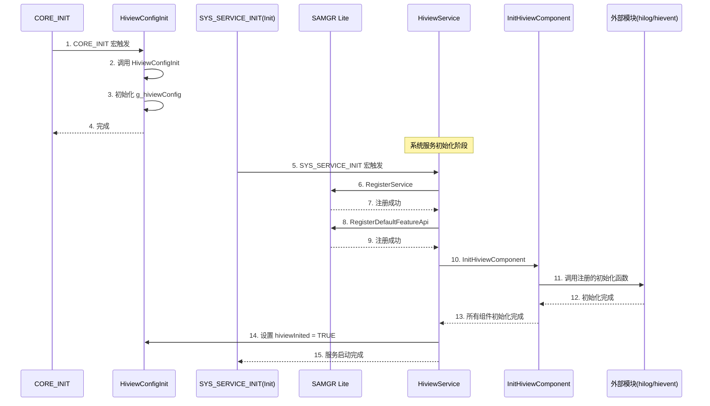
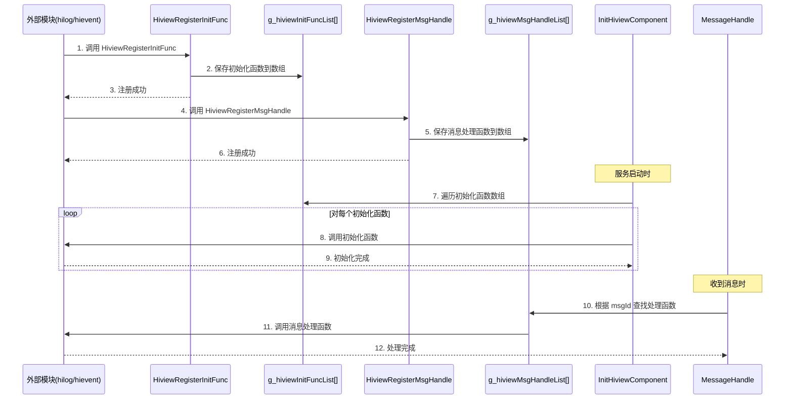
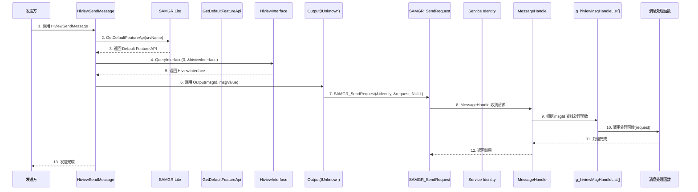
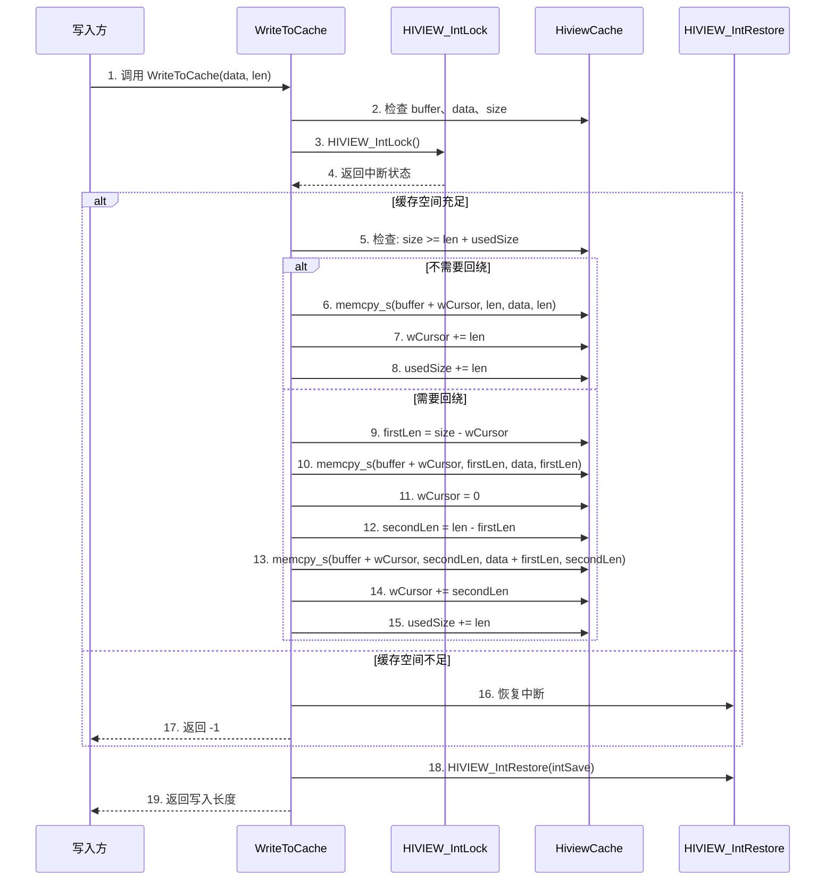
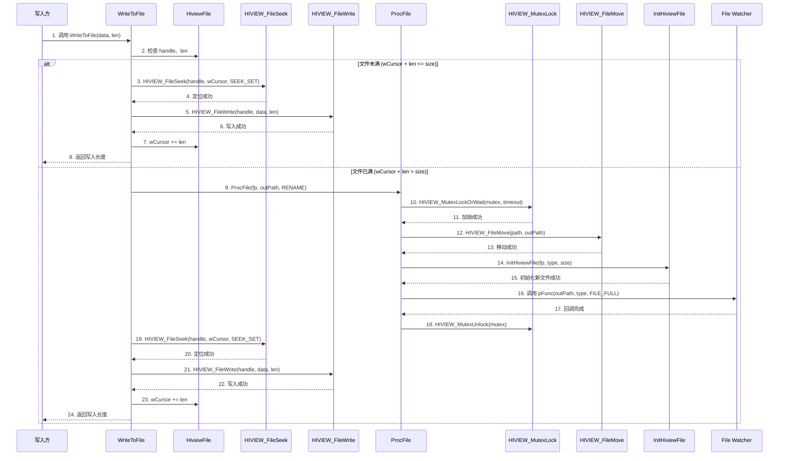
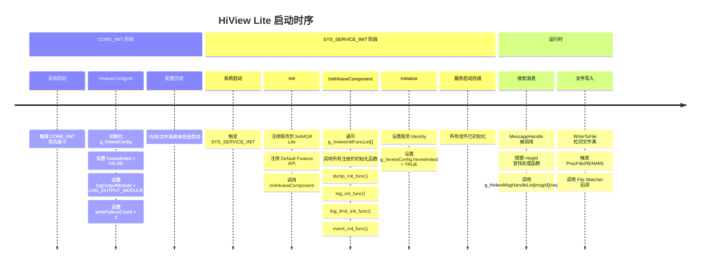

# 架构说明

## 目的

本文档描述 HiView Lite 的架构，包括组件图、数据流、线程模型和关键时序。

## 适用范围

本文档适用于：
- 需要理解系统架构的开发者
- 需要分析性能的维护者
- 需要扩展功能的集成方

## 相关跳转

- [项目概览](00_Overview.md) - 了解项目定位
- [目录结构](02_Directory_Structure.md) - 了解模块职责
- [内部 API](05_Internal_API.md) - 了解模块接口

---

## 组件图

### 整体架构

```
┌─────────────────────────────────────────────────────────────┐
│                    应用层 (外部模块)                   │
│           hilog_lite, hievent_lite, 等                │
└───────────────────────┬─────────────────────────────────┘
                        │
                        │ 注册初始化/消息处理函数
                        │
                        ▼
┌─────────────────────────────────────────────────────────────┐
│                   服务层 (hiview_service)              │
│  ┌─────────────────────────────────────────────────┐    │
│  │  HiviewService (SAMGR Lite Service)       │    │
│  │  - Initialize                              │    │
│  │  - MessageHandle                           │    │
│  │  - Output                                 │    │
│  └─────────────────┬───────────────────────┬───┘    │
│                    │                       │         │
│  ┌─────────────────┘                       │         │
│  │                                         │         │
│  │ g_hiviewInitFuncList[]                │         │
│  │ [0]: dump_init_func                  │         │
│  │ [1]: log_init_func                   │         │
│  │ [2]: log_limit_init_func             │         │
│  │ [3]: event_init_func                 │         │
│  │                                         │         │
│  │ g_hiviewMsgHandleList[]                 │         │
│  │ [0]: log_flow_handle                  │         │
│  │ [1]: log_text_file_handle            │         │
│  │ [2]: log_bin_file_handle             │         │
│  │ [3]: event_flow_handle              │         │
│  │ [4]: event_bin_file_handle          │         │
│  └─────────────────┬─────────────────────┘         │
└────────────────────┼───────────────────────────────────┘
                   │
                   │ 依赖
                   ▼
┌─────────────────────────────────────────────────────────────┐
│                   配置层 (hiview_config)              │
│  ┌─────────────────────────────────────────────────┐    │
│  │  HiviewConfig (全局配置)                  │    │
│  │  - outputOption                          │    │
│  │  - hiviewInited                          │    │
│  │  - level                                 │    │
│  │  - logSwitch / eventSwitch / dumpSwitch    │    │
│  │  - logOutputModule                       │    │
│  └─────────────────────────────────────────────────┘    │
└────────────────────┬───────────────────────────────────┘
                   │
                   │ 依赖
         ┌─────────┴─────────┐
         │                   │
         ▼                   ▼
┌──────────────────┐  ┌──────────────────┐
│  缓存层        │  │  文件层         │
│(hiview_cache)  │  │ (hiview_file)   │
│                │  │                 │
│  循环缓冲区      │  │  循环文件        │
│  - 缓存日志      │  │  - 文件头        │
│  - 缓存事件      │  │  - 文件满检测    │
│  - 缓存 Dump     │  │  - 文件重命名    │
└────────┬───────┘  └────────┬────────┘
         │                   │
         └─────────┬─────────┘
                   │
                   │ 依赖
                   ▼
┌─────────────────────────────────────────────────────────────┐
│                  工具层 (hiview_util)                 │
│  ┌─────────────────────────────────────────────────┐    │
│  │  内存管理 (malloc/free)                     │    │
│  │  互斥锁 (osMutexNew/Acquire/Release)      │    │
│  │  中断锁 (LOS_IntLock/Restore)           │    │
│  │  文件系统封装 (open/close/read/write)     │    │
│  │  Hook 机制 (可覆盖)                       │    │
│  └─────────────────────────────────────────────────┘    │
└────────────────────┬───────────────────────────────────┘
                   │
                   ▼
┌─────────────────────────────────────────────────────────────┐
│                    系统层                             │
│  ┌─────────────────────────────────────────────────┐    │
│  │  SAMGR Lite (服务管理器)                   │    │
│  │  LiteOS-M (操作系统内核)                    │    │
│  │  POSIX (文件系统接口)                      │    │
│  │  CMSIS-OS (RTOS 接口)                     │    │
│  └─────────────────────────────────────────────────┘    │
└─────────────────────────────────────────────────────────────┘
```

### 组件职责

| 层级 | 组件 | 职责 |
|------|------|------|
| 应用层 | 外部模块 | 注册初始化函数，调用消息接口 |
| 服务层 | hiview_service | 管理服务生命周期，协调各组件 |
| 配置层 | hiview_config | 管理全局配置，控制功能开关 |
| 缓存层 | hiview_cache | 提供循环缓冲区，减少文件 I/O |
| 文件层 | hiview_file | 管理循环文件，持久化数据 |
| 工具层 | hiview_util | 封装底层接口，提供 Hook 机制 |
| 系统层 | SAMGR/LiteOS-M | 提供基础服务 |

---

## 数据流

### 1. 初始化流程



**说明**：
1. **CORE_INIT 阶段**：`CORE_INIT_PRI(HiviewConfigInit, 0)` 触发配置初始化，此时内存管理和文件系统未完全启动。
2. **SYS_SERVICE_INIT 阶段**：`SYS_SERVICE_INIT(Init)` 触发服务初始化，注册服务到 SAMGR Lite，并调用所有注册的组件初始化函数。

**证据来源**：
- hiview_config.c:37 - `CORE_INIT_PRI(HiviewConfigInit, 0)`
- hiview_service.c:51 - `SYS_SERVICE_INIT(Init)`
- hiview_service.c:47-48 - 注册服务和 Feature API
- hiview_service.c:107-115 - `InitHiviewComponent`

### 2. 组件注册流程



**说明**：
1. 外部模块（如 hilog_lite、hievent_lite）调用 `HiviewRegisterInitFunc` 注册初始化函数。
2. 外部模块调用 `HiviewRegisterMsgHandle` 注册消息处理函数。
3. 服务启动时，`InitHiviewComponent` 遍历并调用所有注册的初始化函数。
4. 收到消息时，`MessageHandle` 根据 msgId 查找并调用对应的处理函数。

**证据来源**：
- hiview_service.h:59-60 - 函数指针类型定义
- hiview_service.c:117-120 - `HiviewRegisterInitFunc` 实现
- hiview_service.c:122-125 - `HiviewRegisterMsgHandle` 实现
- hiview_service.c:107-115 - `InitHiviewComponent` 实现
- hiview_service.c:75-86 - `MessageHandle` 实现

### 3. 消息传递流程



**说明**：
1. 发送方调用 `HiviewSendMessage(srvName, msgId, msgValue)`。
2. 通过 SAMGR 获取服务的 Default Feature API。
3. 调用 Output 接口发送消息。
4. SAMGR 将请求发送到服务的 `MessageHandle`。
5. `MessageHandle` 根据 msgId 查找并调用对应的处理函数。

**证据来源**：
- hiview_service.c:127-139 - `HiviewSendMessage` 实现
- hiview_service.c:95-105 - `Output` 实现
- hiview_service.c:75-86 - `MessageHandle` 实现

### 4. 缓存写入流程



**说明**：
1. 写入前检查参数有效性。
2. 关中断，保证写入操作的原子性。
3. 检查缓存空间是否充足。
4. 如果需要回绕（wCursor + len > size），分两次写入。
5. 使用 `memcpy_s` 安全复制数据。
6. 更新游标和已用大小。
7. 恢复中断。

**证据来源**：
- hiview_cache.c:58-107 - `WriteToCache` 实现
- hiview_cache.c:66 - `HIVIEW_IntLock()`
- hiview_cache.c:104 - `HIVIEW_IntRestore(intSave)`

### 5. 文件写入流程（含文件满处理）



**说明**：
1. 写入前检查文件句柄和长度。
2. 检测文件是否已满（wCursor + len > size）。
3. 如果文件已满：
   - 调用 `ProcFile` 进行文件重命名。
   - 使用互斥锁保护文件操作。
   - 移动当前文件到输出路径。
   - 初始化新文件。
   - 调用注册的文件监视器回调。
4. 定位到写游标位置。
5. 写入数据。
6. 更新写游标。

**证据来源**：
- hiview_file.c:151-173 - `WriteToFile` 实现
- hiview_file.c:159-163 - 文件满检测
- hiview_file.c:227-274 - `ProcFile` 实现

---

## 线程模型

### 服务线程

HiView Lite 服务运行在独立的线程中，由 SAMGR Lite 管理。

**线程配置**（来自 `GetTaskConfig`）：

| 配置项 | 值 | 说明 |
|--------|-----|------|
| 线程优先级 | HIVIEW_STACK_PRIO | 默认 24（可配置） |
| 栈大小 | HIVIEW_STACK_SIZE | 默认 4096 字节（可配置） |
| 队列深度 | 10 | 消息队列深度 |
| 任务类型 | SINGLE_TASK | 单任务 |

**证据来源**：
- hiview_service.c:88-93 - `GetTaskConfig` 实现
- BUILD.gn:23-24 - 栈大小和优先级配置

### 线程安全

#### 中断锁

**使用场景**：缓存写入操作

**实现**：
- `HIVIEW_IntLock()` - 关中断
- `HIVIEW_IntRestore(intSave)` - 恢复中断

**证据来源**：
- hiview_cache.c:66 - `uint32 intSave = HIVIEW_IntLock();`
- hiview_cache.c:104 - `HIVIEW_IntRestore(intSave);`

#### 互斥锁

**使用场景**：文件处理操作（复制/重命名）

**实现**：
- `HIVIEW_MutexInit()` - 创建互斥锁
- `HIVIEW_MutexLock()` - 加锁（等待）
- `HIVIEW_MutexLockOrWait(mutex, timeout)` - 加锁（带超时）
- `HIVIEW_MutexUnlock()` - 解锁

**证据来源**：
- hiview_file.c:233 - `HIVIEW_MutexLockOrWait(fp->mutex, OUT_PATH_WAIT_TIMEOUT)`
- hiview_file.c:272 - `HIVIEW_MutexUnlock(fp->mutex)`

---

## 关键时序

### 启动时序



**证据来源**：
- hiview_config.c:37 - `CORE_INIT_PRI(HiviewConfigInit, 0)`
- hiview_service.c:51 - `SYS_SERVICE_INIT(Init)`
- hiview_service.c:107-115 - `InitHiviewComponent`
- hiview_service.c:69 - `g_hiviewConfig.hiviewInited = TRUE`
- hiview_file.c:159-163 - 文件满检测

---

## 关键结论

1. **分层架构** - 清晰的分层设计（服务层、配置层、缓存层、文件层、工具层、系统层）。
2. **消息驱动** - 通过 SAMGR Lite 进行消息传递，支持异步通信。
3. **组件注册** - 外部模块可以注册初始化函数和消息处理函数，具有良好的扩展性。
4. **线程安全** - 使用中断锁和互斥锁保证并发安全。
5. **循环缓冲区** - 提供高效的循环缓冲区实现，减少文件 I/O。
6. **循环文件** - 提供循环文件实现，支持文件满检测和自动处理。

---

*最后更新：2026-02-06*
