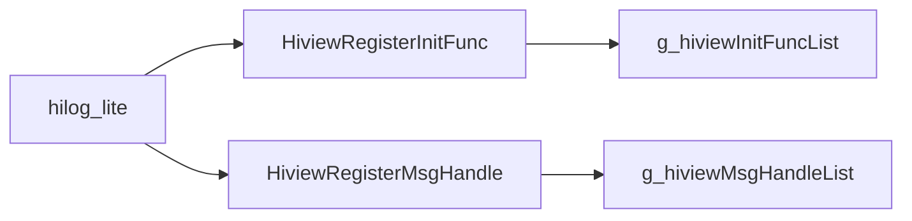
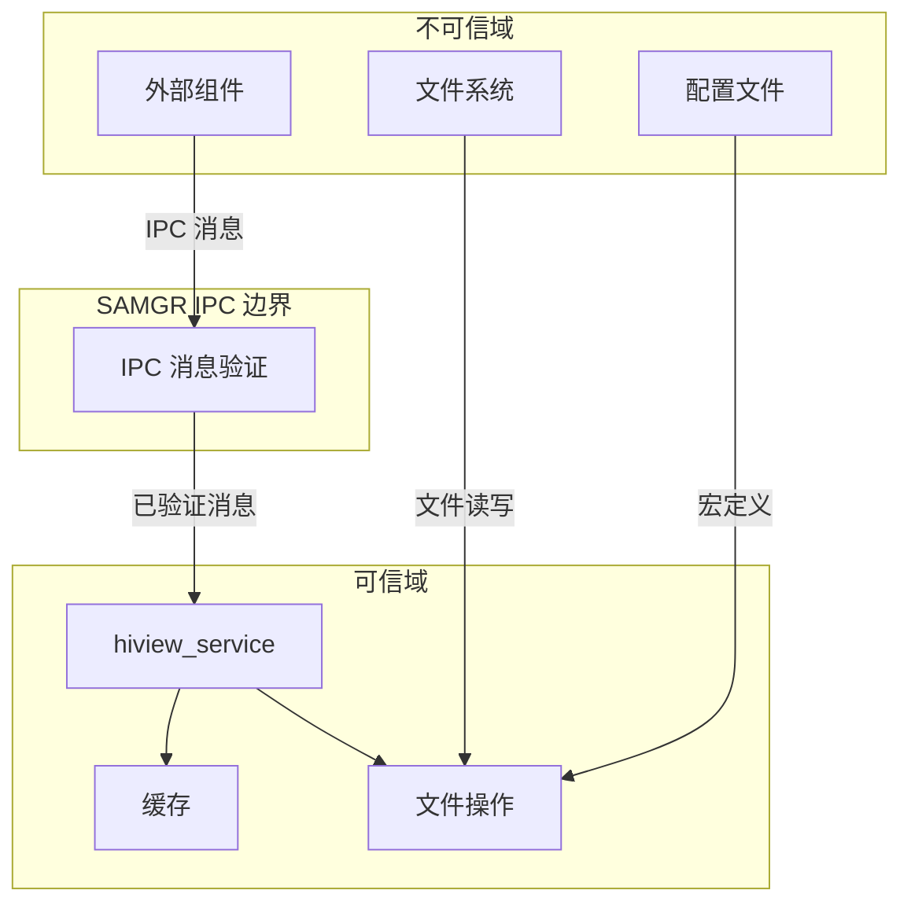

# 攻击面分析

> **文档版本**: 1.0  
> **最后更新**: 2026-02-07  
> **代码版本**: v3.1  
> **审计者**: 安全研究员

## 4.1 外部输入清单

### 4.1.1 SAMGR IPC 消息输入

**输入类型**：进程内 IPC 消息

| 输入项 | 说明 | 证据位置 |
|--------|------|----------|
| **msgId** | 消息类型标识符 | `hiview_service.c:78` |
| **msgValue** | 消息值 | `hiview_service.c:99` |
| **data** | 消息数据指针 | `hiview_service.c:100` |
| **len** | 数据长度 | `hiview_service.c:101` |

**处理路径**：


**关键代码**：`hiview_service.c:75-86`

```c
static BOOL MessageHandle(Service *service, Request *request)
{
    (void)service;
    if ((request == NULL) || (request->msgId >= HIVIEW_MSG_MAX)) {
        return TRUE;  // 边界检查：msgId >= HIVIEW_MSG_MAX 则丢弃
    }
    if (g_hiviewMsgHandleList[request->msgId] != NULL) {
        (*(g_hiviewMsgHandleList[request->msgId]))(request);
    }
    return TRUE;
}
```

**风险评估**：
- ✅ **有检查**：`msgId >= HIVIEW_MSG_MAX` 时丢弃
- ⚠️ **潜在风险**：`data` 和 `len` 未验证直接传递给处理函数

---

### 4.1.2 配置文件输入

**输入类型**：编译时宏定义

| 输入项 | 说明 | 证据位置 |
|--------|------|----------|
| `HIVIEW_FILE_DIR` | 文件输出基础目录 | `hiview_config.h:31` |
| `HIVIEW_FILE_OUT_PATH_LOG` | 日志文件路径 | `hiview_config.h:34` |
| `HIVIEW_FILE_OUT_PATH_UE_EVENT` | UE 事件文件路径 | `hiview_config.h:35` |
| `HIVIEW_FILE_OUT_PATH_FAULT_EVENT` | 故障事件文件路径 | `hiview_config.h:36` |
| `HIVIEW_FILE_OUT_PATH_STAT_EVENT` | 统计事件文件路径 | `hiview_config.h:37` |

**关键代码**：`hiview_config.h:30-44`

```c
#ifndef HIVIEW_FILE_DIR
#define HIVIEW_FILE_DIR                    ""
#endif

#define HIVIEW_FILE_OUT_PATH_LOG           HIVIEW_FILE_DIR"debug.log"
#define HIVIEW_FILE_OUT_PATH_UE_EVENT      HIVIEW_FILE_DIR"ue.event"
// ... 其他路径定义
```

**风险评估**：
- ⚠️ **路径拼接**：`HIVIEW_FILE_DIR` 直接与文件名拼接，无路径规范化
- ⚠️ **相对路径**：`HIVIEW_FILE_DIR` 为空时使用相对路径

---

### 4.1.3 组件注册回调输入

**输入类型**：函数指针注册

| 输入项 | 说明 | 证据位置 |
|--------|------|----------|
| `HiviewInitFunc func` | 组件初始化函数指针 | `hiview_service.c:119` |
| `HiviewMsgHandle func` | 消息处理函数指针 | `hiview_service.c:124` |

**处理路径**：



**关键代码**：`hiview_service.c:117-125`

```c
void HiviewRegisterInitFunc(HiviewComponentType type, HiviewInitFunc func)
{
    g_hiviewInitFuncList[type] = func;  // 直接赋值，无空指针检查
}

void HiviewRegisterMsgHandle(HiviewInnerMessage type, HiviewMsgHandle func)
{
    g_hiviewMsgHandleList[type] = func;  // 直接赋值，无空指针检查
}
```

**风险评估**：
- ⚠️ **无空指针检查**：传入 NULL 会导致后续调用时崩溃
- ⚠️ **数组越界**：`type` 参数未验证是否在有效范围内

---

### 4.1.4 文件系统输入

**输入类型**：文件读写

| 输入项 | 说明 | 证据位置 |
|--------|------|----------|
| **文件内容** | 读取文件时的数据 | `hiview_file.c:175-197` |
| **文件路径** | 打开文件时的路径 | `hiview_file.c:46` |

**处理路径**：


**关键代码**：`hiview_file.c:121-149`

```c
boolean ReadFileHeader(HiviewFile *fp)
{
    // ... 读取文件头
    if ((fp->header.common.prefix & HIVIEW_FILE_HEADER_PREFIX_MASK) 
        != HIVIEW_FILE_HEADER_PREFIX_LOG &&
        (fp->header.common.prefix & HIVIEW_FILE_HEADER_PREFIX_MASK) 
        != HIVIEW_FILE_HEADER_PREFIX_EVENT) {
        return FALSE;  // 验证前缀
    }
    return TRUE;
}
```

**风险评估**：
- ✅ **有验证**：文件头前缀验证
- ⚠️ **潜在风险**：文件内容大小未验证

---

## 4.2 敏感操作清单

### 4.2.1 文件写入操作

| 操作 | 说明 | 风险等级 | 证据位置 |
|------|------|----------|----------|
| `WriteToFile()` | 写入数据到文件 | 高 | `hiview_file.c:151-173` |
| `ProcFile()` | 重命名/复制文件 | 中 | `hiview_file.c:227-274` |
| `HIVIEW_FileMove()` | 移动文件 | 中 | `hiview_util.c:284-294` |

**WriteToFile 关键代码**：`hiview_file.c:151-173`

```c
int32 WriteToFile(HiviewFile *fp, const uint8 *data, uint32 len)
{
    // ... 检查文件是否满
    if (fp->header.wCursor + len > fp->header.size) {
        // 触发文件重命名
        ProcFile(fp, fp->outPath, HIVIEW_FILE_RENAME);
        // ...
    }
    
    // 写入数据
    int32 ret = HIVIEW_FileWrite(fp->fhandle, data, len);
    // ...
}
```

**风险点**：
- 文件路径由配置宏定义，可被控制
- 写入大小依赖 `len` 参数

---

### 4.2.2 内存操作

| 操作 | 说明 | 风险等级 | 证据位置 |
|------|------|----------|----------|
| `HIVIEW_MemAlloc()` | 内存分配 | 中 | `hiview_util.c:55-59` |
| `WriteToCache()` | 写入缓存 | 中 | `hiview_cache.c:58-107` |
| `memcpy_s()` | 安全内存复制 | 低 | `hiview_cache.c:76,87,96` |

**WriteToCache 关键代码**：`hiview_cache.c:58-107`

```c
int32 WriteToCache(HiviewCache *cache, const uint8 *data, uint32 len)
{
    uint32 freeSize = cache->size - cache->usedSize;
    if (len > freeSize) {
        return 0;  // 空间不足返回 0
    }
    
    // 循环写入
    if (cache->wCursor + len <= cache->size) {
        memcpy_s(cache->buffer + cache->wCursor, len, data, len);
    }
    // ...
}
```

**风险点**：
- 使用 `memcpy_s` 进行边界检查的内存复制
- 缓存大小有上限，不会溢出

---

### 4.2.3 同步操作

| 操作 | 说明 | 风险等级 | 证据位置 |
|------|------|----------|----------|
| `HIVIEW_MutexLock()` | 互斥锁 | 低 | `hiview_util.c:94-100` |
| `HIVIEW_IntLock()` | 中断锁 | 低 | `hiview_util.c:118-121` |
| `HIVIEW_FileSync()` | 文件同步 | 低 | `hiview_util.c:225-231` |

**风险评估**：
- ✅ **有保护**：缓存操作使用中断锁保护
- ✅ **有保护**：文件操作使用互斥锁保护

---

## 4.3 信任边界图

### 边界定义



### 边界跨越点

| 边界 | 跨越方向 | 风险等级 | 说明 |
|------|----------|----------|------|
| SAMGR IPC → Service | 进入 | 中 | msgId、data、len 跨边界 |
| 配置宏 → 文件路径 | 配置 | 中 | HIVIEW_FILE_DIR 拼接 |
| 文件系统 → 文件读取 | 进入 | 中 | 读取文件内容验证 |

---

## 4.4 输入验证分析

### 4.4.1 消息验证

| 检查项 | 是否有检查 | 代码位置 |
|--------|------------|----------|
| request NULL 检查 | ✅ | `hiview_service.c:78` |
| msgId 范围检查 | ✅ | `hiview_service.c:78` |
| msgValue 检查 | ❌ | - |
| data NULL 检查 | ❌ | - |
| len 范围检查 | ❌ | - |

**关键代码**：`hiview_service.c:78`

```c
if ((request == NULL) || (request->msgId >= HIVIEW_MSG_MAX)) {
    return TRUE;
}
```

**结论**：消息验证不完整，data 和 len 未验证

---

### 4.4.2 组件注册验证

| 检查项 | 是否有检查 | 代码位置 |
|--------|------------|----------|
| type 范围检查 | ❌ | - |
| func NULL 检查 | ❌ | - |

**关键代码**：`hiview_service.c:117-125`

```c
void HiviewRegisterInitFunc(HiviewComponentType type, HiviewInitFunc func)
{
    g_hiviewInitFuncList[type] = func;  // 无验证
}
```

**结论**：组件注册无任何验证

---

### 4.4.3 文件路径验证

| 检查项 | 是否有检查 | 代码位置 |
|--------|------------|----------|
| 路径规范化 | ❌ | - |
| 路径遍历检查 | ❌ | - |
| 路径长度检查 | ❌ | - |

**关键代码**：`hiview_config.h:34`

```c
#define HIVIEW_FILE_OUT_PATH_LOG           HIVIEW_FILE_DIR"debug.log"
```

**结论**：路径直接拼接，无验证

---

## 4.5 攻击面总结

### 高风险入口

| 排名 | 入口 | 风险类型 | 风险等级 | 证据位置 |
|------|------|----------|----------|----------|
| 1 | 文件路径配置 | 路径遍历 | 高 | `hiview_config.h:34-37` |
| 2 | IPC 消息 data | 数据注入 | 中 | `hiview_service.c:82` |
| 3 | 组件注册 func | 空指针调用 | 中 | `hiview_service.c:119` |

### 中风险入口

| 排名 | 入口 | 风险类型 | 风险等级 | 证据位置 |
|------|------|----------|----------|----------|
| 1 | IPC 消息 len | 缓冲区溢出 | 中 | `hiview_service.c:82` |
| 2 | 文件读取 content | 格式字符串 | 低 | `hiview_file.c:175-197` |

### 低风险入口

| 排名 | 入口 | 风险类型 | 风险等级 | 证据位置 |
|------|------|----------|----------|----------|
| 1 | 配置宏 HIVIEW_FILE_DIR | 路径注入 | 低 | `hiview_config.h:31` |

---

## 4.6 下一步

| 你的目标 | 推荐阅读 |
|----------|----------|
| 了解详细安全风险 | [06_SecurityReview.md](./06_SecurityReview.md) |
| 了解项目定位 | [01_Overview.md](./01_Overview.md) |
| 了解架构设计 | [02_Architecture.md](./02_Architecture.md) |

---

*所有技术结论均有代码证据支撑，详见 [wiki/_work/NOTES.md](../_work/NOTES.md)。*
