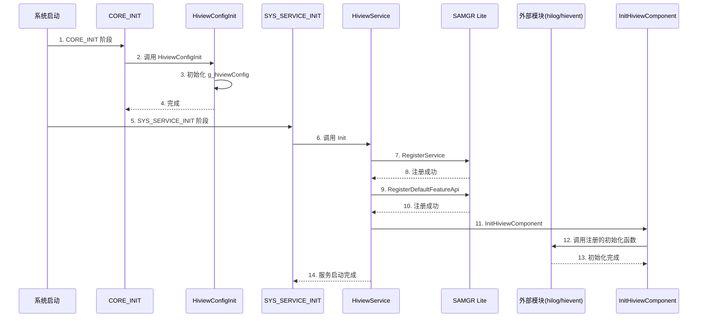

# 编译产物

## 目的

本文档描述 HiView Lite 的编译产物，包括产物清单、安装路径和运行时加载关系。

## 适用范围

本文档适用于：
- 需要了解编译输出的工程师
- 需要集成的维护者
- 需要调试的集成方

## 相关跳转

- [GN Targets](06_GN_Targets.md) - 了解构建配置
- [常见问题](09_FAQ.md) - 了解构建问题

---

## 产物清单

### 主要产物

| 产物名称 | 类型 | 大小 | 说明 |
|----------|------|------|------|
| libhiview_lite.a | 静态库 | ~10KB | HiView Lite 静态库 |
| hiview_lite_config.h | 头文件 | 小 | 配置头文件（导出） |

### 源文件产物

每个 .c 源文件会生成对应的 .o 目标文件：

| 源文件 | 目标文件 | 大小估算 |
|---------|----------|----------|
| hiview_cache.c | hiview_cache.o | ~2KB |
| hiview_config.c | hiview_config.o | ~1KB |
| hiview_file.c | hiview_file.o | ~3KB |
| hiview_service.c | hiview_service.o | ~2KB |
| hiview_util.c | hiview_util.o | ~2KB |

**总大小**：~10KB（与 bundle.json:34 中的 RAM 占用一致）

**证据来源**：
- BUILD.gn:40-72 - `static_library("hiview_lite_static")` 定义
- bundle.json:34 - RAM 占用 "~10KB"

---

## 安装路径

### 开发环境路径

**静态库路径**：
```
out/<board>/<product>/obj/base/hiviewdfx/hiview_lite/hiview_lite_static/libhiview_lite.a
```

**头文件路径**：
```
base/hiviewdfx/hiview_lite/*.h
```

**示例**：
```
out/hisilicon/hispark_taurus_standard/obj/base/hiviewdfx/hiview_lite/hiview_lite_static/libhiview_lite.a
```

### 目标设备路径

HiView Lite 是静态库，会被链接到系统镜像中，不会独立安装到文件系统。

**链接方式**：
- 系统启动时，HiView Lite 的代码和数据段会被加载到内存
- 静态库的符号会解析到对应的地址

**证据来源**：
- BUILD.gn:40 - `static_library("hiview_lite_static")`
- bundle.json:14 - `"name": "hiview_lite"`

---

## 运行时加载关系

### 加载时序



### 内存布局

| 区域 | 内容 | 大小 |
|------|------|------|
| 代码段（.text） | HiView Lite 代码 | ~5KB |
| 数据段（.data） | 已初始化的全局变量 | ~2KB |
| BSS 段（.bss） | 未初始化的全局变量 | ~3KB |
| 栈（.stack） | HiView 服务线程栈 | 4KB（可配置） |
| 总计 | - | ~14KB |

**证据来源**：
- bundle.json:33-34 - ROM 10KB, RAM ~10KB
- BUILD.gn:23 - `hiview_lite_stack_size = 4096`

---

## 链接依赖

### 依赖的库

| 库名 | 类型 | 说明 |
|------|------|------|
| libliteos_m.a | 静态库 | LiteOS-M 内核 |
| libutils_lite.a | 静态库 | Utils Lite 工具库 |
| libbounds_checking_function.a | 静态库 | 边界检查函数库 |

**证据来源**：
- bundle.json:36-42 - 依赖定义

### 依赖的模块

| 模块 | 类型 | 说明 |
|------|------|------|
| SAMGR Lite | 系统服务 | 服务管理器 |
| Hilog Lite | 系统服务 | 日志服务 |
| HiEvent Lite | 系统服务 | 事件服务 |

**证据来源**：
- BUILD.gn:32-35 - include_dirs 定义

---

## 符号导出

### 导出的函数

所有在头文件中声明的函数都会被导出：

| 头文件 | 导出函数数量 | 说明 |
|---------|--------------|------|
| hiview_service.h | 3 | HiviewRegisterInitFunc, HiviewRegisterMsgHandle, HiviewSendMessage |
| hiview_config.h | 1 | HiviewConfigInit |
| hiview_cache.h | 6 | InitHiviewStaticCache, InitHiviewCache, WriteToCache, ReadFromCache, PrereadFromCache, DiscardCacheData, DestroyCache |
| hiview_file.h | 10 | InitHiviewFile, WriteFileHeader, ReadFileHeader, WriteToFile, ReadFromFile, GetFileUsedSize, GetFileFreeSize, CloseHiviewFile, ProcFile, RegisterFileWatcher, UnRegisterFileWatcher |
| hiview_util.h | 17 | 所有工具函数 |

**证据来源**：
- BUILD.gn:40-72 - `static_library("hiview_lite_static")` 包含的源文件
- 各 .h 头文件 - 函数声明

### 导出的变量

| 变量 | 类型 | 说明 |
|------|------|------|
| g_hiviewConfig | extern HiviewConfig | 全局配置变量 |

**证据来源**：
- hiview_config.h:97 - `extern HiviewConfig g_hiviewConfig;`
- hiview_config.c:19-27 - 变量定义

---

## 运行时行为

### 初始化时机

HiView Lite 的初始化分为两个阶段：

1. **CORE_INIT 阶段**（优先级 0）
   - 触发时机：系统内核初始化早期
   - 执行内容：初始化配置
   - 资源状态：内存管理和文件系统未完全启动

2. **SYS_SERVICE_INIT 阶段**
   - 触发时机：系统服务初始化阶段
   - 执行内容：注册服务、初始化组件
   - 资源状态：内存管理和文件系统已启动

**证据来源**：
- hiview_config.c:37 - `CORE_INIT_PRI(HiviewConfigInit, 0)`
- hiview_service.c:51 - `SYS_SERVICE_INIT(Init)`

### 运行时行为

HiView Lite 服务启动后，会持续运行在独立线程中：

1. **消息循环** - 等待 SAMGR Lite 消息
2. **消息处理** - 调用注册的消息处理函数
3. **文件操作** - 处理日志/事件文件读写
4. **缓存管理** - 管理循环缓冲区

**证据来源**：
- hiview_service.c:75-86 - `MessageHandle` 实现
- hiview_service.c:88-93 - `GetTaskConfig` 定义线程配置

---

## 关键结论

1. **静态库输出** - HiView Lite 编译为静态库，链接到系统镜像。
2. **轻量级设计** - ROM 占用 10KB，RAM 占用 ~10KB。
3. **分阶段初始化** - CORE_INIT 和 SYS_SERVICE_INIT 两个阶段满足不同资源需求。
4. **符号导出** - 导出所有公开的函数和变量。
5. **线程运行** - 服务运行在独立线程中，由 SAMGR Lite 管理。

---

*最后更新：2026-02-06*
