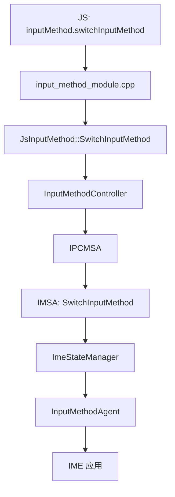
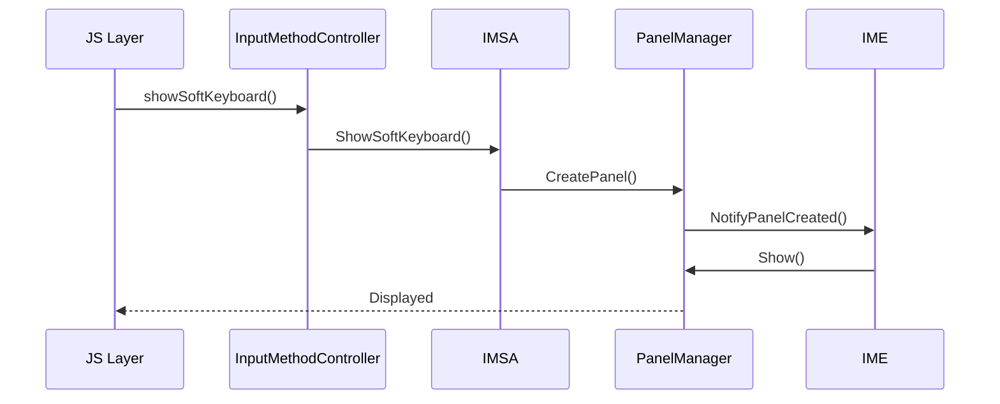
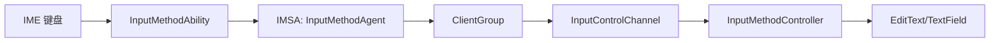
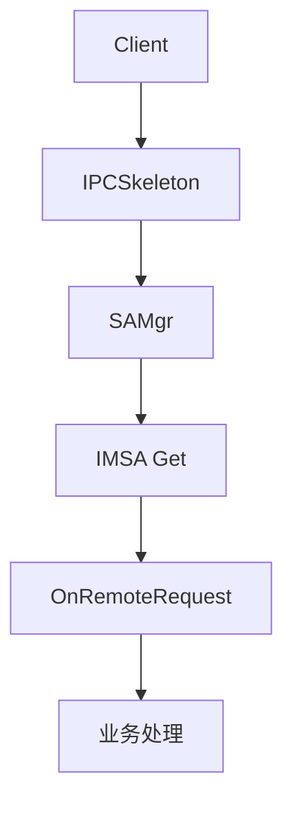
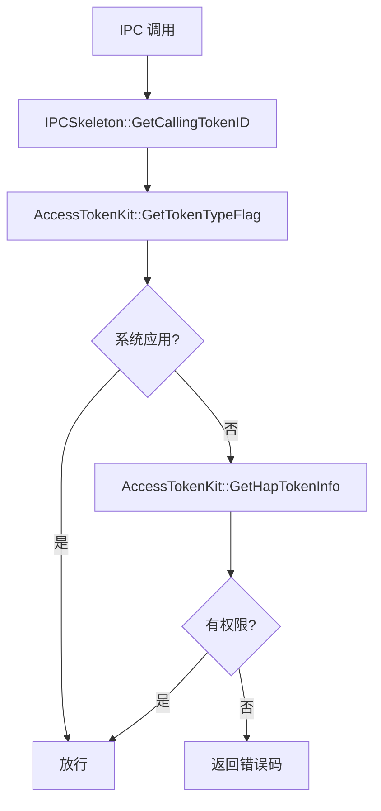
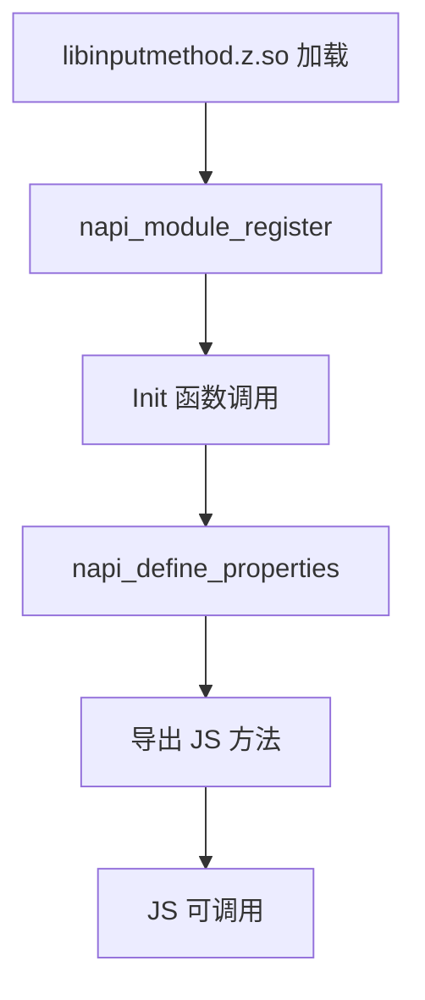

# 关键调用链

## 概述

本文档描述输入法框架中的关键调用链，包括 JS 到 Native 的调用路径、IPC 通信流程等。

## 1. 输入法切换调用链

### 流程图



### 调用序列

```
JS Layer
    |
    ▼
frameworks/js/napi/inputmethodclient/js_input_method.cpp:36
    |
    ▼
JsInputMethod::SwitchInputMethod(napi_env env, napi_value argv)
    |
    ▼
InputMethodController::SwitchInputMethod(SwitchTrigger, name, subName)
    |
    ▼
services/src/input_method_system_ability.cpp:...
    |
    ▼
ImeStateManager::SwitchInputMethod(...)
    |
    ▼
IInputMethodAgent::SwitchInputMethod(...)
```

### 代码位置

| 步骤 | 文件路径 | 行号 |
|------|----------|------|
| JS 调用 | `frameworks/js/napi/inputmethodclient/js_input_method.cpp` | 36 |
| N-API 绑定 | `frameworks/js/napi/inputmethodclient/js_input_method.cpp` | 49 |
| 控制器 | `frameworks/native/inputmethod_controller/src/input_method_controller.cpp` | - |
| 服务入口 | `services/src/input_method_system_ability.cpp` | - |
| 状态管理 | `services/src/ime_state_manager.cpp` | - |

## 2. 软键盘显示调用链

### 流程图



### 代码位置

| 步骤 | 文件路径 | 行号 |
|------|----------|------|
| JS 调用 | `frameworks/js/napi/inputmethodclient/js_get_input_method_controller.cpp` | 93 |
| 控制器 | `frameworks/native/inputmethod_controller/src/input_method_controller.cpp` | - |
| 服务 | `services/src/input_method_system_ability.cpp` | - |
| 面板管理 | `services/src/input_method_panel.cpp` | - |
| 窗口适配 | `services/adapter/window_adapter/` | - |

## 3. 文本输入调用链

### 流程图



### 调用序列

```
IME 应用
    |
    ▼
InputMethodAbility::InsertText(...)
    |
    ▼
IInputMethodAgent::InsertText(...)
    |
    ▼
services/src/input_method_system_ability.cpp
    |
    ▼
ClientGroup::DispatchText(...)
    |
    ▼
InputControlChannel::InsertText(...)
    |
    ▼
InputMethodController::OnTextChangedListener::InsertText(...)
```

### 代码位置

| 步骤 | 文件路径 |
|------|----------|
| IME | `frameworks/native/inputmethod_ability/` |
| Agent | `services/src/input_method_agent.cpp` |
| Service | `services/src/input_method_system_ability.cpp` |
| Channel | `services/src/input_control_channel_service_impl.cpp` |
| Controller | `frameworks/native/inputmethod_controller/` |

## 4. IPC 通信调用链

### SAMgr 调用



### 关键接口

| 接口 | 描述 | 文件位置 |
|------|------|----------|
| `IInputMethodSystemAbility` | IPC 接口定义 | `services/include/iinput_method_system_ability.h` |
| `InputMethodSystemAbilityStub` | IPC 存根 | `services/src/input_method_system_ability_stub.cpp` |
| `InputMethodSystemAbilityProxy` | IPC 代理 | `services/src/input_method_system_ability_proxy.cpp` |

### MessageCode

| Code | 操作 |
|------|------|
| `CMD_START_INPUT` | 启动输入 |
| `CMD_STOP_INPUT` | 停止输入 |
| `CMD_SHOW_CURRENT_INPUT` | 显示键盘 |
| `CMD_HIDE_CURRENT_INPUT` | 隐藏键盘 |
| `CMD_DISPATCH_KEY_EVENT` | 分发按键事件 |

## 5. 权限校验调用链



### 关键代码

| 文件 | 行号 | 描述 |
|------|------|------|
| `services/src/input_method_system_ability.cpp` | 526 | `AccessTokenID tokenId = IPCSkeleton::GetCallingTokenID()` |
| `services/src/input_method_system_ability.cpp` | 1056 | `IMSA_HILOGE("not has connect ime ability permission!")` |
| `common/imf_hisysevent/src/imf_hisysevent_util.cpp` | 116 | `AccessTokenKit::GetTokenTypeFlag(tokenId)` |

## 6. N-API 注册流程



### 注册点清单

| 模块 | 文件 | 行号 |
|------|------|------|
| inputMethod | `frameworks/js/napi/inputmethodclient/input_method_module.cpp` | 47 |
| inputMethodList | `frameworks/js/napi/inputmethodlist/inputmethodlist.cpp` | 44 |
| panel | `frameworks/js/napi/inputmethodpanel/input_method_panel_module.cpp` | 44 |
| inputMethodEngine | `frameworks/js/napi/inputmethodability/input_method_engine_module.cpp` | 51 |
| keyboardPanelManager | `frameworks/js/napi/keyboardpanelmanager/keyboard_panel_manager_module.cpp` | 43 |

## 相关文档

- [架构说明](../01_Architecture.md)
- [N-API 接口](../02_N-API.md)
- [安全评审](../05_Security.md)
