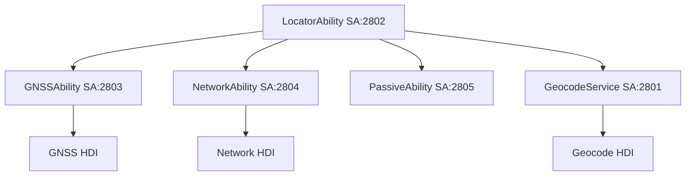
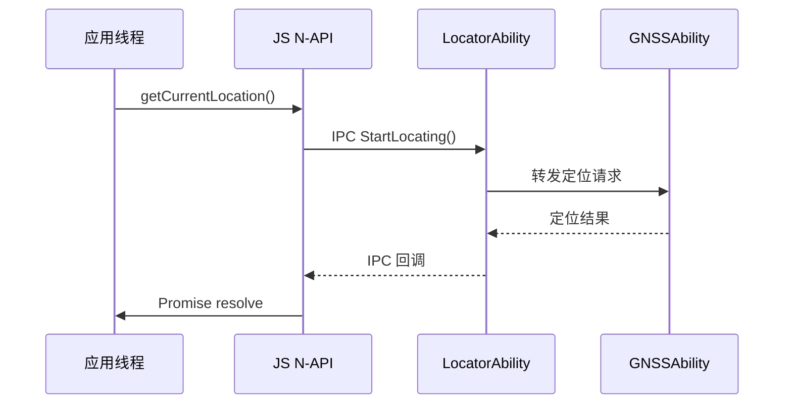
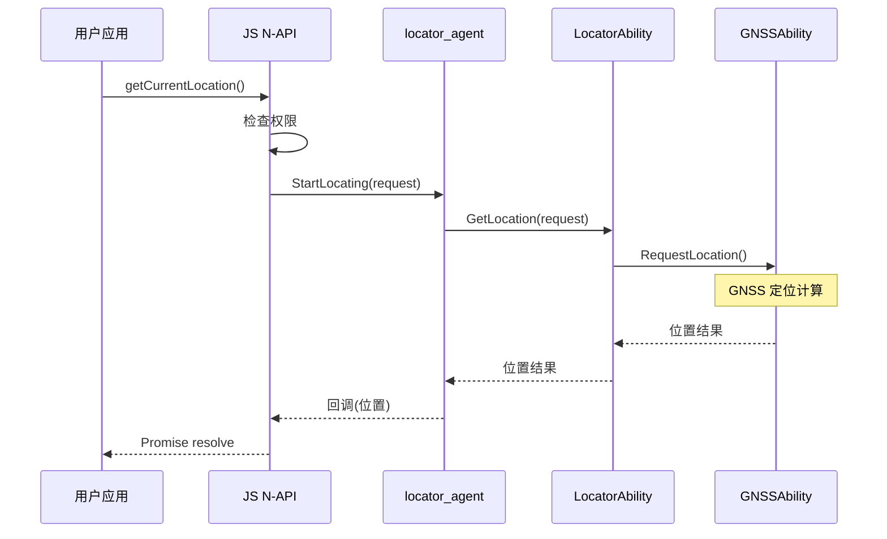
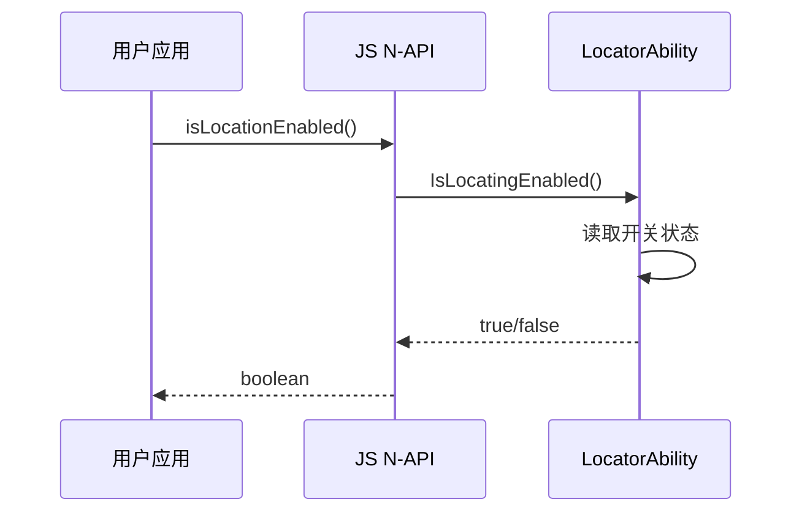

# OpenHarmony 位置服务系统架构

> **目的**: 详细说明位置服务组件的架构设计、组件关系、数据流和线程模型  
> **适用范围**: 架构师、框架开发者、需要深入理解内部实现的开发者  
> **最后更新**: 2026-02-05

---

## 1. 整体架构

### 1.1 架构图

```
┌─────────────────────────────────────────────────────────────────────────┐
│                           应用层 (Applications)                          │
│  ┌─────────────────────┐  ┌─────────────────────┐  ┌─────────────────┐  │
│  │     JS/ETS 应用     │  │    Native 应用      │  │   C/C++ 应用    │  │
│  └──────────┬──────────┘  └──────────┬──────────┘  └────────┬────────┘  │
└─────────────┼───────────────────────────┼─────────────────────┼──────────┘
              │                           │                     │
              ▼                           ▼                     ▼
┌─────────────────────────────────────────────────────────────────────────┐
│                          接口层 (Interfaces)                             │
│  ┌─────────────────────┐  ┌─────────────────────┐  ┌─────────────────┐  │
│  │   @ohos.geolocation │  │     C API (NDK)     │  │   Inner API     │  │
│  │   (JS N-API)        │  │   (oh_location.h)   │  │   (Native SDK)  │  │
│  └──────────┬──────────┘  └──────────┬──────────┘  └────────┬────────┘  │
│             │                        │                       │           │
│  frameworks/js/napi     interfaces/c_api       frameworks/native/locator_sdk
└─────────────┼───────────────────────────┼─────────────────────┼──────────┘
              │                           │                     │
              ▼                           │                     ▼
┌─────────────────────────────────────────┼───────────────────────────────┐
│                           框架层 (Frameworks)                            │
│  ┌─────────────────────────────────────────────────────────────────┐    │
│  │                    location_common (公共框架)                    │    │
│  │  ┌─────────────┐ ┌─────────────┐ ┌─────────────┐ ┌───────────┐ │    │
│  │  │ permission  │ │ background  │ │   request   │ │ location  │ │    │
│  │  │  manager    │ │  manager    │ │  manager    │ │   data    │ │    │
│  │  └─────────────┘ └─────────────┘ └─────────────┘ └───────────┘ │    │
│  └─────────────────────────────────────────────────────────────────┘    │
│             │                        │                       │           │
│             ▼                        ▼                       ▼           │
│  ┌─────────────────────┐  ┌─────────────────────┐  ┌─────────────────┐  │
│  │   locator_agent     │  │   geofence_sdk      │  │  location_ndk   │  │
│  └─────────────────────┘  └─────────────────────┘  └─────────────────┘  │
└─────────────────────────────────────────────────────────────────────────┘
              │
              ▼
┌─────────────────────────────────────────────────────────────────────────┐
│                          SA 服务层 (Services)                            │
│  ┌─────────────────────────────────────────────────────────────────┐    │
│  │                      locationhub 进程                            │    │
│  │  ┌─────────┐ ┌─────────┐ ┌─────────┐ ┌─────────┐ ┌─────────┐   │    │
│  │  │Locator  │ │  GNSS   │ │Network  │ │Passive  │ │Geocode  │   │    │
│  │  │Ability  │ │Ability  │ │Ability  │ │Ability  │ │Service  │   │    │
│  │  │  SA:2802│ │  SA:2803│ │  SA:2804│ │  SA:2805│ │ SA:2801 │   │    │
│  │  └────┬────┘ └────┬────┘ └────┬────┘ └────┬────┘ └────┬────┘   │    │
│  └───────┼───────────┼───────────┼───────────┼───────────┼────────┘    │
│          │           │           │           │           │              │
└──────────┼───────────┼───────────┼───────────┼───────────┼──────────────┘
           │           │           │           │           │
           ▼           ▼           ▼           ▼           ▼
┌─────────────────────────────────────────────────────────────────────────┐
│                         HAL/HDI 层 (Hardware)                            │
│  ┌─────────────┐ ┌─────────────┐ ┌─────────────┐ ┌───────────────────┐  │
│  │ GNSS HDI    │ │ Network HDI │ │ Geofence    │ │ Other HW Services │  │
│  │             │ │             │ │ HDI         │ │                   │  │
│  └─────────────┘ └─────────────┘ └─────────────┘ └───────────────────┘  │
└─────────────────────────────────────────────────────────────────────────┘
```

### 1.2 架构分层说明

| 层级 | 组件 | 职责 |
|------|------|------|
| 应用层 | JS/ETS/Native/C | 发起定位请求，处理位置结果 |
| 接口层 | JS N-API / C API / Inner API | 对外暴露能力，屏蔽实现细节 |
| 框架层 | location_common / locator_sdk | 业务逻辑编排，权限管理，请求调度 |
| 服务层 | 5 个 SA | 实际定位逻辑，IPC 通信，硬件交互 |
| HAL/HDI | GNSS/Network/Geofence | 硬件抽象，与驱动交互 |

---

## 2. SA 服务详解

### 2.1 服务列表

| SA ID | 服务名 | 进程 | 库文件 | 职责 |
|-------|--------|------|--------|------|
| 2801 | Geocode | locationhub | `liblbsservice_geocode.z.so` | 地理编码（坐标↔地址） |
| 2802 | Locator | locationhub | `liblbsservice_locator.z.so` | 主定位器，权限检查，请求分发 |
| 2803 | GNSS | locationhub | `liblbsservice_gnss.z.so` | GNSS 定位，卫星数据 |
| 2804 | Network | locationhub | - | 网络定位（基站/WLAN/蓝牙） |
| 2805 | Passive | locationhub | - | 被动定位（共享位置） |

> 证据: `sa_profile/*.json`

### 2.2 服务依赖关系



### 2.3 服务注册模式

所有 SA 使用统一的注册模式：

```cpp
// 文件: services/location_locator/locator/source/locator_ability.cpp:74-75
const bool REGISTER_RESULT = SystemAbility::MakeAndRegisterAbility(
    LocatorAbility::GetInstance());
```

**注册流程**:
1. 继承 `SystemAbility` 基类
2. 实现 `MakeAndRegisterAbility` 工厂方法
3. 在 `OnStart()` 中初始化事件循环和消息处理

---

## 3. 数据流分析

### 3.1 定位请求数据流

```
1. 应用调用 API
   JS: geolocation.getCurrentLocation()
   C: OH_Location_StartLocating()
   
2. 接口层处理
   - 参数解析与校验
   - 权限检查
   - 转换为内部请求格式
   
3. 框架层处理
   - 创建请求上下文
   - 选择定位策略
   - 调度 SA 请求
   
4. SA 层处理
   - IPC 调用具体定位 SA
   - 等待定位结果
   - 缓存位置数据
   
5. 返回结果
   - 通过回调/Promise 返回
   - 转换为对应 API 格式
```

### 3.2 关键数据类

| 类名 | 职责 | 文件 |
|------|------|------|
| `Request` | 定位请求配置 | `interfaces/inner_api/include/request.h` |
| `RequestConfig` | 请求参数 | `interfaces/inner_api/include/request_config.h` |
| `Location` | 位置信息 | `interfaces/inner_api/include/location.h` |
| `Locator` | 定位器接口 | `interfaces/inner_api/include/locator.h` |
| `AppIdentity` | 应用身份 | `interfaces/inner_api/include/app_identity.h` |

---

## 4. 线程模型

### 4.1 线程划分

| 线程/Runner | 职责 | 位置 |
|-------------|------|------|
| Main UI Thread | JS 应用主线程 | 应用进程 |
| JS NAPI Thread | N-API 回调处理 | 框架层 |
| SA Event Runner | SA 消息处理 | locationhub 进程 |
| GNSS Event Runner | GNSS 定位线程 | locationhub 进程 |
| Database Thread | RDB 操作线程 | location_common |

### 4.2 线程通信



---

## 5. 权限与隐私

### 5.1 权限检查点

权限检查发生在以下位置：

| 检查点 | 文件 | 说明 |
|--------|------|------|
| API 入口 | `frameworks/js/napi/...` | JS API 权限检查 |
| 框架层 | `frameworks/location_common/common/source/permission_manager.cpp` | Native 权限检查 |
| SA 层 | `services/location_locator/locator/source/locator_ability.cpp` | IPC 权限验证 |

### 5.2 权限列表

| 权限名 | 说明 | 精度 |
|--------|------|------|
| `ohos.permission.APPROXIMATELY_LOCATION` | 粗略位置 | 城市级 |
| `ohos.permission.LOCATION` | 精确位置 | 设备级 |

> 证据: `interfaces/c_api/include/oh_location.h:73`

---

## 6. 关键时序图

### 6.1 定位请求时序



### 6.2 开关状态查询



---

## 7. 稳定性与容错

### 7.1 SA 生命周期管理

- **按需加载**: `run-on-create: false`，使用时才启动
- **低内存回收**: `recycle-strategy: low-memory`
- **快速卸载**: `location_feature_with_quick_unload`

### 7.2 错误处理

| 错误码 | 含义 | 处理策略 |
|--------|------|----------|
| 201 | 权限拒绝 | 提示用户授权 |
| 401 | 参数错误 | 检查输入参数 |
| 801 | 能力不支持 | 降级或提示 |
| 3301000 | 服务不可用 | 重试或提示 |
| 3301100 | 开关关闭 | 引导用户开启 |

> 证据: `interfaces/c_api/include/oh_location_type.h:48-76`

---

## 相关文档

| 文档 | 说明 |
|------|------|
| [概览](index.md) | 项目定位与核心能力 |
| [C/N-API 接口](02_C_NAPI.md) | C API 参考 |
| [JS API 接口](03_JS_API.md) | JS API 参考 |
| [内部 API](04_Inner_API.md) | 内部模块接口 |
| [安全风险评审](07_Security.md) | 安全分析 |

---

## 更新日志

| 日期 | 版本 | 变更 |
|------|------|------|
| 2026-02-05 | 1.0 | 初始版本 |
