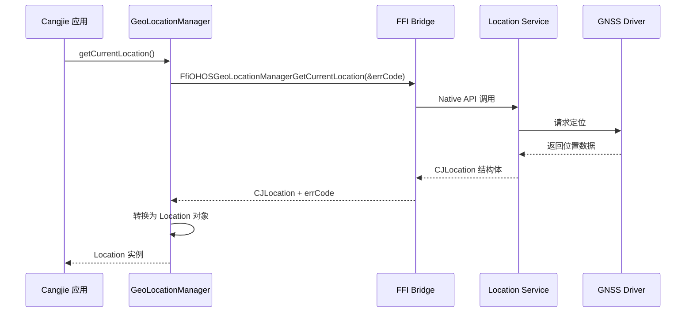
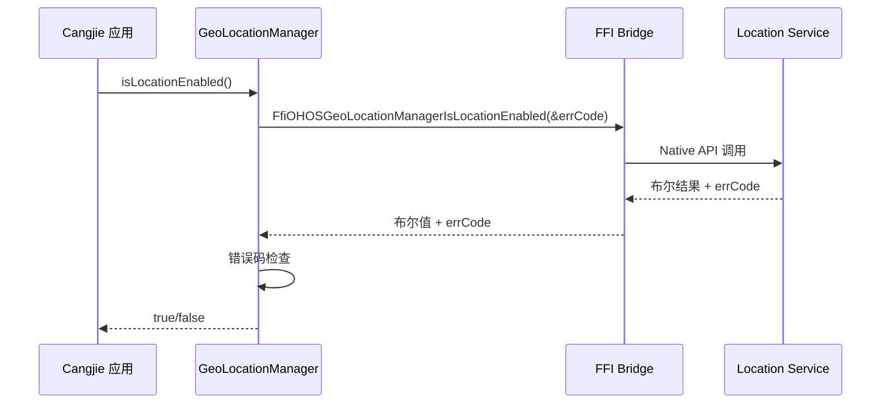

# 系统架构

> location_cangjie_wrapper 组件设计、数据流与线程模型

## 架构概述

### 整体架构图

```
┌─────────────────────────────────────────────────────────────────┐
│                     Application Layer (Cangjie)                  │
│                                                                 │
│  ┌───────────────────────────────────────────────────────────┐  │
│  │               GeoLocationManager (Kit Layer)               │  │
│  │         kit/LocationKit/index.cj [package: kit.LocationKit]│  │
│  └───────────────────────────────────────────────────────────┘  │
│                              │                                  │
│                              ▼                                  │
│  ┌───────────────────────────────────────────────────────────┐  │
│  │            geo_location_manager (Framework Layer)          │  │
│  │    ohos/geo_location_manager/geo_location_manager.cj       │  │
│  └───────────────────────────────────────────────────────────┘  │
│                              │                                  │
│         ┌────────────────────┼────────────────────┐            │
│         ▼                    ▼                    ▼            │
│  ┌─────────────┐    ┌─────────────────┐    ┌─────────────────┐  │
│  │ FFI Bridge  │    │   Error Handle  │    │    Logging      │  │
│  │ (ffi.cj)    │    │  (common.cj)   │    │  (hilog)        │  │
│  └─────────────┘    └─────────────────┘    └─────────────────┘  │
│                              │                                  │
└──────────────────────────────┼──────────────────────────────────┘
                               │
                               ▼
┌─────────────────────────────────────────────────────────────────┐
│                    FFI Boundary (C/C++)                          │
│                                                                 │
│  ┌───────────────────────────────────────────────────────────┐  │
│  │         cj_geolocationmanager_ffi (location 组件)           │  │
│  │                   C++ FFI 实现                            │  │
│  └───────────────────────────────────────────────────────────┘  │
│                              │                                  │
└──────────────────────────────┼──────────────────────────────────┘
                               │
                               ▼
┌─────────────────────────────────────────────────────────────────┐
│                   Native Services Layer                          │
│                                                                 │
│  ┌───────────────────────────────────────────────────────────┐  │
│  │              Location Service (GNSS Driver)                │  │
│  │     base_location/sa_locatoin_manager/*.cpp/cpp            │  │
│  └───────────────────────────────────────────────────────────┘  │
│                                                                 │
│  ┌───────────────────────────────────────────────────────────┐  │
│  │                 System Ability Manager                     │  │
│  └───────────────────────────────────────────────────────────┘  │
└─────────────────────────────────────────────────────────────────┘
```

### 架构分层说明

| 层级 | 组件 | 职责 | 代码位置 |
|------|------|------|----------|
| **应用层** | GeoLocationManager | 提供 Cangjie 公开 API | `kit/LocationKit/index.cj` |
| **框架层** | geo_location_manager | 实现封装逻辑、类型转换、错误处理 | `ohos/geo_location_manager/*.cj` |
| **FFI 层** | cj_geolocationmanager_ffi | C/C++ 互操作桥梁 | 依赖 `location:cj_geolocationmanager_ffi` |
| **服务层** | Location Service | 底层定位能力（GNSS） | `base_location` 仓库 |

## 组件职责

### 1. Kit Layer（kit/LocationKit）

**职责**：模块导出入口，提供统一的包命名空间。

| 文件 | 职责 | 代码证据 |
|------|------|----------|
| `index.cj` | 导出 ohos.geo_location_manager 包 | `index.cj:18` |

```cj
// kit/LocationKit/index.cj:18-20
package kit.LocationKit

public import ohos.geo_location_manager.*
```

### 2. Framework Layer（ohos/geo_location_manager）

**职责**：核心业务逻辑实现，包括：

| 文件 | 职责 | 关键内容 |
|------|------|----------|
| `geo_location_manager.cj` | GeoLocationManager 类实现 | API 方法、Ffi 调用 |
| `geo_location_manager_common.cj` | 公共类型与错误处理 | Location 类、枚举、错误码 |
| `geo_location_manager_ffi.cj` | FFI 绑定定义 | C 结构体、外部函数声明 |

### 3. Mock Layer（mock/）

**职责**：跨平台编译支持，提供 Mock 实现。

| 文件 | 适用平台 | 说明 |
|------|----------|------|
| `ohos.geo_location_manager.cj` | Windows/Mac | 返回默认值的 Mock 类 |

证据来源：`ohos/geo_location_manager/BUILD.gn:20-28`

## 数据流分析

### 位置获取流程



### 位置开关检查流程



## 线程模型

### 线程安全设计

| API | 线程模型 | 说明 |
|-----|----------|------|
| `getCurrentLocation()` | `workerthread: true` | 在工作线程执行，避免阻塞主线程 |
| `isLocationEnabled()` | 主线程 | 快速返回 |

证据来源：`geo_location_manager.cj:46-156` 中的 `@!APILevel` 注解

### 异步执行说明

`getCurrentLocation()` 方法通过 FFI 调用底层 C++ 实现，耗时操作（GPS 定位）在 Native 层异步执行，Cangjie 层通过 FFI 阻塞等待结果。

## 依赖关系

### 模块依赖

```
kit.LocationKit
    └── depends on: ohos.geo_location_manager

ohos.geo_location_manager
    ├── depends on: cangjie_ark_interop (ohos.ffi)
    ├── depends on: cangjie_ark_interop (ohos.labels)
    ├── depends on: cangjie_ark_interop (ohos.business_exception)
    ├── depends on: hiviewdfx_cangjie_wrapper (ohos.hilog)
    └── depends on: location (cj_geolocationmanager_ffi)
```

### 外部依赖组件

| 组件 | 用途 | 仓库来源 |
|------|------|----------|
| `cangjie_ark_interop` | FFI 基础、标签类、异常 | arkcompiler_cangjie_ark_interop |
| `hiviewdfx_cangjie_wrapper` | 日志输出 | hiviewdfx_cangjie_wrapper |
| `location` | C++ FFI 实现、定位服务 | base_location |

证据来源：`ohos/geo_location_manager/BUILD.gn:30-37`

## 错误处理机制

### 错误码映射

| 原始错误码 | 映射后错误码 | 含义 |
|------------|--------------|------|
| -1 (MEMORY_ERROR) | 3301000 | 位置服务不可用 |
| 3301000 | 3301000 | 位置服务不可用 |
| 3301100 | 3301100 | 位置开关关闭 |
| 3301200 | 3301200 | 获取地理位置失败 |

证据来源：`geo_location_manager_common.cj:543-550`

### 异常抛出

所有 API 方法（除 `isLocationEnabled`）均声明 `throwexception: true`，失败时抛出 `BusinessException`。

```cj
// geo_location_manager.cj:56-60
try {
    if (errCode != SUCCESS_CODE) {
        throw BusinessException(getErrorCode(errCode), getErrorMsg(errCode))
    }
    // ...
}
```

## 日志系统

### 日志通道配置

| 配置项 | 值 |
|--------|-----|
| 域（Domain） | 0xD002300 |
| 核心日志级别 | LOG_CORE (3) |
| 标签（Tag） | CJ-GeoLocationManager |

证据来源：`geo_location_manager_common.cj:26-28`

### 日志使用示例

```cj
// geo_location_manager_common.cj:28
let GEO_LOCATION_MANAGER_LOG = HilogChannel(LOG_CORE, LOCATION_LOG_DOMAIN, "CJ-GeoLocationManager")

// 使用示例
GEO_LOCATION_MANAGER_LOG.info("Get current location success")
```

## 接口稳定性

### 稳定接口（Public API）

| 接口 | 稳定性 | 证据 |
|------|--------|------|
| `GeoLocationManager.getCurrentLocation()` | 稳定 | `@!APILevel[public]` + 完整文档 |
| `GeoLocationManager.isLocationEnabled()` | 稳定 | `@!APILevel[public]` + 完整文档 |
| `Location` 类 | 稳定 | `@!APILevel[public]` + 完整文档 |

### 内部接口

| 接口 | 稳定性 | 证据 |
|------|--------|------|
| `PoiInfo` | 内部 | `@!Hide[isChecked: true]` |
| FFI 绑定函数 | 内部 | `foreign` 声明，仅框架层使用 |

证据来源：`geo_location_manager_common.cj:30-31`

## 相关文档

| 文档 | 说明 |
|------|------|
| [00_Overview](00_Overview.md) | 项目概览 |
| [02_API_Reference](02_API_Reference.md) | API 详细说明 |
| [03_Build](03_Build.md) | 构建配置 |
| [04_Security](04_Security.md) | 安全评审 |
