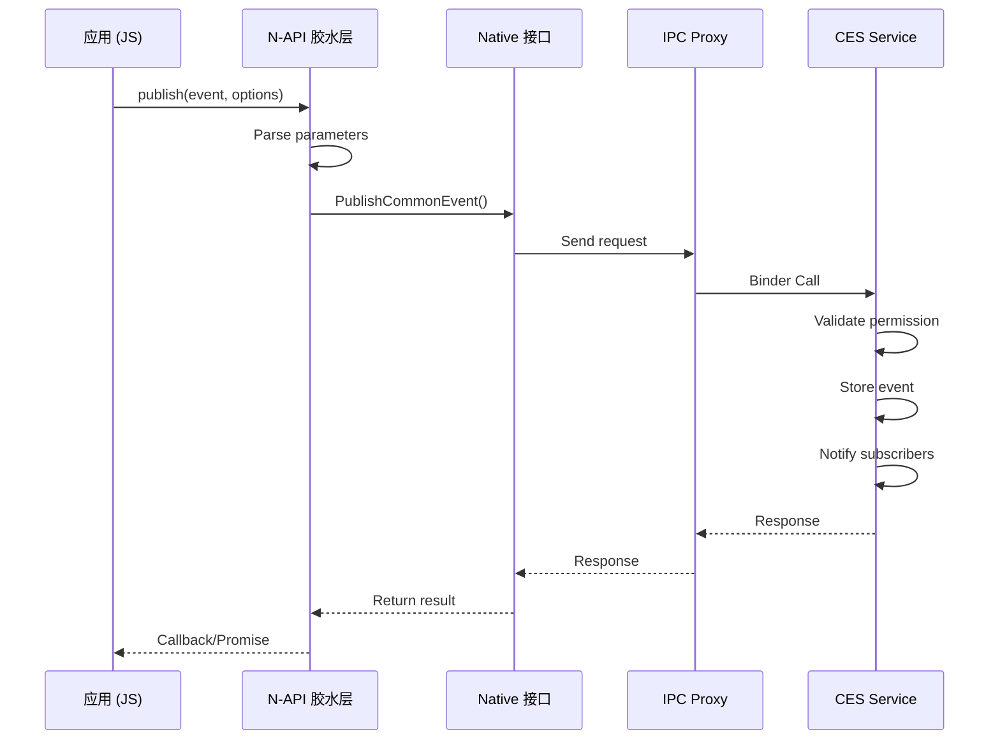
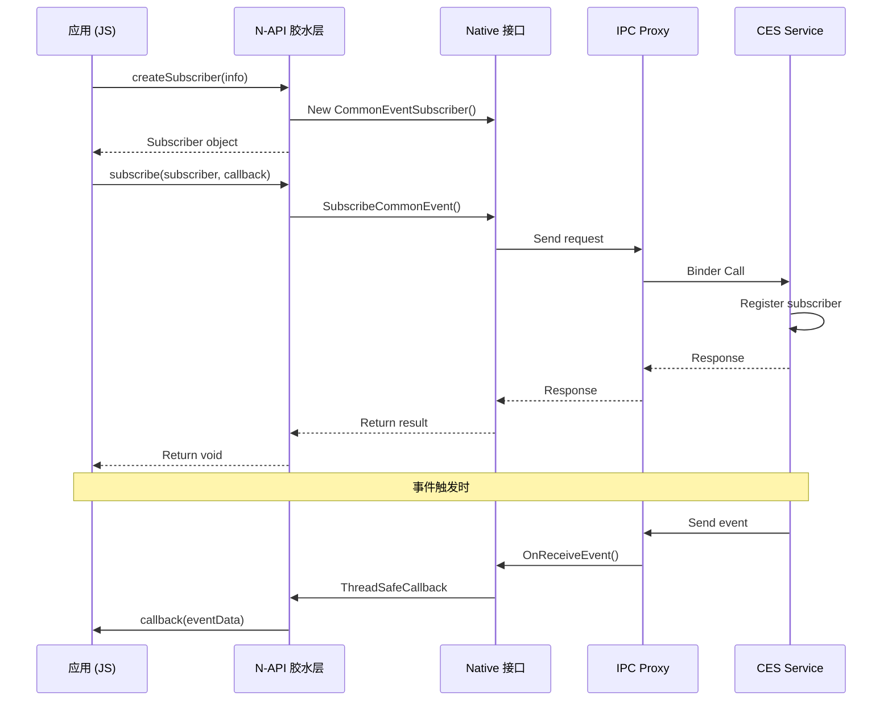

# 01_架构

## 架构概述

公共事件服务采用**分层架构**，从下到上依次为：

```
┌─────────────────────────────────────────────────────────┐
│                      应用层 (JS)                         │
│            @ohos.commonevent 模块接口                    │
├─────────────────────────────────────────────────────────┤
│                    N-API 胶水层                          │
│     interfaces/kits/napi/napi_common_event/             │
├─────────────────────────────────────────────────────────┤
│                    Native 接口层                         │
│         frameworks/native/ (CommonEventManager)          │
├─────────────────────────────────────────────────────────┤
│                    IPC 通信层                            │
│         frameworks/core/ (Proxy/Stub)                   │
├─────────────────────────────────────────────────────────┤
│                    服务实现层                            │
│              services/ (CommonEventManagerService)       │
├─────────────────────────────────────────────────────────┤
│                    系统能力层                            │
│              SAFwk (SA ID: 3299)                        │
└─────────────────────────────────────────────────────────┘
```

## 组件说明

### 1. N-API 胶水层

**位置**: `interfaces/kits/napi/`

| 组件 | 说明 |
|------|------|
| `napi_commoneventmanager` | 核心 N-API 实现库 |
| `commoneventmanager` | 包装库 |
| 关键文件 | `napi_common_event.cpp`, `common_event_parse.cpp` |

### 2. Native 接口层

**位置**: `frameworks/native/`

| 组件 | 说明 |
|------|------|
| `cesfwk_innerkits` | Native 套件库 |
| 关键类 | `CommonEventManager`, `CommonEventSubscriber`, `CommonEventData` |

### 3. IPC 通信层

**位置**: `frameworks/core/`

| 组件 | 说明 |
|------|------|
| `cesfwk_core` | 核心框架库 |
| IPC 接口 | `ICommonEvent`, `IEventReceive` |
| 代理/存根 | `common_event_proxy/stub`, `event_receive_proxy/stub` |

### 4. 服务实现层

**位置**: `services/`

| 组件 | 说明 |
|------|------|
| `cesfwk_services` | SA 服务实现 |
| 关键管理类 | `CommonEventControlManager`, `CommonEventSubscrberManager`, `PublishManager` |

## 数据流

### 事件发布流程

```
┌──────────┐     ┌──────────────┐     ┌──────────────────┐     ┌──────────────────┐
│  App     │────▶│  N-API       │────▶│  CommonEventManager │────▶│  SA Service      │
│ (JS)     │     │  (JS→C)      │     │  (Native)         │     │  (IPC)           │
└──────────┘     └──────────────┘     └──────────────────┘     └──────────────────┘
```

1. 应用调用 `CommonEvent.publish()`
2. N-API 胶水层解析参数
3. Native 接口层调用 IPC
4. SA 服务接收并处理发布请求

### 事件订阅流程

```
┌──────────┐     ┌──────────────┐     ┌──────────────────┐     ┌──────────────────┐
│  App     │────▶│  N-API       │────▶│  CommonEventManager │────▶│  SA Service      │
│ (JS)     │     │  (JS→C)      │     │  (Native)         │     │  (IPC)           │
└──────────┘     └──────────────┘     └──────────────────┘     └──────────────────┘
      │               │                    │                      │
      │               │                    │                      ▼
      │               │                    │              ┌──────────────────┐
      │               │                    │              │  Event Dispatch  │
      ▼               ▼                    ▼              └──────────────────┘
┌──────────┐   ┌──────────────┐     ┌──────────────────┐              │
│ Callback │◀──│  ThreadSafe  │◀────│  IPC Callback    │◀─────────────┘
└──────────┘   │  Callback    │     └──────────────────┘
               └──────────────┘
```

1. 应用创建订阅者并调用 `subscribe()`
2. SA 服务注册订阅者
3. 事件触发时，SA 通过 IPC 回调
4. N-API 层通过 `ThreadSafeCallback` 回调 JS

## 线程模型

### 关键线程

| 线程/队列 | 用途 |
|----------|------|
| SA 主线程 | SA 服务主循环，处理 IPC 请求 |
| FFRT 队列 | 异步任务处理 |
| EventHandler | 事件循环 |
| UV 线程池 | N-API 回调线程 |

### 线程安全

| 组件 | 线程安全机制 |
|------|-------------|
| N-API | `ThreadSafeCallback`, `napi_handle_scope` |
| Native | `std::mutex`, `std::shared_ptr` |
| IPC | Binder 驱动保证 |

## IPC 接口

### ICommonEvent (服务端接口)

**定义文件**: `frameworks/core/ICommonEvent.idl`

| 方法 | 说明 |
|------|------|
| PublishCommonEvent | 发布公共事件 |
| SubscribeCommonEvent | 订阅公共事件 |
| UnsubscribeCommonEvent | 取消订阅 |
| GetStickyCommonEvent | 获取粘性事件 |
| Freeze | 冻结应用 |
| Unfreeze | 解冻应用 |

### IEventReceive (订阅者回调接口)

**定义文件**: `frameworks/core/IEventReceive.idl`

| 方法 | 说明 |
|------|------|
| OnReceiveEvent | 接收事件回调 |
| OnSubscriberDied | 订阅者死亡通知 |

## 关键时序

### 事件发布时序



### 事件订阅时序



## 扩展组件

### 静态订阅者扩展

**位置**: `frameworks/extension/`

静态订阅者是应用声明式配置的订阅者，在特定事件发生时自动触发：

| 组件 | 说明 |
|------|------|
| `static_subscriber_extension` | 静态订阅者扩展 |
| `static_subscriber_ipc` | 静态订阅者 IPC 通信 |
| `static_subscriber_proxy` | 静态订阅者代理 |

### 配置方式

静态订阅者通过 `module.json` 配置：

```json
{
  "extensionAbilities": [
    {
      "name": "StaticSubscriber",
      "type": "staticSubscriber",
      "metadata": {
        "name": "StaticSubscriber",
        "resource": "$profile:static_subscribers"
      }
    }
  ]
}
```

## 相关文档

- [概览](00_Overview.md)
- [N-API 接口](02_N-API.md)
- [内部 API](03_Inner_API.md)
