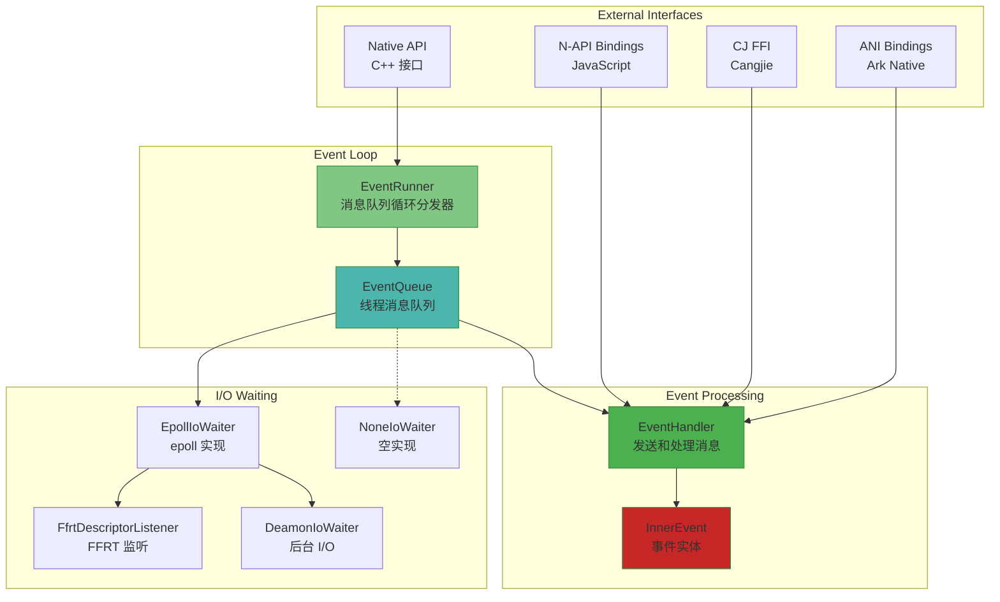
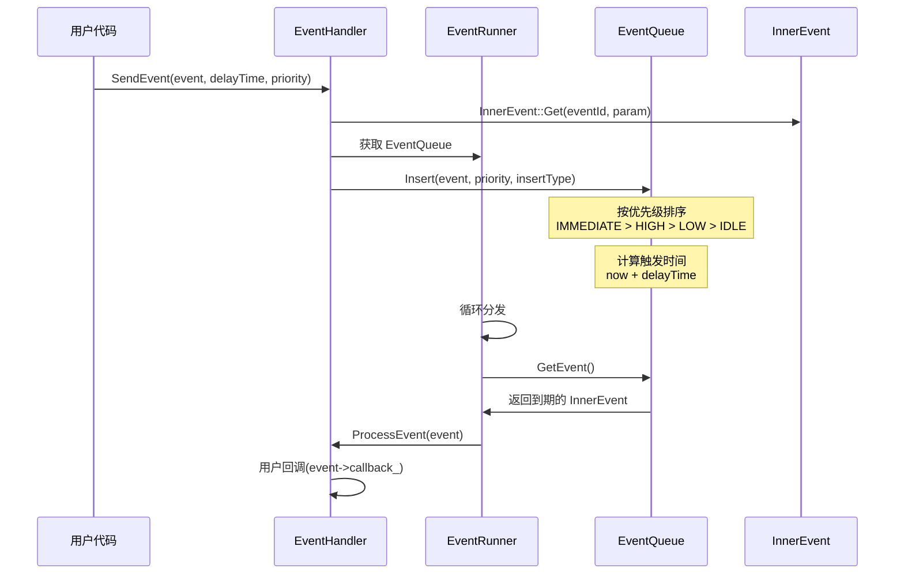
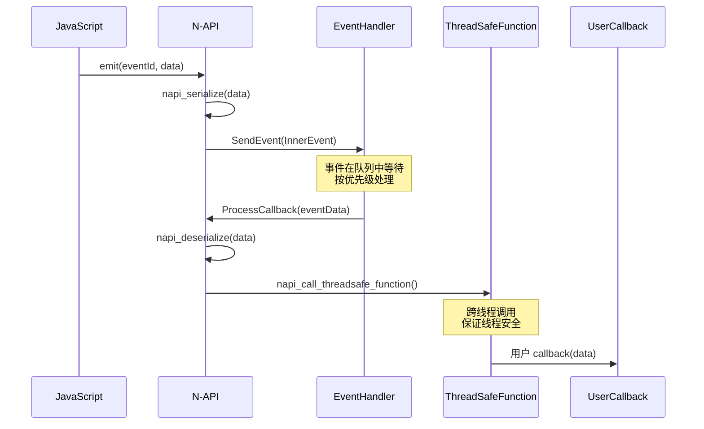
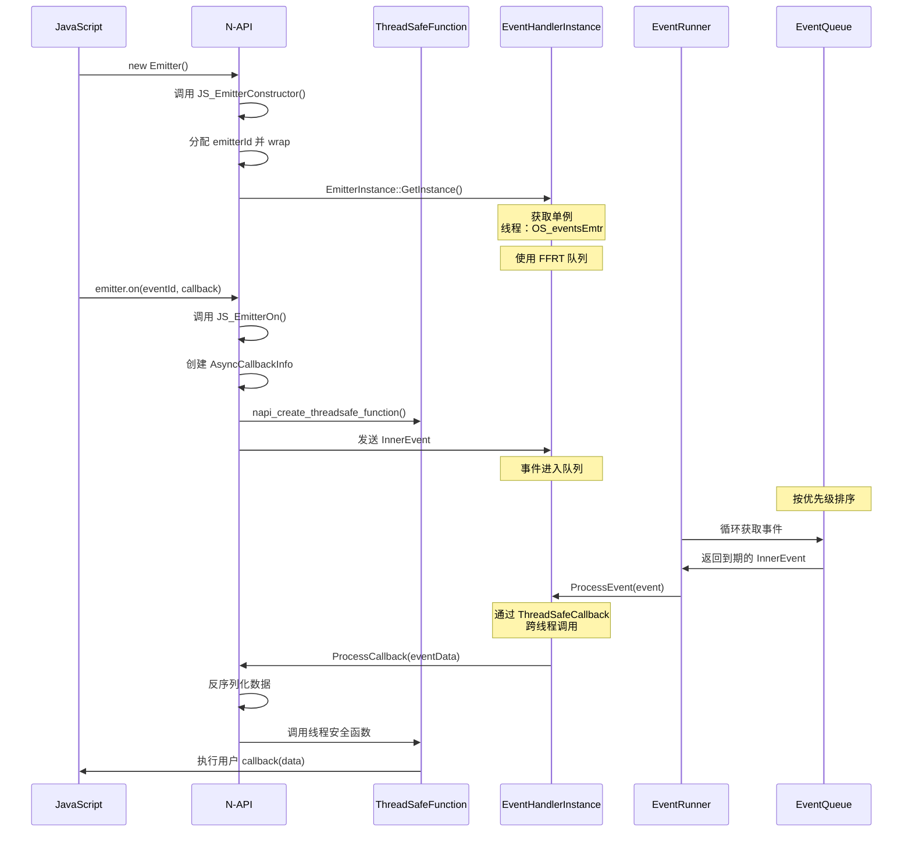

# 架构说明

## 目的

本文档详细说明 EventHandler 部件的架构设计、组件关系、数据流、线程模型和关键时序。

## 适用范围

- 核心组件：EventRunner、EventHandler、InnerEvent、EventQueue
- 线程模型：NEW_THREAD 和 FFRT
- I/O 等待：Epoll、FFRT、Daemon

## 组件架构图

### 核心组件关系



## 数据流

### 事件发送流程

**代码证据**：
- `EventHandler::SendEvent()` - `interfaces/inner_api/event_handler.h:81`
- `EventQueue::Insert()` - `frameworks/eventhandler/src/event_queue.cpp`



### 事件触发与回调流程

**代码证据**：
- `JS_Emit()` - `frameworks/napi/src/events_emitter.cpp:965`
- `ThreadSafeCallback()` - `frameworks/napi/src/events_emitter.cpp:140`
- `EventHandler::DistributeEvent()` - `frameworks/eventhandler/src/event_handler.cpp:491`



## 线程模型

### EventRunner 线程模式

**代码证据**：
- `ThreadMode` 枚举 - `interfaces/inner_api/event_runner.h:36`
- `EventRunner::Create()` - `frameworks/eventhandler/src/event_runner.cpp:545`

#### ThreadMode::NEW_THREAD

创建新原生线程运行事件循环：

```cpp
EventRunner::Create(const std::string &threadName, ThreadMode threadMode, EventLockType lockType)
{
    return Create(threadName, Mode::DEFAULT, ThreadMode::NEW_THREAD, lockType);
}
```

**特点**：
- 使用 `std::thread` 创建新线程
- 线程命名（用于调试）
- 支持优先级继承锁（PRIORITY_INHERIT）

#### ThreadMode::FFRT

使用 FFRT（Flexible Function Runtime）队列：

```cpp
EventRunner::Create(const std::string &threadName, ThreadMode threadMode, EventLockType lockType)
{
    return Create(threadName, Mode::DEFAULT, ThreadMode::FFRT, lockType);
}
```

**特点**：
- 使用 FFRT 队列调度
- 支持优先级继承
- 更好的性能和资源利用率

**代码证据**：
- FFRT 检测：`ffrt_this_task_get_id()` - `frameworks/eventhandler/src/event_runner.cpp:779`
- FFRT 队列：`ffrt_queue` - `frameworks/eventhandler/src/event_queue_ffrt.cpp:74`

### 事件循环

**代码证据**：
- `EventRunner::Run()` - `frameworks/eventhandler/src/event_runner.cpp:693`
- `EventRunnerImpl::Run()` - `frameworks/eventhandler/src/event_runner.cpp:292`

```mermaid
sequenceDiagram
    participant Caller as 调用者
    participant ER as EventRunner
    participant EQ as EventQueue
    participant IO as IoWaiter
    participant EH as EventHandler

    Caller->>ER: Run()
    ER->>ER: innerRunner_->Run()
    ER->>EQ: 进入循环
    loop 循环:
        ER->>EQ: GetEvent(nextExpiredTime)
        EQ->>IO: WaitFor(lock, timeout)
        Note over IO: 等待 I/O 事件或超时
        IO->>IO: epoll_wait() 或 ffrt_queue_get()
        Note over IO: 或检查文件描述符
        alt 有事件:
            IO->>EQ: NotifyOne()
            EQ->>ER: 返回事件
        alt 超时:
            IO->>EQ: 返回超时
            EQ->>ER: 返回 null
        ER->>EQ: 分发事件到处理器
        ER->>EH: ProcessEvent(event)
    end
```

### 主线程 EventRunner

**代码证据**：
- `EventRunner::GetMainEventRunner()` - `frameworks/eventhandler/src/event_runner.cpp:835`
- `EventRunner::IsAppMainThread()` - `frameworks/eventhandler/src/event_runner.cpp:851`

```cpp
std::shared_ptr<EventRunner> EventRunner::GetMainEventRunner()
{
    if (!mainRunner_) {
#ifdef MAIN_RUNNER_PRIORITY_LOCK_ENABLE
        mainRunner_ = Create(false, Mode::DEFAULT, EventLockType::PRIORITY_INHERIT);
#else
        mainRunner_ = EventRunner::Create(false, Mode::DEFAULT, EventLockType::STANDARD);
#endif
    }
    return mainRunner_;
}
```

## 优先级机制

### 事件优先级

**代码证据**：
- `Priority` 枚举 - `interfaces/inner_api/event_queue.h:42`

| 优先级 | 值 | 描述 | 代码位置 |
|-------|-----|------|---------|
| IMMEDIATE | 0 | 立即处理，最高优先级 | event_queue.h:42 |
| HIGH | 1 | 高优先级 | event_queue.h:43 |
| LOW | 2 | 低优先级（默认） | event_queue.h:44 |
| IDLE | 3 | 空闲优先级，最低 | event_queue.h:45 |

**处理顺序**：IMMEDIATE > HIGH > LOW > IDLE

**代码证据**：
- 优先级比较：`frameworks/eventhandler/src/event_queue.cpp:161-200`

### FFRT 优先级映射

**代码证据**：
- `TransferInnerPriority()` - `frameworks/eventhandler/src/event_queue_ffrt.cpp:34`

```cpp
ffrt_inner_queue_priority_t TransferInnerPriority(EventQueue::Priority priority)
{
    switch (priority) {
        case Priority::IMMEDIATE:
            return ffrt_inner_queue_priority_t::ffrt_inner_queue_priority_immediate;
        case Priority::HIGH:
            return ffrt_inner_queue_priority_t::ffrt_inner_queue_priority_vip;
        case Priority::LOW:
            return ffrt_inner_queue_priority_t::ffrt_inner_queue_priority_high;
        case Priority::IDLE:
            return ffrt_inner_queue_priority_t::ffrt_inner_queue_priority_low;
        default:
            return ffrt_inner_queue_priority_t::ffrt_inner_queue_priority_idle;
    }
}
```

## I/O 等待机制

### IoWaiter 接口

**代码证据**：
- `IoWaiter` 接口定义 - `frameworks/eventhandler/include/io_waiter.h:45`

**方法**：
- `WaitFor(lock, nanoseconds, vsyncOnly)` - 等待 I/O 事件或超时
- `NotifyOne()` - 唤醒一个等待线程
- `NotifyAll()` - 唤醒所有等待线程
- `AddFileDescriptor(fd, events, listener, priority)` - 添加文件描述符监听
- `RemoveFileDescriptor(fd)` - 移除文件描述符监听
- `SupportListeningFileDescriptor()` - 是否支持文件描述符监听

### EpollIoWaiter 实现

**代码证据**：
- `EpollIoWaiter` 类定义 - `frameworks/eventhandler/include/epoll_io_waiter.h:35`

**内部结构**：
- `epollFd_` - epoll 文件描述符
- `awakenFd_` - 用于唤醒 epoll 的 eventfd
- `fileDescriptorMap_` - 文件描述符映射（fd → listener）
- `waitingCount_` - 等待计数（原子）

**初始化代码证据**：
- `EpollIoWaiter::Init()` - `frameworks/eventhandler/src/epoll_io_waiter.cpp:61`
- `epoll_create()` - 创建 epoll 实例（epoll_io_waiter.cpp:73）
- `eventfd()` - 创建唤醒 fd（epoll_io_waiter.cpp:81）

### FfrtDescriptorListener 实现

**代码证据**：
- `FfrtDescriptorListener` 类定义 - `frameworks/eventhandler/include/ffrt_descriptor_listener.h`

**功能**：将 FFRT 文件描述符事件转换为 EventHandler 事件

**方法**：
- `OnReadable(fd)` - 可读事件
- `OnWritable(fd)` - 可写事件
- `OnShutdown(fd)` - 关闭事件
- `OnException(fd)` - 异常事件

**代码证据**：
- 事件转换：`ConvertEvents()` - `frameworks/eventhandler/src/ffrt_descriptor_listener.cpp:62`

## 锁机制

### EventLockType 枚举

**代码证据**：
- `EventLockType` 定义 - `interfaces/inner_api/lock_base.h`

| 锁类型 | 描述 | 实现 |
|-------|------|------|
| STANDARD | 标准互斥锁 | `std::mutex`（StdLock） |
| PRIORITY_INHERIT | 优先级继承锁 | `PriorityInheritanceLock` |

**代码证据**：
- 锁初始化：`EventQueue::InitializeLocks()` - `frameworks/eventhandler/src/event_queue.cpp:62`

### 优先级继承锁

**代码证据**：
- `PriorityInheritanceLock` 类 - `frameworks/eventhandler/include/priority_inheritance_lock.h`

**特性**：
- 支持优先级继承
- 避免优先级反转
- 支持递归锁（可重入）

## 关键时序

### 事件完整处理时序



## 跨运行时支持

### N-API 到 ANI 互操作

**代码证据**：
- `EmitterEnhancedApi` 结构体 - `frameworks/napi/include/interops.h:18`

**支持的功能**：
- `JS_Off` / `JS_EmitterOff` - off 方法
- `JS_Emit` / `JS_EmitterEmit` - emit 方法
- `JS_GetListenerCount` / `JS_EmitterGetListenerCount` - getListenerCount 方法
- `ProcessEvent` - 处理事件（增强版本）
- `ProcessCallbackEnhanced` - 处理回调（增强版本）

**注册机制**：
- `EmitterEnhancedApiRegister::Register()` - `frameworks/napi/src/interops.cpp:25`
- 运行时检测：`GetEmitterEnhancedApiRegister().IsInit()` - `frameworks/napi/src/interops.cpp:37`

## 性能优化

### HiTrace 追踪

**代码证据**：
- `event_hitrace_meter_adapter.h` - 定义追踪适配器
- `DEH_HITRACE_METER_ENABLE` 编译标志

### HiChecker 检测

**代码证据**：
- `HAS_HICHECKER_NATIVE_PART` 编译标志
- 条件依赖：`eventhandler.gni:64`

## 相关跳转

- [N-API 接口](04_NAPI_API.md) - 详细的 API 参考
- [内部 API](05_Inner_API.md) - C++ 接口文档
- [项目概览](01_Overview.md) - 核心概念说明
