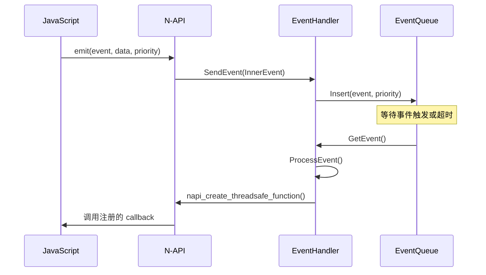
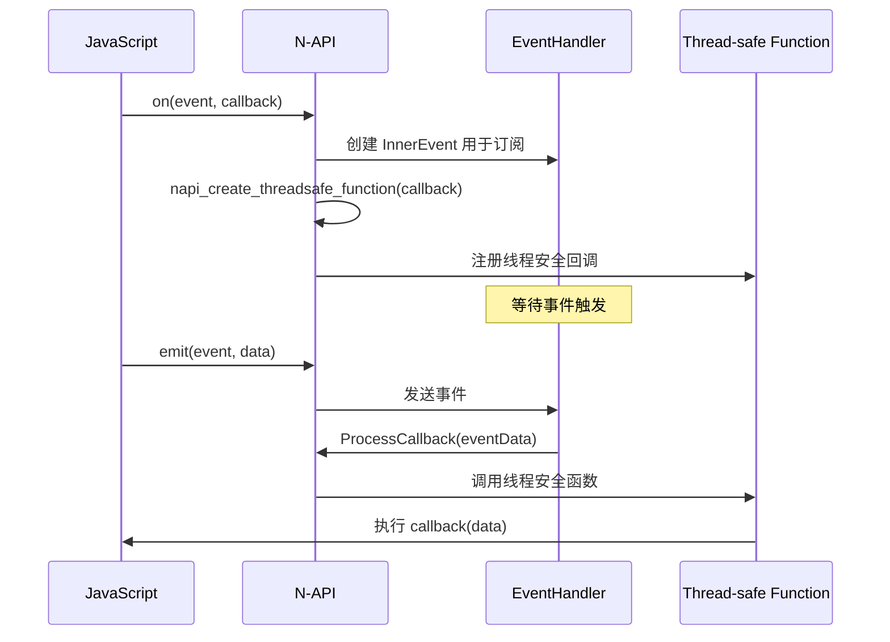

# N-API 接口文档

## 目的

本文档详细说明 EventHandler 部件对外暴露的 N-API (JavaScript Native API) 接口，包括 API 清单、参数、返回值、错误码和调用链。

## 适用范围

- **模块名**: `events.emitter`
- **运行时**: Node.js (N-API)
- **语言**: JavaScript / TypeScript
- **API 级别**: SystemCapability.Notification.Emitter

## N-API 模块注册

### 注册点

**文件**: `frameworks/napi/src/init.cpp`

**注册代码**：
```cpp
static napi_module _module = {
    .nm_version = 1,
    .nm_flags = 0,
    .nm_filename = nullptr,
    .nm_register_func = Init,       // 初始化函数
    .nm_modname = "events.emitter",  // 模块名
    .nm_priv = ((void *)0),
    .reserved = {0}
};

extern "C" __attribute__((constructor)) void RegisterModule(void)
{
    napi_module_register(&_module);
}
```

**代码证据**：
- 注册函数：`Init()` （init.cpp:22）
- 模块名：`"events.emitter"` （init.cpp:34）
- 注册宏：`napi_module_register` （init.cpp:41）

## 全局函数 API

### on(event, callback)

**功能**：订阅事件

**参数**：
- `event`: 事件标识（number 或 string）
- `callback`: 回调函数（当事件触发时调用）

**实现函数**: `JS_On()` → `OnOrOnce(env, cbinfo, false)` （events_emitter.cpp:475, 901）

**参数校验**：
```cpp
// 事件类型校验（number/string/object）
if (eventValueType != napi_object && eventValueType != napi_string) {
    HILOGD("type mismatch for parameter 1");
    return nullptr;
}
// 回调函数校验
if (GetNapiType(env, argv[1]) != napi_function) {
    HILOGD("OnOrOnce type mismatch for parameter 2");
    return nullptr;
}
```

**错误处理**：无返回值，失败时返回 `null`

**权限**：无特殊权限要求

### once(event, callback)

**功能**：一次性订阅事件，触发一次后自动移除

**参数**：
- `event`: 事件标识
- `callback`: 回调函数

**实现函数**: `JS_Once()` → `OnOrOnce(env, cbinfo, true)` （events_emitter.cpp:481, 907）

**代码证据**：
- once 标志设置：`callbackInfo->once = true` （events_emitter.cpp:889）

### off(event, callback?)

**功能**：取消订阅事件

**参数**：
- `event`: 事件标识（必选）
- `callback`: 要移除的回调函数（可选）

**实现函数**: `JS_Off()` （events_emitter.cpp:487）
- 增强 API：`JS_EmitterOff()` （events_emitter.cpp:913 / napi_emitter.cpp:268）

**参数校验**：
```cpp
// 事件类型校验
if (eventValueType != napi_string) {
    HILOGE("type mismatch for parameter 1");
    return nullptr;
}
// 回调函数类型校验（可选参数）
if (argc == ARGC_NUM) {
    napi_valuetype eventHandleType;
    napi_typeof(env, argv[1], &eventHandleType);
    if (eventHandleType != napi_function) {
        HILOGE("type mismatch for parameter 2");
        return nullptr;
    }
}
```

### emit(event, data, priority?)

**功能**：触发事件

**参数**：
- `event`: 事件标识（number 或 string 或 object）
- `data`: 事件数据（任意类型）
- `priority`: 优先级（可选，默认 LOW）

**实现函数**: `JS_Emit()` （events_emitter.cpp:683 / napi_emitter.cpp:315）

**优先级参数校验**：
```cpp
bool hasPriority = false;
napi_has_named_property(env, argv[0], "priority", &hasPriority);
if (hasPriority) {
    napi_get_named_property(env, argv[0], "priority", &value);
    uint32_t priorityValue = 0u;
    napi_get_value_uint32(env, value, &priorityValue);
    priority = static_cast<Priority>(priorityValue);
}
```

### getListenerCount(event)

**功能**：获取指定事件的监听器数量

**参数**：
- `event`: 事件标识（必选）

**实现函数**: `JS_GetListenerCount()` （events_emitter.cpp:765 / napi_emitter.cpp:347）

**返回值**: 监听器数量（number）

## Emitter 类方法 API

### constructor

**功能**：创建 Emitter 实例

**实现函数**: `JS_EmitterConstructor()` （events_emitter.cpp:825）

**代码证据**：
```cpp
uint32_t emitterId = GetNextEmitterInstanceId();
napi_wrap(env, thisArg, reinterpret_cast<void*>(emitterIdPtr),
    [](napi_env env, void* data, void* hint) {
        // 自动清理 emitter 实例
        DeleteEmitterInstance(emitterId);
    }, nullptr, nullptr);
```

### emitter.on(event, callback)

**功能**：订阅指定 emitter 实例的事件

**实现函数**: `JS_EmitterOn()` → `EmitterOnOrOnce(env, cbinfo, false)` （events_emitter.cpp:901）

**代码证据**：
- 事件 ID 组合：`compositeId.emitterId = emitterId` （events_emitter.cpp:874）

### emitter.once(event, callback)

**功能**：一次性订阅指定 emitter 实例的事件

**实现函数**: `JS_EmitterOnce()` → `EmitterOnOrOnce(env, cbinfo, true)` （events_emitter.cpp:907）

### emitter.off(event, callback?)

**功能**：取消订阅指定 emitter 实例的事件

**实现函数**: `JS_EmitterOff()` （events_emitter.cpp:913 / napi_emitter.cpp:268）

### emitter.emit(event, data, priority?)

**功能**：通过指定 emitter 实例触发事件

**实现函数**: `JS_EmitterEmit()` （events_emitter.cpp:965 / napi_emitter.cpp:315）

### emitter.getListenerCount(event)

**功能**：获取指定 emitter 实例事件的监听器数量

**实现函数**: `JS_EmitterGetListenerCount()` （events_emitter.cpp:986 / napi_emitter.cpp:347）

## EventPriority 枚举

### 静态属性

**代码证据**：`events_emitter.cpp:406-411`

```cpp
DECLARE_NAPI_STATIC_PROPERTY("IMMEDIATE", immediate),  // Priority::IMMEDIATE
DECLARE_NAPI_STATIC_PROPERTY("HIGH", high),            // Priority::HIGH
DECLARE_NAPI_STATIC_PROPERTY("LOW", low),              // Priority::LOW
DECLARE_NAPI_STATIC_PROPERTY("IDLE", idle),            // Priority::IDLE
```

**优先级顺序**：IMMEDIATE > HIGH > LOW > IDLE

## 参数序列化

### 序列化支持

**实现文件**：
- `napi_serialize.cpp` - N-API 版本
- `ani_serialize.cpp` - ANI 版本

**支持的数据类型**：
- 基本类型（number, string, boolean）
- 对象（通过属性访问）
- 数组（迭代处理）

**代码证据**：
- 序列化函数：`napi_deserialize()` / `napi_serialize_hybrid()` （events_emitter.cpp:94-104）

## 错误处理

### N-API 错误码

本模块不返回特定错误码，失败时返回 `null` 或 `undefined`。

### 日志错误码

使用 `HILOGD` / `HILOGE` / `HILOGW` 记录错误：

- `HILOGD` - 调试信息
- `HILOGE` - 错误信息
- `HILOGW` - 警告信息

## 异步回调机制

### Thread-safe Function

**代码证据**：`events_emitter.cpp:895`

```cpp
napi_create_threadsafe_function(env, argv[1], nullptr, resourceName, 0, 1, nullptr,
    ThreadFinished, nullptr, ThreadSafeCallback, &(callbackInfo->tsfn));
```

### 回调处理

**代码证据**：`events_emitter.cpp:79-129`

```cpp
void ProcessCallback(const EventDataWorker* eventDataInner)
{
    // 反序列化数据
    napi_value resultData = nullptr;
    if (eventDataInner->IsEnhanced) {
        // 增强版本
        GetEmitterEnhancedApiRegister().GetEnhancedApi()->ProcessCallbackEnhanced(eventDataInner);
    } else {
        // 标准版本：反序列化数据并调用回调
        napi_deserialize_hybrid(callbackInner->env, *(eventDataInner->data), &resultData);
    }
    // 调用 JS 回调
    napi_call_function(callbackInfo->env, nullptr, callback, 1, &event, &returnVal);
}
```

## 调用链

### 事件触发流程



### 事件订阅流程



## 相关跳转

- [架构说明](03_Architecture.md) - 理解内部事件分发流程
- [项目概览](01_Overview.md) - 了解核心概念
