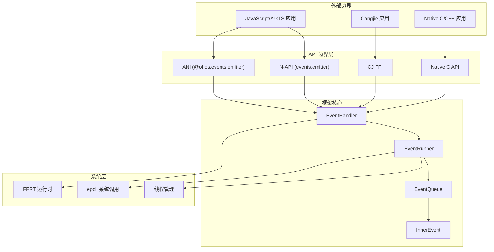

# 攻击面分析 (Attack Surface Analysis)

**文档目的**: 识别 EventHandler 的所有外部输入入口、敏感操作和信任边界，为安全评估提供基础。

**适用范围**: 安全研究员、代码审计人员

**关联文档**: [08_Security_Review.md](08_Security_Review.md)

---

## 1. 信任边界图



**信任边界说明**:
- **API 边界层**: 外部输入验证的第一道防线
- **框架核心**: 内部处理逻辑，假设输入已验证
- **系统层**: 敏感系统调用，需严格权限控制

---

## 2. 外部输入入口清单

### 2.1 N-API 接口 (JavaScript/TypeScript)

| 入口函数 | 位置 | 输入参数 | 风险等级 |
|---------|------|----------|----------|
| `JS_On()` | `frameworks/napi/src/events_emitter.cpp:475` | eventId (string/object), callback (function) | 中 |
| `JS_Once()` | `frameworks/napi/src/events_emitter.cpp:481` | eventId (string/object), callback (function) | 中 |
| `JS_Off()` | `frameworks/napi/src/events_emitter.cpp:487` | eventId (string/object), callback (function, optional) | 低 |
| `JS_Emit()` | `frameworks/napi/src/events_emitter.cpp:683` | eventId (string/object), data (object), options (object) | **高** |
| `JS_EmitterOn()` | `frameworks/napi/src/events_emitter.cpp:901` | eventId, callback, options | 中 |
| `JS_EmitterOnce()` | `frameworks/napi/src/events_emitter.cpp:907` | eventId, callback, options | 中 |
| `JS_EmitterEmit()` | `frameworks/napi/src/events_emitter.cpp:913` | eventId, data | **高** |
| `JS_EmitterOff()` | `frameworks/napi/src/events_emitter.cpp:919` | eventId, callback | 低 |

**关键代码证据** (N-API 模块注册):
```cpp
// frameworks/napi/src/init.cpp:29-42
static napi_module _module = {
    .nm_version = 1,
    .nm_flags = 0,
    .nm_filename = nullptr,
    .nm_register_func = Init,
    .nm_modname = "events.emitter",  // JS 模块名
    .nm_priv = ((void *)0),
    .reserved = {0}
};
```

### 2.2 ANI 接口 (ArkTS/ETS)

| 入口函数 | 位置 | 输入参数 | 风险等级 |
|---------|------|----------|----------|
| `OnOrOnceSync()` | `frameworks/emitter/ani/src/ani_emitter.cpp:278` | eventId, callback, isOnce | 中 |
| `OnOrOnceStringSync()` | `frameworks/emitter/ani/src/ani_emitter.cpp:296` | eventId (string), callback, isOnce | 中 |
| `EmitWithEventIdString()` | `frameworks/emitter/ani/src/ani_emitter.cpp:177` | eventId (string), data (serialized) | **高** |
| `EmitterTransferToDynamic()` | `frameworks/emitter/ani/src/ani_emitter.cpp:490` | ANI object | **高** |
| `ANI_Constructor()` | `frameworks/emitter/ani/src/ani_emitter.cpp:622` | VM pointer | 中 |

**关键代码证据** (ANI 函数注册):
```cpp
// frameworks/emitter/ani/src/ani_emitter.cpp:622-648
ani_status ANI_Constructor(ani_vm *vm, uint32_t *result)
{
    ani_env *env;
    if (ANI_OK != vm->GetEnv(ANI_VERSION_1, &env)) {  // VM 边界
        return ANI_ERROR;
    }
    g_vm = vm;  // 全局 VM 指针存储
    // ... 注册 ANI 函数
}
```

### 2.3 FFI 接口 (Cangjie)

| 入口函数 | 位置 | 输入参数 | 风险等级 |
|---------|------|----------|----------|
| `CJ_OnWithId()` | `frameworks/cj/src/emitter_ffi.cpp:40` | eventId (uint32_t), callback | 中 |
| `CJ_OnWithStringId()` | `frameworks/cj/src/emitter_ffi.cpp:49` | eventId (char*), callback | 中 |
| `CJ_EmitWithId()` | `frameworks/cj/src/emitter_ffi.cpp:106` | eventId (uint32_t), priority, data | **高** |
| `CJ_EmitWithString()` | `frameworks/cj/src/emitter_ffi.cpp:111` | eventId (char*), priority, data | **高** |

**关键代码证据**:
```cpp
// frameworks/cj/src/emitter_ffi.cpp:49
void CJ_OnWithStringId(char* eventId, void (*callback)(const char* data))
{
    auto sharedCallback = std::make_shared<std::function<void(const char*)>>(
        [callback](const char* data) {  // Lambda 捕获外部指针
            (*callback)(data);
        });
    // ...
}
```

### 2.4 Native C API

| 入口函数 | 位置 | 输入参数 | 风险等级 |
|---------|------|----------|----------|
| `EventRunnerAddFileDescriptorListener()` | `interfaces/kits/native/native_interface_eventhandler.h:144` | fd (int), events (uint), callbacks | **高** |
| `EventRunnerRemoveFileDescriptorListener()` | `interfaces/kits/native/native_interface_eventhandler.h:157` | fd (int) | 中 |
| `CreateEventRunnerNativeObj()` | `interfaces/kits/native/native_interface_eventhandler.h:94` | 无 | 低 |
| `EventRunnerRun()` | `interfaces/kits/native/native_interface_eventhandler.h:110` | nativeObj (pointer) | 低 |

---

## 3. 敏感操作清单

### 3.1 系统调用

| 操作 | 位置 | 系统调用 | 风险说明 |
|------|------|----------|----------|
| epoll 创建 | `frameworks/eventhandler/src/epoll_io_waiter.cpp:73` | `epoll_create1()` | 创建内核事件表 |
| epoll 控制 | `frameworks/eventhandler/src/epoll_io_waiter.cpp:90` | `epoll_ctl()` | 添加/修改/删除 FD |
| epoll 等待 | `frameworks/eventhandler/src/epoll_io_waiter.cpp:129` | `epoll_wait()` | 阻塞等待事件 |
| eventfd 创建 | `frameworks/eventhandler/src/epoll_io_waiter.cpp:81` | `eventfd()` | 事件通知机制 |
| 线程 ID 获取 | `frameworks/eventhandler/src/event_handler.cpp` | `syscall(SYS_gettid)` | 线程标识 |

### 3.2 文件描述符操作

| 操作 | 位置 | 功能 | 权限要求 |
|------|------|------|----------|
| FD 监听添加 | `frameworks/eventhandler/src/event_handler.cpp:538` | 监听文件可读/可写 | **需验证 FD 所有权** |
| FD 监听移除 | `frameworks/eventhandler/src/event_handler.cpp:564` | 移除监听 | 低 |
| FD 事件处理 | `frameworks/eventhandler/src/epoll_io_waiter.cpp:166` | 处理 epoll 事件 | 高 |

**关键代码**:
```cpp
// frameworks/eventhandler/src/event_handler.cpp:538
ErrCode EventHandler::AddFileDescriptorListener(
    int32_t fileDescriptor,  // 用户传入的 FD
    uint32_t events,
    const std::shared_ptr<FileDescriptorListener> &listener,
    const std::string &taskName,
    EventQueue::Priority priority)
{
    // 注意: 此处未验证调用者是否拥有该 FD
    return eventRunner_->GetEventQueue()->AddFileDescriptorListener(...);
}
```

### 3.3 线程操作

| 操作 | 位置 | 功能 | 风险 |
|------|------|------|------|
| 线程创建 | `frameworks/eventhandler/src/event_runner.cpp:247` | `pthread_create()` | 资源耗尽 |
| FFRT 队列 | `frameworks/eventhandler/src/event_queue_ffrt.cpp` | 异步任务调度 | 任务堆积 |
| 线程绑定 | `frameworks/eventhandler/src/event_runner.cpp` | EventRunner 线程关联 | 线程安全问题 |

### 3.4 序列化/反序列化

| 操作 | 位置 | 方向 | 风险等级 |
|------|------|------|----------|
| `napi_serialize_hybrid()` | `frameworks/emitter/napi/src/napi_serialize.cpp` | JS → Native | **高** |
| `napi_deserialize_hybrid()` | `frameworks/napi/src/events_emitter.cpp:100` | Native → JS | **高** |
| CrossDeserialize | `frameworks/emitter/base/src/ani_deserialize.cpp:49` | NAPI → ANI | **高** |
| PeerSerialize | `frameworks/emitter/ani/src/ani_serialize.cpp` | ANI → Native | 中 |

**关键代码** (反序列化无大小限制):
```cpp
// frameworks/napi/src/events_emitter.cpp:79-100
void ProcessCallback(...) {
    // ...
    if (!isEmpty) {
        napi_value result = nullptr;
        // 高风险: 反序列化用户提供的任意数据，无大小限制
        napi_deserialize_hybrid(env, data, &result);
        argc = 1;
        argv[0] = result;
    }
    napi_call_function(env, global, callback, argc, argv, &result);
}
```

---

## 4. 输入验证状态

### 4.1 已验证的输入

| 位置 | 验证内容 | 实现方式 |
|------|----------|----------|
| `events_emitter.cpp:404` | Event ID 类型 | `napi_object` 或 `napi_string` 检查 |
| `events_emitter.cpp:409` | 回调函数类型 | `napi_function` 检查 |
| `epoll_io_waiter.cpp:215` | FD 有效性 | `fileDescriptor < 0` 检查 |
| `epoll_io_waiter.cpp:215` | 事件掩码 | `FILE_DESCRIPTOR_EVENTS_MASK` 检查 |

### 4.2 缺失验证 (安全风险点)

| 位置 | 缺失验证 | 风险 | 建议 |
|------|----------|------|------|
| `events_emitter.cpp:636` | Event ID 字符串长度 | DoS (内存耗尽) | 设置最大长度限制 (如 256 字符) |
| `events_emitter.cpp:669` | Priority 值范围 | 整数溢出/无效优先级 | 验证 `priority <= static_cast<uint32_t>(Priority::IDLE)` |
| `events_emitter.cpp:100` | 序列化数据大小 | OOM (内存耗尽) | 添加 size 参数检查 |
| `ani_emitter.cpp:39` | UTF-8 字符串大小 | 缓冲区问题 | 验证字符串长度 |
| `emitter_ffi.cpp:49` | C 字符串编码 | 编码/内存问题 | 使用明确的长度参数 |

---

## 5. 权限检查状态

**当前状态**: ⚠️ **未发现权限检查**

| 检查类型 | 搜索结果 | 状态 |
|----------|----------|------|
| AccessToken | 未找到 | ❌ 缺失 |
| VerifyPermission | 未找到 | ❌ 缺失 |
| GetTokenID | 未找到 | ❌ 缺失 |
| ACL 检查 | 未找到 | ❌ 缺失 |
| Capability 检查 | 未找到 | ❌ 缺失 |

**影响**: 任何应用都可以:
- 创建任意数量的 EventRunner (线程)
- 监听任何文件描述符 (无论是否拥有)
- 发送高优先级事件 (VIP/IMMEDIATE)

---

## 6. 并发安全边界

### 6.1 线程安全机制

| 组件 | 同步机制 | 位置 |
|------|----------|------|
| EventQueue | `std::mutex` / `ffrt::mutex` | `event_queue_base.cpp` |
| FileDescriptorMap | `std::mutex` | `epoll_io_waiter.cpp:107` |
| Callback 实例 | `std::mutex` | `events_emitter.cpp:128` |
| Async Callback | `std::mutex` | `napi_async_callback_manager.cpp` |

### 6.2 潜在竞态条件

| 位置 | 问题 | 风险 |
|------|------|------|
| `events_emitter.cpp:140` | `ThreadSafeCallback` env 指针 | 跨线程 env 使用可能导致崩溃 |
| `emitter_ffi.cpp:27` | Lambda 捕获 callback 引用 | 生命周期管理问题 |
| `event_queue_ffrt.cpp:477` | Raw pointer → shared_ptr | 潜在的 use-after-free |

---

## 7. 攻击向量总结

### 7.1 拒绝服务 (DoS)

| 向量 | 入口 | 机制 |
|------|------|------|
| 线程耗尽 | `EventRunner::Create()` | 创建大量 EventRunner |
| 内存耗尽 | `JS_Emit()` + 大数据 | 发送超大序列化数据 |
| 队列堆积 | `JS_Emit()` + VIP 优先级 | 发送大量 VIP 事件阻塞队列 |
| FD 耗尽 | `AddFileDescriptorListener()` | 添加大量 FD 监听 |

### 7.2 权限提升

| 向量 | 入口 | 机制 |
|------|------|------|
| FD 劫持 | `AddFileDescriptorListener()` | 监听其他进程的 FD |
| 优先级操纵 | `JS_Emit()` + priority | 使用 VIP 优先级抢占资源 |

### 7.3 信息泄露

| 向量 | 入口 | 机制 |
|------|------|------|
| 反序列化漏洞 | `napi_deserialize_hybrid()` | 恶意构造的数据读取内存 |
| 跨运行时泄露 | ANI ↔ NAPI 序列化 | 跨 VM 边界数据泄露 |

---

## 8. 安全测试覆盖

### 8.1 现有 Fuzz 测试

| 目标 | 位置 | 覆盖范围 |
|------|------|----------|
| EpollIoWaiterFuzzTest | `test/fuzztest/epolliowaiter_fuzzer/` | epoll 操作 |
| EventRunnerFuzzTest | `test/fuzztest/eventrunner_fuzzer/` | EventRunner 生命周期 |
| EventQueueFuzzTest | `test/fuzztest/eventqueue_fuzzer/` | 队列操作 |
| EventHandlerFuzzTest | `test/fuzztest/eventhandler_fuzzer/` | Handler 操作 |
| InnerEventFuzzTest | `test/fuzztest/innerevent_fuzzer/` | 事件创建 |

### 8.2 测试缺口

- ❌ 序列化/反序列化 fuzz 测试
- ❌ ANI 接口 fuzz 测试
- ❌ FFI 接口 fuzz 测试
- ❌ 大输入压力测试

---

## 9. 建议修复优先级

### P0 (立即修复)
1. **序列化数据大小限制**: 在 `napi_deserialize_hybrid()` 调用前添加大小检查
2. **FD 所有权验证**: 在 `AddFileDescriptorListener()` 中验证 FD 所有权

### P1 (短期修复)
3. **Event ID 长度限制**: 设置最大字符串长度 (如 256 字符)
4. **Priority 范围检查**: 验证 priority 参数在有效枚举范围内
5. **添加权限检查**: 对敏感操作添加 AccessToken 校验

### P2 (中期改进)
6. **速率限制**: 对 VIP/IMMEDIATE 优先级事件添加速率限制
7. **资源配额**: 限制每个应用的 EventRunner 数量和队列大小
8. **完善 fuzz 测试**: 添加序列化和 ANI 接口的 fuzz 测试

---

## 10. 参考文档

- [08_Security_Review.md](08_Security_Review.md) - 详细安全风险评估
- [04_NAPI_API.md](04_NAPI_API.md) - N-API 接口文档
- [03_Architecture.md](03_Architecture.md) - 架构说明

---

**文档版本**: 1.0
**最后更新**: 2026-02-07
**审核状态**: 待安全团队审核
