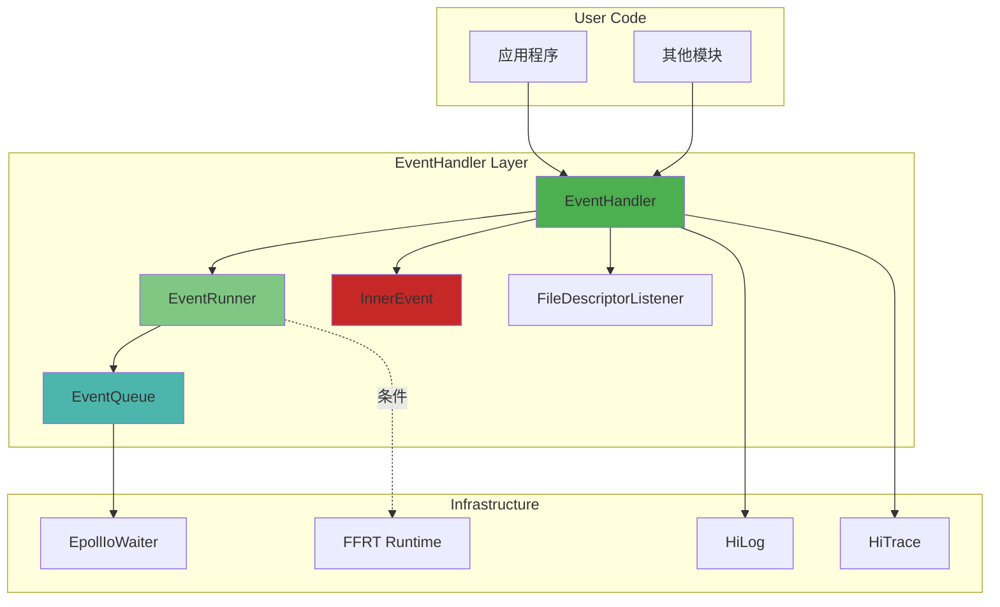

# 内部 API 文档

## 目的

本文档说明 EventHandler 部件的内部 C++ API 接口，包括模块接口、依赖方向、稳定性和可替换点。

## 适用范围

- 内部 API 路径：`interfaces/inner_api/`
- 目标用户：OpenHarmony 系统内其他模块
- 语言：C++ (C++17)

## 核心类接口

### EventHandler

**文件**: `interfaces/inner_api/event_handler.h`

**职责**：发送和处理消息的核心类，通过绑定 EventRunner 实现消息队列循环分发功能。

**代码证据**：
- 类定义：`event_handler.h:51`
- 析构函数：`virtual ~EventHandler()` - `event_handler.h:63`

#### 创建与销毁

```cpp
explicit EventHandler(const std::shared_ptr<EventRunner> &runner = nullptr);
virtual ~EventHandler();
```

**代码证据**：`event_handler.h:62-63`

#### 发送事件

| 方法 | 参数 | 返回值 | 说明 | 代码位置 |
|-------|-------|--------|------|---------|
| `SendEvent(event, delayTime, priority)` | InnerEvent::Pointer &, int64_t, Priority | bool | event_handler.h:81 |
| `SendTimingEvent(event, taskTime, priority)` | InnerEvent::Pointer &, int64_t, Priority | bool | event_handler.h:91 |
| `SendEvent(event, priority)` | InnerEvent::Pointer &, Priority | bool | event_handler.h:100 |
| `SendEvent(innerEventId, param, delayTime, caller)` | uint32_t, int64_t, int64_t, Caller | bool | event_handler.h:127 |
| `SendEvent(innerEventId, delayTime, priority, caller)` | uint32_t, int64_t, Priority, Caller | bool | event_handler.h:141 |

**代码证据**：
- 参数校验：检查 `eventRunner_` 是否已设置 - `event_handler.cpp:239-241`
- 调用队列：`eventRunner_->GetEventQueue()->Insert()` - `event_handler.cpp:242`

#### 处理事件

```cpp
virtual void ProcessEvent(const InnerEvent::Pointer &event);
```

**代码证据**：`event_handler.h:191`

**默认实现**：
```cpp
void EventHandler::ProcessEvent(const InnerEvent::Pointer &event)
{
    if (event->GetCallback() != nullptr) {
        event->GetCallback()();
    }
}
```

**代码证据**：`event_handler.cpp:668`

#### 分发事件（内部）

```cpp
void DistributeEvent(const InnerEvent::Pointer &event);
```

**代码证据**：`event_handler.h:491`

**实现位置**：`event_handler.cpp:491-537`

#### 当前实例

```cpp
static std::shared_ptr<EventHandler> Current();
```

**代码证据**：`event_handler.h:71`

**实现位置**：`event_handler.cpp:68-76`

#### 事件移除

```cpp
bool RemoveOrphanEvent(uint32_t innerEventId);
void RemoveAllEvents();
```

**代码证据**：`event_handler.h:208-211`

#### 同步发送

```cpp
std::shared_ptr<InnerEvent::Waiter> CreateOrGetWaiter();
bool SendSyncEvent(InnerEvent::Pointer &event, int64_t timeoutMs, InnerEvent::Pointer &result);
```

**代码证据**：`event_handler.h:283, 290`

### EventRunner

**文件**: `interfaces/inner_api/event_runner.h`

**职责**：消息队列的循环分发器，每个线程只有一个 EventRunner，主要用于管理消息队列 EventQueue，不断地从队列中取出 InnerEvent 分发至对应的 EventHandler 处理。

**代码证据**：
- 类定义：`event_runner.h:41`
- 删除构造：`EventRunner() = delete` - `event_runner.h:43`

#### 创建 EventRunner

| 方法 | 参数 | 返回值 | 说明 | 代码位置 |
|-------|-------|--------|------|---------|
| `Create(inNewThread, mode)` | bool, Mode | std::shared_ptr<EventRunner> | event_runner.h:62 |
| `Create(inNewThread, threadMode, lockType)` | bool, ThreadMode, EventLockType | std::shared_ptr<EventRunner> | event_runner.h:72 |
| `Create(threadName, mode, lockType)` | const std::string &, Mode, EventLockType | std::shared_ptr<EventRunner> | event_runner.h:83 |
| `Create(threadName, threadMode, lockType)` | const std::string &, ThreadMode, EventLockType | std::shared_ptr<EventRunner> | event_runner.h:96 |

**代码证据**：
- `EventRunner::Create()` 实现位置：`event_runner.cpp:545, 568, 591, 636`

#### 运行与停止

```cpp
ErrCode Run();
ErrCode Stop();
```

**代码证据**：`event_runner.h:110, 123`

**实现位置**：`event_runner.cpp:693-735`

#### 当前实例

```cpp
static std::shared_ptr<EventRunner> Current();
std::shared_ptr<EventRunner> GetMainEventRunner();
bool IsCurrentRunnerThread();
```

**代码证据**：`event_runner.h:136, 161, 169, 181`

#### 队列访问

```cpp
std::shared_ptr<EventQueue> GetEventQueue();
```

**代码证据**：`event_runner.h:177`

#### 调试与监控

```cpp
void Dump(Dumper &dumper);
void DumpRunnerInfo(std::string& runnerInfo);
```

**代码证据**：`event_runner.h:186, 191`

#### 回调钩子

```cpp
static DistributeBeginTime distributeBegin_;
static DistributeEndTime distributeEnd_;
static CallbackTime distributeCallback_;
```

**代码证据**：`event_runner.h:47-52`

### InnerEvent

**文件**: `interfaces/inner_api/inner_event.h`

**职责**：线程间消息传递的实体封装，EventHandler 接收与处理的消息对象。

**代码证据**：
- 类定义：`inner_event.h:76`

#### 创建事件

```cpp
static Pointer Get(uint32_t innerEventId, int64_t param = 0, const Caller &caller = {});
static Pointer Get(uint32_t innerEventId, std::shared_ptr<void> object);
static Pointer Get(const std::string &innerEventId, std::shared_ptr<void> object);
```

**代码证据**：`inner_event.h:104-112`

#### 事件属性

| 属性 | 类型 | 说明 | 代码位置 |
|-------|------|------|---------|
| `GetInnerEventId()` | EventId (variant<uint32_t, string>) | 获取事件 ID | inner_event.h:137 |
| `GetParam()` | int64_t | 获取参数 | inner_event.h:141 |
| `GetSender()` | const Caller & | 获取发送者信息 | inner_event.h:145 |
| `GetOwner()` | std::weak_ptr<EventHandler> | 获取所属 EventHandler | inner_event.h:149 |
| `GetCallback()` | Callback | 获取回调函数 | inner_event.h:153 |
| `GetHandleTime()` | TimePoint | 获取处理时间 | inner_event.h:157 |
| `GetSendTime()` | TimePoint | 获取发送时间 | inner_event.h:161 |
| `GetPriority()` | Priority | 获取优先级 | inner_event.h:165 |
| `SetSharedObject()` | void | 设置共享对象 | inner_event.h:169 |
| `GetSharedObject()` | std::shared_ptr<void> | 获取共享对象 | inner_event.h:173 |
| `IsVsyncTask()` | bool | 是否 VSync 任务 | inner_event.h:177 |
| `SetWantReceiver()` | void | 设置 Want 接收者 | inner_event.h:181 |

**代码证据**：`inner_event.h:137-185`

#### 事件优先级

```cpp
enum class Priority {
    IMMEDIATE = 0,
    HIGH = 1,
    LOW = 2,
    IDLE = 3,
};
```

**代码证据**：`inner_event.h:23-28`

#### 事件类型

```cpp
enum class EventType {
    SYNC_EVENT = 0,
    DELAY_EVENT = 1,
    TIMING_EVENT = 2,
};
```

**代码证据**：`inner_event.h:20-23`

### EventQueue

**文件**: `interfaces/inner_api/event_queue.h`

**职责**：线程消息队列，管理 InnerEvent，在初始化 EventRunner 对象时需要创建一个与之关联的 EventQueue。

**代码证据**：
- 类定义：`event_queue.h:15`

#### 队列操作

| 方法 | 参数 | 返回值 | 说明 | 代码位置 |
|-------|-------|--------|------|---------|
| `Insert(event, priority, insertType)` | InnerEvent::Pointer &, Priority, EventInsertType | bool | event_queue.h:57 |
| `Insert(event, delayTime, priority, insertType)` | InnerEvent::Pointer &, int64_t, Priority, EventInsertType | bool | event_queue.h:62 |
| `Insert(event, priority)` | InnerEvent::Pointer &, Priority | bool | event_queue.h:67 |
| `Insert(event, insertType)` | InnerEvent::Pointer &, EventInsertType | bool | event_queue.h:72 |
| `Remove(event)` | const InnerEvent::Pointer & | void | event_queue.h:77 |
| `Remove(owner)` | const std::shared_ptr<EventHandler> & | void | event_queue.h:82 |
| `RemoveOrphanByHandlerId()` | const std::string & | void | event_queue.h:88 |
| `RemoveAll()` | void | void | event_queue.h:93 |
| `RemoveOrphan()` | void | void | event_queue.h:98 |

**代码证据**：`event_queue.h:57-98`

#### 获取事件

```cpp
Pointer GetEvent();
Pointer GetExpiredEvent(TimePoint &nextExpiredTime);
```

**代码证据**：`event_queue.h:102-105`

#### 文件描述符操作

```cpp
bool AddFileDescriptorListener(int32_t fd, uint32_t events, const std::string &taskName,
    const std::shared_ptr<FileDescriptorListener>& listener);
void RemoveFileDescriptorListener(int32_t fd);
void RemoveAllFileDescriptorListeners();
```

**代码证据**：`event_queue.h:112-127`

#### 队列信息

```cpp
void Dump(Dumper &dumper);
void DumpQueueInfo(std::string& queueInfo);
bool HasInnerEvent();
uint32_t GetEventSize();
int32_t GetExpiredEventSize();
```

**代码证据**：`event_queue.h:133-146`

### FileDescriptorListener

**文件**: `interfaces/inner_api/file_descriptor_listener.h`

**职责**：文件描述符监听器接口，当文件描述符可读、可写、关闭或异常时调用相应回调。

**代码证据**：
- 接口定义：`file_descriptor_listener.h:18`

```cpp
virtual ~FileDescriptorListener() = default;

virtual void OnReadable(int32_t fileDescriptor) = 0;
virtual void OnWritable(int32_t fileDescriptor) = 0;
virtual void OnShutdown(int32_t fileDescriptor) = 0;
virtual void OnException(int32_t fileDescriptor) = 0;
```

**代码证据**：`file_descriptor_listener.h:31-34`

### LockBase

**文件**: `interfaces/inner_api/lock_base.h`

**职责**：锁基类接口，定义锁的基本操作。

**代码证据**：
- 接口定义：`lock_base.h:19`

```cpp
virtual ~LockBase() = default;

virtual void Lock() = 0;
virtual void Unlock() = 0;
virtual bool TryLock() = 0;
```

**代码证据**：`lock_base.h:24-29`

## 稳定性分析

### 稳定接口（STABLE）

以下接口标记为 STABLE，向后兼容：

| 类 | 接口 | 稳定性 | 证据 |
|-----|-------|--------|------|
| EventHandler | SendEvent(), ProcessEvent(), Current() | STABLE | event_handler.h |
| EventRunner | Create(), Run(), Stop(), Current() | STABLE | event_runner.h |
| InnerEvent | Get(), GetInnerEventId(), GetParam() | STABLE | inner_event.h |
| EventQueue | Insert(), GetEvent(), Remove() | STABLE | event_queue.h |
| FileDescriptorListener | OnReadable(), OnWritable() | STABLE | file_descriptor_listener.h |
| LockBase | Lock(), Unlock(), TryLock() | STABLE | lock_base.h |

**证据来源**：
- `interfaces/inner_api/` 目录下的公共头文件

### 内部接口（INTERNAL）

以下实现为内部使用，可能随版本变更：

| 实现 | 稳定性 | 证据 |
|-----|--------|------|
| EventRunnerImpl | INTERNAL | event_runner.cpp:292 |
| EventInnerRunner | INTERNAL | event_inner_runner.h |
| EpollIoWaiter | INTERNAL | epoll_io_waiter.h:35 |
| FfrtDescriptorListener | INTERNAL | ffrt_descriptor_listener.h |
| PriorityInheritanceLock | INTERNAL | priority_inheritance_lock.h |

**证据来源**：
- `frameworks/eventhandler/include/` 目录下的内部头文件（`LOCAL_API` 标记）

## 依赖方向

### 依赖层次图



### 模块间依赖

| 模块 | 依赖 | 说明 |
|-------|------|------|
| EventHandler | EventRunner, InnerEvent, EventQueue | 直接依赖 |
| EventRunner | EventQueue, EpollIoWaiter, FFRT | 队列和 I/O 等待 |
| EventQueue | InnerEvent, FileDescriptorListener | 事件管理和监听 |
| FFRT | ffrt_queue | 队列调度 |

**代码证据**：
- `EventHandler` 持有 `std::shared_ptr<EventRunner> eventRunner_` - `event_handler.h:354`
- `EventRunner` 持有 `std::shared_ptr<EventQueue> queue_` - `event_runner.cpp:539`

## 可替换点

### IoWaiter 接口（可替换）

**实现类**：
- `EpollIoWaiter` - 基于 Linux epoll（默认）
- `FfrtDescriptorListener` - FFRT 集成
- `DeamonIoWaiter` - 后台 I/O
- `NoneIoWaiter` - 空实现（用于测试）

**替换方式**：
1. 实现 `IoWaiter` 接口
2. 在 `EventQueue` 构造函数中传入自定义实现
3. 通过 `EventRunner::Create()` 或 `EventQueue` 构造函数指定

**代码证据**：
- 接口定义：`io_waiter.h:45`
- Epoll 实现：`epoll_io_waiter.h:35`
- 事件队列使用：`event_queue.cpp:75-92`

### LockBase 接口（可替换）

**实现类**：
- `StdLock` - 基于 `std::mutex`
- `PriorityInheritanceLock` - 优先级继承锁

**替换方式**：
1. 实现 `LockBase` 接口
2. 通过 `EventRunner::Create()` 的 `lockType` 参数指定
3. 在 `EventQueue::InitializeLocks()` 中初始化

**代码证据**：
- 接口定义：`lock_base.h:19`
- StdLock 实现：`event_handler_utils.h:...`（推断）
- PriorityInheritanceLock 实现：`priority_inheritance_lock.h:...`
- 初始化位置：`event_queue.cpp:62`

### FileDescriptorListener 接口（可替换）

**使用场景**：
- 监听 socket I/O
- 监听 pipe I/O
- 自定义 I/O 事件处理

**替换方式**：
1. 继承 `FileDescriptorListener` 接口
2. 实现 `OnReadable()`, `OnWritable()`, `OnShutdown()`, `OnException()`
3. 调用 `EventRunner::AddFileDescriptorListener()` 注册

**代码证据**：
- 接口定义：`file_descriptor_listener.h:18`
- 使用位置：`file_descriptor_listener.cpp`（推断）

## 数据结构

### Caller 结构体

**代码证据**：`inner_event.h:42`

```cpp
struct Caller {
    std::string file_;
    int line_;
    std::string func_;
    std::string dfxName_;
    // ... 支持编译器内置函数
};
```

### CompositeEventId 结构体

**代码证据**：`emitter/base/include/composite_event.h`（推断）

用于组合事件 ID 和 Emitter ID：
```cpp
struct CompositeEventId {
    InnerEvent::EventId eventId;
    uint32_t emitterId;
};
```

## 性能考虑

### 线程安全

- 所有队列操作使用锁保护
- 支持优先级继承锁避免优先级反转
- 使用原子操作标记 EventRunner 运行状态

**代码证据**：
- `std::mutex queueLock_` - `event_queue.cpp:20`
- `std::atomic<bool> running_` - `event_runner.cpp:539`

### 内存管理

- InnerEvent 使用对象池减少分配
- 使用 `std::shared_ptr` 管理生命周期
- 支持自定义删除器

**代码证据**：
- `InnerEvent::Get()` - 从池中获取 - `inner_event.h:104`

## 相关跳转

- [架构说明](03_Architecture.md) - 组件设计和数据流
- [N-API 接口](04_NAPI_API.md) - JavaScript API 参考
- [项目概览](01_Overview.md) - 核心概念说明
