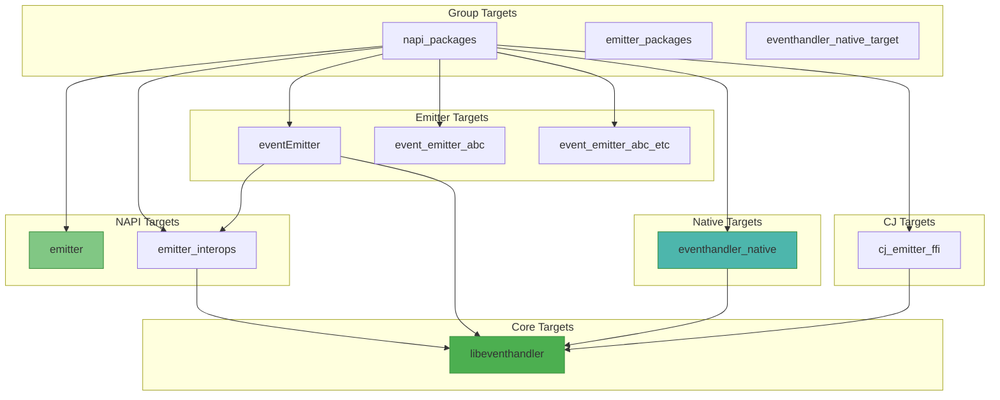

# GN 构建目标文档

## 目的

本文档详细说明 EventHandler 项目的 GN 构建系统，包括 targets 列表、类型、依赖关系和编译产物。

## 适用范围

- 构建系统：GN（Generate Ninja）
- 构建文件位置：`frameworks/*/BUILD.gn`
- 配置文件：`eventhandler.gni`

## 配置文件

### eventhandler.gni

**文件路径**: `/base/notification/eventhandler/eventhandler.gni`

**代码证据**：
- 文件存在：`eventhandler.gni:1-48`

**定义的变量**：

| 变量 | 默认值 | 说明 |
|-------|---------|------|
| `frameworks_path` | `//base/notification/eventhandler/frameworks` | 框架源代码路径 |
| `inner_api_path` | `//base/notification/eventhandler/interfaces/inner_api` | 内部 API 路径 |
| `kits_path` | `//base/notification/eventhandler/interfaces/kits` | 外部接口路径 |
| `fuzztest_path` | `base/notification/eventhandler/test/fuzztest` | Fuzz 测试路径 |
| `eventhandler_fuzz_test_output_path` | `eventhandler/eventhandler` | Fuzz 输出路径 |
| `has_hichecker_native_part` | 自动检测 | 是否启用 HiChecker |
| `eventhandler_ffrt_usage` | `true` | 启用 FFRT 支持 |
| `eh_hitrace_usage` | 自动检测 | 启用 HiTrace |
| `resource_schedule_usage` | 自动检测 | 启用资源调度 |

**声明的编译参数**：

```gni
declare_args() {
  eventhandler_feature_enable_pgo = false
  eventhandler_feature_pgo_path = ""
  eventhandler_feature_enable_main_runner_priority_lock = false
}
```

**代码证据**：`eventhandler.gni:43-47`

## 构建目标概览

### 目标依赖图



## 核心 Targets

### libeventhandler

**文件**: `frameworks/eventhandler/BUILD.gn`

**代码证据**：
- target 定义：`eventhandler.gni:29-120`

```gni
ohos_shared_library("libeventhandler") {
  sources = inner_api_sources
  external_deps = [
    "c_utils:utils",
    "hilog:libhilog",
    "hitrace:libhitracechain",
    "init:libbegetutil",
  ]
  install_images = [
    system_base_dir,
    updater_base_dir,
  ]
  subsystem_name = "notification"
  part_name = "eventhandler"
  innerapi_tags = [
    "platformsdk",
    "chipsetsdk_sp_indirect",
    "sasdk",
  ]
}
```

**目标类型**: `ohos_shared_library`

**源文件**: 通过 `inner_api_sources.gni` 定义

| 源文件 | 说明 | 条件 |
|-------|------|-------|
| `async_stack_adapter.cpp` | 异步栈适配器 | 始终 |
| `deamon_io_waiter.cpp` | 后台 I/O 等待器 | 始终 |
| `epoll_io_waiter.cpp` | Epoll I/O 等待 | 始终 |
| `event_handler.cpp` | 事件处理器 | 始终 |
| `event_queue.cpp` | 事件队列 | 始终 |
| `event_queue_base.cpp` | 队列基类 | 始终 |
| `event_runner.cpp` | 事件运行器 | 始终 |
| `ffrt_descriptor_listener.cpp` | FFRT 描述符监听 | `eventhandler_ffrt_usage` |
| `file_descriptor_listener.cpp` | 文件描述符监听 | 始终 |
| `frame_report_sched.cpp` | 帧报告调度 | 始终 |
| `inner_event.cpp` | 内部事件 | 始终 |
| `native_implement_eventhandler.cpp` | Native 实现 | 始终 |
| `none_io_waiter.cpp` | 空 I/O 等待器 | 始终 |
| `event_queue_ffrt.cpp` | FFRT 队列适配 | `eventhandler_ffrt_usage` |

**代码证据**：`eventhandler/inner_api_sources.gni:15-34`

**外部依赖**：

| 依赖 | 条件 | 说明 |
|-------|------|------|
| `c_utils:utils` | 无 | 通用工具库 |
| `hilog:libhilog` | 无 | 日志库 |
| `hitrace:libhitracechain` | `eh_hitrace_usage` | 调用链追踪 |
| `init:libbegetutil` | 无 | 系统初始化工具 |
| `ipc:ipc_single` | `resource_schedule_usage` | IPC 通信 |
| `resource_schedule_service:ressched_client` | `resource_schedule_usage` | 资源调度服务 |
| `hichecker:libhichecker` | `has_hichecker_native_part` | 性能检测 |
| `ffrt:libffrt` | `eventhandler_ffrt_usage` | Flexible Function Runtime |

**代码证据**：`eventhandler.gni:50-75`

**编译选项**：
- `sanitize`: integer_overflow, ubsan, boundary_sanitize, cfi, cfi_cross_dso
- `branch_protector_ret`: "pac_ret"
- PGO 优化：条件支持（`eventhandler_feature_enable_pgo`）
- AArch64 内联：条件支持（`enable_enhanced_opt`）

**输出**：
- 产物：`libeventhandler.so`
- 安装路径：`system_base_dir`, `updater_base_dir`

**代码证据**：`eventhandler.gni:82-86`

### eventhandler_native

**文件**: `frameworks/native/BUILD.gn`

**代码证据**：`native/BUILD.gn:17-43`

```gni
ohos_shared_library("eventhandler_native") {
  sources = [ "src/native_interface_eventhandler.cpp" ]
  include_dirs = [ "${kits_path}/native" ]
  deps = [ "${frameworks_path}/eventhandler:libeventhandler" ]
  external_deps = [
    "c_utils:utils",
    "hilog:libhilog",
  ]
  subsystem_name = "notification"
  part_name = "eventhandler"
}
```

**目标类型**: `ohos_shared_library`

**源文件**：
- `native_interface_eventhandler.cpp`

**代码证据**：`native/BUILD.gn:28`

**依赖**：
- `libeventhandler`

**代码证据**：`native/BUILD.gn:34`

**外部依赖**：
- `c_utils:utils`
- `hilog:libhilog`

**代码证据**：`native/BUILD.gn:36-39`

**输出**：
- 产物：`libeventhandler_native.so`

**代码证据**：`native/BUILD.gn:17`

## N-API Targets

### emitter_interops

**文件**: `frameworks/napi/BUILD.gn`

**代码证据**：`napi/BUILD.gn:67-102`

```gni
ohos_shared_library("emitter_interops") {
  sources = [
    "src/events_emitter.cpp",
    "src/interops.cpp"
  ]
  deps = [ "${frameworks_path}/eventhandler:libeventhandler" ]
  external_deps = [
    "c_utils:utils",
    "hilog:libhilog",
    "napi:ace_napi",
  ]
  version_script = "libemitter.map"
  subsystem_name = "notification"
  part_name = "eventhandler"
}
```

**目标类型**: `ohos_shared_library`

**源文件**：
- `events_emitter.cpp`
- `interops.cpp`

**代码证据**：`napi/BUILD.gn:87-90`

**依赖**：
- `libeventhandler`

**代码证据**：`napi/BUILD.gn:92`

**外部依赖**：
- `c_utils:utils`
- `hilog:libhilog`
- `napi:ace_napi`

**代码证据**：`napi/BUILD.gn:94-98`

**版本控制**：
- `version_script`: `libemitter.map`
- 文件路径：`frameworks/napi/libemitter.map`

**代码证据**：`napi/BUILD.gn:77`

### emitter

**文件**: `frameworks/napi/BUILD.gn`

**代码证据**：`napi/BUILD.gn:40-65`

```gni
ohos_shared_library("emitter") {
  sources = [
    "src/init.cpp",
  ]
  deps = [ "${frameworks_path}/napi:emitter_interops" ]
  external_deps = [
    "c_utils:utils",
    "napi:ace_napi",
  ]
  relative_install_dir = "module/events"
  subsystem_name = "notification"
  part_name = "eventhandler"
}
```

**目标类型**: `ohos_shared_library`

**源文件**：
- `init.cpp`

**代码证据**：`napi/BUILD.gn:52`

**依赖**：
- `emitter_interops`

**代码证据**：`napi/BUILD.gn:55`

**外部依赖**：
- `c_utils:utils`
- `napi:ace_napi`

**代码证据**：`napi/BUILD.gn:56-60`

**安装路径**：
- `relative_install_dir`: `module/events`

**代码证据**：`napi/BUILD.gn:62`

## Emitter Targets

### eventEmitter

**文件**: `frameworks/emitter/BUILD.gn`

**代码证据**：`emitter/BUILD.gn:19-62`

```gni
ohos_shared_library("eventEmitter") {
  include_dirs = [
    "${frameworks_path}/emitter/ani/include",
    "${frameworks_path}/emitter/napi/include",
    "${frameworks_path}/emitter/base/include",
  ]
  sources = [
    "${frameworks_path}/emitter/ani/src/ani_emitter.cpp",
    "${frameworks_path}/emitter/ani/src/ani_serialize.cpp",
    "${frameworks_path}/emitter/base/src/ani_async_callback_manager.cpp",
    "${frameworks_path}/emitter/base/src/ani_deserialize.cpp",
    "${frameworks_path}/emitter/base/src/async_callback_manager.cpp",
    "${frameworks_path}/emitter/base/src/napi_async_callback_manager.cpp",
    "${frameworks_path}/emitter/napi/src/napi_emitter.cpp",
    "${frameworks_path}/emitter/napi/src/napi_serialize.cpp",
  ]
  deps = [
    "${frameworks_path}/eventhandler:libeventhandler",
    "${frameworks_path}/napi:emitter_interops",
  ]
  external_deps = [
    "c_utils:utils",
    "hilog:libhilog",
    "napi:ace_napi",
    "runtime_core:ani",
    "runtime_core:ani_helpers",
  ]
  subsystem_name = "notification"
  part_name = "eventhandler"
}
```

**目标类型**: `ohos_shared_library`

**源文件**（共 8 个）：

| 源文件 | 模块 | 说明 |
|-------|------|------|
| `ani_emitter.cpp` | ANI | ANI Emitter 实现 |
| `ani_serialize.cpp` | ANI | ANI 序列化 |
| `ani_async_callback_manager.cpp` | base | ANI 回调管理器 |
| `ani_deserialize.cpp` | base | ANI 反序列化 |
| `async_callback_manager.cpp` | base | N-API 回调管理器 |
| `napi_async_callback_manager.cpp` | base | N-API 回调管理器 |
| `napi_emitter.cpp` | napi | N-API Emitter 实现 |
| `napi_serialize.cpp` | napi | N-API 序列化 |

**代码证据**：`emitter/BUILD.gn:36-45`

**依赖**：
- `libeventhandler`
- `emitter_interops`

**代码证据**：`emitter/BUILD.gn:47-50`

**外部依赖**：
- `c_utils:utils`
- `hilog:libhilog`
- `napi:ace_napi`
- `runtime_core:ani`
- `runtime_core:ani_helpers`

**代码证据**：`emitter/BUILD.gn:52-58`

### event_emitter_abc

**代码证据**：`emitter/BUILD.gn:64-69`

```gni
generate_static_abc("event_emitter_abc") {
  base_url = "${frameworks_path}/emitter/ani/ets"
  files = [ "${frameworks_path}/emitter/ani/ets/@ohos.events.emitter.ets" ]
  is_boot_abc = "True"
  device_dst_file = "/system/framework/event_emitter_abc.abc"
}
```

**目标类型**: `generate_static_abc`

**源文件**：
- `@ohos.events.emitter.ets`

**代码证据**：`emitter/BUILD.gn:66`

**输出路径**：
- `/system/framework/event_emitter_abc.abc`

**代码证据**：`emitter/BUILD.gn:68`

### event_emitter_abc_etc

**代码证据**：`emitter/BUILD.gn:71-77`

```gni
ohos_prebuilt_etc("event_emitter_abc_etc") {
  source = "$target_out_dir/event_emitter_abc.abc"
  module_install_dir = "framework"
  subsystem_name = "notification"
  part_name = "eventhandler"
  deps = [ ":event_emitter_abc" ]
}
```

**目标类型**: `ohos_prebuilt_etc`

**依赖**：
- `event_emitter_abc`

**代码证据**：`emitter/BUILD.gn:76`

## CJ Targets

### cj_emitter_ffi

**文件**: `frameworks/cj/BUILD.gn`

**代码证据**：`cj/BUILD.gn:17-54`

```gni
ohos_shared_library("cj_emitter_ffi") {
  include_dirs = [
    "include",
    "${inner_api_path}",
  ]
  external_deps = [ "napi:cj_bind_ffi" ]

  if (!ohos_indep_compiler_enable && !build_ohos_sdk) {
    external_deps += [
      "hilog:libhilog",
      "napi:cj_bind_native",
    ]
    deps = [ "${frameworks_path}/eventhandler:libeventhandler" ]
    sources = [
      "src/emitter.cpp",
      "src/emitter_ffi.cpp",
      "src/event_handler_impl.cpp",
    ]
  } else {
    sources = [ "src/emitter_mock.cpp" ]
  }

  innerapi_tags = [ "platformsdk" ]
  subsystem_name = "notification"
  part_name = "eventhandler"
}
```

**目标类型**: `ohos_shared_library`

**编译条件**：
- 正常编译：`!ohos_indep_compiler_enable && !build_ohos_sdk`
- SDK 构建：`ohos_indep_compiler_enable || build_ohos_sdk`

**代码证据**：`cj/BUILD.gn:35-49`

**源文件**（正常编译）：
- `emitter.cpp`
- `emitter_ffi.cpp`
- `event_handler_impl.cpp`

**代码证据**：`cj/BUILD.gn:42-46`

**源文件**（SDK 构建）：
- `emitter_mock.cpp`

**代码证据**：`cj/BUILD.gn:48`

**依赖**：
- `libeventhandler`（条件）

**代码证据**：`cj/BUILD.gn:40`

**外部依赖**：
- `napi:cj_bind_ffi`
- `hilog:libhilog`（条件）
- `napi:cj_bind_native`（条件）

**代码证据**：`cj/BUILD.gn:33, 37`

## Group Targets

### napi_packages

**文件**: `frameworks/BUILD.gn`

**代码证据**：`frameworks/BUILD.gn:14-19`

```gni
group("napi_packages") {
  deps = []
  if (support_jsapi) {
    deps += [ "cj:cj_emitter_ffi" ]
  }
}
```

**目标类型**: `group`

**依赖**：
- `cj:cj_emitter_ffi`（`support_jsapi` 条件）

**代码证据**：`frameworks/BUILD.gn:17`

### emitter_packages

**代码证据**：`frameworks/BUILD.gn:21-30`

```gni
group("emitter_packages") {
  if (support_jsapi) {
    deps = [
      "emitter:eventEmitter",
      "emitter:event_emitter_abc_etc",
      "napi:emitter",
      "napi:emitter_interops",
    ]
  }
}
```

**目标类型**: `group`

**依赖**：
- `emitter:eventEmitter`
- `emitter:event_emitter_abc_etc`
- `napi:emitter`
- `napi:emitter_interops`

**代码证据**：`frameworks/BUILD.gn:23-29`

### eventhandler_native_target

**代码证据**：`frameworks/BUILD.gn:31-33`

```gni
group("eventhandler_native_target") {
  deps = [ "native:eventhandler_native" ]
}
```

**目标类型**: `group`

**依赖**：
- `native:eventhandler_native`

**代码证据**：`frameworks/BUILD.gn:32`

## 条件编译

### FFRT 支持

**条件**: `eventhandler_ffrt_usage`（默认 true）

**影响**：
- 添加源文件：`event_queue_ffrt.cpp`
- 添加外部依赖：`ffrt:libffrt`
- 添加编译标志：`-DFFRT_USAGE_ENABLE`

**代码证据**：
- 条件源：`inner_api_sources.gni:31-34`
- 条件依赖：`eventhandler.gni:74-76`

### HiTrace 支持

**条件**: `eh_hitrace_usage`（自动检测）

**影响**：
- 添加外部依赖：`hitrace:libhitracechain`
- 添加编译标志：`-DEH_HITRACE_METER_ENABLE`

**代码证据**：
- 条件依赖：`eventhandler.gni:69-71`
- 编译标志：`eventhandler.gni:70`

### HiChecker 支持

**条件**: `has_hichecker_native_part`（自动检测）

**影响**：
- 添加外部依赖：`hichecker:libhichecker`
- 添加编译标志：`-DHAS_HICHECKER_NATIVE_PART`

**代码证据**：
- 条件依赖：`eventhandler.gni:64-67`
- 编译标志：`eventhandler.gni:65`

### 资源调度支持

**条件**: `resource_schedule_usage`（自动检测）

**影响**：
- 添加外部依赖：`ipc:ipc_single`, `resource_schedule_service:ressched_client`
- 添加编译标志：`-DRES_SCHED_ENABLE`

**代码证据**：
- 条件依赖：`eventhandler.gni:58-62`
- 编译标志：`eventhandler.gni:61`

### PGO 优化

**条件**: `is_ohos && is_clang && (target_cpu == "arm" || target_cpu == "arm64")`

**影响**：
- 使用 PGO profile 数据进行优化
- 添加编译标志：`-fprofile-use=...`

**代码证据**：`eventhandler.gni:94-105`

### 主线程优先级锁

**条件**: `eventhandler_feature_enable_main_runner_priority_lock`

**影响**：
- 主线程 EventRunner 使用 `EventLockType::PRIORITY_INHERIT`

**代码证据**：
- 编译标志：`eventhandler.gni:79`
- 使用位置：`event_runner.cpp:839`

## 编译命令示例

### 构建整个部件

```bash
./build.sh --product-name <product> --build-target eventhandler
```

### 构建特定目标

```bash
# 构建 libeventhandler
gn gen out/default
ninja -C out/default libeventhandler

# 构建 emitter_packages
ninja -C out/default emitter_packages

# 构建 napi_packages
ninja -C out/default napi_packages
```

## 相关跳转

- [编译产物](07_Build_Artifacts.md) - 输出文件和安装路径
- [目录结构](02_Directory_Structure.md) - 源代码组织
- [项目概览](01_Overview.md) - 编译特性说明
