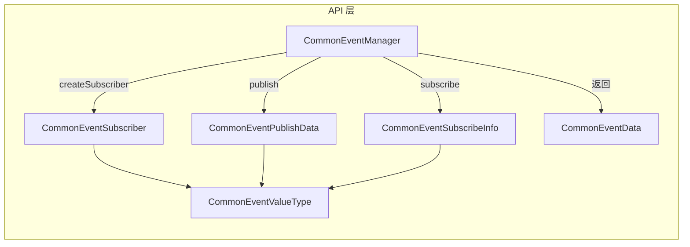
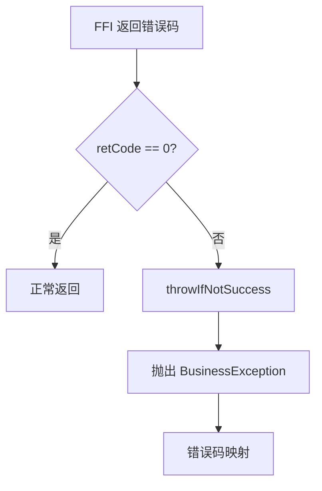

# 架构设计

## 整体架构图

```mermaid
graph TB
    subgraph "用户空间"
        A[Cangjie 应用] --> B[notification_cangjie_wrapper]
    end
    
    subgraph "Cangjie FFI 包装层"
        B --> C[CommonEventManager]
        B --> D[CommonEventData]
        B --> E[CommonEventPublishData]
        B --> F[CommonEventSubscribeInfo]
        B --> G[CommonEventSubscriber]
        B --> H[Support 常量]
    end
    
    subgraph "FFI 边界"
        C --> I[foreign { CJ_* 函数 }]
        G --> J[foreign { CJ_* 函数 }]
        D --> K[@C struct CCommonEventData]
        E --> L[@C struct CCommonEventPublishData]
        F --> M[@C struct CSubscribeInfo]
    end
    
    subgraph "native_event_service"
        N[cj_common_event_manager_ffi]
        N --> O[IPCSkeleton]
        N --> P[CommonEventService SA]
    end
    
    I --> N
    J --> N
    K --> N
    L --> N
    M --> N
```

## 模块依赖关系



## FFI 绑定机制

### 调用模式

```
Cangjie 调用流程:
┌─────────────────────────────────────────────────────────────┐
│ 1. 业务代码 (common_event_manager.cj)                        │
│    unsafe {                                                 │
│        CJ_PublishEventWithData(...)                         │
│    }                                                        │
└─────────────────────────────────────────────────────────────┘
                          ↓
┌─────────────────────────────────────────────────────────────┐
│ 2. foreign 声明 (common_event_manager_ffi.cj)               │
│    func CJ_PublishEventWithData(...)                        │
└─────────────────────────────────────────────────────────────┘
                          ↓
┌─────────────────────────────────────────────────────────────┐
│ 3. C++ 实现 (common_event_service:cj_common_event_manager_ffi)│
│    napi_value CJ_PublishEventWithData(...)                 │
└─────────────────────────────────────────────────────────────┘
```

### 数据结构转换

```mermaid
graph LR
    subgraph "Cangjie 侧"
        A[CommonEventPublishData]
        B[CCommonEventPublishData<br/>@C struct]
    end
    
    subgraph "C/C++ 侧"
        C[ces_publish_attr_st]
    end
    
    A -->|init 转换| B
    B -->|FFI 传递| C
```

### 内存管理

| 场景 | 分配方 | 释放方 | 证据 |
|------|--------|--------|------|
| 字符串参数 | `LibC.mallocCString()` | `LibC.free()` | `common_event_manager.cj:60` |
| C 结构体 | 构造函数分配 | `free()` 方法 | `common_event_publish_data.cj:141-164` |
| FFI 句柄 | C++ 侧 | `releaseFFIData()` | `common_event_subscriber.cj:36` |

## 线程模型

### API 线程要求

| API | 执行线程 | 证据 |
|-----|---------|------|
| `publish` | worker thread | `common_event_manager.cj:56` |
| `createSubscriber` | worker thread | `common_event_manager.cj:80` |
| `subscribe` | **main thread** | `common_event_manager.cj:107` |
| `unsubscribe` | worker thread | `common_event_manager.cj:132` |

### 回调执行

`subscribe` 的 `AsyncCallback` 在 **主线程** 执行，事件数据通过 `CCommonEventData` 传递：

```cangjie
// common_event_manager.cj:109-118
public static func subscribe(
    subscriber: CommonEventSubscriber,
    callback: AsyncCallback<CommonEventData>
): Unit {
    let wrapper = { value: CCommonEventData =>
        let commonData = CommonEventData(value)
        callback(None, commonData)
    }
    let lambdaData = Callback1Param<CCommonEventData, Unit>(wrapper)
    CJ_Subscribe(subscriber.getID(), lambdaData.getID())
}
```

## 异常处理



### 错误码映射

| 原始错误码 | 含义 | 异常类型 |
|-----------|------|---------|
| ERR_CES TooFrequent | 发送频率过高 | 1500003 |
| ERR_CES_SEND_FAIL | 发送失败 | 1500007 |
| ERR_CES_UNINITIALIZED | 服务未初始化 | 1500008 |
| ERR_SYSTEM_PARAM | 系统参数错误 | 1500009 |
| ERR_TOO_MANY_SUBSCRIBERS | 订阅者超限 | 1500010 |
| CAPABILITY_NOT_SUPPORTED | 能力不支持 | 801 |
