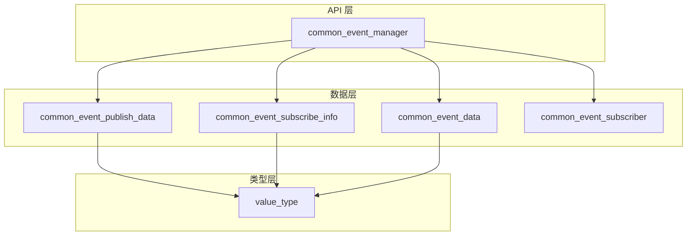

# 目录结构与代码地图

**本文档提供源码导航，帮助开发者快速定位功能实现。**

---

## 顶层目录结构

```
base/notification/notification_cangjie_wrapper
├── BUILD.gn                    # 根构建配置
├── bundle.json                 # 组件元数据
├── figures/                    # 架构图资源
│   └── notification_cangjie_wrapper_architecture_en.png
├── mock/                       # 跨平台 Mock 实现
│   └── ohos.common_event_manager.cj    # Windows/Mac 模拟实现
├── ohos/                       # Cangjie 源码（核心）
│   ├── common_event_data/          # 事件数据结构
│   ├── common_event_manager/       # 管理器核心
│   ├── common_event_publish_data/  # 发布数据定义
│   ├── common_event_subscribe_info/# 订阅信息定义
│   ├── common_event_subscriber/    # 订阅者封装
│   └── value_type/                 # 参数类型系统
├── test/                       # 测试代码（忽略）
└── wiki/                       # 本文档
```

---

## 模块职责说明

### common_event_manager（核心模块）

**路径**: `ohos/common_event_manager/`  
**产物**: `ohos.common_event_manager`

| 文件 | 职责 | 关键符号 | 代码行数 |
|------|------|----------|----------|
| `common_event_manager.cj` | 主 API 实现 | `CommonEventManager` 类 | 139 |
| `common_event_manager_ffi.cj` | FFI 函数声明 | `foreign { CJ_* }` | 41 |
| `common_event_manager_errors.cj` | 错误码定义 | `ERROR_*` 常量 | 73 |
| `common_event_manager_utils.cj` | 工具常量 | `UNDEFINED_USER` | ~20 |
| `support.cj` | 系统事件常量 | `COMMON_EVENT_*` | ~51KB |

**核心类**: `CommonEventManager` (lines 40-138)
- `publish()` - 发布事件 (line 57)
- `createSubscriber()` - 创建订阅者 (line 82)
- `subscribe()` - 订阅事件 (line 109)
- `unsubscribe()` - 取消订阅 (line 134)

### common_event_data（事件数据）

**路径**: `ohos/common_event_data/`  
**产物**: `ohos.common_event_data`

| 文件 | 职责 | 关键符号 |
|------|------|----------|
| `common_event_data.cj` | 接收数据结构 | `CommonEventData`, `CCommonEventData` |

**关键类**: `CommonEventData` (lines 31-91)
- `event: String` - 事件名 (line 39)
- `bundleName: String` - 发布者包名 (line 47)
- `code: Int32` - 事件码 (line 56)
- `data: String` - 事件数据 (line 65)
- `parameters: HashMap` - 扩展参数 (line 75)

### common_event_publish_data（发布数据）

**路径**: `ohos/common_event_publish_data/`  
**产物**: `ohos.common_event_publish_data`

| 文件 | 职责 | 关键符号 |
|------|------|----------|
| `common_event_publish_data.cj` | 发布参数结构 | `CommonEventPublishData`, `CCommonEventPublishData` |

**关键类**: `CommonEventPublishData` (lines 33-126)
- `isSticky: Bool` - 粘性标记 (line 83) - **需权限**
- `subscriberPermissions: Array<String>` - 订阅者权限要求 (line 66)
- `data: String` - 数据 (最大 64KB) (line 58)

**C 结构体**: `CCommonEventPublishData` (lines 128-180)
- 内存管理: `init()` 分配, `free()` 释放

### common_event_subscribe_info（订阅信息）

**路径**: `ohos/common_event_subscribe_info/`  
**产物**: `ohos.common_event_subscribe_info`

| 文件 | 职责 | 关键符号 |
|------|------|----------|
| `common_event_subscribe_info.cj` | 订阅配置结构 | `CommonEventSubscribeInfo`, `CSubscribeInfo` |

**关键类**: `CommonEventSubscribeInfo` (lines 72-158)
- `events: Array<String>` - 订阅事件列表 (line 80)
- `priority: Int32` - 优先级 (-100~1000) (line 117)
- `userId: Int32` - 用户 ID (line 106)

**边界检查**: `checkPriority()` (lines 160-170) - 静默截断越界值

### common_event_subscriber（订阅者）

**路径**: `ohos/common_event_subscriber/`  
**产物**: `ohos.common_event_subscriber`

| 文件 | 职责 | 关键符号 |
|------|------|----------|
| `common_event_subscriber.cj` | 订阅者封装 | `CommonEventSubscriber` |
| `common_event_subscriber_ffi.cj` | 订阅者 FFI | `CJ_GetCode`, `CJ_SetData` 等 |

**关键类**: `CommonEventSubscriber` (lines 30-38)
- 继承: `RemoteDataLite` - IPC 数据生命周期管理
- 析构: `releaseFFIData()` - 释放 FFI 资源

### value_type（参数类型系统）

**路径**: `ohos/value_type/`  
**产物**: `ohos.value_type`

| 文件 | 职责 | 关键符号 |
|------|------|----------|
| `value_type.cj` | 值类型枚举 | `CommonEventValueType` |
| `parameters.cj` | 参数序列化 | `Parameters`, `CParameters`, `createCArrParam` |

**关键枚举**: `CommonEventValueType` (lines 29-129)
- 基础类型: `Int32Value`, `StringValue`, `BoolValue`
- 数组类型: `ArrayString`, `ArrayInt32`, ...
- **FD 类型**: `FD(Int32)` - 文件描述符 (line 73) - **安全风险**

---

## 代码导航图

### 功能 → 文件索引

| 功能 | 入口文件 | 关键行号 |
|------|----------|----------|
| **发布事件** | `common_event_manager.cj` | 57-67 |
| 事件名处理 | `common_event_manager.cj` | 60 (mallocCString) |
| 数据打包 | `common_event_publish_data.cj` | 141-163 (C 结构体构造) |
| FFI 调用 | `common_event_manager_ffi.cj` | 26 (CJ_PublishEventWithData) |
| **创建订阅者** | `common_event_manager.cj` | 82-92 |
| 信息转换 | `common_event_subscribe_info.cj` | 36-54 (CSubscribeInfo) |
| FFI 调用 | `common_event_manager_ffi.cj` | 38 (FfiCommonEventManagerCreateSubscriber) |
| **订阅事件** | `common_event_manager.cj` | 109-118 |
| 回调包装 | `common_event_manager.cj` | 110-114 (wrapper lambda) |
| FFI 调用 | `common_event_manager_ffi.cj` | 34 (CJ_Subscribe) |
| **取消订阅** | `common_event_manager.cj` | 134-137 |
| FFI 调用 | `common_event_manager_ffi.cj` | 36 (CJ_Unsubscribe) |
| **错误处理** | `common_event_manager_errors.cj` | 67-72 (throwIfNotSuccess) |
| **系统常量** | `support.cj` | 全文件 (150+ 常量) |

### 调用链示例

```
publish() 调用链:
├─ common_event_manager.cj:57
│  ├─ LibC.mallocCString(event) - 字符串分配
│  ├─ CCommonEventPublishData() - 数据转换
│  │   ├─ common_event_publish_data.cj:141
│  │   └─ createCArrParam() - 参数序列化
│  │       └─ value_type/parameters.cj:132
│  └─ CJ_PublishEventWithData() - FFI 调用
│      └─ common_event_manager_ffi.cj:26
└─ common_event_service (C++) - 底层服务

subscribe() 调用链:
├─ common_event_manager.cj:109
│  ├─ wrapper lambda - 回调包装
│  ├─ Callback1Param - FFI 回调注册
│  └─ CJ_Subscribe() - FFI 调用
│      └─ common_event_manager_ffi.cj:34
└─ common_event_service (C++) - 底层服务
```

---

## 关键数据流

### 发布事件数据流

```
[应用层] CommonEventPublishData
    ↓ 构造函数转换
[FFI 层] CCommonEventPublishData (@C 结构体)
    ├─ CString (mallocCString)
    ├─ CArrString (权限数组)
    └─ CArrParameters (扩展参数)
    ↓ FFI 传递
[Native] cj_common_event_manager_ffi
    ↓ IPC
[系统服务] Common Event Service
```

### 接收事件数据流

```
[系统服务] Common Event Service
    ↓ IPC
[Native] cj_common_event_manager_ffi
    ↓ FFI 回调
[FFI 层] CCommonEventData (@C 结构体)
    ↓ 构造函数解析
[应用层] CommonEventData
    ├─ toString() - C 字符串转 Cangjie
    └─ Parameters() - 参数反序列化
```

---

## 依赖关系图

### 模块间依赖



### 文件依赖

| 文件 | 依赖的文件 |
|------|-----------|
| `common_event_manager.cj` | `common_event_manager_ffi.cj`, `common_event_data.cj`, `common_event_publish_data.cj`, `common_event_subscribe_info.cj`, `common_event_subscriber.cj` |
| `common_event_publish_data.cj` | `value_type/parameters.cj` |
| `common_event_subscribe_info.cj` | `value_type` (通过 FFI 工具) |
| `common_event_data.cj` | `value_type/parameters.cj` |
| `common_event_subscriber.cj` | `common_event_subscriber_ffi.cj` |

---

## 快速定位指南

### 按任务定位

| 我要... | 去这里 |
|---------|--------|
| 查看 API 定义 | `ohos/common_event_manager/common_event_manager.cj` |
| 查看 FFI 接口 | `ohos/common_event_manager/common_event_manager_ffi.cj` |
| 查看错误码 | `ohos/common_event_manager/common_event_manager_errors.cj` |
| 查看数据结构 | `ohos/common_event_data/common_event_data.cj` |
| 查看发布参数 | `ohos/common_event_publish_data/common_event_publish_data.cj` |
| 查看订阅配置 | `ohos/common_event_subscribe_info/common_event_subscribe_info.cj` |
| 查看参数类型 | `ohos/value_type/value_type.cj` |
| 查看参数序列化 | `ohos/value_type/parameters.cj` |
| 查看系统事件常量 | `ohos/common_event_manager/support.cj` |
| 查看构建配置 | `BUILD.gn`, `ohos/*/BUILD.gn` |

### 按问题定位

| 问题 | 检查文件 | 关键位置 |
|------|----------|----------|
| 发布失败 | `common_event_manager_errors.cj` | 错误码 1500007-1500009 |
| 订阅失败 | `common_event_manager_errors.cj` | 错误码 1500008, 1500010 |
| 内存泄漏 | `common_event_publish_data.cj` | `free()` 方法 |
| 类型转换错误 | `value_type/parameters.cj` | `getValue()` |
| 权限问题 | `common_event_publish_data.cj` | `isSticky` (line 83) |
| 优先级问题 | `common_event_subscribe_info.cj` | `checkPriority()` |

---

## 新人阅读路线

**第 1 步**（5 分钟）：了解整体  
→ `01_Overview.md`

**第 2 步**（10 分钟）：理解架构  
→ `02_Architecture.md`

**第 3 步**（10 分钟）：查看 API  
→ `03_API_Reference.md`

**第 4 步**（15 分钟）：深入代码  
1. `ohos/common_event_manager/common_event_manager.cj` - 入口点
2. `ohos/common_event_manager/common_event_manager_ffi.cj` - FFI 层
3. 选择一个数据类（如 `common_event_publish_data.cj`）理解转换逻辑

**第 5 步**（10 分钟）：查看安全注意  
→ `05_Security.md`

---

**相关文档**:
- [架构设计 →](02_Architecture.md)
- [API 参考 →](03_API_Reference.md)
- [安全评审 →](05_Security.md)
- [构建配置 →](04_Build.md)
- [内部实现 →](08_Internals.md)
