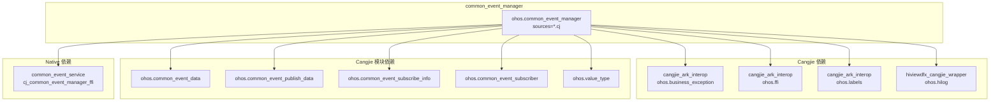
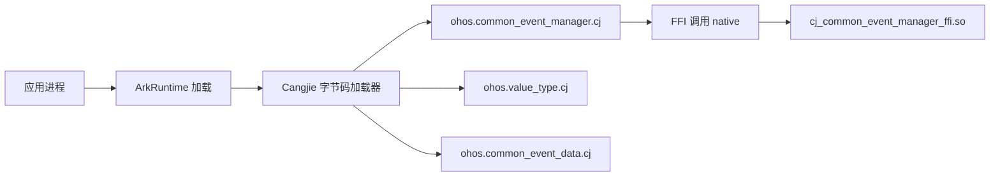

# 构建配置

## GN 构建系统

本项目使用 OpenHarmony 的 GN (Generate Ninja) 构建系统，配合 Cangjie 编译器 (cjc)。

### 根目录 BUILD.gn

**文件**: `//base/notification/notification_cangjie_wrapper/BUILD.gn`

```gn
# Copyright (c) 2025 Huawei Device Co., Ltd.

import("//build/templates/cangjie/cjc.gni")

notification_cangjie_wrapper_packages_ohos = [
    "//base/notification/notification_cangjie_wrapper/ohos/common_event_manager:ohos.common_event_manager",
    "//base/notification/notification_cangjie_wrapper/ohos/value_type:ohos.value_type",
    "//base/notification/notification_cangjie_wrapper/ohos/common_event_subscribe_info:ohos.common_event_subscribe_info",
    "//base/notification/notification_cangjie_wrapper/ohos/common_event_publish_data:ohos.common_event_publish_data",
    "//base/notification/notification_cangjie_wrapper/ohos/common_event_subscriber:ohos.common_event_subscriber",
    "//base/notification/notification_cangjie_wrapper/ohos/common_event_data:ohos.common_event_data"
]

copy_ohos_cangjie_sdk_api_lib("copy_sdk_notification_cangjie_libs") {
  ohos_inputs = notification_cangjie_wrapper_packages_ohos
}
```

### 模块 BUILD.gn 模板

**文件**: `//base/notification/notification_cangjie_wrapper/ohos/common_event_manager/BUILD.gn`

```gn
ohos_cangjie_shared_library("ohos.common_event_manager") {
  if (is_mingw || is_mac) {
    sources = [ "../../mock/ohos.common_event_manager.cj" ]
  } else {
    sources = [
      "common_event_manager_errors.cj",
      "common_event_manager_ffi.cj",
      "common_event_manager_utils.cj",
      "common_event_manager.cj",
      "support.cj",
    ]
  }

  external_deps = [ "common_event_service:cj_common_event_manager_ffi" ]

  cj_external_deps = [
    "cangjie_ark_interop:ohos.business_exception",
    "cangjie_ark_interop:ohos.ffi",
    "cangjie_ark_interop:ohos.labels",
    "hiviewdfx_cangjie_wrapper:ohos.hilog",
  ]

  cj_deps = [
    "../common_event_data:ohos.common_event_data",
    "../common_event_publish_data:ohos.common_event_publish_data",
    "../common_event_subscribe_info:ohos.common_event_subscribe_info",
    "../common_event_subscriber:ohos.common_event_subscriber",
    "../value_type:ohos.value_type"
  ]

  subsystem_name = "notification"
  part_name = "notification_cangjie_wrapper"
}
```

## Target 清单

### 主模块 Targets

| Target | 类型 | 路径 | 产物 |
|--------|------|------|------|
| `ohos.common_event_manager` | ohos_cangjie_shared_library | ohos/common_event_manager/ | `.cj` 字节码 |
| `ohos.common_event_data` | ohos_cangjie_shared_library | ohos/common_event_data/ | `.cj` 字节码 |
| `ohos.common_event_publish_data` | ohos_cangjie_shared_library | ohos/common_event_publish_data/ | `.cj` 字节码 |
| `ohos.common_event_subscribe_info` | ohos_cangjie_shared_library | ohos/common_event_subscribe_info/ | `.cj` 字节码 |
| `ohos.common_event_subscriber` | ohos_cangjie_shared_library | ohos/common_event_subscriber/ | `.cj` 字节码 |
| `ohos.value_type` | ohos_cangjie_shared_library | ohos/value_type/ | `.cj` 字节码 |
| `copy_sdk_notification_cangjie_libs` | copy_ohos_cangjie_sdk_api_lib | 根目录 | SDK 产物复制 |

### 构建开关

| 开关 | 类型 | 描述 |
|------|------|------|
| `is_mingw \|\| is_mac` | 条件编译 | Windows/macOS 使用 mock 实现 |

## Target 依赖关系



### 依赖说明

| 依赖类型 | 依赖项 | 用途 |
|----------|--------|------|
| `external_deps` | `common_event_service:cj_common_event_manager_ffi` | FFI C++ 桥接层 |
| `cj_external_deps` | `cangjie_ark_interop:ohos.*` | Cangjie 标准库互操作 |
| `cj_external_deps` | `hiviewdfx_cangjie_wrapper:ohos.hilog` | 日志输出 |
| `cj_deps` | 其他 ohos.* 模块 | Cangjie 模块间依赖 |

## 编译产物

### 产物清单

| 产物类型 | 路径 | 描述 |
|----------|------|------|
| `.cj` 字节码 | `out/{product}/libs/` | Cangjie 编译产物 |
| `.hap` (集成时) | - | 随应用打包 |
| SDK API | `developtools/sdk_napi/` | N-API 头文件与类型定义 |

### 产物映射

```
ohos.common_event_manager
├── common_event_manager.cj     → 字节码
├── common_event_manager_ffi.cj  → 字节码
├── common_event_manager_errors.cj → 字节码
├── common_event_manager_utils.cj → 字节码
└── support.cj                  → 字节码
```

### 运行时加载



## bundle.json 配置

**文件**: `//base/notification/notification_cangjie_wrapper/bundle.json`

```json
{
    "name": "@ohos/notification_cangjie_wrapper",
    "version": "6.1",
    "component": {
        "name": "notification_cangjie_wrapper",
        "subsystem": "notification",
        "adapted_system_type": ["standard"],
        "rom": "400KB",
        "ram": "432KB",
        "deps": {
            "components": [
                "cangjie_ark_interop",
                "common_event_service",
                "hiviewdfx_cangjie_wrapper"
            ]
        },
        "build": {
            "sub_component": [
                "//base/notification/notification_cangjie_wrapper/ohos/common_event_manager:ohos.common_event_manager"
            ],
            "inner_kits": [
                {
                    "name": "//base/notification/notification_cangjie_wrapper/ohos/common_event_manager:ohos.common_event_manager"
                },
                {
                    "name": "//base/notification/notification_cangjie_wrapper:copy_sdk_notification_cangjie_libs"
                }
            ]
        }
    }
}
```

### 配置说明

| 配置项 | 值 | 描述 |
|--------|-----|------|
| `subsystem` | `notification` | 所属子系统 |
| `part_name` | `notification_cangjie_wrapper` | 部件名 |
| `inner_kits` | - | 对内接口 (模块间调用) |
| `sub_component` | - | 子组件 (编译单元) |

## 构建命令

### 完整构建

```bash
./build.sh --product {product} --parts notification_cangjie_wrapper
```

### 模块构建

```bash
hb build -p {product} -f //base/notification/notification_cangjie_wrapper
```

### 仅编译 Cangjie

```bash
cjc --out-dir=out/ ohos/common_event_manager/
```
