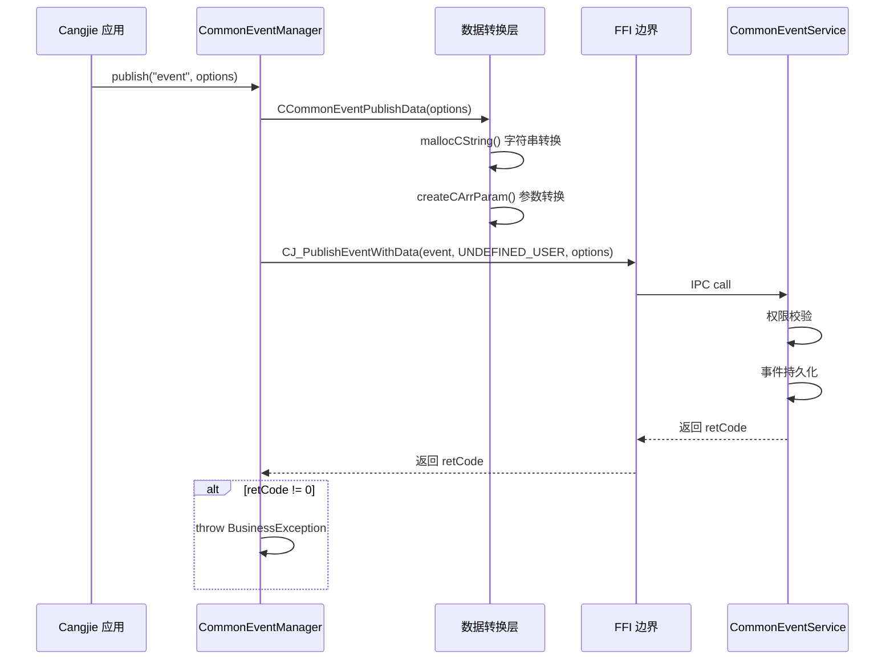
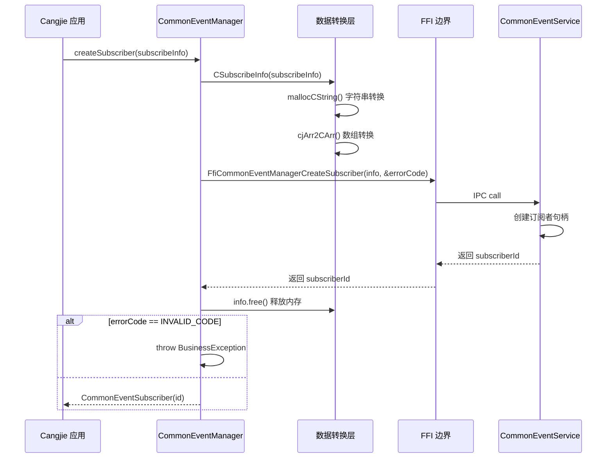
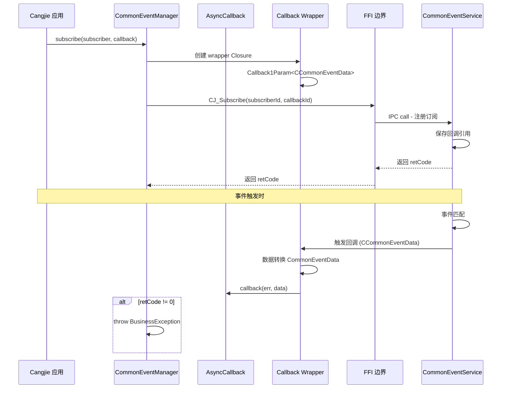
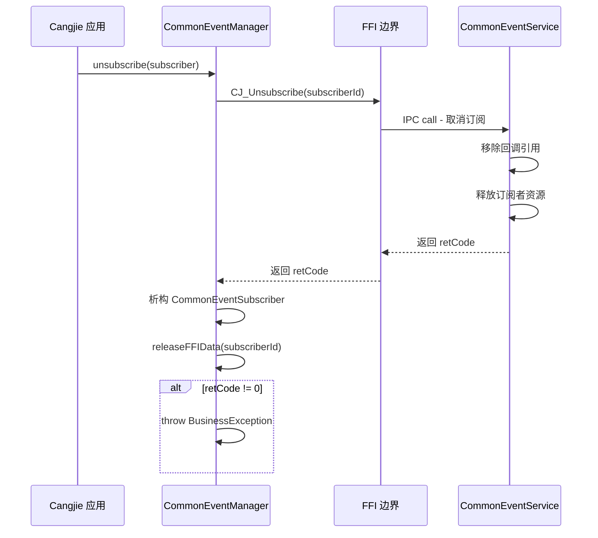
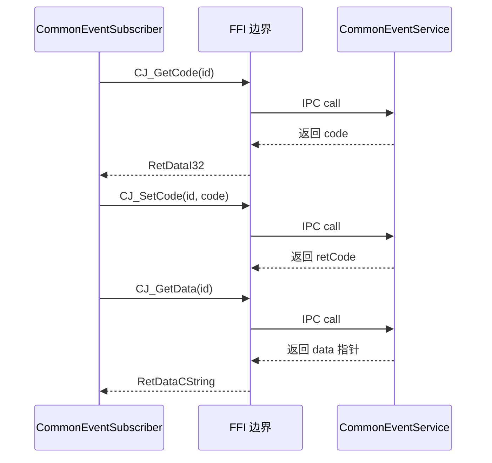

# 关键调用链

## 发布事件调用链

### publish()



**代码路径**:

1. `common_event_manager.cj:57-67`
2. `common_event_publish_data.cj:141-163` (数据转换)
3. `common_event_manager_ffi.cj:26` (FFI 声明)
4. → `common_event_service:cj_common_event_manager_ffi` (C++ 实现)

---

## 创建订阅者调用链

### createSubscriber()



**代码路径**:

1. `common_event_manager.cj:82-92`
2. `common_event_subscribe_info.cj:36-54` (数据转换)
3. `common_event_manager_ffi.cj:38` (FFI 声明)
4. → `common_event_service:cj_common_event_manager_ffi` (C++ 实现)

---

## 订阅事件调用链

### subscribe()



**代码路径**:

1. `common_event_manager.cj:109-118`
2. `common_event_data.cj:77-91` (数据接收)
3. `common_event_manager_ffi.cj:34` (FFI 声明)
4. → `common_event_service:cj_common_event_manager_ffi` (C++ 实现)

**线程注意**: callback 在主线程执行

---

## 取消订阅调用链

### unsubscribe()



**代码路径**:

1. `common_event_manager.cj:134-137`
2. `common_event_subscriber.cj:35-37` (资源释放)
3. `common_event_manager_ffi.cj:36` (FFI 声明)
4. → `common_event_service:cj_common_event_manager_ffi` (C++ 实现)

---

## 订阅者属性操作调用链

### CommonEventSubscriber getter/setter



**代码路径**:

1. `common_event_subscriber_ffi.cj:22-45` (所有 FFI 声明)
2. → `common_event_service:cj_common_event_manager_ffi` (C++ 实现)

---

## 完整调用层次

```
Cangjie 应用
    │
    ├── CommonEventManager
    │       ├── publish()
    │       ├── createSubscriber()
    │       ├── subscribe()
    │       └── unsubscribe()
    │
    ├── CommonEventPublishData
    │       └── @C struct CCommonEventPublishData
    │
    ├── CommonEventSubscribeInfo
    │       └── @C struct CSubscribeInfo
    │
    ├── CommonEventData
    │       └── @C struct CCommonEventData
    │
    └── CommonEventSubscriber
            └── RemoteDataLite
                    │
                    └── FFI 数据句柄 (Int64 id)

FFI 边界 (foreign { func CJ_* })
    │
    └── common_event_service:cj_common_event_manager_ffi
            │
            ├── IPCSkeleton
            │       │
            │       └── SendRequest(CommonEventService)
            │
            ├── CES Permission Check
            │
            └── Event Store & Dispatch
```

---

## 资源生命周期

```
┌─────────────────────────────────────────────────────────────────┐
│                     publish() 资源生命周期                        │
├─────────────────────────────────────────────────────────────────┤
│  mallocCString(event)  ──→  CString  ──→  asResource()  ──→  │
│                          自动释放                                     │
├─────────────────────────────────────────────────────────────────┤
│  mallocCString(data)  ──→  CString  ──→  asResource()  ──→  │
│                          自动释放                                     │
├─────────────────────────────────────────────────────────────────┤
│  CCommonEventPublishData  ──→  CTypeResource  ──→  自动释放    │
└─────────────────────────────────────────────────────────────────┘

┌─────────────────────────────────────────────────────────────────┐
│                  createSubscriber() 资源生命周期                  │
├─────────────────────────────────────────────────────────────────┤
│  CSubscribeInfo  ──→  mallocCString()  ──→  FFI 调用  ──→  │
│                                      free() 释放                 │
├─────────────────────────────────────────────────────────────────┤
│  subscriberId  ──→  CommonEventSubscriber  ──→  析构  ──→     │
│                              releaseFFIData()                    │
└─────────────────────────────────────────────────────────────────┘
```
