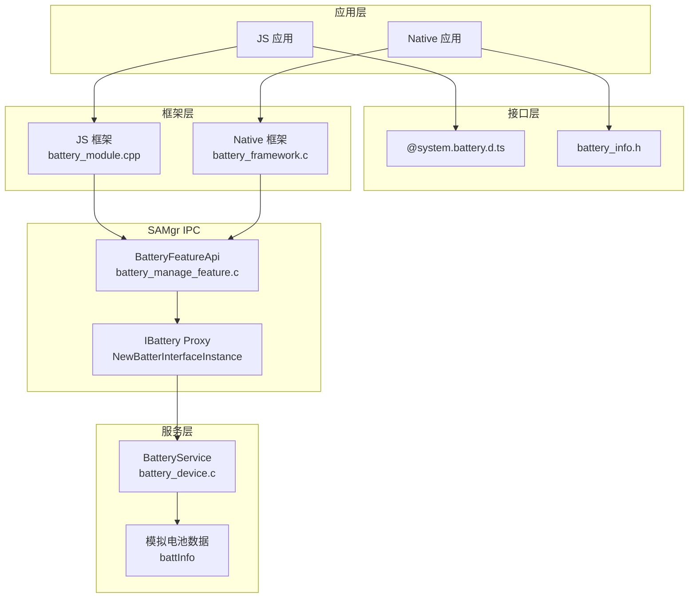

# 架构说明

> **目的**: 说明 battery_lite 的整体架构设计、组件关系、数据流向和线程模型。  
> **适用范围**: 需要理解系统如何工作的开发者。  
> **关键结论**: 项目采用 SAMgr IPC 架构，分为服务层、框架层和 JS 绑定层，使用回调模式实现跨线程数据获取。

---

## 整体架构图



**证据**: 架构图基于以下源代码分析：
- `services/src/battery_device.c:19-28` 定义了模拟电池数据 `battInfo`
- `services/src/battery_manage_feature.c:50-55` 实现了电量查询代理
- `frameworks/native/src/mini/battery_framework.c:25-44` 实现了接口获取

---

## 组件职责

### 服务层组件

#### BatteryService (`battery_device.c`)

**职责**: 电池硬件抽象服务的实现，作为 SAMgr 的默认服务运行。

| 特性 | 值 |
|------|-----|
| Service 名称 | `"battery_service"` |
| 任务优先级 | `LEVEL_HIGH` |
| 线程优先级 | `PRIORITY_BELOW_NORMAL` |
| 栈大小 | `0x800` (2KB) |
| 队列大小 | `20` |

**暴露接口**:
- `GetSoc()` - 获取电量
- `GetChargingStatus()` - 获取充电状态
- `GetHealthStatus()` - 获取健康状态
- `GetPluggedType()` - 获取连接类型
- `GetVoltage()` - 获取电压
- `GetTechnology()` - 获取电池技术
- `GetTemperature()` - 获取温度
- `TurnOnLed()` / `TurnOffLed()` / `SetLedColor()` / `GetLedColor()` - LED 控制
- `ShutDown()` - 关机
- `UpdateBatInfo()` - 更新电池信息

**关键证据**: `services/include/battery_device.h:46-61` 定义了完整的 `BatteeryDeviceFeatureApi` 接口。

#### BatteryFeature (`battery_manage_feature.c`)

**职责**: 作为电池服务的代理层特征，向框架层提供 `IBattery` 接口。

| 特性 | 值 |
|------|-----|
| Feature 名称 | `"battery_feature"` |
| 服务名称 | `"battery_service"` |

**实现函数**:
- `BatterySocImpl()` - 电量查询
- `ChargingStatusImpl()` - 充电状态查询
- `HealthStatusImpl()` - 健康状态查询
- `PluggedTypeImpl()` - 连接类型查询
- `VoltageImpl()` - 电压查询
- `TechnologyImpl()` - 技术型号查询
- `BatteryTemperatureImpl()` - 温度查询

**关键证据**: `services/include/battery_manage_feature.h:45-67` 定义了所有实现函数。

### 框架层组件

#### Native 框架 (`battery_framework.c`)

**职责**: 为 Native 应用提供电池管理 API，封装 SAMgr IPC 调用。

**核心函数**:

```c
// 获取电池接口实例（线程安全）
static BatteryInterface *GetBatteryInterface(void)
{
    pthread_mutex_lock(&g_mutex);  // 互斥锁保护
    if (g_intf != NULL) {
        pthread_mutex_unlock(&g_mutex);
        return g_intf;
    }
    IUnknown *iUnknown = GetBatteryIUnknown();
    // ... 查询接口
    pthread_mutex_unlock(&g_mutex);
    return g_intf;
}
```

**公共 API**:
- `GetBatSoc()` - 获取电量
- `GetChargingStatus()` - 获取充电状态
- `GetHealthStatus()` - 获取健康状态
- `GetPluggedType()` - 获取连接类型
- `GetBatVoltage()` - 获取电压
- `GetBatTechnology()` - 获取电池技术
- `GetBatTemperature()` - 获取温度

**关键证据**: `frameworks/native/src/mini/battery_framework.c:22-115` 实现了完整的框架层。

#### JS 框架 (`battery_module.cpp`)

**职责**: 为 ACELite JS 运行时提供电池管理模块。

**注册函数**:
```cpp
void InitBatteryModule(JSIValue exports)
{
    JSI::SetModuleAPI(exports, "BatterySOC", BatteryModule::GetBatterySOC);
    JSI::SetModuleAPI(exports, "ChargingStatus", BatteryModule::GetChargingStatus);
    JSI::SetModuleAPI(exports, "HealthStatus", BatteryModule::GetHealthStatus);
    JSI::SetModuleAPI(exports, "PluggedType", BatteryModule::GetPluggedType);
    JSI::SetModuleAPI(exports, "Voltage", BatteryModule::GetVoltage);
    JSI::SetModuleAPI(exports, "Technology", BatteryModule::GetTechnology);
    JSI::SetModuleAPI(exports, "Temperature", BatteryModule::GetTemperature);
}
```

**关键证据**: `frameworks/js/builtin/src/battery_module.cpp:157-168` 定义了模块初始化。

---

## 数据流分析

### Native API 调用流程

```
Native 应用
    ↓调用 GetBatSoc()
frameworks/native/src/battery_framework.c:GetBatSoc()
    ↓调用 GetBatteryInterface()
    ↓获取 IUnknown 接口
    ↓调用 intf->GetBatSocFunc()
services/src/battery_manage_feature.c:BatterySocImpl()
    ↓调用 NewBatterInterfaceInstance()
    ↓获取 IBattery 接口
    ↓调用 g_batteryDevice->GetSoc()
services/src/battery_device.c:GetSocImpl()
    ↓返回 battInfo.batSoc
```

**关键证据**:
- `frameworks/native/src/mini/battery_framework.c:47-55` 实现了 `GetBatSoc()` 函数
- `services/src/battery_manage_feature.c:47-56` 实现了 `BatterySocImpl()` 函数
- `services/src/battery_device.c:71-74` 实现了 `GetSocImpl()` 函数

### JS API 调用流程

```
JS 应用
    ↓调用 battery.BatterySOC()
frameworks/js/builtin/src/battery_module.cpp:GetBatterySOC()
    ↓调用 GetBatSocImpl()
    ↓创建 JS 对象 result
    ↓调用 SuccessCallBack()
    ↓执行 success 回调函数
```

**关键证据**: `frameworks/js/builtin/src/battery_module.cpp:44-58` 实现了 `GetBatterySOC()` 方法。

---

## 线程模型

### 服务线程

BatteryService 运行在独立线程，配置如下：

| 参数 | 值 | 说明 |
|------|-----|------|
| 优先级级别 | `LEVEL_HIGH` | 高优先级 |
| 线程优先级 | `PRIORITY_BELOW_NORMAL` | 低于普通优先级 |
| 栈大小 | `0x800` (2048 字节) | 2KB 栈空间 |
| 队列大小 | `20` | 消息队列深度 |
| 任务类型 | `SHARED_TASK` | 共享任务模式 |

**证据**: `services/include/battery_device.h:42-43` 和 `services/src/battery_device.c:54-59`。

### 框架线程安全

Native 框架使用互斥锁保护接口获取：

```c
static pthread_mutex_t g_mutex = PTHREAD_MUTEX_INITIALIZER;
static BatteryInterface *g_intf = NULL;
```

**证据**: `frameworks/native/src/mini/battery_framework.c:22-23`。

### JS 回调执行

JS API 采用回调模式，不阻塞 JS 线程：

```cpp
void SuccessCallBack(const JSIValue thisVal, const JSIValue args, JSIValue jsiValue)
{
    if (!JSI::ValueIsUndefined(success)) {
        JSI::CallFunction(success, thisVal, &jsiValue, ARGC_ONE);
    }
    if (!JSI::ValueIsUndefined(complete)) {
        JSI::CallFunction(complete, thisVal, nullptr, 0);
    }
}
```

**证据**: `frameworks/js/builtin/src/battery_module.cpp:23-41` 实现了回调处理。

---

## 接口定义

### IBattery 接口

服务层向框架层暴露的核心接口：

```c
typedef struct IBattery {
    int32_t (*GetSoc)();                                    // 获取电量
    BatteryChargeState (*GetChargingStatus)();              // 获取充电状态
    BatteryHealthState (*GetHealthStatus)();                // 获取健康状态
    BatteryPluggedType (*GetPluggedType)();                 // 获取连接类型
    int32_t (*GetVoltage)();                                // 获取电压
    char* (*GetTechnology)();                               // 获取技术
    int32_t (*GetTemperature)();                            // 获取温度
    int (*TurnOnLed)(int, int, int);                       // 点亮 LED
    int (*TurnOffLed)();                                   // 关闭 LED
    int (*SetLedColor)(int, int, int);                     // 设置颜色
    int (*GetLedColor)(int*, int*, int*);                  // 获取颜色
    void (*ShutDown)();                                    // 关机
    void (*UpdateBatInfo)(BatInfo*);                       // 更新信息
} IBattery;
```

**证据**: `services/include/ibattery.h:45-59` 定义了完整的接口。

### BatInfo 数据结构

```c
typedef struct {
    int32_t batSoc;              // 电池电量 (0-100)
    int32_t batVoltage;          // 电池电压 (mV)
    int32_t BatTemp;             // 电池温度 (0.1℃)
    int32_t batCapacity;        // 电池容量
    BatteryChargeState chargingStatus;  // 充电状态
    BatteryPluggedType pluggedType;     // 连接类型
    char BatTechnology[64];      // 电池技术型号
    BatteryHealthState healthStatus;    // 健康状态
} BatInfo;
```

**证据**: `services/include/ibattery.h:26-43` 定义了数据结构。

---

## 初始化流程

### SAMgr 注册

```c
// 电池设备服务注册
static void Init(void)
{
    BOOL result = SAMGR_GetInstance()->RegisterService((Service *)&g_batteryDevice);
    BOOL apiResult = SAMGR_GetInstance()->RegisterDefaultFeatureApi(
        BATTERY_DEVICE, GET_IUNKNOWN(g_batteryDevice));
}

// 电池特征注册
static void GInit()
{
    BatteryFeatureApi *feature = GetBatteryFeatureImpl();
    BOOL result = SAMGR_GetInstance()->RegisterFeature(BATTERY_SERVICE, (Feature *)feature);
    BOOL apiResult = SAMGR_GetInstance()->RegisterFeatureApi(
        BATTERY_SERVICE, BATTERY_INNER, GET_IUNKNOWN(*feature));
}

SYSEX_SERVICE_INIT(Init);    // 注册服务
SYSEX_FEATURE_INIT(GInit);   // 注册特征
```

**证据**:
- `services/src/battery_device.c:182-193` 实现了服务初始化
- `services/src/battery_manage_feature.c:118-133` 实现了特征初始化

---

## 相关文档

| 文档 | 说明 |
|------|------|
| [N-API 接口](03_N_API.md) | 完整 API 清单 |
| [内部 API](04_Inner_API.md) | 模块接口详细说明 |
| [GN 构建](05_GN_Build.md) | 构建 Targets 和产物 |
| [安全评审](06_Security_Review.md) | 安全风险分析 |
| [调用链图谱](appendix/Callgraphs.md) | 详细调用链 |
