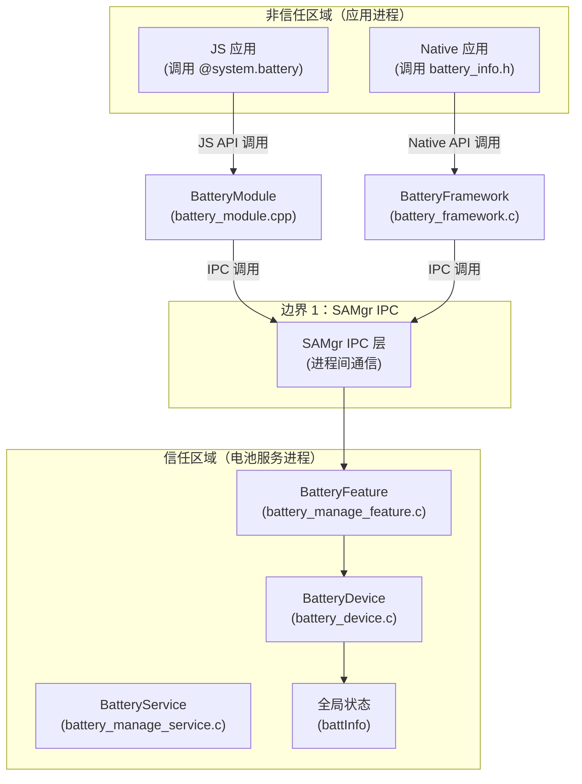

# 攻击面分析

> **目的**：识别 battery_lite 项目的所有外部输入点、敏感操作和信任边界，为安全审计提供完整入口清单。  
> **适用范围**：安全研究员、渗透测试工程师、安全审计人员。  
> **关键结论**：项目存在 3 类主要攻击面——JS/N-API 接口（风险等级：中）、Native IPC 接口（风险等级：低）、SAMgr 服务边界（风险等级：低）。建议重点关注 JS API 参数验证不足的问题。

---

## 1. 外部输入点清单

### 1.1 JS/N-API 接口入口

所有 JS API 通过 `@system.battery` 模块暴露，采用异步回调模式。攻击者可通过构造恶意参数触发潜在漏洞。

| 序号 | API | 输入参数 | 风险等级 | 位置 | 验证状态 |
|------|-----|---------|---------|------|----------|
| 1 | `battery.BatterySOC()` | options 对象（success/fail/complete 回调） | 中 | `battery_module.cpp:44` | 仅检查 undefined |
| 2 | `battery.ChargingStatus()` | options 对象 | 中 | `battery_module.cpp:60` | 仅检查 undefined |
| 3 | `battery.HealthStatus()` | options 对象 | 中 | `battery_module.cpp:76` | 仅检查 undefined |
| 4 | `battery.PluggedType()` | options 对象 | 中 | `battery_module.cpp:92` | 仅检查 undefined |
| 5 | `battery.Voltage()` | options 对象 | 中 | `battery_module.cpp:109` | 仅检查 undefined |
| 6 | `battery.Technology()` | options 对象 | 中 | `battery_module.cpp:125` | 仅检查 undefined |
| 7 | `battery.Temperature()` | options 对象 | 中 | `battery_module.cpp:141` | 仅检查 undefined |

**证据**：`frameworks/js/builtin/src/battery_module.cpp:48-50`

```cpp
if ((args == nullptr) || (argsNum == 0) || JSI::ValueIsUndefined(args[0])) {
    return undefValue;
}
```

**分析**：当前仅验证参数是否为空（undefined），未验证：
- 参数是否为有效的对象类型
- success/fail/complete 回调是否为函数类型
- 对象属性是否完整

### 1.2 Native C API 入口

Native API 直接暴露给 C/C++ 应用，接收整型返回值。

| 序号 | API | 输入参数 | 风险等级 | 位置 | 验证状态 |
|------|-----|---------|---------|------|----------|
| 1 | `GetBatSoc()` | 无 | 低 | `battery_framework.c:47` | 内部有 NULL 检查 |
| 2 | `GetChargingStatus()` | 无 | 低 | `battery_framework.c:63` | 内部有 NULL 检查 |
| 3 | `GetHealthStatus()` | 无 | 低 | `battery_framework.c:79` | 内部有 NULL 检查 |
| 4 | `GetPluggedType()` | 无 | 低 | `battery_framework.c:95` | 内部有 NULL 检查 |
| 5 | `GetBatVoltage()` | 无 | 低 | `battery_framework.c:111` | 内部有 NULL 检查 |
| 6 | `GetBatTechnology()` | 无 | 低 | `battery_framework.c:145` | 返回内部缓冲区指针 |
| 7 | `GetBatTemperature()` | 无 | 低 | `battery_framework.c:161` | 内部有 NULL 检查 |

**证据**：`frameworks/native/src/mini/battery_framework.c:47-55`

```c
int32_t GetBatSoc(void)
{
    int32_t ret = EC_FAILURE;
    BatteryInterface *intf = GetBatteryInterface();
    if ((intf != NULL) && (intf->GetBatSocFunc != NULL)) {
        ret = intf->GetBatSocFunc((IUnknown *)intf);
    }
    return ret;
}
```

**分析**：Native API 风险较低，因不接收外部输入参数。但需注意：
- `intf->GetBatSocFunc` 函数指针可能为 NULL
- `GetBatTechnology()` 返回内部静态缓冲区，存在信息泄露风险

### 1.3 IPC 数据入口

Small 系统通过 SAMgr IPC 接收远程调用数据。

| 序号 | 函数 ID | 处理函数 | 风险等级 | 位置 | 说明 |
|------|---------|---------|---------|------|------|
| 1 | `BATTERY_FUNCID_GETSOC` | `BatterySocInvoke()` | 低 | `battery_feature_impl.c:63` | 获取电量 |
| 2 | `BATTERY_FUNCID_GETCHARGING` | `ChargingStatusInvoke()` | 低 | `battery_feature_impl.c:73` | 获取充电状态 |
| 3 | `BATTERY_FUNCID_GETHEALTH` | `HealthStatusInvoke()` | 低 | `battery_feature_impl.c:83` | 获取健康状态 |
| 4 | `BATTERY_FUNCID_GETPLUGTYPE` | `PluggedTypeInvoke()` | 低 | `battery_feature_impl.c:93` | 获取连接类型 |
| 5 | `BATTERY_FUNCID_GETVOLTAGE` | `VoltageInvoke()` | 低 | `battery_feature_impl.c:103` | 获取电压 |
| 6 | `BATTERY_FUNCID_GETTECHNOLONY` | `TechnologyInvoke()` | 低 | `battery_feature_impl.c:113` | 获取电池技术 |
| 7 | `BATTERY_FUNCID_GETTEMPERATURE` | `BatteryTemperatureInvoke()` | 低 | `battery_feature_impl.c:124` | 获取温度 |

**证据**：`services/src/small/battery_feature_impl.c:54-61`

```c
static int32_t FeatureInvoke(IServerProxy *iProxy, int funcId, void *origin, IpcIo *req, IpcIo *reply)
{
    (void)iProxy;
    (void)origin;
    (void)req;
    (void)reply;
    if (funcId >= 0 && funcId < BATTERY_FUNCID_END) {
        return g_invokeFuncs[funcId](iProxy, origin, req, reply);
    }
    return EC_FAILURE;
}
```

**分析**：IPC 层有基本的 funcId 范围检查，但：
- 未验证 `origin`（调用者身份）
- 未验证 `req`（请求数据合法性）
- `reply` 输出参数未初始化验证

### 1.4 服务消息入口

BatteryService 通过消息队列接收内部消息。

| 序号 | 消息 ID | 处理函数 | 风险等级 | 位置 | 说明 |
|------|---------|---------|---------|------|------|
| 1 | `BATT_SRV_MSG_UPDATE` | `MessageHandle()` | 低 | `battery_manage_service.c:72` | 电池信息更新 |

**证据**：`services/src/battery_manage_service.c:64-79`

```c
static BOOL MessageHandle(Service *service, Request *request)
{
    (void)service;
    if ((request == NULL) ||
        ((BatteryServiceMsgID)(request->msgId) >= BATT_SRV_MSG_ID_MAX)) {
        return false;
    }
    switch (request->msgId) {
        case BATT_SRV_MSG_UPDATE:
            UpdateBatteryMsg(&battpoint);
            break;
        default:
            break;
    }
    return true;
}
```

**分析**：消息处理有基本验证，但：
- `request->msgId` 强制转换为枚举类型可能产生截断
- `UpdateBatteryMsg()` 接收的 `battpoint` 是内部静态变量

---

## 2. 敏感操作清单

### 2.1 硬件操作

| 操作 | 函数 | 风险等级 | 位置 | 当前实现 |
|------|-----|---------|------|----------|
| LED 控制 | `TurnOnLedImpl()` | **中** | `battery_device.c:99` | 空实现 |
| LED 控制 | `TurnOffLedImpl()` | **中** | `battery_device.c:106` | 空实现 |
| LED 控制 | `SetLedColorImpl()` | **中** | `battery_device.c:110` | 空实现 |
| LED 状态读取 | `GetLedColorImpl()` | 低 | `battery_device.c:117` | 空实现 |
| 设备关机 | `ShutDownImpl()` | **高** | `battery_device.c:124` | 空实现 |

**证据**：`services/include/battery_device.h:55-58`

```c
int (*TurnOnLed)(int red, int green, int blue);
int (*TurnOffLed)(void);
int (*SetLedColor)(int red, int green, int blue);
int (*GetLedColor)(int *red, int *green, int *blue);
void (*ShutDown)(void);
```

**风险分析**：
- LED 控制当前为空实现，但**未添加任何权限检查**
- 恶意应用可能通过调用 LED API 进行拒绝服务攻击
- `ShutDown()` 函数权限最高，但同样无保护

### 2.2 数据读取操作

| 操作 | 函数 | 返回类型 | 风险等级 | 位置 |
|------|-----|---------|---------|------|
| 获取电量 | `GetSocImpl()` | `int32_t` | 低 | `battery_device.c:71` |
| 获取充电状态 | `GetChargingStatusImpl()` | `BatteryChargeState` | 低 | `battery_device.c:75` |
| 获取健康状态 | `GetHealthStatusImpl()` | `BatteryHealthState` | 低 | `battery_device.c:79` |
| 获取连接类型 | `GetPluggedTypeImpl()` | `BatteryPluggedType` | 低 | `battery_device.c:83` |
| 获取电压 | `GetVoltageImpl()` | `int32_t` | 低 | `battery_device.c:87` |
| 获取电池技术 | `GetTechnologyImpl()` | `char*` | 低 | `battery_device.c:91` |
| 获取温度 | `GetTemperatureImpl()` | `int32_t` | 低 | `battery_device.c:95` |

**特殊风险**：`GetTechnologyImpl()` 返回内部静态缓冲区指针

**证据**：`services/src/battery_device.c:91-94`

```c
char *GetTechnologyImpl(void)
{
    return battInfo.BatTechnology;
}
```

### 2.3 数据更新操作

| 操作 | 函数 | 风险等级 | 位置 | 说明 |
|------|-----|---------|------|------|
| 更新电池信息 | `UpdateBatInfoImpl()` | 中 | `battery_device.c:127` | 写入全局状态 |

**证据**：`services/src/battery_device.c:127-142`

```c
void UpdateBatInfoImpl(BatInfo *battery)
{
    if (battery == NULL) {
        return;
    }
    if (strcpy_s(battery->BatTechnology, BATTECHNOLOGY_LEN, battInfo.BatTechnology) != EOK) {
        return;
    }
    battery->batSoc = battInfo.batSoc;
    battery->batVoltage = battInfo.batVoltage;
    // ... 复制其他字段
}
```

**风险分析**：
- 源和目标参数顺序疑似错误（从 `battInfo` 复制到 `battery`）
- `strcpy_s` 返回值被忽略

---

## 3. 信任边界图

### 3.1 整体信任边界



### 3.2 边界说明

| 边界 | 类型 | 跨越方向 | 验证机制 |
|------|------|---------|----------|
| JS → BatteryModule | 函数调用 | 单进程内 | 参数 NULL 检查 |
| Native → BatteryFramework | 函数调用 | 单进程内 | 接口 NULL 检查 |
| BatteryFramework → SAMgr | IPC 调用 | 跨进程 | SAMgr 认证（依赖系统） |
| SAMgr → Feature | IPC 调用 | 跨进程 | funcId 范围检查 |
| Feature → Device | 函数调用 | 单进程内 | 无验证 |

### 3.3 信任假设

| 层级 | 信任假设 | 风险影响 |
|------|---------|----------|
| JS 运行时 | 参数类型正确 | 类型错误导致崩溃 |
| Native 应用 | 正确初始化接口 | NULL 指针解引用 |
| SAMgr IPC | 调用者身份可信 | 权限提升攻击 |
| 服务内部 | 数据来源可信 | 全局状态污染 |

---

## 4. 权限检查点

### 4.1 当前权限控制

| 检查点 | 是否实现 | 位置 | 说明 |
|--------|---------|------|------|
| JS API 权限 | ❌ | `battery_module.cpp` | 无权限检查 |
| Native API 权限 | ❌ | `battery_framework.c` | 无权限检查 |
| LED 控制权限 | ❌ | `battery_device.c` | 无权限检查 |
| 关机权限 | ❌ | `battery_device.c` | 无权限检查 |
| IPC 调用者身份 | ⚠️ | `battery_feature_impl.c` | 依赖 SAMgr 底层 |

### 4.2 建议的权限检查点

```
┌─────────────────────────────────────────────────────────────┐
│                    应用进程                                  │
│  ┌─────────────────────────────────────────────────────┐ │
│  │  检查应用是否有权访问电池服务                          │ │
│  │  CheckPermission("ohos.permission.READ_BATTERY_STATE") │ │
│  └─────────────────────────────────────────────────────┘ │
│                            │                                │
│                            ▼                                │
│  ┌─────────────────────────────────────────────────────┐ │
│  │  SAMgr IPC 层                                        │ │
│  │  - 验证调用者 UID/PID                               │ │
│  │  - 检查 capability                                   │ │
│  └─────────────────────────────────────────────────────┘ │
│                            │                                │
│                            ▼                                │
│  ┌─────────────────────────────────────────────────────┐ │
│  │                    服务进程                           │ │
│  │  ┌─────────────────────────────────────────────────┐│ │
│  │  │  检查 LED/关机操作的特殊权限                     ││ │
│  │  │  CheckPermission("ohos.permission.CONTROL_LED") ││ │
│  │  └─────────────────────────────────────────────────┘│ │
│  └─────────────────────────────────────────────────────┘ │
└─────────────────────────────────────────────────────────────┘
```

---

## 5. 数据流分析

### 5.1 JS API 数据流

```
用户输入 (JS 参数)
    │
    ▼
BatteryModule::GetBatterySOC(args)
    │
    ├──▶ 参数验证: IsUndefined(args[0]) ──▶ 失败返回 undefined
    │
    └──▶ GetBatSocImpl() ──▶ GetBatSoc() ──▶ IPC 调用
                                                  │
                                                  ▼
                                           SAMgr IPC 边界
                                                  │
                                                  ▼
                                           BatterySocImpl()
                                                  │
                                                  ▼
                                           GetSocImpl()
                                                  │
                                                  ▼
                                           battInfo.batSoc (全局状态)
                                                  │
                                                  ▼
                                           返回结果
                                                  │
                                                  ▼
                                           SuccessCallBack(data)
                                                  │
                                                  ▼
                                           JS 回调执行
```

**攻击路径**：参数验证不足 → 异常参数 → JS 运行时错误

### 5.2 Native API 数据流

```
Native 应用调用
    │
    ▼
GetBatSoc()
    │
    ├──▶ GetBatteryInterface() ──▶ pthread_mutex_lock()
    │                                      │
    │                                      ▼
    │                               SAMGR_GetInstance()
    │                                      │
    │                                      ▼
    │                               GetFeatureApi()
    │                                      │
    │                                      ▼
    │                               QueryInterface()
    │                                      │
    │                                      ▼
    │                               g_intf (缓存指针)
    │
    └──▶ intf->GetBatSocFunc() ──▶ 返回电量值
```

**攻击路径**：接口 NULL → 返回错误码（当前处理正确）

### 5.3 数据验证点

| 阶段 | 验证内容 | 当前实现 | 建议 |
|------|---------|---------|------|
| JS 参数 | 对象类型 | ❌ 仅 undefined 检查 | 添加 ValueIsObject 验证 |
| JS 参数 | 回调函数类型 | ❌ 无检查 | 添加 ValueIsFunction 验证 |
| IPC funcId | 范围检查 | ✅ 有检查 | 无需改进 |
| IPC 响应 | 缓冲区大小 | ⚠️ 依赖 IPC 框架 | 无需改进 |
| 返回值 | 类型验证 | ⚠️ 依赖调用方 | 添加范围检查 |

---

## 6. 并发安全边界

### 6.1 受保护资源

| 资源 | 保护机制 | 位置 | 状态 |
|------|---------|------|------|
| `g_intf` 指针 | `pthread_mutex_t g_mutex` | `battery_framework.c:22` | ✅ 已保护 |
| `g_batteryFeatureHandle` | 无 | `battery_device.c:30` | ❌ 竞态风险 |
| `battInfo` 全局状态 | 无 | `battery_device.c:19` | ❌ 竞态风险 |

**证据**：`frameworks/native/src/mini/battery_framework.c:22-23`

```c
static pthread_mutex_t g_mutex = PTHREAD_MUTEX_INITIALIZER;
static BatteryInterface *g_intf = NULL;
```

### 6.2 竞态场景分析

| 场景 | 风险等级 | 触发条件 | 影响 |
|------|---------|---------|------|
| `GetBatteryInterface()` 并发调用 | 低 | 多线程同时首次调用 | 双重初始化 |
| `battInfo` 读写竞争 | 中 | 服务更新与应用读取并发 | 数据不一致 |
| `g_batteryFeatureHandle` 懒初始化 | 中 | 多线程同时获取 | NULL 指针解引用 |

---

## 7. 摘要与建议

### 7.1 攻击面摘要

| 类别 | 输入点数量 | 高风险 | 中风险 | 低风险 |
|------|-----------|--------|--------|--------|
| JS/N-API 接口 | 7 | 0 | 7 | 0 |
| Native API | 7 | 0 | 0 | 7 |
| IPC 接口 | 7 | 0 | 0 | 7 |
| 服务消息 | 1 | 0 | 0 | 1 |
| **合计** | **22** | **0** | **7** | **15** |

### 7.2 高优先级安全建议

| 序号 | 建议 | 影响范围 | 难度 | 状态 |
|------|------|---------|------|------|
| 1 | 增强 JS API 参数类型验证 | 7 个 API | 低 | 待实现 |
| 2 | 为 LED/关机操作添加权限检查 | 5 个函数 | 中 | 待实现 |
| 3 | 保护 `battInfo` 全局状态 | 电池数据一致性 | 中 | 待实现 |
| 4 | 保护 `g_batteryFeatureHandle` | 接口获取 | 低 | 待实现 |
| 5 | 修复 `UpdateBatInfoImpl()` 参数顺序 | 数据更新 | 低 | 待验证 |

### 7.3 安全影响评估

| 风险类型 | 可利用性 | 权限提升 | 数据泄露 | DoS |
|---------|---------|---------|---------|-----|
| JS 参数验证不足 | ⭐⭐ | 否 | 可能 | 可能 |
| LED 无权限控制 | ⭐⭐ | 可能 | 否 | 可能 |
| 全局状态竞态 | ⭐ | 否 | 可能 | 可能 |
| 关机无权限 | ⭐⭐⭐ | **是** | 否 | **是** |

**总体风险等级**：**中**（存在可利用的中高风险点，但影响范围有限）

---

## 相关文档

| 文档 | 说明 |
|------|------|
| [06_Security_Review.md](./06_Security_Review.md) | 详细安全风险评估和修复建议 |
| [02_Architecture.md](./02_Architecture.md) | 完整架构设计 |
| [03_N_API.md](./03_N_API.md) | JS API 详细说明 |
| [04_Inner_API.md](./04_Inner_API.md) | 内部 API 接口 |
