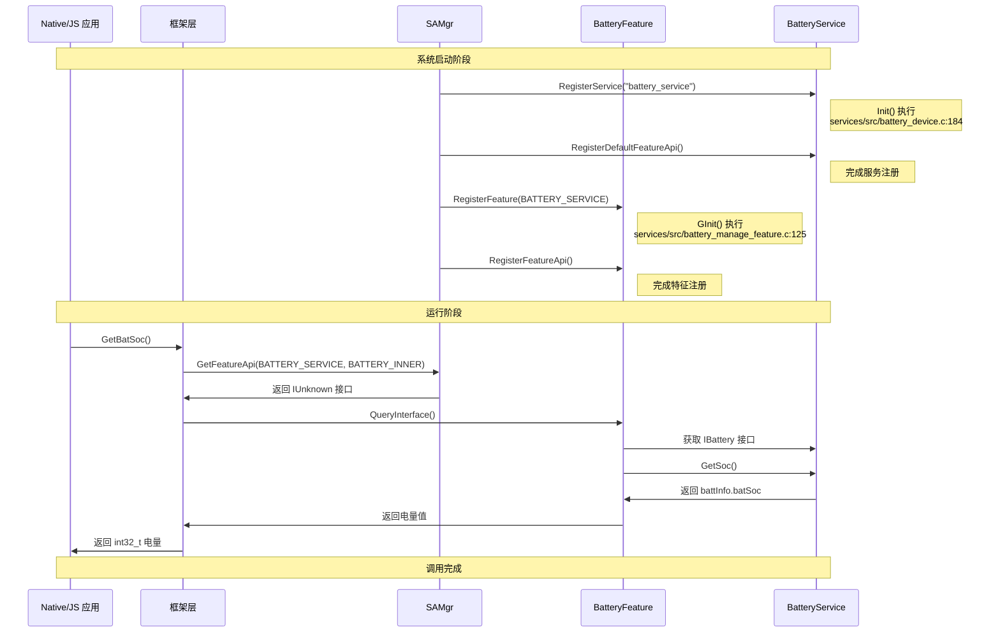

# 调用链图谱

> **目的**: 梳理 battery_lite 项目中关键功能的完整调用链，从 JS/Native 入口到服务实现。  
> **适用范围**: 需要理解调用路径、进行调试或性能分析的开发者。  
> **关键结论**: JS API 和 Native API 调用都经过 SAMgr IPC 层，服务层提供实际数据或模拟实现。

---

## 1. Native API 调用链

### 1.1 GetBatSoc() 调用链

```
Native 应用
    │
    │ 调用 GetBatSoc()
    ▼
┌─────────────────────────────────────────────────────────────┐
│  frameworks/native/include/battery_framework.h              │
│  GetBatteryIUnknown() → SAMGR_GetFeatureApi()              │
└─────────────────────────────────────────────────────────────┘
    │
    │ 获取 IUnknown 接口
    ▼
┌─────────────────────────────────────────────────────────────┐
│  frameworks/native/src/mini/battery_framework.c:47-55      │
│  GetBatSoc()                                               │
│  ├─ GetBatteryInterface() ──→ pthread_mutex_lock()        │
│  │                               GetBatteryIUnknown()      │
│  │                               QueryInterface()         │
│  │                               pthread_mutex_unlock()   │
│  └─ intf->GetBatSocFunc()                                  │
└─────────────────────────────────────────────────────────────┘
    │
    │ 调用接口函数
    ▼
┌─────────────────────────────────────────────────────────────┐
│  services/src/battery_manage_feature.c:47-56                │
│  BatterySocImpl()                                          │
│  ├─ NewBatterInterfaceInstance()                            │
│  │   └─ ChargingApiGet() → SAMGR_GetDefaultFeatureApi()    │
│  └─ g_batteryDevice->GetSoc()                               │
└─────────────────────────────────────────────────────────────┘
    │
    │ 调用服务接口
    ▼
┌─────────────────────────────────────────────────────────────┐
│  services/src/battery_device.c:71-74                        │
│  GetSocImpl()                                              │
│  └─ return battInfo.batSoc                                  │
└─────────────────────────────────────────────────────────────┘
    │
    │ 返回数据
    ▼
Native 应用 (收到电量值 0-100)
```

### 1.2 GetChargingStatus() 调用链

```
Native 应用
    │
    │ 调用 GetChargingStatus()
    ▼
frameworks/native/src/mini/battery_framework.c:57-65
    │
    ├─ GetBatteryInterface()
    └─ intf->GetChargingStatusFunc()
        │
        ▼
services/src/battery_manage_feature.c:57-66
    │
    ├─ NewBatterInterfaceInstance()
    └─ g_batteryDevice->GetChargingStatus()
        │
        ▼
services/src/battery_device.c:75-78
    │
    └─ return battInfo.chargingStatus
        │
        ▼
Native 应用 (收到充电状态枚举值)
```

---

## 2. JS API 调用链

### 2.1 BatterySOC() 调用链

```
JS 应用
    │
    │ battery.BatterySOC({ success: fn })
    ▼
┌─────────────────────────────────────────────────────────────┐
│  interfaces/kits/js/@system.battery.d.ts:175              │
│  TypeScript 类型定义                                        │
└─────────────────────────────────────────────────────────────┘
    │
    │ JS 引擎调用
    ▼
┌─────────────────────────────────────────────────────────────┐
│  frameworks/js/builtin/src/battery_module.cpp:44-58        │
│  BatteryModule::GetBatterySOC()                             │
│  ├─ 参数校验: args[0] 是否为 undefined                      │
│  ├─ GetBatSocImpl() → GetBatSoc()                          │
│  ├─ JSI::CreateObject()                                     │
│  ├─ JSI::SetNumberProperty(result, "batterySoc", value)    │
│  └─ SuccessCallBack(thisVal, args[0], result)              │
│      └─ JSI::CallFunction(success, ...)                     │
└─────────────────────────────────────────────────────────────┘
    │
    │ 通过 JSI 运行时
    ▼
JS 应用 success 回调执行
    │
    │ console.log(data.batterySoc)
    ▼
控制台输出电量值
```

### 2.2 回调处理详细流程

```
BatteryModule::GetBatterySOC()
    │
    ├─ 步骤 1: 参数验证
    │   └─ if ((args == nullptr) || (argsNum == 0) || 
    │           JSI::ValueIsUndefined(args[0]))
    │       return JSI::CreateUndefined();
    │
    ├─ 步骤 2: 获取电池数据
    │   └─ batterySoc = GetBatSocImpl();
    │
    ├─ 步骤 3: 创建 JS 结果对象
    │   └─ JSIValue result = JSI::CreateObject();
    │       JSI::SetNumberProperty(result, "batterySoc", batterySoc);
    │
    └─ 步骤 4: 执行回调
        └─ SuccessCallBack(thisVal, args[0], result);
            │
            ├─ 获取 success 回调
            │   └─ JSIValue success = JSI::GetNamedProperty(args[0], CB_SUCCESS);
            │
            ├─ 获取 complete 回调
            │   └─ JSIValue complete = JSI::GetNamedProperty(args[0], CB_COMPLETE);
            │
            ├─ 执行 success (如果存在)
            │   └─ JSI::CallFunction(success, thisVal, &result, 1);
            │
            └─ 执行 complete (如果存在)
                └─ JSI::CallFunction(complete, thisVal, nullptr, 0);
```

**证据**: `frameworks/js/builtin/src/battery_module.cpp:23-58`。

---

## 3. 服务注册调用链

### 3.1 BatteryService 注册

```
系统启动
    │
    │ SYSEX_SERVICE_INIT 宏
    ▼
services/src/battery_device.c:182-193
Init()
    │
    ├─ SAMGR_GetInstance()->RegisterService()
    │   └─ 注册 BatteryService (服务名: "battery_service")
    │
    └─ SAMGR_GetInstance()->RegisterDefaultFeatureApi()
        └─ 注册默认 Feature API (设备名: "battery_device")
```

**证据**: `services/src/battery_device.c:182-193`。

### 3.2 BatteryFeature 注册

```
系统启动
    │
    │ SYSEX_FEATURE_INIT 宏
    ▼
services/src/battery_manage_feature.c:118-133
GInit()
    │
    ├─ GetBatteryFeatureImpl()
    │   └─ 返回 &g_feature (BatteryFeatureApi 结构)
    │
    ├─ SAMGR_GetInstance()->RegisterFeature()
    │   └─ 注册 Feature (服务: "battery_service", 特征: "battery_feature")
    │
    └─ SAMGR_GetInstance()->RegisterFeatureApi()
        └─ 注册 Feature API (供框架层调用)
```

**证据**: `services/src/battery_manage_feature.c:118-133`。

---

## 4. LED 控制调用链

```
Native 应用 / JS 应用
    │
    │ TurnOnLed(red, green, blue)
    ▼
services/src/battery_device.c:99-105
TurnOnLedImpl()
    │
    ├─ 参数: red, green, blue (0-255)
    │   (void)red;
    │   (void)green;
    │   (void)blue;
    │
    └─ return BATTERY_OK;  // 空实现，未控制实际 LED
```

**当前状态**: LED 控制接口已定义但为空实现，仅返回成功。

**证据**: `services/src/battery_device.c:99-105`。

---

## 5. 数据更新调用链

```
外部事件 (充电状态变化、电量变化等)
    │
    │ 调用 UpdateBatInfo()
    ▼
services/src/battery_device.c:127-142
UpdateBatInfoImpl(BatInfo *battery)
    │
    ├─ NULL 检查
    │   └─ if (battery == NULL) return;
    │
    ├─ 复制电池技术字符串
    │   └─ strcpy_s(battery->BatTechnology, ...)
    │
    ├─ 复制其他字段
    │   ├─ battery->batSoc = battInfo.batSoc;
    │   ├─ battery->batVoltage = battInfo.batVoltage;
    │   ├─ battery->BatTemp = battInfo.BatTemp;
    │   ├─ battery->batCapacity = battInfo.batCapacity;
    │   ├─ battery->chargingStatus = battInfo.chargingStatus;
    │   ├─ battery->pluggedType = battInfo.pluggedType;
    │   └─ battery->healthStatus = battInfo.healthStatus;
    │
    └─ return;
```

**当前状态**: `UpdateBatInfo()` 实现为从内部模拟数据更新外部传入的结构体，功能与预期相反（预期应为外部更新内部数据）。

**证据**: `services/src/battery_device.c:127-142`。

---

## 6. 初始化时序图



---

## 7. 关键路径总结

| API | 调用深度 | 主要模块 | 是否线程安全 |
|-----|----------|----------|--------------|
| `GetBatSoc()` | 4 层 | framework → feature → service | 是 (互斥锁) |
| `GetChargingStatus()` | 4 层 | framework → feature → service | 是 (互斥锁) |
| `GetHealthStatus()` | 4 层 | framework → feature → service | 是 (互斥锁) |
| `GetPluggedType()` | 4 层 | framework → feature → service | 是 (互斥锁) |
| `GetVoltage()` | 4 层 | framework → feature → service | 是 (互斥锁) |
| `GetTechnology()` | 4 层 | framework → feature → service | 是 (互斥锁) |
| `GetTemperature()` | 4 层 | framework → feature → service | 是 (互斥锁) |
| `TurnOnLed()` | 3 层 | feature → service | 是 |
| `UpdateBatInfo()` | 2 层 | 直接访问 service | 否 (无保护) |

---

## 相关文档

| 文档 | 说明 |
|------|------|
| [架构说明](02_Architecture.md) | 组件和数据流 |
| [N-API 接口](03_N_API.md) | JS API 详细说明 |
| [内部 API](04_Inner_API.md) | Native API 详细说明 |
