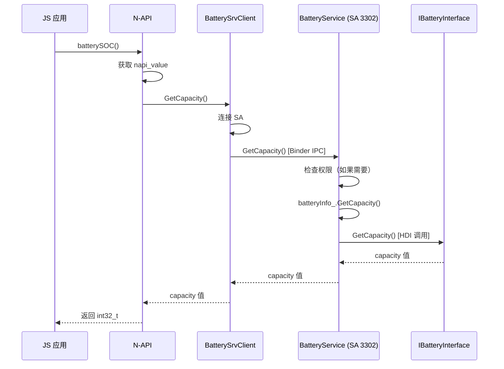
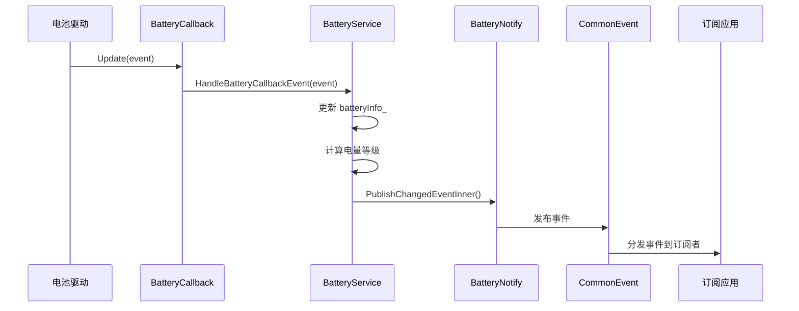

# 系统架构说明

> **目的**: 详细说明 battery_manager 项目的系统架构、组件图、数据流、线程模型和关键时序

**适用范围**: 架构分层、组件交互、数据流向

---

## 架构概览

### 分层架构

```
┌─────────────────────────────────────────────┐
│         应用层（Application）             │
│  - JS 应用（N-API）                 │
│  - Native 应用（C API）              │
│  - ArkUI-X 应用（CJ FFI）          │
│  - ArkTS 应用（Taihe）              │
└──────────────────┬──────────────────────────┘
                 │ IPC (ZIDL)
┌──────────────────┴──────────────────────────┐
│         框架层（Framework）           │
│  - N-API 绑定（3 个模块）         │
│  - Native 客户端                  │
│  - C API 客户端                  │
│  - CJ FFI 绑定                    │
│  - Taihe 绑定                      │
└──────────────────┬──────────────────────────┘
                 │ IPC (ZIDL)
┌──────────────────┴──────────────────────────┐
│         接口层（Interface）           │
│  - BatterySrvClient（IPC 客户端）   │
└──────────────────┬──────────────────────────┘
                 │ Binder IPC
┌──────────────────┴──────────────────────────┐
│         服务层（Service）              │
│  - BatteryService (SA 3302)         │
│  - BatteryNotify（通知管理）         │
│  - BatteryLight（LED 控制）          │
│  - BatteryConfig（配置管理）         │
│  - ChargingSound（充电音效）        │
└──────────────────┬──────────────────────────┘
                 │ HDI Callback
┌──────────────────┴──────────────────────────┐
│         HDI 适配层（Driver）         │
│  - BatteryCallback                  │
│  - HdiServiceStatusListener          │
└──────────────────┬──────────────────────────┘
                 │ HDI
┌──────────────────┴──────────────────────────┐
│         硬件驱动层（HDI）            │
│  - IBatteryInterface               │
└─────────────────────────────────────────────┘
```

**证据**:
- N-API 层: `frameworks/napi/BUILD.gn:16-22`
- 客户端: `interfaces/inner_api/native/include/battery_srv_client.h:29`
- 服务端: `services/native/include/battery_service.h:51`
- HDI 层: `services/native/include/battery_callback.h:26`

---

## 组件关系

### 核心服务组件

| 组件 | 类型 | 职责 | 证据 |
|--------|------|------|------|
| BatteryService | SA 3302 | 电池服务主类，实现 SA 生命周期和业务逻辑 | `services/native/include/battery_service.h:51-70` |
| BatterySrvClient | IPC 客户端 | 连接到 BatteryService，提供跨进程调用接口 | `interfaces/inner_api/native/include/battery_srv_client.h:29-115` |
| BatteryCallback | HDI 回调 | 接收底层电池驱动事件 | `services/native/include/battery_callback.h:26` |
| HdiServiceStatusListener | HDI 服务状态监听 | 监听 HDI 服务启动/停止事件 | `services/native/include/hdi_service_status_listener.h:27` |
| BatteryNotify | 通知管理 | 通过 CommonEvent 上报电池状态变化 | `services/native/include/battery_notify.h` |
| BatteryLight | LED 控制 | 控制电池指示灯（可选） | `services/native/include/battery_light.h` |
| BatteryConfig | 配置管理 | 管理电池配置参数和阈值 | `services/native/include/battery_config.h` |

**证据**: `services/BUILD.gn:49-151`

### N-API 绑定组件

| 模块 | JS 模块名 | C++ 类 | 绑定函数 | 证据 |
|------|----------|--------|----------|------|
| batteryInfo | @ohos.batteryInfo | NAPI 导出类 | BatteryInit() | `frameworks/napi/src/battery_info.cpp:566-600` |
| battery | @ohos.battery | SystemBattery 类 | SystemBatteryInit() | `frameworks/napi/src/system_battery.cpp:261-270` |
| charger | @ohos.charger | ChargeType 枚举类 | ChargeTypeInit() | `frameworks/napi/src/charger.cpp:82-89` |

**证据**: `frameworks/napi/BUILD.gn:16-22`

### CJ FFI 组件

| 组件 | FFI 函数 | C++ 实现 | 证据 |
|------|----------|--------|------|
| BatteryInfo FFI | 10 个导出函数 | BatterySrvClient 代理 | `frameworks/cj/src/battery_info_ffi.cpp:24-...` |

**证据**: `frameworks/cj/BUILD.gn:...`

### Taihe 组件

| 模块 | 说明 | 证据 |
|------|------|------|
| batteryInfo | ArkTS 电池信息模块，17 个导出函数 | `frameworks/ets/taihe/batteryInfo/src/ohos.batteryInfo.impl.cpp:43-259` |
| charger | ArkTS 充电模块（空实现） | `frameworks/ets/taihe/charger/src/ohos.charger.impl.cpp` |

**证据**: `frameworks/ets/taihe/BUILD.gn:...`

---

## 数据流

### 电池信息查询流程

```
JS 应用
    ↓ (调用 N-API)
N-API: batterySOC()
    ↓ (调用 IPC 客户端)
BatterySrvClient::GetCapacity()
    ↓ (Binder IPC)
BatteryService::GetCapacity() [SA 3302]
    ↓ (直接返回)
batteryInfo_.GetCapacity()
    ↓ (HDI 获取)
IBatteryInterface::GetCapacity() [来自 HDI 缓存]
    ↓ (返回)
int32_t capacity
```

**证据**:
- N-API: `frameworks/napi/src/battery_info.cpp:37-46`
- 客户端: `frameworks/native/src/battery_srv_client.cpp:16-30`
- 服务端: `services/native/src/battery_service.cpp:786-795`

### 电池状态变化通知流程

```
底层硬件驱动
    ↓ (HDI 回调)
BatteryCallback::Update(event)
    ↓ (更新内部状态)
BatteryService::HandleBatteryCallbackEvent()
    ↓ (触发 CommonEvent)
BatteryNotify::PublishChangedEventInner()
    ↓ (CommonEvent 系统)
订阅的 JS 应用
```

**证据**:
- HDI 回调: `services/native/include/battery_callback.h:27-29`
- 通知发布: `services/native/src/battery_notify.cpp:270-271`

### 配置设置流程

```
JS 应用
    ↓ (调用 N-API)
N-API: setBatteryConfig(sceneName, value)
    ↓ (参数校验)
NapiUtils::CheckValueType()
    ↓ (调用 IPC 客户端)
BatterySrvClient::SetBatteryConfig()
    ↓ (Binder IPC)
BatteryService::SetBatteryConfig() [SA 3302]
    ↓ (权限检查)
Permission::IsSystem()
    ↓ (如果系统应用)
BatteryConfig::SetConfigValue()
    ↓ (更新配置)
配置文件 / 内存
```

**证据**:
- N-API: `frameworks/napi/src/battery_info.cpp:185-213`
- 权限检查: `services/native/src/battery_service.cpp:678-681`

---

## 线程模型

### 主线程

- **BatteryService**: 作为 SystemAbility 运行在主线程
- **IPC 请求处理**: 在 Binder 线程池中处理 IPC 调用
- **HDI 回调**: 在 HDI 回调线程中处理底层事件

**证据**: `services/native/include/battery_service.h:51-55`

### 异步处理

**system_battery.cpp 中的异步模式**:
```cpp
// 使用 napi_send_event() 将任务发送到事件循环
SendEvent(env, asyncInfo.get(), napi_eprio_low, __func__);
// 任务 Lambda 在事件线程中执行
auto task = [env, asyncContext]() mutable {
    asyncContext->GetBatteryStats(env);
    delete asyncContext;
};
```

**证据**: `frameworks/napi/src/system_battery.cpp:219-234, 236-255`

### 事件循环

- **N-API 事件队列**: `napi_send_event()` 用于异步任务分发
- **优先级**: `napi_eprio_low` - 低优先级

**证据**: `frameworks/napi/src/system_battery.cpp:219-234`

---

## 关键时序

### 时序 1: 应用查询电池信息



**证据**:
- N-API: `frameworks/napi/src/battery_info.cpp:37-46`
- 客户端: `interfaces/inner_api/native/include/battery_srv_client.h:38`
- IDL: `services/zidl/IBatterySrv.idl:18`

### 时序 2: 电池状态变化通知



**证据**:
- HDI 回调: `services/native/include/battery_callback.h:27-29`
- 通知发布: `services/native/src/battery_notify.cpp:270-271`

### 时序 3: 设置电池配置

```mermaid
sequenceDiagram
    participant App as JS 应用
    participant NAPI as N-API
    participant Client as BatterySrvClient
    participant SA as BatteryService
    participant Permission as Permission

    App->>NAPI: setBatteryConfig(sceneName, value)
    NAPI->>NAPI: 参数校验（类型/数量）
    NAPI->>Client: SetBatteryConfig(sceneName, value)
    Client->>SA: SetBatteryConfig(sceneName, value) [Binder IPC]
    SA->>Permission: IsSystem()
    alt 非系统应用
        SA-->>Client: ERR_SYSTEM_API_DENIED (202)
        Client-->>NAPI: 抛出错误
    alt 是系统应用
        SA->>SA: BatteryConfig::SetConfigValue()
        SA-->>Client: ERR_OK (0)
        Client-->>NAPI: 返回成功
```

**证据**:
- N-API: `frameworks/napi/src/battery_info.cpp:185-213`
- 权限检查: `services/native/src/battery_service.cpp:678-681`
- 错误码: `interfaces/inner_api/native/include/battery_srv_errors.h:24-25`

---

## SA 生命周期

### SystemAbility 生命周期

| 阶段 | 方法 | 说明 | 证据 |
|------|------|------|------|
| OnStart() | 服务启动 | 注册 SA 3302，初始化 HDI，启动监听 | `services/native/include/battery_service.h:57` |
| OnStop() | 服务停止 | 清理资源，取消注册 | `services/native/include/battery_service.h:58` |
| OnAddSystemAbility() | SA 启动/停止监听 | 监听其他 SA 启动/停止事件 | `services/native/include/battery_service.h:59` |

**证据**: `services/native/include/battery_service.h:57-59`

### HDI 服务初始化

```cpp
// BatteryService::Init()
RegisterBatteryHdiCallback()  // 注册 HDI 回调
RegisterHdiStatusListener()      // 注册 HDI 状态监听
```

**证据**: `services/native/include/battery_service.h:113-114`

---

## 资源生命周期

### 单例模式

**BatterySrvClient** 使用 `DelayedRefSingleton` 模式确保全局唯一实例。

**证据**: `interfaces/inner_api/native/include/battery_srv_client.h:29`

### 共享内存

- **BatteryInfo**: 服务端共享的电池信息对象
- **batteryInfo_**: 服务端和客户端缓存

**证据**: `services/native/include/battery_service.h:191-194`

### HDI 回调生命周期

```cpp
// 注册
BatteryCallback::RegisterBatteryEvent(callback)
    iBatteryInterface_->RegisterCallback(callback);

// 监听期间
iBatteryInterface_-> 监听硬件事件
    -> BatteryCallback::Update(event)

// 取消注册
iBatteryInterface_->UnRegisterCallback();
```

**证据**: `services/native/src/battery_callback.cpp:...`

---

## 错误传播

### IPC 层错误传播

```
BatterySrvClient
    ↓ (连接失败)
返回 ERR_CONNECTION_FAIL (5100101)
    ↓
NAPI: NapiError::ThrowError()
    ↓
JS 应用: 抛出异常
```

**证据**:
- 客户端连接: `frameworks/native/src/battery_srv_client.cpp:35-65`
- 错误抛出: `frameworks/napi/src/napi_error.cpp:58-65`

### 参数校验错误传播

```
N-API 层
    ↓ (参数无效)
返回 ERR_PARAM_INVALID (401)
    ↓
NAPI: NapiError::ThrowError()
    ↓
JS 应用: 抛出异常
```

**证据**:
- 参数校验: `frameworks/napi/src/battery_info.cpp:192-211`
- 错误抛出: `frameworks/napi/src/napi_error.cpp:58-65`

### 权限拒绝错误传播

```
BatteryService
    ↓ (非系统应用)
返回 ERR_SYSTEM_API_DENIED (202)
    ↓
BatterySrvClient
    ↓
NAPI: NapiError::ThrowError()
    ↓
JS 应用: 抛出异常
```

**证据**:
- 权限检查: `services/native/src/battery_service.cpp:678-681, 696, 719`
- 错误码: `interfaces/inner_api/native/include/battery_srv_errors.h:25`

---

## 相关跳转

- [目录结构](02_Directory_Structure.md)
- [N-API 文档](04_NAPI_API.md)
- [内部 API](05_Inner_API.md)

---

**返回**: [导航](SUMMARY.md)
