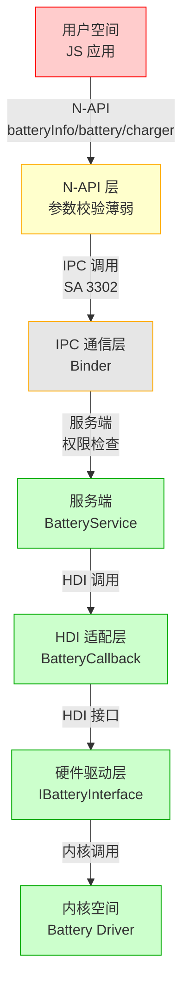

# 攻击面分析

> **目的**: 系统化识别 battery_manager 项目的所有外部输入入口、敏感操作和信任边界

> **适用范围**: 输入验证、权限检查、路径遍历、内存安全、竞态条件、信息泄露

---

## 威胁模型

### 数据流向

```
用户空间（JS 应用）
    ↓ N-API (batteryInfo, battery, charger)
    ↓ [输入校验薄弱点]
    ↓ 权限检查[部分缺失]
    ↓ IPC 调用 (SA 3302)
    ↓ [服务端权限检查]
    ↓ HDI 驱动访问
    ↓ 硬件层
```

### 信任边界

| 边界 | 可信度 | 说明 |
|-----|--------|------|
| **用户空间** | ❌ 不可信 | JS 应用，可能被恶意应用利用 |
| **N-API 层** | ⚠️ 部分可信 | 有参数校验，但不充分 |
| **IPC 通信** | ⚠️ 部分可信 | Binder IPC，依赖服务端鉴权 |
| **服务端（SA）** | ✅ 可信 | 系统服务，运行在系统进程 |
| **HDI 驱动** | ✅ 可信 | 硬件驱动接口 |
| **内核空间** | ✅ 可信 | 底层驱动，受内核保护 |

---

## 外部输入入口清单

### 1. N-API 输入点

| 输入点 | JS 方法 | 参数类型 | 风险等级 | 证据 |
|--------|---------|---------|---------|------|
| `setBatteryConfig()` | `@ohos.batteryInfo.setBatteryConfig()` | sceneName: string, value: string | **高** | `frameworks/napi/src/battery_info.cpp:185-213` |
| `getBatteryConfig()` | `@ohos.batteryInfo.getBatteryConfig()` | sceneName: string | **中** | `frameworks/napi/src/battery_info.cpp:215-242` |
| `isBatteryConfigSupported()` | `@ohos.batteryInfo.isBatteryConfigSupported()` | featureName: string | **中** | `frameworks/napi/src/battery_info.cpp:221-244` |

**风险分析**:
- `setBatteryConfig()`: 直接将用户输入传递给服务端，可能被滥用修改系统配置
- `getBatteryConfig()`: 无权限检查，可能泄露敏感配置信息
- 所有方法: 缺少输入长度限制，可能导致缓冲区溢出

### 2. N-API 异步回调输入

| 输入点 | JS 方法 | 回调类型 | 风险等级 | 证据 |
|--------|---------|---------|---------|------|
| `getStatus()` | `@ohos.battery.getStatus()` | function callback | **中** | `frameworks/napi/src/system_battery.cpp:245-254` |

**风险分析**:
- 异步回调未校验回调类型，可被注入恶意回调
- 缺少回调上下文验证，可能被利用

### 3. IPC 消息输入

| 输入点 | ZIDL 接口 | 参数类型 | 风险等级 | 证据 |
|--------|-----------|---------|---------|------|
| `SetBatteryConfig()` | `IBatterySrv::SetBatteryConfig` | sceneName: string, value: string | **高** | `services/zidl/IBatterySrv.idl:32` |
| `GetBatteryConfig()` | `IBatterySrv::GetBatteryConfig` | sceneName: string | **中** | `services/zidl/IBatterySrv.idl:33` |
| `IsBatteryConfigSupported()` | `IBatterySrv::IsBatteryConfigSupported` | featureName: string | **中** | `services/zidl/IBatterySrv.idl:34` |

**风险分析**:
- ZIDL 接口部分方法缺乏参数验证
- 依赖 Binder IPC，需关注 Binder 安全
- 服务端可能被恶意应用直接调用（如果绕过 N-API）

---

## 敏感操作清单

### 1. 文件操作

| 操作 | 文件路径 | 操作类型 | 风险等级 | 证据 |
|-----|---------|---------|---------|------|
| 配置文件读取 | `services/native/profile/battery_config.json` | JSON 解析 | **高** | `services/native/src/battery_config.cpp` |
| 振动配置读取 | `services/native/profile/vibrator_config.json` | JSON 解析 | **中** | `services/native/src/battery_config.cpp` |
| 资源文件读取 | `services/native/resources/` | 多语言资源 | **中** | `services/native/src/battery_notify.cpp` |

**风险分析**:
- JSON 配置文件解析未做安全检查，可能被篡改
- 多语言资源路径可能被注入

### 2. 系统服务调用

| 操作 | 目标服务 | 调用方式 | 风险等级 | 证据 |
|-----|---------|---------|---------|------|
| 事件发布 | CommonEventService | PublishCommonEvent | **中** | `services/native/src/battery_notify.cpp:270-271` |
| 通知发布 | DistributedNotificationService | PublishNotification | **中** | `services/native/notification/` |
| 振动调用 | MiscDeviceService | Vibrate | **低** | `services/native/src/battery_light.cpp` |
| 音频播放 | AudioFramework | PlayAudio | **低** | `services/native/src/charging_sound.cpp` |

**风险分析**:
- 电池状态广播仅设置订阅权限，接收者无身份验证
- 通知发布可能被滥用，发送大量通知

### 3. HDI 调用

| 操作 | HDI 接口 | 调用方式 | 风险等级 | 证据 |
|-----|---------|---------|---------|------|
| 注册回调 | `IBatteryInterface::Register` | IPC 调用 | **低** | `services/native/src/battery_service.cpp` |
| 获取电池信息 | `IBatteryInterface::Get*` | IPC 调用 | **低** | `services/native/src/battery_service.cpp` |

**风险分析**:
- HDI 接口运行在内核空间，相对安全
- 依赖 HDF 框架的安全机制

### 4. 权限提升点

| 操作 | 权限检查 | 风险等级 | 证据 |
|-----|---------|---------|------|
| SetBatteryConfig() | 仅检查系统应用 | **高** | `services/native/src/battery_service.cpp:678-681` |
| 配置修改 | 无细粒度权限控制 | **高** | `services/native/src/battery_service.cpp:678-719` |

**风险分析**:
- SetBatteryConfig 等方法仅检查系统应用身份，无细粒度权限控制
- 任何系统应用可修改电池配置，包括敏感参数

---

## 信任边界图

### Mermaid 图



### 边界跨越点

| 跨越点 | 从 | 到 | 风险 | 缓解措施 |
|-------|-----|---|-----|---------|
| **N-API 参数** | 用户空间 | N-API 层 | 注入攻击 | 参数校验（当前薄弱） |
| **IPC 通信** | N-API 层 | 服务端 | 篡改/重放 | Binder 安全机制 |
| **HDI 调用** | 服务端 | 驱动层 | 直接内存访问 | HDF 沙箱机制 |

---

## 输入验证清单

### 1. N-API 参数校验

| 方法 | 参数类型检查 | 长度检查 | 空值检查 | 编码检查 | 路径遍历检查 | 证据 |
|-----|-----------|---------|---------|---------|------------|------|
| `setBatteryConfig()` | ✅ 有 | ❌ 无 | ❌ 无 | ❌ 无 | ❌ 无 | `frameworks/napi/src/battery_info.cpp:185-213` |
| `getBatteryConfig()` | ✅ 有 | ❌ 无 | ❌ 无 | ❌ 无 | ❌ 无 | `frameworks/napi/src/battery_info.cpp:215-242` |
| `isBatteryConfigSupported()` | ✅ 有 | ❌ 无 | ❌ 无 | ❌ 无 | ❌ 无 | `frameworks/napi/src/battery_info.cpp:221-244` |

### 2. IPC 消息校验

| 方法 | 调用者检查 | 参数检查 | 权限检查 | 证据 |
|-----|-----------|---------|---------|------|
| `SetBatteryConfig()` | ✅ 有（仅系统应用） | ❌ 无 | ⚠️ 弱 | `services/native/src/battery_service.cpp:678-681` |
| `GetBatteryConfig()` | ❌ 无 | ❌ 无 | ❌ 无 | `services/native/src/battery_service.cpp:683-713` |
| `IsBatteryConfigSupported()` | ❌ 无 | ❌ 无 | ❌ 无 | `services/native/src/battery_service.cpp:715-737` |

### 3. 配置文件校验

| 文件 | 格式验证 | 签名验证 | 完整性检查 | 证据 |
|-----|---------|---------|----------|------|
| `battery_config.json` | ❌ 无 | ❌ 无 | ❌ 无 | `services/native/src/battery_config.cpp` |
| `vibrator_config.json` | ❌ 无 | ❌ 无 | ❌ 无 | `services/native/src/battery_config.cpp` |

---

## 并发控制点

| 同步原语 | 保护对象 | 位置 | 潜在竞态 | 证据 |
|---------|---------|------|---------|------|
| `std::shared_mutex mutex_` | BatteryInfo 读写 | `services/native/include/battery_service.h:161` | 读写竞态 | `services/native/src/battery_service.cpp:186-190` |
| `std::atomic_bool isBootCompleted_` | 开机完成状态 | `services/native/include/battery_service.h:160` | 状态竞态 | `services/native/src/battery_service.cpp` |
| `std::atomic_bool isBatteryHdiReady_` | HDI 就绪状态 | `services/native/include/battery_service.h:175` | 初始化竞态 | `services/native/src/battery_service.cpp` |
| `std::mutex shutdownGuardMutex_` | 关机守护 | `services/native/include/battery_service.h:194` | 关机竞态 | `services/native/src/battery_service.cpp` |

**潜在竞态条件**:
1. HDI 回调线程与事件循环线程的 BatteryInfo 竞态
2. 低电量关机任务与用户充电插入的竞态
3. 配置文件重载与并发读取的竞态

---

## 快速参考

### 外部输入入口速查表

```
高风险输入点:
├─ setBatteryConfig() - 可修改系统配置
├─ getBatteryConfig() - 可泄露敏感信息
└─ 配置文件 - 可被篡改

中风险输入点:
├─ isBatteryConfigSupported() - 信息泄露
├─ 异步回调 - 回调注入
└─ 资源文件路径 - 路径注入
```

### 敏感操作速查表

```
高风险操作:
├─ 配置文件读写（未校验）
├─ 系统配置修改（权限弱）
└─ 公共事件发布（无身份验证）

中风险操作:
├─ 通知发布
└─ 文件路径操作
```

---

## 相关文档

- **详细安全风险**: [08_Security_Review](08_Security_Review.md)
- **系统架构**: [03_Architecture](03_Architecture.md)
- **N-API 接口**: [04_NAPI_API](04_NAPI_API.md)

---

**生成时间**: 2026-02-07 10:30:00
**最后更新**: 2026-02-07 10:30:00
**返回**: [SUMMARY](SUMMARY.md)
