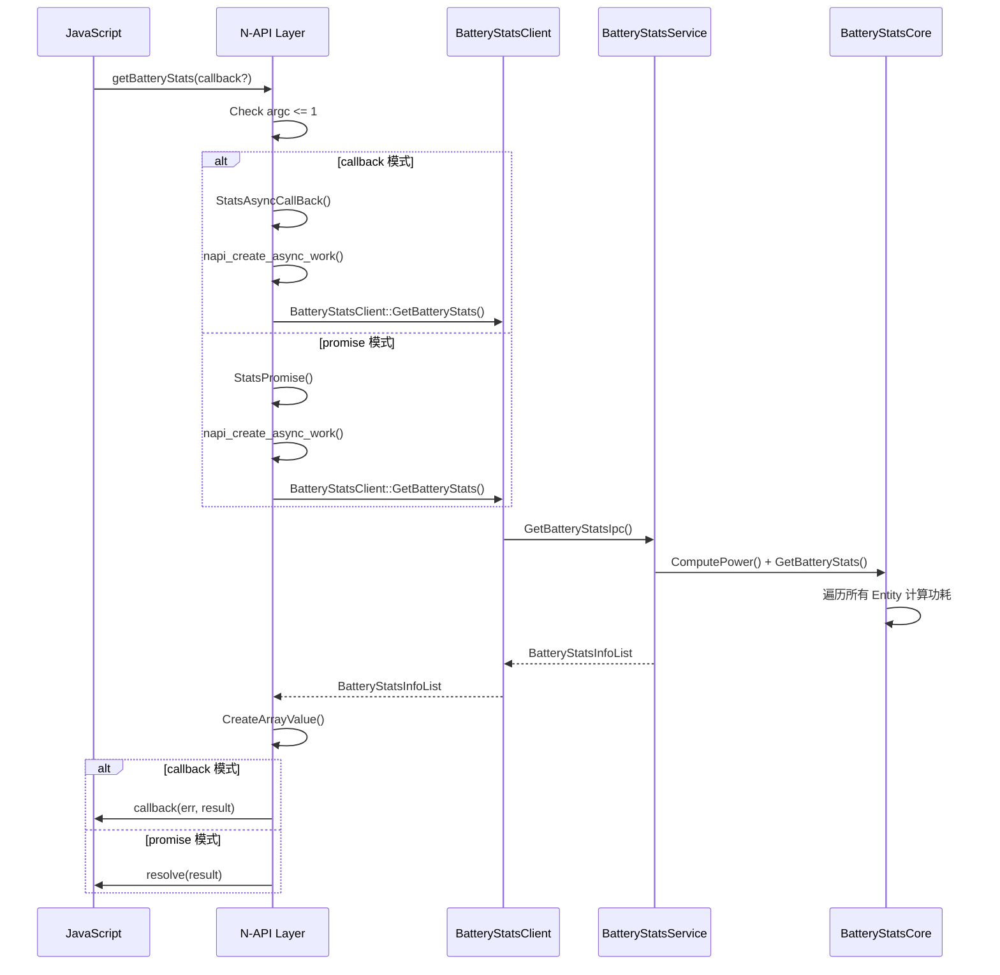
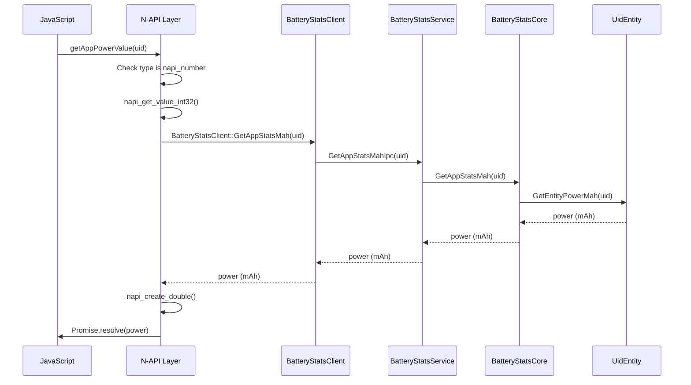

# N-API 参考

> N-API 层是电池统计模块对外暴露的 JavaScript 接口，位于 `frameworks/napi/` 目录。

## 目录

- [概述](#概述)
- [API 清单](#api-清单)
- [ConsumptionType 枚举](#consumptiontype-枚举)
- [参数校验](#参数校验)
- [错误码](#错误码)
- [调用链示例](#调用链示例)

## 概述

N-API 层负责将 C++ 实现的电池统计功能暴露给 JavaScript/ArkTS 调用。主要组件：

| 文件 | 职责 |
|------|------|
| `battery_stats_module.cpp` | 模块注册、JS API 导出 |
| `battery_stats.cpp` | API 实现、异步回调处理 |
| `async_callback_info.cpp` | Promise/Callback 封装 |
| `napi_utils.cpp` | 参数校验工具 |
| `napi_error.cpp` | 错误转换 |

**证据**: `frameworks/napi/src/battery_stats_module.cpp:155-170` (模块注册)

```cpp
static napi_module batteryStatsModule = {
    .nm_version = 1,
    .nm_flags = 0,
    .nm_filename = "batteryStats",
    .nm_register_func = BatteryStatsInit,
    .nm_modname = "batteryStatistics",
    .nm_priv = ((void*)0),
    .reserved = {0}};
```

## API 清单

### getBatteryStats

获取所有电池统计数据。

| 属性 | 值 |
|------|-----|
| **JS API** | `getBatteryStats(callback?: AsyncCallback<BatteryStatsInfo[]>)` |
| **C++ 实现** | `GetBatteryStats()` (`battery_stats.cpp:33-55`) |
| **模式** | Promise / Callback |
| **参数** | 可选 `AsyncCallback<BatteryStatsInfo[]>` |
| **返回值** | `Promise<BatteryStatsInfo[]>` 或 `void` (callback 模式) |

**参数校验** (`battery_stats.cpp:41-43`):
```cpp
if (argc > MAX_ARGC) {  // MAX_ARGC = 1
    return error.ThrowError(env, StatsError::ERR_PARAM_INVALID);
}
```

### getAppPowerValue

获取指定应用的耗电量（毫安时）。

| 属性 | 值 |
|------|-----|
| **JS API** | `getAppPowerValue(uid: number): Promise<number>` |
| **C++ 实现** | `GetAppStatsMah()` (`battery_stats.cpp:57-61`) |
| **模式** | Promise |
| **参数** | `uid: number` - 应用 UID |
| **返回值** | `Promise<number>` - 耗电量 (mAh) |

**参数校验** (`battery_stats.cpp:144-146`):
```cpp
if (argc != maxArgc || !NapiUtils::CheckValueType(env_, argv[index], napi_number)) {
    return error.ThrowError(env_, StatsError::ERR_PARAM_INVALID);
}
```

### getAppPowerPercent

获取指定应用的耗电占比（百分比）。

| 属性 | 值 |
|------|-----|
| **JS API** | `getAppPowerPercent(uid: number): Promise<number>` |
| **C++ 实现** | `GetAppStatsPercent()` (`battery_stats.cpp:63-67`) |
| **模式** | Promise |
| **参数** | `uid: number` - 应用 UID |
| **返回值** | `Promise<number>` - 耗电占比 (%) |

### getHardwareUnitPowerValue

获取硬件单元的耗电量（毫安时）。

| 属性 | 值 |
|------|-----|
| **JS API** | `getHardwareUnitPowerValue(type: ConsumptionType): Promise<number>` |
| **C++ 实现** | `GetPartStatsMah()` (`battery_stats.cpp:69-73`) |
| **模式** | Promise |
| **参数** | `type: ConsumptionType` - 硬件单元类型 |
| **返回值** | `Promise<number>` - 耗电量 (mAh) |

### getHardwareUnitPowerPercent

获取硬件单元的耗电占比（百分比）。

| 属性 | 值 |
|------|-----|
| **JS API** | `getHardwareUnitPowerPercent(type: ConsumptionType): Promise<number>` |
| **C++ 实现** | `GetPartStatsPercent()` (`battery_stats.cpp:75-79`) |
| **模式** | Promise |
| **参数** | `type: ConsumptionType` - 硬件单元类型 |
| **返回值** | `Promise<number>` - 耗电占比 (%) |

## ConsumptionType 枚举

导出为 JS 静态属性。

| 枚举值 | 值 | 说明 |
|--------|-----|------|
| `CONSUMPTION_TYPE_INVALID` | -17 | 无效类型 |
| `CONSUMPTION_TYPE_APP` | -16 | 应用 |
| `CONSUMPTION_TYPE_BLUETOOTH` | -15 | 蓝牙 |
| `CONSUMPTION_TYPE_IDLE` | -14 | 空闲 |
| `CONSUMPTION_TYPE_PHONE` | -13 | 电话 |
| `CONSUMPTION_TYPE_RADIO` | -12 | 无线通信 |
| `CONSUMPTION_TYPE_SCREEN` | -11 | 屏幕 |
| `CONSUMPTION_TYPE_USER` | -10 | 用户 |
| `CONSUMPTION_TYPE_WIFI` | -9 | WiFi |
| `CONSUMPTION_TYPE_CAMERA` | -8 | 相机 |
| `CONSUMPTION_TYPE_FLASHLIGHT` | -7 | 手电筒 |
| `CONSUMPTION_TYPE_AUDIO` | -6 | 音频 |
| `CONSUMPTION_TYPE_SENSOR` | -5 | 传感器 |
| `CONSUMPTION_TYPE_GNSS` | -4 | GNSS |
| `CONSUMPTION_TYPE_CPU` | -3 | CPU |
| `CONSUMPTION_TYPE_WAKELOCK` | -2 | 唤醒锁 |
| `CONSUMPTION_TYPE_ALARM` | -1 | 闹钟 |

**证据**: `frameworks/napi/src/battery_stats_module.cpp:113-123` 和 `interfaces/inner_api/include/battery_stats_info.h:30-48`

## 参数校验

### 类型检查

使用 `NapiUtils::CheckValueType()` 进行类型验证。

**证据**: `frameworks/napi/src/napi_utils.cpp:48-57`

```cpp
bool NapiUtils::CheckValueType(napi_env& env, napi_value& value, napi_valuetype checkType)
{
    napi_valuetype valueType = napi_undefined;
    napi_typeof(env, value, &valueType);
    if (valueType != checkType) {
        STATS_HILOGW(COMP_FWK, "Parameter type error");
        return false;
    }
    return true;
}
```

### 参数数量检查

**证据**: `frameworks/napi/src/battery_stats_module.cpp:29-31`

```cpp
constexpr uint32_t MAX_ARGC = 1;
constexpr uint32_t ARGV_IND_0 = 0;
```

- `getBatteryStats`: 最多 1 个参数 (callback)
- 其他 API: 必须有 1 个参数 (uid 或 type)

### 参数值检查

| API | 检查逻辑 |
|-----|---------|
| `getAppPowerValue` | `napi_get_value_int32()` 获取 uid |
| `getHardwareUnitPowerValue` | `napi_get_value_int32()` 获取 type，然后转换为 `ConsumptionType` |

**证据**: `frameworks/napi/src/battery_stats.cpp:148-149`

```cpp
int32_t jsValue;
napi_get_value_int32(env_, argv[index], &jsValue);
```

## 错误码

| 错误码 | 值 | 说明 | 触发条件 |
|--------|-----|------|---------|
| `ERR_OK` | 0 | 成功 | 操作完成 |
| `ERR_PARAM_INVALID` | 401 | 参数无效 | 参数类型/数量错误 |
| `ERR_PERMISSION_DENIED` | 201 | 权限拒绝 | 无系统权限 |
| `ERR_SYSTEM_API_DENIED` | 202 | 系统 API 拒绝 | 非系统应用调用 |
| `ERR_CONNECTION_FAIL` | 4600101 | 连接失败 | SA 未就绪 |

**证据**: `interfaces/inner_api/include/battery_stats_errors.h:21-27`

```cpp
enum class StatsError : int32_t {
    ERR_OK = 0,
    ERR_PERMISSION_DENIED = 201,
    ERR_SYSTEM_API_DENIED = 202,
    ERR_PARAM_INVALID = 401,
    ERR_CONNECTION_FAIL = 4600101
};
```

## 调用链示例

### getBatteryStats 调用链



### getAppPowerValue 调用链



## 相关文档

- [概览](./00_Overview.md)
- [架构说明](./02_Architecture.md)
- [Inner API](./04_Inner_API.md)
- [SUMMARY](./SUMMARY.md)
