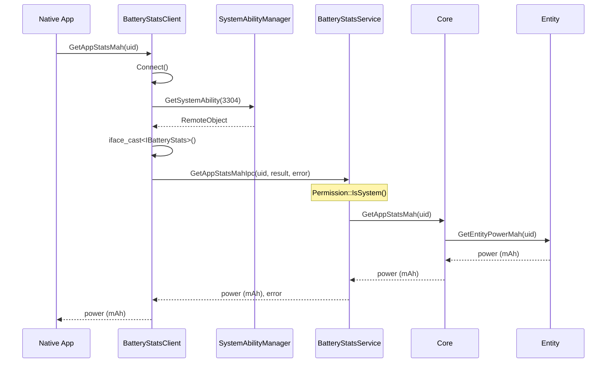

# Inner API 参考

> Inner API 是电池统计模块对 Native 层暴露的内部接口，位于 `interfaces/inner_api/` 和 `frameworks/native/` 目录。

## 目录

- [概述](#概述)
- [BatteryStatsClient](#batterystatsclient)
- [IBatteryStats IPC 接口](#ibatterystats-ipc-接口)
- [数据模型](#数据模型)
- [错误码](#错误码)
- [IPC 调用示例](#ipc-调用示例)

## 概述

Inner API 是供 Native 应用和框架层调用的 C++ 接口，不直接暴露给 JS。主要组件：

| 组件 | 文件 | 职责 |
|------|------|------|
| `BatteryStatsClient` | `frameworks/native/src/battery_stats_client.cpp` | IPC 客户端、单例模式 |
| `IBatteryStats` | `services/IBatteryStats.idl` | IPC 接口定义 |
| `BatteryStatsStub` | 生成的存根 | 服务端 IPC 处理 |
| `BatteryStatsProxy` | 生成的代理 | 客户端 IPC 代理 |
| `BatteryStatsInfo` | `interfaces/inner_api/include/battery_stats_info.h` | 数据结构 |

**证据**: `interfaces/inner_api/include/battery_stats_client.h:33`

```cpp
class BatteryStatsClient final : public DelayedRefSingleton<BatteryStatsClient> {
    DECLARE_DELAYED_REF_SINGLETON(BatteryStatsClient);
```

## BatteryStatsClient

### 接口方法

| 方法 | 参数 | 返回值 | 说明 |
|------|------|--------|------|
| `GetBatteryStats()` | void | `BatteryStatsInfoList` | 获取所有统计 |
| `GetAppStatsMah(uid)` | `const int32_t&` | `double` | 获取 App 耗电 (mAh) |
| `GetAppStatsPercent(uid)` | `const int32_t&` | `double` | 获取 App 耗电 (%) |
| `GetPartStatsMah(type)` | `ConsumptionType` | `double` | 获取硬件耗电 (mAh) |
| `GetPartStatsPercent(type)` | `ConsumptionType` | `double` | 获取硬件耗电 (%) |
| `GetTotalTimeSecond(statsType, uid)` | `StatsType, int32_t` | `uint64_t` | 获取时间 (秒) |
| `GetTotalDataBytes(statsType, uid)` | `StatsType, int32_t` | `uint64_t` | 获取数据量 (字节) |
| `SetOnBattery(isOnBattery)` | `bool` | `void` | 设置电池状态 |
| `Reset()` | void | `void` | 重置统计 |
| `Dump(args)` | `vector<string>` | `string` | 调试 dump |
| `GetLastError()` | void | `StatsError` | 获取最后错误 |

**证据**: `interfaces/inner_api/include/battery_stats_client.h:38-48`

```cpp
BatteryStatsInfoList GetBatteryStats();
void SetOnBattery(bool isOnBattery);
double GetAppStatsMah(const int32_t& uid);
double GetAppStatsPercent(const int32_t& uid);
double GetPartStatsMah(const BatteryStatsInfo::ConsumptionType& type);
double GetPartStatsPercent(const BatteryStatsInfo::ConsumptionType& type);
uint64_t GetTotalTimeSecond(const StatsUtils::StatsType& statsType, const int32_t& uid = StatsUtils::INVALID_VALUE);
uint64_t GetTotalDataBytes(const StatsUtils::StatsType& statsType, const int32_t& uid = StatsUtils::INVALID_VALUE);
void Reset();
std::string Dump(const std::vector<std::string>& args);
StatsError GetLastError();
```

### 连接管理

**证据**: `frameworks/native/src/battery_stats_client.cpp:36-54`

```cpp
ErrCode BatteryStatsClient::Connect()
{
    std::lock_guard<std::mutex> lock(mutex_);
    if (proxy_ != nullptr) {
        return ERR_OK;
    }
    sptr<ISystemAbilityManager> sam = SystemAbilityManagerClient::GetInstance().GetSystemAbilityManager();
    if (sam == nullptr) {
        STATS_HILOGE(COMP_FWK, "Fail to get registry");
        return E_STATS_GET_SYSTEM_ABILITY_MANAGER_FAILED;
    }
    sptr<IRemoteObject> remoteObject_ = sam->GetSystemAbility(POWER_MANAGER_BATT_STATS_SERVICE_ID);
    if (remoteObject_ == nullptr) {
        STATS_HILOGE(COMP_FWK, "Get batterystats service failed");
        return E_STATS_GET_SERVICE_FAILED;
    }
    proxy_ = iface_cast<IBatteryStats>(remoteObject_);
    return ERR_OK;
}
```

### 服务死亡处理

**证据**: `frameworks/native/src/battery_stats_client.cpp:56-75`

```cpp
void BatteryStatsClient::ResetProxy(const wptr<IRemoteObject>& remote)
{
    std::lock_guard<std::mutex> lock(mutex_);
    STATS_RETURN_IF(proxy_ == nullptr);
    auto serviceRemote = proxy_->AsObject();
    if ((serviceRemote != nullptr) && (serviceRemote == remote.promote())) {
        serviceRemote->RemoveDeathRecipient(deathRecipient_);
        proxy_ = nullptr;
    }
}

void BatteryStatsClient::BatteryStatsDeathRecipient::OnRemoteDied(const wptr<IRemoteObject>& remote)
{
    if (remote == nullptr) {
        STATS_HILOGE(COMP_FWK, "OnRemoteDied failed, remote is nullptr");
        return;
    }
    BatteryStatsClient::GetInstance().ResetProxy(remote);
    STATS_HILOGI(COMP_FWK, "Receive death notification");
}
```

## IBatteryStats IPC 接口

### 接口定义

**证据**: `services/IBatteryStats.idl`

```idl
interface OHOS.PowerMgr.IBatteryStats {
    [ipccode 0] void GetBatteryStatsIpc([out] ParcelableBatteryStatsList batteryStats, [out] int tempError);
    void GetAppStatsMahIpc([in] int uid, [out] double appStatsMah, [out] int tempError);
    void GetAppStatsPercentIpc([in] int uid, [out] double appStatsPercent, [out] int tempError);
    void GetPartStatsMahIpc([in] int type, [out] double partStatsMah, [out] int tempError);
    void GetPartStatsPercentIpc([in] int type, [out] double partStatsPercent, [out] int tempError);
    void GetTotalTimeSecondIpc([in] int statsType, [in] int uid, [out] unsigned long totalTimeSecond);
    void GetTotalDataBytesIpc([in] int statsType, [in] int uid, [out] unsigned long totalDataBytes);
    void ResetIpc();
    void SetOnBatteryIpc([in] boolean isOnBattery);
    void ShellDumpIpc([in] String[] args, [in] unsigned int argc, [out] String dumpShell);
}
```

### IPC 方法映射

| Inner API | IPC 方法 | Code |
|-----------|----------|------|
| `GetBatteryStats()` | `GetBatteryStatsIpc()` | 0 |
| `GetAppStatsMah()` | `GetAppStatsMahIpc()` | - |
| `GetAppStatsPercent()` | `GetAppStatsPercentIpc()` | - |
| `GetPartStatsMah()` | `GetPartStatsMahIpc()` | - |
| `GetPartStatsPercent()` | `GetPartStatsPercentIpc()` | - |
| `GetTotalTimeSecond()` | `GetTotalTimeSecondIpc()` | - |
| `GetTotalDataBytes()` | `GetTotalDataBytesIpc()` | - |
| `Reset()` | `ResetIpc()` | - |
| `SetOnBattery()` | `SetOnBatteryIpc()` | - |
| `Dump()` | `ShellDumpIpc()` | - |

## 数据模型

### BatteryStatsInfo

**证据**: `interfaces/inner_api/include/battery_stats_info.h:28-69`

```cpp
class BatteryStatsInfo : public Parcelable {
public:
    enum ConsumptionType {
        CONSUMPTION_TYPE_INVALID = -17,
        CONSUMPTION_TYPE_APP = -16,
        CONSUMPTION_TYPE_BLUETOOTH = -15,
        CONSUMPTION_TYPE_IDLE = -14,
        CONSUMPTION_TYPE_PHONE = -13,
        CONSUMPTION_TYPE_RADIO = -12,
        CONSUMPTION_TYPE_SCREEN = -11,
        CONSUMPTION_TYPE_USER = -10,
        CONSUMPTION_TYPE_WIFI = -9,
        CONSUMPTION_TYPE_CAMERA = -8,
        CONSUMPTION_TYPE_FLASHLIGHT = -7,
        CONSUMPTION_TYPE_AUDIO = -6,
        CONSUMPTION_TYPE_SENSOR = -5,
        CONSUMPTION_TYPE_GNSS = -4,
        CONSUMPTION_TYPE_CPU = -3,
        CONSUMPTION_TYPE_WAKELOCK = -2,
        CONSUMPTION_TYPE_ALARM = -1
    };

    bool Marshalling(Parcel &parcel) const override;
    static std::shared_ptr<BatteryStatsInfo> Unmarshalling(Parcel &parcel);
    void SetUid(int32_t uid);
    void SetUserId(int32_t userId);
    void SetConsumptioType(ConsumptionType type);
    void SetPower(double power);
    int32_t GetUid();
    int32_t GetUserId();
    ConsumptionType GetConsumptionType();
    double GetPower();

private:
    int32_t uid_ = StatsUtils::INVALID_VALUE;
    int32_t userId_ = StatsUtils::INVALID_VALUE;
    ConsumptionType type_ = CONSUMPTION_TYPE_INVALID;
    double totalPowerMah_ = StatsUtils::DEFAULT_VALUE;
};
```

### ParcelableBatteryStatsInfoList

```cpp
class ParcelableBatteryStatsList : public Parcelable {
public:
    BatteryStatsInfoList statsList_;

    virtual bool Marshalling(Parcel &parcel) const override;
    static ParcelableBatteryStatsList* Unmarshalling(Parcel &parcel);
};
```

## 错误码

| 错误码 | 值 | 来源 | 说明 |
|--------|-----|------|------|
| `ERR_OK` | 0 | battery_stats_errors.h | 成功 |
| `ERR_PERMISSION_DENIED` | 201 | battery_stats_errors.h | 权限拒绝 |
| `ERR_SYSTEM_API_DENIED` | 202 | battery_stats_errors.h | 系统 API 拒绝 |
| `ERR_PARAM_INVALID` | 401 | battery_stats_errors.h | 参数无效 |
| `ERR_CONNECTION_FAIL` | 4600101 | battery_stats_errors.h | 连接失败 |
| `E_STATS_GET_SYSTEM_ABILITY_MANAGER_FAILED` | - | stats_errors.h | 获取 SA Manager 失败 |
| `E_STATS_GET_SERVICE_FAILED` | - | stats_errors.h | 获取服务失败 |
| `E_STATS_INNER_ERR` | - | stats_errors.h | 内部错误 |

**证据**: `interfaces/inner_api/include/battery_stats_errors.h:21-27` 和 `utils/native/include/stats_errors.h`

## IPC 调用示例

### 客户端调用流程



### Parcel 序列化

**证据**: `frameworks/native/src/battery_stats_info.cpp:24-55`

```cpp
bool BatteryStatsInfo::Marshalling(Parcel& parcel) const {
    STATS_RETURN_IF_WRITE_PARCEL_FAILED_WITH_RET(COMP_FWK, parcel, Int32, uid_, false);
    STATS_RETURN_IF_WRITE_PARCEL_FAILED_WITH_RET(COMP_FWK, parcel, Int32, static_cast<int32_t>(type_), false);
    STATS_RETURN_IF_WRITE_PARCEL_FAILED_WITH_RET(COMP_FWK, parcel, Double, totalPowerMah_, false);
    return true;
}

bool BatteryStatsInfo::ReadFromParcel(Parcel &parcel) {
    STATS_RETURN_IF_READ_PARCEL_FAILED_WITH_RET(COMP_FWK, parcel, Int32, uid_, false);
    int32_t type = static_cast<int32_t>(0);
    STATS_RETURN_IF_READ_PARCEL_FAILED_WITH_RET(COMP_FWK, parcel, Int32, type, false);
    type_ = static_cast<ConsumptionType>(type);
    STATS_RETURN_IF_READ_PARCEL_FAILED_WITH_RET(COMP_FWK, parcel, Double, totalPowerMah_, false);
    return true;
}
```

## 相关文档

- [概览](./00_Overview.md)
- [架构说明](./02_Architecture.md)
- [N-API 参考](./03_NAPI.md)
- [GN 构建](./05_GN_Build.md)
- [SUMMARY](./SUMMARY.md)
