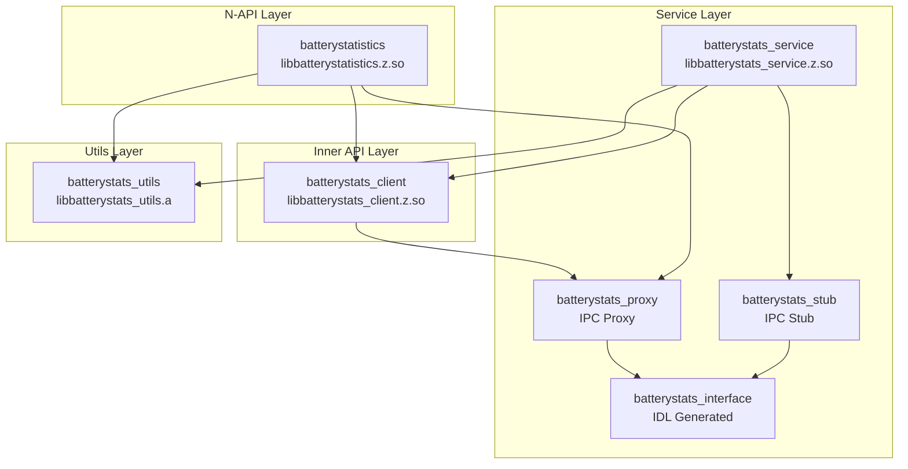

# GN 构建系统

> 电池统计模块使用 GN (Generate Ninja) 作为构建系统，构建配置位于各目录的 `BUILD.gn` 和根目录的 `batterystats.gni`。

## 目录

- [概述](#概述)
- [根配置 (batterystats.gni)](#根配置-batterystatsgni)
- [N-API 层构建](#n-api-层构建)
- [Inner API 层构建](#inner-api-层构建)
- [服务层构建](#服务层构建)
- [工具库构建](#工具库构建)
- [依赖关系图](#依赖关系图)

## 概述

### 项目结构

```
battery_statistics/
├── batterystats.gni              # 根配置文件 (feature flags, paths)
├── frameworks/
│   ├── napi/
│   │   └── BUILD.gn              # batterystatistics 目标
│   └── native/
│       └── BUILD.gn              # batterystats_client 目标
├── interfaces/
│   └── inner_api/
│       └── BUILD.gn              # batterystats_client 目标
├── services/
│   ├── native/
│   │   └── BUILD.gn              # batterystats_service 目标
│   ├── zidl/
│   │   └── IBatteryStats.idl     # IPC 接口定义
│   └── profile/
│       └── BUILD.gn              # power_average.json
└── utils/
    └── BUILD.gn                  # batterystats_utils 目标
```

### 构建产物类型

| 类型 | 说明 | 示例 |
|------|------|------|
| `ohos_shared_library` | 动态库 | `.z.so` |
| `ohos_static_library` | 静态库 | `.a` |
| `ohos_source_set` | 源文件集合 | 无输出 (供依赖) |
| `idl_gen_interface` | IDL 生成接口 | 代理/存根代码 |
| `group` | 目标组 | 聚合依赖 |
| `config` | 配置集合 | include_dirs, defines |

## 根配置 (batterystats.gni)

### Feature Flags

**证据**: `batterystats.gni:14-53`

```gni
# Bluetooth 支持
if (!defined(global_parts_info) ||
    defined(global_parts_info.communication_bluetooth)) {
  has_batterystats_bluetooth_part = true
  defines += [ "HAS_BATTERYSTATS_BLUETOOTH_PART" ]
} else {
  has_batterystats_bluetooth_part = false
}

# WiFi 支持
if (!defined(global_parts_info) ||
    defined(global_parts_info.communication_wifi)) {
  has_batterystats_wifi_part = true
  defines += [ "HAS_BATTERYSTATS_WIFI_PART" ]
} else {
  has_batterystats_wifi_part = false
}

# Display Manager 支持
if (!defined(global_parts_info) ||
    defined(global_parts_info.powermgr_display_manager)) {
  has_batterystats_display_manager_part = true
  defines += [ "HAS_BATTERYSTATS_DISPLAY_MANAGER_PART" ]
} else {
  has_batterystats_display_manager_part = false
}

# Call Manager 支持
if (!defined(global_parts_info) ||
    defined(global_parts_info.telephony_call_manager)) {
  has_batterystats_call_manager_part = true
  defines += [ "HAS_BATTERYSTATS_CALL_MANAGER_PART" ]
} else {
  has_batterystats_call_manager_part = false
}

# Config Policy 支持
if (!defined(global_parts_info) ||
    defined(global_parts_info.customization_config_policy)) {
  has_batterystats_config_policy_part = true
} else {
  has_batterystats_config_policy_part = false
}
```

### 路径定义

```gni
batterystats_part_name = "battery_statistics"
batterystats_root_path = "//base/powermgr/battery_statistics"
batterystats_inner_api = "${batterystats_root_path}/interfaces/inner_api"
batterystats_frameworks_path = "${batterystats_root_path}/frameworks"
batterystats_service_path = "${batterystats_root_path}/services"
batterystats_service_zidl = "${batterystats_service_path}/zidl"
batterystats_service_native = "${batterystats_service_path}/native"
batterystats_utils_path = "${batterystats_root_path}/utils"
taihe_generated_file_path = "${root_out_dir}/taihe/out/powermgr/battery_statistics"
```

## N-API 层构建

### batterystatistics 目标

**证据**: `frameworks/napi/BUILD.gn:20-57`

```gni
ohos_shared_library("batterystatistics") {
  sanitize = {
    cfi = true
    cfi_cross_dso = true
    debug = false
  }
  sources = [
    "src/async_callback_info.cpp",
    "src/battery_stats.cpp",
    "src/battery_stats_module.cpp",
    "src/napi_error.cpp",
    "src/napi_utils.cpp",
  ]

  configs = [
    "${batterystats_utils_path}:batterystats_utils_config",
    ":batterystatsnapi_private_config",
    "${batterystats_utils_path}:coverage_flags",
  ]

  deps = [
    "${batterystats_inner_api}:batterystats_client",
    "${batterystats_service_path}:batterystats_proxy",
    "${batterystats_utils_path}:batterystats_utils",
  ]

  external_deps = [
    "c_utils:utils",
    "hilog:libhilog",
    "ipc:ipc_core",
    "napi:ace_napi",
  ]

  relative_install_dir = "module"

  subsystem_name = "powermgr"
  part_name = "${batterystats_part_name}"
}
```

### 配置

```gni
config("batterystatsnapi_private_config") {
  include_dirs = [ "include" ]
}
```

## Inner API 层构建

### batterystats_client 目标

**证据**: `interfaces/inner_api/BUILD.gn:20-58`

```gni
ohos_shared_library("batterystats_client") {
  sanitize = {
    cfi = true
    cfi_cross_dso = true
    debug = false
  }

  sources = [
    "${batterystats_frameworks_path}/native/src/battery_stats_client.cpp",
    "${batterystats_frameworks_path}/native/src/battery_stats_info.cpp",
  ]

  configs = [
    "${batterystats_service_path}:batterystats_public_config",
    "${batterystats_utils_path}:batterystats_utils_config",
    ":batterystats_public_config",
    "${batterystats_utils_path}:coverage_flags",
  ]

  public_configs = [
    "${batterystats_service_path}:batterystats_public_config",
    ":batterystats_public_config",
  ]

  deps = [
    "${batterystats_service_path}:batterystats_proxy",
    "${batterystats_utils_path}:batterystats_utils",
  ]

  external_deps = [
    "c_utils:utils",
    "hilog:libhilog",
    "ipc:ipc_core",
    "samgr:samgr_proxy",
  ]

  subsystem_name = "powermgr"
  part_name = "${batterystats_part_name}"
}
```

## 服务层构建

### IDL 生成

**证据**: `services/BUILD.gn:24-35`

```gni
idl_gen_interface("batterystats_interface") {
  sources = [ "IBatteryStats.idl" ]
  configs = [
    "${batterystats_utils_path}:batterystats_utils_config",
    "${batterystats_utils_path}:coverage_flags",
  ]

  log_domainid = "0xD002962"
  log_tag = "StatsSvc"
  part_name = "${batterystats_part_name}"
  subsystem_name = "powermgr"
}
```

### batterystats_proxy 目标

```gni
ohos_source_set("batterystats_proxy") {
  sanitize = {
    cfi = true
    cfi_cross_dso = true
    debug = false
  }
  output_values = get_target_outputs(":batterystats_interface")
  sources = filter_include(output_values, [ "*_proxy.cpp" ])
  public_configs = [ ":batterystats_public_config" ]
  configs = [
    "${batterystats_utils_path}:batterystats_utils_config",
    "${batterystats_utils_path}:coverage_flags",
  ]
  deps = [ ":batterystats_interface" ]
  external_deps = [
    "c_utils:utils",
    "hilog:libhilog",
    "ipc:ipc_single",
    "samgr:samgr_proxy",
  ]
  part_name = "${batterystats_part_name}"
  subsystem_name = "powermgr"
}
```

### batterystats_stub 目标

```gni
ohos_source_set("batterystats_stub") {
  sanitize = {
    cfi = true
    cfi_cross_dso = true
    debug = false
  }
  output_values = get_target_outputs(":batterystats_interface")
  sources = filter_include(output_values, [ "*_stub.cpp" ])
  sources += [ "${batterystats_frameworks_path}/native/src/battery_stats_info.cpp" ]
  public_configs = [ ":batterystats_public_config" ]
  configs = [
    "${batterystats_utils_path}:batterystats_utils_config",
    "${batterystats_utils_path}:coverage_flags",
  ]
  deps = [ ":batterystats_interface" ]
  external_deps = [
    "c_utils:utils",
    "hilog:libhilog",
    "ipc:ipc_core",
    "ipc:ipc_single",
  ]

  if (has_batterystats_call_manager_part) {
    external_deps += [ "call_manager:tel_call_manager_api" ]
  }

  if (has_batterystats_display_manager_part) {
    external_deps += [ "display_manager:displaymgr" ]
  }
  external_deps += [ "ability_runtime:appkit_native" ]

  part_name = "${batterystats_part_name}"
  subsystem_name = "powermgr"
}
```

### batterystats_service 目标

**证据**: `services/BUILD.gn:97-192`

```gni
ohos_shared_library("batterystats_service") {
  sanitize = {
    cfi = true
    cfi_cross_dso = true
    debug = false
  }
  branch_protector_ret = "pac_ret"

  sources = [
    "native/src/battery_stats_core.cpp",
    "native/src/battery_stats_detector.cpp",
    "native/src/battery_stats_dumper.cpp",
    "native/src/battery_stats_listener.cpp",
    "native/src/battery_stats_parser.cpp",
    "native/src/battery_stats_service.cpp",
    "native/src/battery_stats_subscriber.cpp",
    "native/src/cpu_time_reader.cpp",
    "native/src/entities/alarm_entity.cpp",
    "native/src/entities/audio_entity.cpp",
    "native/src/entities/battery_stats_entity.cpp",
    "native/src/entities/bluetooth_entity.cpp",
    "native/src/entities/camera_entity.cpp",
    "native/src/entities/cpu_entity.cpp",
    "native/src/entities/flashlight_entity.cpp",
    "native/src/entities/gnss_entity.cpp",
    "native/src/entities/idle_entity.cpp",
    "native/src/entities/phone_entity.cpp",
    "native/src/entities/screen_entity.cpp",
    "native/src/entities/sensor_entity.cpp",
    "native/src/entities/uid_entity.cpp",
    "native/src/entities/user_entity.cpp",
    "native/src/entities/wakelock_entity.cpp",
    "native/src/entities/wifi_entity.cpp",
  ]

  configs = [
    "${batterystats_utils_path}:batterystats_utils_config",
    "${batterystats_utils_path}:coverage_flags",
  ]

  public_configs = [ ":batterystats_public_config" ]

  deps = [
    ":batterystats_stub",
    "${batterystats_inner_api}:batterystats_client",
    "${batterystats_utils_path}:batterystats_utils",
  ]

  external_deps = [ "power_manager:power_permission" ]
  external_deps += [
    "ability_base:want",
    "battery_manager:batterysrv_client",
    "cJSON:cjson",
    "c_utils:utils",
    "common_event_service:cesfwk_innerkits",
    "eventhandler:libeventhandler",
    "hicollie:libhicollie",
    "hilog:libhilog",
    "hisysevent:libhisyseventmanager",
    "ipc:ipc_core",
    "os_account:libaccountkits",
    "power_manager:power_sysparam",
    "safwk:system_ability_fwk",
    "samgr:samgr_proxy",
  ]

  if (has_batterystats_bluetooth_part) {
    external_deps += [ "bluetooth:btframework" ]
  }

  if (has_batterystats_call_manager_part) {
    external_deps += [ "call_manager:tel_call_manager_api" ]
  }

  if (has_batterystats_config_policy_part) {
    defines += [ "HAS_BATTERYSTATS_CONFIG_POLICY_PART" ]
    external_deps += [ "config_policy:configpolicy_util" ]
  }

  if (has_batterystats_display_manager_part) {
    external_deps += [ "display_manager:displaymgr" ]
  }

  if (has_batterystats_wifi_part) {
    external_deps += [ "wifi:wifi_sdk" ]
  }

  subsystem_name = "powermgr"
  part_name = "${batterystats_part_name}"
}
```

## 工具库构建

### batterystats_utils 目标

**证据**: `utils/BUILD.gn:35-55`

```gni
ohos_static_library("batterystats_utils") {
  branch_protector_ret = "pac_ret"

  sources = [
    "native/src/stats_helper.cpp",
    "native/src/stats_hisysevent.cpp",
    "native/src/stats_utils.cpp",
    "native/src/stats_xcollie.cpp",
  ]

  configs = [ "${batterystats_utils_path}:coverage_flags" ]

  public_configs = [ ":batterystats_utils_config" ]
  external_deps = [
    "c_utils:utils",
    "hicollie:libhicollie",
    "hilog:libhilog",
  ]
  subsystem_name = "powermgr"
  part_name = "${batterystats_part_name}"
}
```

### 配置

```gni
config("batterystats_utils_config") {
  include_dirs = [
    "native/include",
    "${batterystats_inner_api}/include",
  ]
}

config("batterystats_public_config") {
  include_dirs = [
    "native/include",
    "${target_gen_dir}",
  ]
}

config("coverage_flags") {
  if (battery_statistics_feature_coverage) {
    cflags = [ "--coverage" ]
    cflags_cc = [ "--coverage" ]
    ldflags = [ "--coverage" ]
  }
}
```

## 依赖关系图



## 相关文档

- [概览](./00_Overview.md)
- [目录结构](./01_Directory_Structure.md)
- [编译产物](./06_Build_Outputs.md)
- [SUMMARY](./SUMMARY.md)
