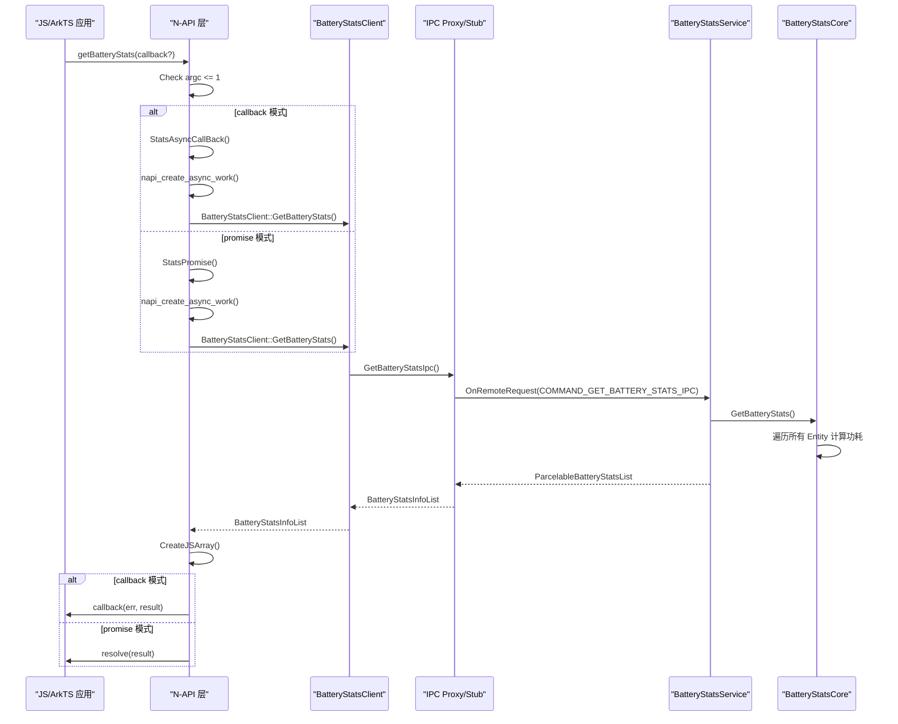
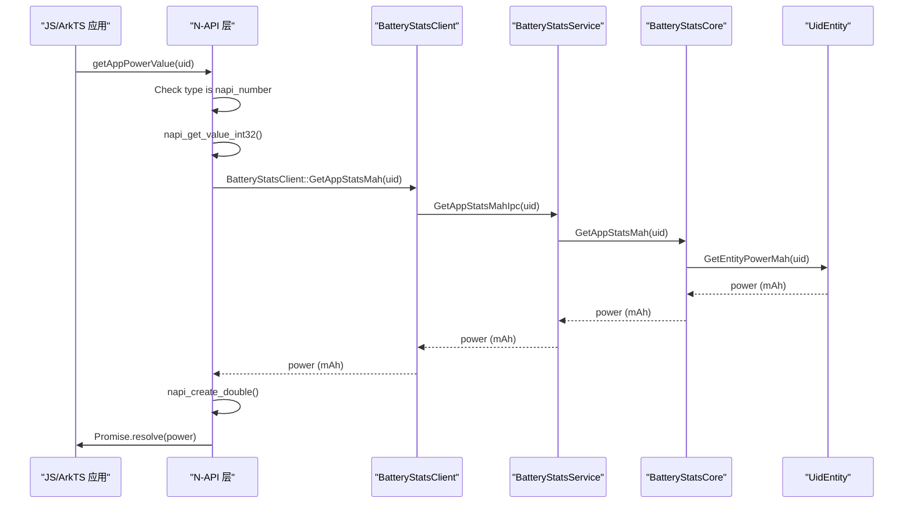
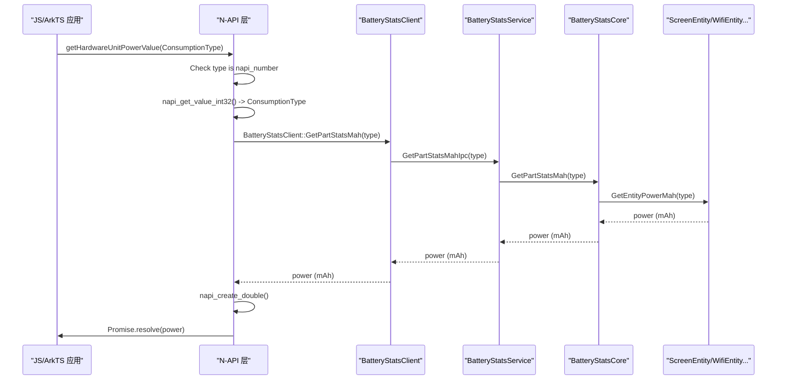
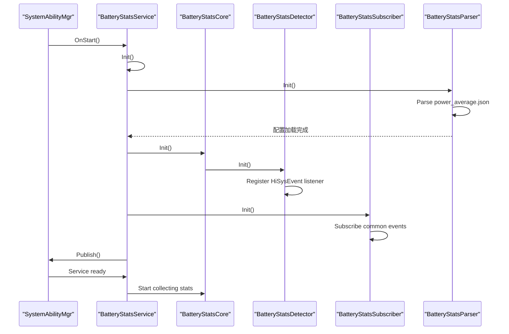
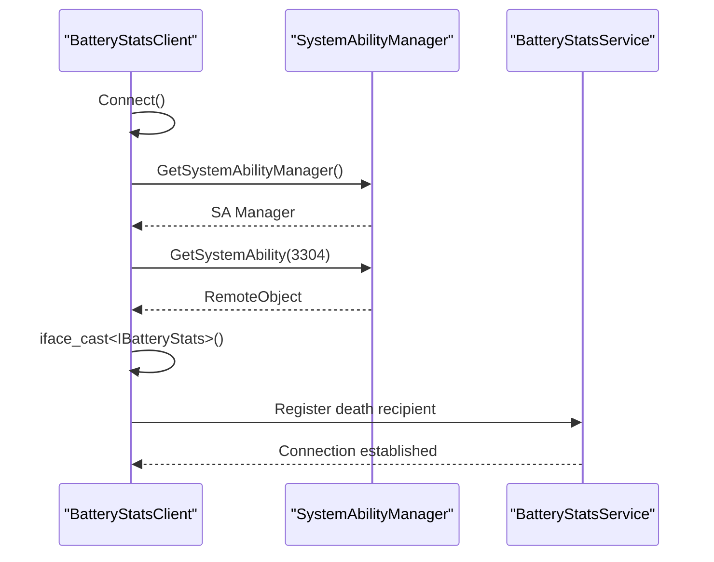
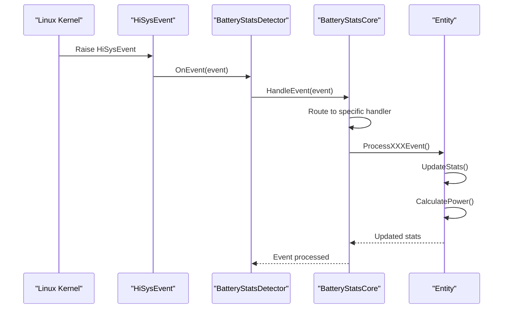
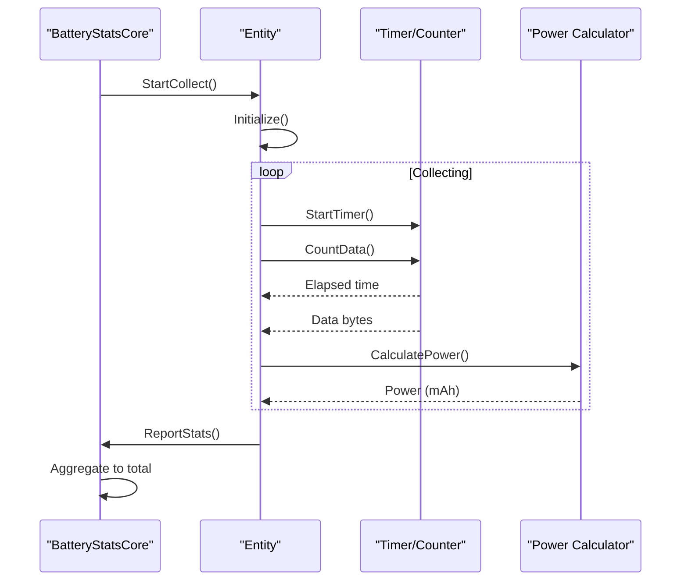
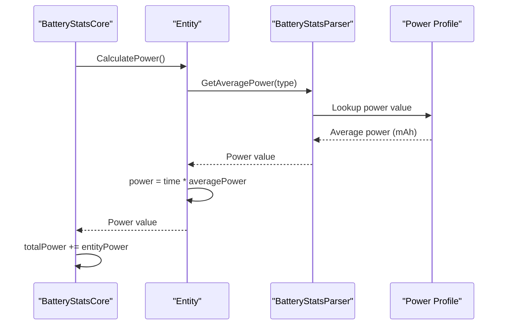

# 关键调用链

## 概述

本文档描述电池统计模块的关键调用链路，包括 API 调用流程、服务启动流程、事件处理流程等。

## 目录

- [N-API 调用链](#n-api-调用链)
- [服务启动流程](#服务启动流程)
- [IPC 通信流程](#ipc-通信流程)
- [事件处理流程](#事件处理流程)
- [数据统计流程](#数据统计流程)

---

## N-API 调用链

### getBatteryStats 调用链



**证据来源**：`frameworks/napi/src/battery_stats_module.cpp:33-55`

### getAppPowerValue 调用链



**证据来源**：`frameworks/napi/src/battery_stats.cpp:140-150`

### getHardwareUnitPowerValue 调用链



---

## 服务启动流程



**证据来源**：`services/native/src/battery_stats_service.cpp:68-102`

---

## IPC 通信流程

### 客户端连接流程



**证据来源**：`frameworks/native/src/battery_stats_client.cpp:42-52`

### IPC 请求处理流程

```mermaid
sequenceDiagram
    participant Client as "BatteryStatsProxy"
    participant Stub as "BatteryStatsStub"
    participant Service as "BatteryStatsService"

    Client->>Stub: SendRequest(ipcCode, data, reply, option)
    Stub->>Stub: OnRemoteRequest(code, data, reply, option)
    Stub->>Stub: Dispatch to method by code
    alt code == COMMAND_GET_BATTERY_STATS_IPC
        Stub->>Service: GetBatteryStats()
    alt code == COMMAND_GET_APP_STATS_MAH_IPC
        Stub->>Service: GetAppStatsMah()
    alt code == COMMAND_GET_PART_STATS_MAH_IPC
        Stub->>Service: GetPartStatsMah()
    end
    Service->>Stub: result
    Stub->>Client: reply
```

**证据来源**：`services/IBatteryStats.idl`

---

## 事件处理流程

### HiSysEvent 处理流程



**证据来源**：`services/native/src/battery_stats_detector.cpp`

### Common Event 处理流程

```mermaid
sequenceDiagram
    participant Event as "CommonEventService"
    participant Subscriber as "BatteryStatsSubscriber"
    participant Core as "BatteryStatsCore"
    participant Service as "BatteryStatsService"

    Event->>Subscriber: OnReceiveEvent(data)
    Subscriber->>Core: HandleCommonEvent(data)
    Core->>Core: Process event type
    alt COMMON_EVENT_SHUTDOWN
        Core->>Core: ResetAllStats()
    alt COMMON_EVENT_BATTERY_CHANGED
        Core->>Core: UpdateBatteryState()
    alt COMMON_EVENT_BATTERY_LOW
        Core->>Core: NotifyLowPower()
    end
```

**证据来源**：`services/native/src/battery_stats_subscriber.cpp`

---

## 数据统计流程

### 实体数据收集流程



### 耗电计算流程



**证据来源**：`services/native/src/battery_stats_core.cpp`

---

## 关键入口点汇总

| 入口点 | 文件:行号 | 说明 |
|--------|-----------|------|
| N-API 模块注册 | `battery_stats_module.cpp:155-170` | napi_module 结构体定义 |
| JS API 导出 | `battery_stats_module.cpp:136-149` | BatteryStatsInit |
| 服务启动 | `battery_stats_service.cpp:68-86` | OnStart() |
| 服务停止 | `battery_stats_service.cpp:88-102` | OnStop() |
| IPC 处理 | `IBatteryStats.idl` | 10 个 IPC 方法 |
| 事件检测 | `battery_stats_detector.cpp` | HiSysEvent 处理 |
| 核心计算 | `battery_stats_core.cpp` | 功耗聚合 |

---

## 相关文档

- [架构设计](../02_Architecture.md) - 整体架构
- [N-API 接口](../03_NAPI.md) - JS API 详细说明
- [Inner API](../04_Inner_API.md) - C++ Kit 接口
- [安全评审](../07_Security.md) - 安全机制分析
