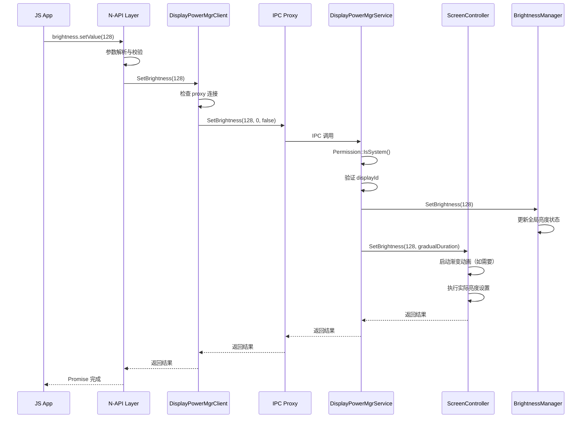
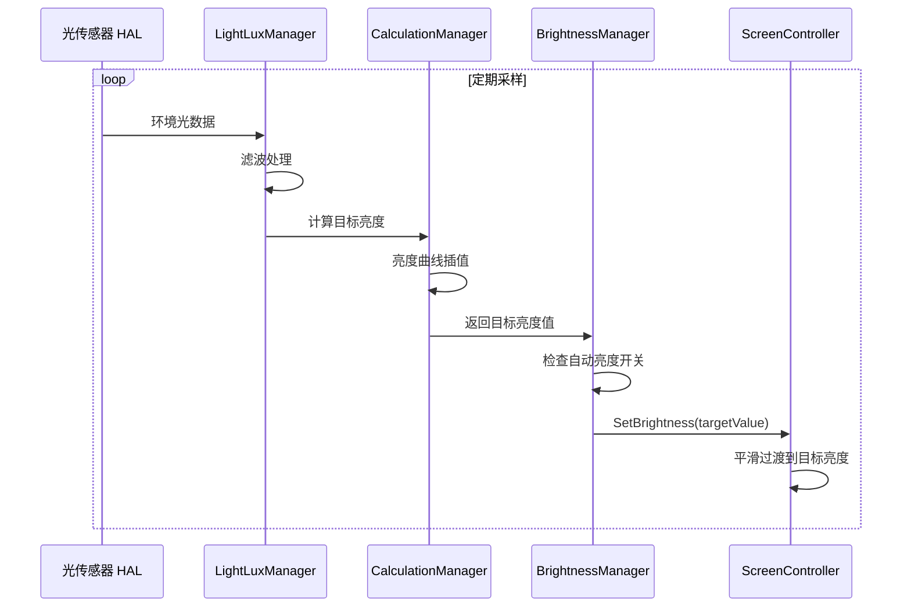
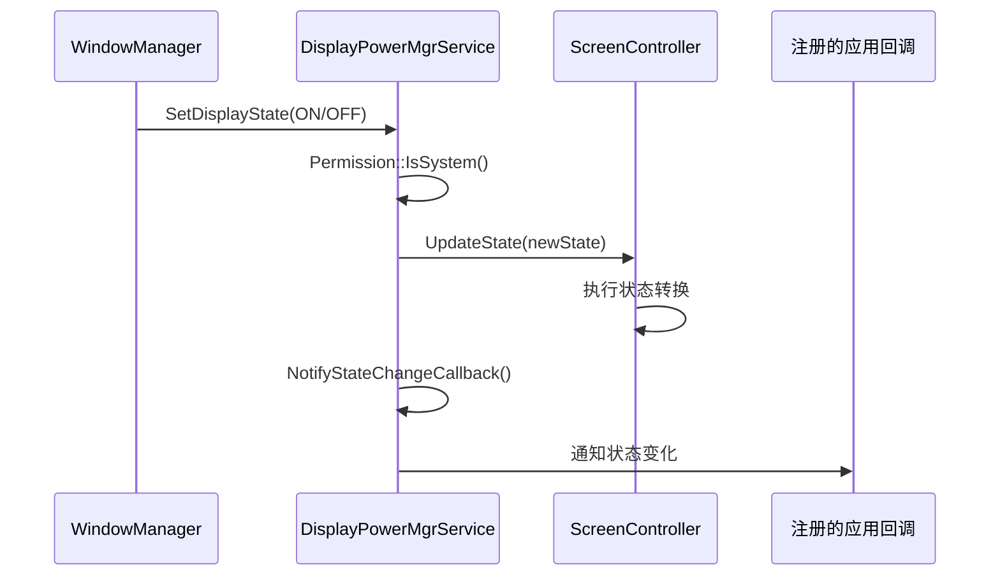
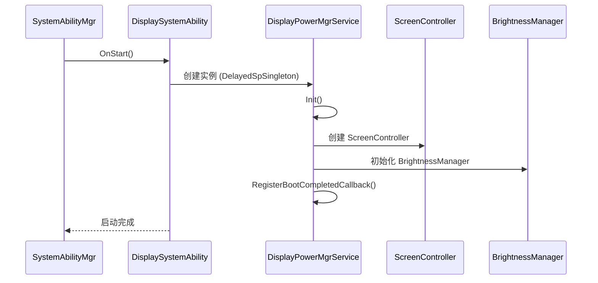
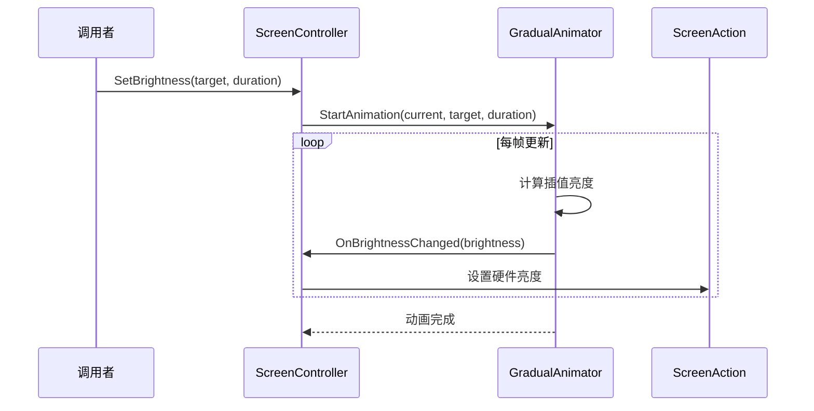

# 架构设计 - display_manager

> 本文档说明 display_manager 模块的系统架构、组件关系和数据流

---

## 文档目的

本文档提供：
- 系统架构的整体视图
- 组件之间的关系和交互
- 数据流的完整路径
- 线程模型和并发设计
- 关键时序流程

## 适用范围

- **适用对象**：系统架构师、模块开发者、性能优化工程师
- **前置知识**：熟悉 System Ability、IPC 通信、C++ 设计模式

---

## 架构概览

display_manager 采用**分层客户端-服务架构**，通过 System Ability 机制提供跨进程的显示管理能力。

### 架构分层

```
┌─────────────────────────────────────────────────────────────────┐
│                        应用层 (Application)                      │
│  ┌──────────────┐  ┌──────────────────────────────────────┐    │
│  │ JS/ETS 应用   │  │ 调用 brightness API                  │    │
│  │ @ohos.display │  │ @ohos.brightness                     │    │
│  │ .brightness   │  │                                      │    │
│  └──────┬───────┘  └──────────────────┬───────────────────┘    │
└─────────┼─────────────────────────────┼────────────────────────┘
          │                             │
┌─────────▼─────────────────────────────▼────────────────────────┐
│                    Framework 层                                 │
│  ┌──────────────────┐      ┌──────────────────────────────┐   │
│  │ N-API (传统)      │      │ ANI/ETS (新版)                │   │
│  │ brightness.cpp   │      │ ohos.brightness.impl.cpp     │   │
│  └────────┬─────────┘      └──────────────┬─────────────────┘   │
│           │                                │                     │
│  ┌────────▼────────────────────────────────▼─────────┐          │
│  │          DisplayPowerMgrClient                    │          │
│  │     (DelayedRefSingleton 延迟单例)                │          │
│  └────────┬──────────────────────────────────────────┘          │
└───────────┼────────────────────────────────────────────────────┘
            │
┌───────────▼────────────────────────────────────────────────────┐
│                      IPC 层                                     │
│  ┌─────────────────────────────────────────────────────────┐   │
│  │            IDisplayPowerMgr Proxy/Stub                  │   │
│  │         (ZIDL 生成，跨进程通信)                          │   │
│  └─────────────────────────┬───────────────────────────────┘   │
└────────────────────────────┼───────────────────────────────────┘
                             │
┌────────────────────────────▼───────────────────────────────────┐
│                    Service 层 (System Ability)                  │
│  ┌─────────────────────────────────────────────────────────┐   │
│  │         DisplaySystemAbility (SA ID 3308)               │   │
│  │              SystemAbility 生命周期管理                  │   │
│  └─────────────────────────┬───────────────────────────────┘   │
│                            │                                     │
│  ┌─────────────────────────▼───────────────────────────────┐    │
│  │         DisplayPowerMgrService                          │    │
│  │    (DelayedSpSingleton 单例，继承 DisplayPowerMgrStub)   │    │
│  └────────┬────────────────────────────────┬───────────────┘    │
│           │                                │                    │
│  ┌────────▼─────────┐          ┌───────────▼────────────┐      │
│  │ ScreenController │          │   BrightnessManager    │      │
│  │ (每显示器一个)    │          │   (全局单例)            │      │
│  └────────┬─────────┘          └───────────┬────────────┘      │
│           │                                │                    │
│  ┌────────▼─────────┐          ┌───────────▼────────────┐      │
│  │   ScreenAction   │          │ BrightnessManagerExt   │      │
│  │  (屏幕实际操作)   │          │ (平台相关扩展)          │      │
│  └──────────────────┘          └────────────────────────┘      │
└────────────────────────────────────────────────────────────────┘
```

---

## 核心组件

### 1. DisplayPowerMgrService（显示电源服务）

**职责**：核心服务实现，处理所有显示和亮度相关的 IPC 请求

**位置**：`state_manager/service/native/include/display_power_mgr_service.h:44`

**关键特性**：
- 继承 `DisplayPowerMgrStub`，接收 IPC 调用
- 使用 `DelayedSpSingleton` 单例模式
- 维护 `ScreenController` 映射表（支持多显示器）
- 包含 `BrightnessManager` 引用（全局亮度管理）
- 使用 `FFRTQueue` 进行异步操作

**主要方法**：
```cpp
// 显示状态管理
ErrCode SetDisplayState(uint32_t id, uint32_t state, uint32_t reason, bool& result);
ErrCode GetDisplayState(uint32_t id, int32_t& displayState);

// 亮度控制
ErrCode SetBrightness(uint32_t value, uint32_t displayId, bool continuous, bool& result, int32_t& displayError);
ErrCode GetBrightness(uint32_t displayId, uint32_t& brightness);
ErrCode AdjustBrightness(uint32_t id, int32_t value, uint32_t duration, bool& result);

// 自动亮度
ErrCode AutoAdjustBrightness(bool enable, bool& result);
ErrCode IsAutoAdjustBrightness(bool& result);

// 高级功能
ErrCode BoostBrightness(int32_t timeoutMs, uint32_t displayId, bool& result);
ErrCode OverrideBrightness(uint32_t value, uint32_t displayId, uint32_t duration, bool& result);
```

**设计模式**：
- **单例模式**：`DelayedSpSingleton<DisplayPowerMgrService>`
- **桥接模式**：委托给 `ScreenController` 和 `BrightnessManager`
- **死亡接收者模式**：处理客户端进程死亡

---

### 2. DisplaySystemAbility（系统能力包装）

**职责**：SystemAbility 生命周期管理，包装 DisplayPowerMgrService

**位置**：`state_manager/service/native/include/display_system_ability.h:29`

**关键特性**：
- 继承 `SystemAbility`，参与系统能力管理
- SA ID 为 3308
- 管理服务的启动、停止、依赖添加

**生命周期回调**：
```cpp
void OnStart() override;      // 服务启动，创建 DisplayPowerMgrService
void OnStop() override;       // 服务停止，清理资源
void OnAddSystemAbility(int32_t systemAbilityId, const std::string& deviceId) override;
```

**设计模式**：
- **代理模式**：包装 `DisplayPowerMgrService` 作为 SystemAbility
- **RAII 模式**：通过 OnStart/OnStop 管理服务生命周期

---

### 3. ScreenController（屏幕控制器）

**职责**：每显示器的屏幕状态和亮度控制器

**位置**：`state_manager/service/native/include/screen_controller.h:30`

**关键特性**：
- 每个显示器一个实例（通过 `displayId` 区分）
- 管理显示状态机（ON/OFF/DIM 等）
- 协调亮度动画（通过 `GradualAnimator`）
- 执行实际的屏幕操作（通过 `ScreenAction`）

**状态管理方法**：
```cpp
DisplayState GetState();
DisplayState SetDelayOffState();
DisplayState SetOnState();
bool UpdateState(DisplayState state, uint32_t reason);
bool IsScreenOn();
```

**亮度控制方法**：
```cpp
bool SetBrightness(uint32_t value, uint32_t gradualDuration = 0, bool continuous = false);
uint32_t GetBrightness();
bool DiscountBrightness(double discount, uint32_t gradualDuration = 0);
bool OverrideBrightness(uint32_t value, uint32_t gradualDuration = 0);
bool BoostBrightness(uint32_t timeoutMs, uint32_t gradualDuration = 0);
```

**设计模式**：
- **状态机模式**：管理 `DisplayState` 转换
- **策略模式**：`AnimateCallback` 支持不同动画行为
- **组合模式**：组合 `ScreenAction` 和 `GradualAnimator`

---

### 4. BrightnessManager（亮度管理器）

**职责**：全局亮度状态管理、自动亮度、传感器集成

**位置**：`brightness_manager/include/brightness_manager.h:24`

**关键特性**：
- 全局单例（禁止拷贝和移动）
- 管理自动亮度状态
- 集成光传感器（可选）
- 协调亮度策略（覆盖、提升、折扣等）

**核心方法**：
```cpp
static BrightnessManager& Get();  // 单例访问

// 自动亮度
bool IsSupportLightSensor(void);
bool IsAutoAdjustBrightness(void);
bool AutoAdjustBrightness(bool enable);

// 亮度控制
bool SetBrightness(uint32_t value, uint32_t gradualDuration = 0, bool continuous = false);
bool OverrideBrightness(uint32_t value, uint32_t gradualDuration = 0);
bool BoostBrightness(uint32_t timeoutMs, uint32_t gradualDuration = 0);
uint32_t GetBrightness();

// 数据监听
int32_t RegisterDataChangeListener(const sptr<IDisplayBrightnessListener>& listener, ...);
int32_t UnregisterDataChangeListener(DisplayDataChangeListenerType listenerType, ...);
```

**设计模式**：
- **单例模式**：严格的单例实现
- **扩展模式**：委托给 `BrightnessManagerExt` 处理平台相关逻辑

---

### 5. DisplayPowerMgrClient（客户端）

**职责**：客户端单例，提供应用层访问服务的统一接口

**位置**：`state_manager/interfaces/inner_api/native/include/display_power_mgr_client.h:31`

**关键特性**：
- 使用 `DelayedRefSingleton` 延迟单例
- 自动处理服务断开重连（DeathRecipient）
- 提供与 `DisplayPowerMgrService` 对应的客户端方法
- 缓存常用的常量（BRIGHTNESS_MAX/MIN/DEFAULT）

**客户端方法示例**：
```cpp
bool SetBrightness(uint32_t value, uint32_t displayId = 0, bool continuous = false);
uint32_t GetBrightness(uint32_t displayId = 0);
bool AutoAdjustBrightness(bool enable);
bool RegisterCallback(sptr<IDisplayPowerCallback> callback);
```

**设计模式**：
- **单例模式**：`DelayedRefSingleton`
- **代理模式**：通过 `IDisplayPowerMgr` proxy 进行 IPC 调用
- **外观模式**：简化服务接口访问

---

## IPC 通信架构

### ZIDL 接口定义

**位置**：`state_manager/service/IDisplayPowerMgr.idl`

**接口方法**：34 个 IPC 方法，涵盖：
- 显示状态管理（SetDisplayState, GetDisplayState, ...）
- 亮度控制（SetBrightness, GetBrightness, AdjustBrightness, ...）
- 自动亮度（AutoAdjustBrightness, IsAutoAdjustBrightness）
- 回调注册（RegisterCallback, RegisterDataChangeListener）
- 高级功能（BoostBrightness, OverrideBrightness, ...）

### 通信流程

```
┌──────────────┐      ┌──────────────┐      ┌──────────────┐
│    Client    │ ───▶ │ Proxy (IDL)  │ ───▶ │ Binder Driver│
│   Process    │      │  (生成代码)   │      │              │
└──────────────┘      └──────────────┘      └──────┬───────┘
                                                   │
┌──────────────┐      ┌──────────────┐      ┌──────▼───────┐
│   Service    │ ◀─── │ Stub (IDL)   │ ◀─── │ Binder Driver│
│   Process    │      │  (生成代码)   │      │              │
└──────────────┘      └──────────────┘      └──────────────┘
```

**代码生成**：
- `display_power_callback_proxy.cpp` / `stub.cpp`
- `display_brightness_callback_proxy.cpp` / `stub.cpp`
- `display_brightness_listener_proxy.cpp` / `stub.cpp`

---

## 数据流

### 1. 设置亮度数据流



**关键路径代码位置**：
1. `frameworks/napi/brightness.cpp:81-156` - N-API 入口
2. `interfaces/inner_api/native/src/display_power_mgr_client.cpp` - Client 实现
3. `service/native/src/display_power_mgr_service.cpp:337` - Service 入口
4. `service/native/src/screen_controller.cpp` - 屏幕控制

---

### 2. 自动亮度数据流



---

### 3. 显示状态变更数据流



---

## 线程模型

### 服务端线程模型

**FFRTQueue**：服务使用 FFRT（Fast Fiber Runtime）进行异步任务调度

```cpp
// service/native/src/display_power_mgr_service.cpp:200
std::shared_ptr<PowerMgr::FFRTQueue> queue_;
```

**线程分配**：
- **主线程**：处理 IPC 请求（Binder 线程池）
- **FFRT 队列**：执行耗时操作（亮度计算、动画调度）
- **动画线程**：`GradualAnimator` 使用独立线程或 FFRT 任务

### 客户端线程模型

**N-API 异步机制**：
- 使用 `napi_send_event` 将任务投递到事件队列
- 优先级：`napi_eprio_low`

```cpp
// frameworks/napi/brightness_module.cpp:74-76
napi_send_event(env, task, napi_eprio_low, resName.c_str());
```

### 并发安全

**关键锁**：
- `DisplayPowerMgrService::mutex_` - 保护服务状态
- `ScreenController` 内部锁 - 保护屏幕状态
- `BrightnessManager` 内部锁 - 保护亮度状态
- `CallbackDeathRecipient::callbackMutex_` - 保护回调列表

---

## 关键时序

### 1. 服务启动时序



### 2. 亮度渐变动画时序



---

## 信任边界

### 安全域划分

```
┌─────────────────────────────────────────────────────────────┐
│  非特权域 (普通应用)                                          │
│  - 无法直接调用 N-API（权限不足）                              │
│  - 无法获取系统能力                                           │
└─────────────────────────────────────────────────────────────┘
                              │
                              ▼ Permission::IsSystem()
┌─────────────────────────────────────────────────────────────┐
│  特权域 (系统应用)                                            │
│  ┌───────────────────────────────────────────────────────┐  │
│  │  N-API 层                                              │  │
│  │  - 参数校验                                            │  │
│  │  - 类型检查                                            │  │
│  └────────────────────┬──────────────────────────────────┘  │
│                       │ IPC                                  │
│  ┌────────────────────▼──────────────────────────────────┐  │
│  │  Service 层                                           │  │
│  │  - 权限检查 (Permission::IsSystem())                  │  │
│  │  - 业务逻辑                                           │  │
│  └───────────────────────────────────────────────────────┘  │
└─────────────────────────────────────────────────────────────┘
                              │
                              ▼ 硬件抽象层
┌─────────────────────────────────────────────────────────────┐
│  硬件域                                                       │
│  - 屏幕驱动                                                   │
│  - 传感器 HAL                                                 │
└─────────────────────────────────────────────────────────────┘
```

---

## 相关链接

- **项目概览**：[00_Overview.md](00_Overview.md)
- **目录结构**：[02_Directory_Structure.md](02_Directory_Structure.md)
- **N-API 接口**：[04_NAPI_Interface.md](04_NAPI_Interface.md)
- **内部 API**：[05_Internal_API.md](05_Internal_API.md)
- **安全分析**：[08_Security_Analysis.md](08_Security_Analysis.md)

---

## 文档更新记录

- **2026-02-07**：初始版本 v1.0，基于代码扫描和架构分析生成
