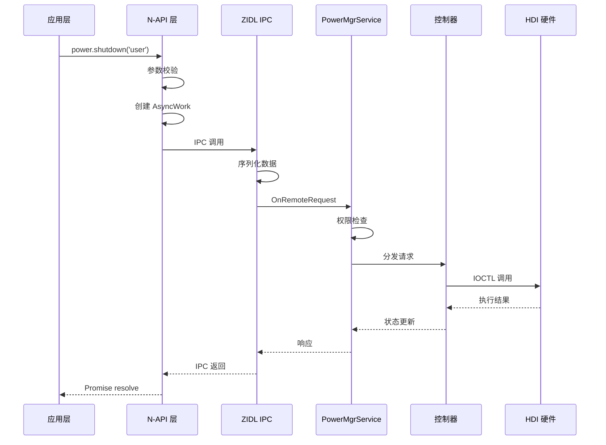
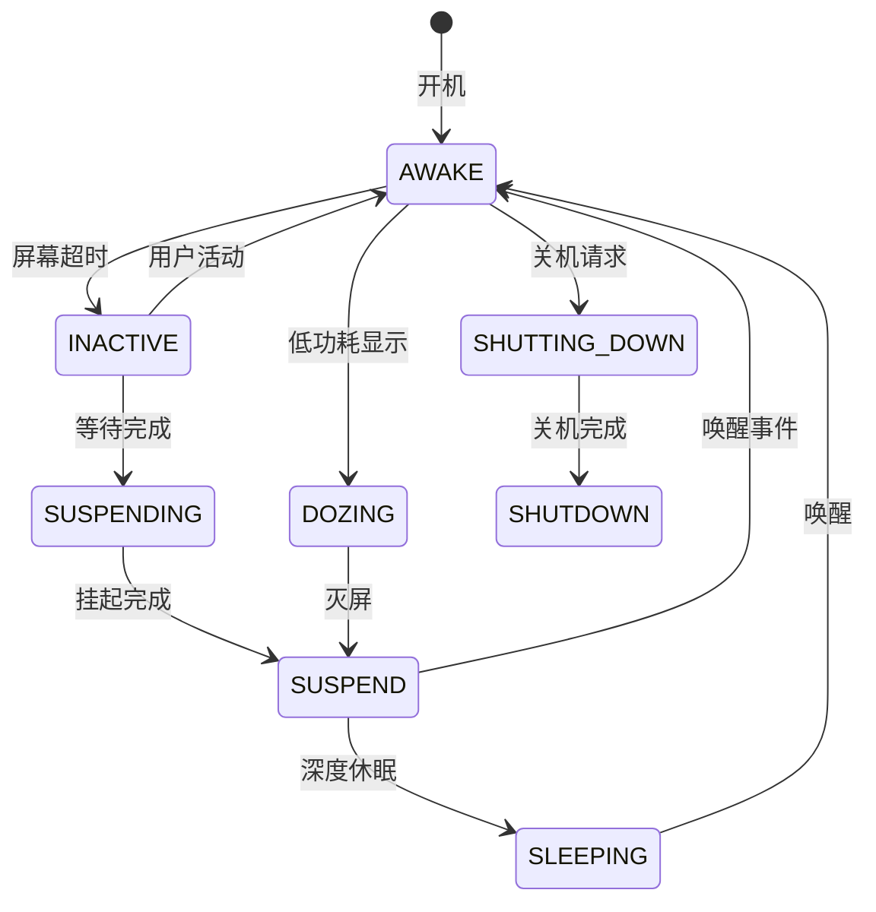
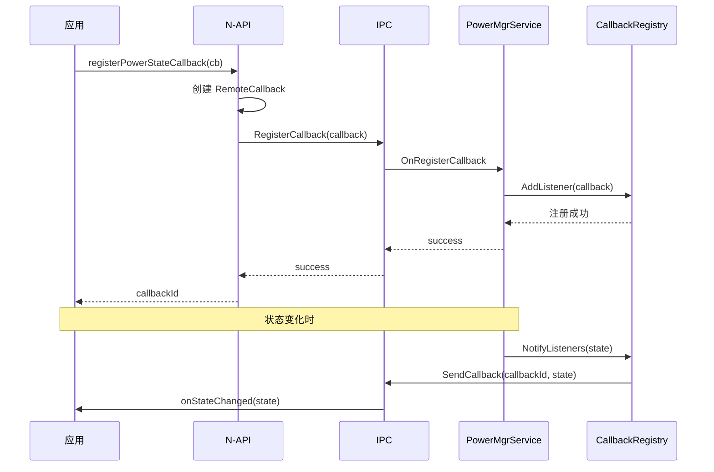

# 系统架构

本文档描述 Power Manager 模块的系统架构设计，包括分层架构、数据流向和关键组件交互。

## 1. 整体架构

### 1.1 架构图

```
┌─────────────────────────────────────────────────────────────────────────────┐
│                              APPLICATION LAYER                               │
│  ┌──────────────────┐  ┌──────────────────┐  ┌──────────────────┐          │
│  │ JS/TS Applications│  │ ArkTS Applications│  │ Cangjie Apps     │          │
│  └────────┬─────────┘  └────────┬─────────┘  └────────┬─────────┘          │
└───────────┼─────────────────────┼─────────────────────┼─────────────────────┘
            │                     │                     │
            └─────────────────────┴─────────────────────┘
                                  │
                                  ▼
┌─────────────────────────────────────────────────────────────────────────────┐
│                            FRAMEWORKS LAYER                                  │
│  ┌─────────────────────────────────────────────────────────────────────┐   │
│  │                          N-API (JavaScript/TypeScript)                │   │
│  │  ┌─────────────────┐  ┌─────────────────┐  ┌─────────────────┐      │   │
│  │  │  @ohos.power   │  │ @ohos.runningLock│  │   N-API Utils   │      │   │
│  │  │  (power_napi)  │  │ (runninglock_napi)│  │ (async, errors)│      │   │
│  │  └────────┬────────┘  └────────┬────────┘  └────────┬────────┘      │   │
│  └───────────┼─────────────────────┼─────────────────────┼────────────────┘   │
│              │                     │                     │                      │
│  ┌───────────┴─────────────────────┴─────────────────────┴────────────────┐  │
│  │                    ETS/Taihe (ArkTS Bindings)                           │  │
│  │  ┌─────────────────┐  ┌─────────────────┐                              │  │
│  │  │ power_napi.ts   │  │ runninglock_napi.ts│                            │  │
│  │  └─────────────────┘  └─────────────────┘                              │  │
│  └───────────────────────────────────────────────────────────────────────┘   │
│  ┌───────────────────────────────────────────────────────────────────────┐   │
│  │                    Cangjie FFI Bindings                                │   │
│  │  ┌─────────────────┐  ┌─────────────────┐                              │  │
│  │  │ cj_power_ffi    │  │ cj_runninglock_ffi│                            │  │
│  │  └─────────────────┘  └─────────────────┘                              │  │
│  └───────────────────────────────────────────────────────────────────────┘   │
│  ┌───────────────────────────────────────────────────────────────────────┐   │
│  │                    Native C++ Client                                    │   │
│  │  ┌─────────────────┐  ┌─────────────────┐  ┌─────────────────┐        │   │
│  │  │ PowerMgrClient │  │ RunningLock     │  │ ShutdownClient  │        │   │
│  │  └─────────────────┘  └─────────────────┘  └─────────────────┘        │   │
│  └───────────────────────────────────────────────────────────────────────┘   │
└───────────────────────────────────┬─────────────────────────────────────────┘
                                  │
                                  ▼
┌─────────────────────────────────────────────────────────────────────────────┐
│                         INTERFACES / INNER API                              │
│  ┌─────────────────────────────────────────────────────────────────────┐   │
│  │                    Public Client Interfaces                           │   │
│  │  ┌─────────────────┐  ┌─────────────────┐  ┌─────────────────┐      │   │
│  │  │power_mgr_client│  │  running_lock.h │  │ shutdown_client │      │   │
│  │  │     .h          │  │                 │  │     .h          │      │   │
│  │  └─────────────────┘  └─────────────────┘  └─────────────────┘      │   │
│  │  ┌─────────────────────────────────────────────────────────────────┐ │   │
│  │  │                 Callback Interfaces                              │ │   │
│  │  │  IPowerStateCallback │ IPowerModeCallback │ IShutdownCallback │ │   │
│  │  └─────────────────────────────────────────────────────────────────┘ │   │
│  └───────────────────────────────────────────────────────────────────────┘   │
└───────────────────────────────────┬─────────────────────────────────────────┘
                                  │
                                  ▼
┌─────────────────────────────────────────────────────────────────────────────┐
│                              SERVICES LAYER                                  │
│  ┌─────────────────────────────────────────────────────────────────────┐   │
│  │                      ZIDL (IPC Communication)                       │   │
│  │  ┌─────────────────┐  ┌─────────────────┐  ┌─────────────────┐      │   │
│  │  │   IPowerMgr    │  │   Stub Classes │  │  Proxy Classes  │      │   │
│  │  │   (Interface)  │  │   (Server)     │  │   (Client)      │      │   │
│  │  └─────────────────┘  └─────────────────┘  └─────────────────┘      │   │
│  └─────────────────────────────────────────────────────────────────────┘   │
│                                  │                                             │
│  ┌─────────────────────────────────────────────────────────────────────┐   │
│  │                 PowerMgrService (Core Service)                      │   │
│  │  ┌─────────────────────────────────────────────────────────────┐   │   │
│  │  │                  PowerStateMachine                          │   │   │
│  │  │    (121KB) - 核心状态机，管理所有电源状态转换                  │   │   │
│  │  └─────────────────────────────────────────────────────────────┘   │   │
│  │                                                                     │   │
│  │  ┌─────────────┐ ┌─────────────┐ ┌─────────────┐ ┌─────────────┐ │   │
│  │  │RunningLock  │ │  Suspend    │ │   Wakeup    │ │  Shutdown   │ │   │
│  │  │  Manager    │ │ Controller  │ │ Controller  │ │ Controller  │ │   │
│  │  └─────────────┘ └─────────────┘ └─────────────┘ └─────────────┘ │   │
│  │  ┌─────────────┐ ┌─────────────┐ ┌─────────────┐ ┌─────────────┐ │   │
│  │  │Power Mode  │ │ Proximity  │ │ Hibernate  │ │  ULSR      │ │   │
│  │  │  Module    │ │ Controller │ │ Controller │ │  Plugin    │ │   │
│  │  └─────────────┘ └─────────────┘ └─────────────┘ └─────────────┘ │   │
│  └─────────────────────────────────────────────────────────────────────┘   │
└───────────────────────────────────┬─────────────────────────────────────────┘
                                  │
                                  ▼
┌─────────────────────────────────────────────────────────────────────────────┐
│                               UTILITIES LAYER                                │
│  ┌─────────┐ ┌─────────┐ ┌─────────┐ ┌─────────┐ ┌─────────┐ ┌─────────┐  │
│  │  Common │ │   FFRT  │ │ Vibrator│ │Perm/Set │ │  Hook   │ │  Shell  │  │
│  │  Utils  │ │  Utils  │ │  Utils  │ │  Utils  │ │ Manager │ │ Commands│  │
│  └─────────┘ └─────────┘ └─────────┘ └─────────┘ └─────────┘ └─────────┘  │
└───────────────────────────────────┬─────────────────────────────────────────┘
                                  │
                                  ▼
┌─────────────────────────────────────────────────────────────────────────────┐
│                          HDI / HARDWARE LAYER                               │
│  ┌─────────────────────────────────────────────────────────────────────┐   │
│  │              drivers_interface_power (HDF)                          │   │
│  │  ┌─────────────────┐  ┌─────────────────┐  ┌─────────────────┐      │   │
│  │  │  Power HDI     │  │ Display Manager │  │ Input Manager   │      │   │
│  │  │  (IOCTL)       │  │  (Screen)       │  │  (Power Key)   │      │   │
│  │  └─────────────────┘  └─────────────────┘  └─────────────────┘      │   │
│  └─────────────────────────────────────────────────────────────────────┘   │
└─────────────────────────────────────────────────────────────────────────────┘
```

### 1.2 分层说明

| 层级 | 职责 | 关键技术 |
|------|------|----------|
| **应用层** | 业务调用 | JS/TS, ArkTS, Cangjie, Native |
| **框架层** | API 暴露与转换 | N-API, Taihe, Cangjie FFI |
| **接口层** | IPC 接口定义 | Inner API Headers |
| **服务层** | 核心业务逻辑 | PowerMgrService, State Machine |
| **工具层** | 公共能力支撑 | Utils, FFRT, Permissions |
| **HDI 层** | 硬件交互 | HDF Driver Interface |

---

## 2. 关键组件

### 2.1 PowerMgrService

**位置**: `services/native/src/power_mgr_service.cpp`

**类定义**: `services/native/include/power_mgr_service.h`

```cpp
class PowerMgrService : public SystemAbility, public PowerMgrServiceAdapter
```

**继承关系**:
```
SystemAbility
    ↓
PowerMgrService (单例模式)
    ↓
PowerMgrServiceAdapter (IPC 适配器)
```

**核心职责**:
- SA 生命周期管理 (OnStart/OnStop)
- 状态机协调
- 控制器协调
- 插件管理

### 2.2 PowerStateMachine

**位置**: `services/native/src/power_state_machine.cpp`

**代码规模**: 121KB (最大模块)

**电源状态定义**:

```cpp
enum class PowerState : uint32_t {
    AWAKE = 0,           // 活跃状态
    ACTIVE,              // 活跃状态
    INACTIVE,            // 非活跃
    SUSPENDING,          // 挂起中
    SUSPEND,             // 已挂起
    DOZING,              // 低功耗显示
    SLEEPING,            // 休眠中
    SHUTTING_DOWN,       // 关机中
    SHUTDOWN,            // 已关机
};
```

**状态转换**:
```
AWAKE/ACTIVE ←→ INACTIVE ←→ SUSPENDING ←→ SUSPEND ←→ SLEEPING
                ↑              ↓
                └──── DOZING ←┘

SHUTDOWN ← SHUTTING_DOWN ← INACTIVE
```

### 2.3 控制器模块

| 控制器 | 位置 | 职责 |
|--------|------|------|
| **RunningLock** | `services/native/src/runninglock/` | 后台任务保活锁管理 |
| **Suspend** | `services/native/src/suspend/` | 设备挂起控制 |
| **Wakeup** | `services/native/src/wakeup/` | 唤醒源管理 |
| **Shutdown** | `services/native/src/shutdown/` | 关机/重启控制 |
| **PowerMode** | `services/native/src/power_mode/` | 电源模式切换 |
| **Hibernate** | `services/native/src/hibernate/` | 休眠支持 |
| **Proximity** | `services/native/src/proximity_sensor_controller/` | 距离感应控制 |

---

## 3. 数据流向

### 3.1 API 调用流程



### 3.2 状态变更流程



---

## 4. IPC 通信架构

### 4.1 ZIDL 模式

```
┌─────────────────────────────────────────────────────────────┐
│                    ZIDL 三层架构                             │
│                                                              │
│  ┌─────────────────────────────────────────────────────┐  │
│  │                   Interface                         │  │
│  │         IRemoteBroker (纯虚接口)                     │  │
│  │         DECLARE_INTERFACE_DESCRIPTOR                │  │
│  └─────────────────────────────────────────────────────┘  │
│                           │                                 │
│             ┌─────────────┴─────────────┐                 │
│             ▼                           ▼                 │
│  ┌─────────────────────┐   ┌─────────────────────┐      │
│  │       Stub          │   │       Proxy         │      │
│  │   (服务端实现)       │   │   (客户端存根)       │      │
│  │  IRemoteStub<T>    │   │  IRemoteProxy<T>    │      │
│  └─────────────────────┘   └─────────────────────┘      │
│                           │                                 │
│  IPC 通信 (Binder Driver)                                  │
└─────────────────────────────────────────────────────────────┘
```

### 4.2 接口列表

| 接口名 | 描述 | 方向 |
|--------|------|------|
| `IPowerMgrAsync` | 电源管理异步接口 | Client ↔ Service |
| `IPowerStateCallback` | 电源状态变化回调 | Service → Client |
| `IPowerModeCallback` | 电源模式变化回调 | Service → Client |
| `IPowerRunninglockCallback` | 运行锁变化回调 | Service → Client |
| `IScreenOffPreCallback` | 灭屏前回调 | Service → Client |
| `ISyncSleepCallback` | 同步休眠回调 | Service → Client |
| `ISyncHibernateCallback` | 同步休眠回调 | Service → Client |
| `ITakeOverSuspendCallback` | 接管挂起回调 | Service → Client |
| `IAsyncShutdownCallback` | 异步关机回调 | Service → Client |
| `ISyncShutdownCallback` | 同步关机回调 | Service → Client |
| `ITakeOverShutdownCallback` | 接管关机回调 | Service → Client |

**代码位置**: `services/zidl/include/`

---

## 5. 线程模型

### 5.1 线程划分

```
┌─────────────────────────────────────────────────────────────┐
│                      线程模型                               │
│                                                              │
│  ┌───────────────────────────────────────────────────────┐  │
│  │                   主线程                              │  │
│  │  - SA OnStart/OnStop                                │  │
│  │  - 状态机事件处理                                     │  │
│  │  - 控制器协调                                         │  │
│  └───────────────────────────────────────────────────────┘  │
│                                                              │
│  ┌───────────────────────────────────────────────────────┐  │
│  │                 FFRT 线程池                           │  │
│  │  - 异步操作执行                                       │  │
│  │  - 回调通知                                           │  │
│  │  - 延迟任务                                           │  │
│  └───────────────────────────────────────────────────────┘  │
│                                                              │
│  ┌───────────────────────────────────────────────────────┐  │
│  │                 N-API 线程池 (libuv)                   │  │
│  │  - JS 异步回调                                        │  │
│  │  - Promise 完成处理                                   │  │
│  └───────────────────────────────────────────────────────┘  │
│                                                              │
│  ┌───────────────────────────────────────────────────────┐  │
│  │                   HDI 线程                            │  │
│  │  - 同步 IOCTL 调用                                    │  │
│  │  - 硬件响应处理                                       │  │
│  └───────────────────────────────────────────────────────┘  │
└─────────────────────────────────────────────────────────────┘
```

### 5.2 线程同步

**锁机制**:
- `std::mutex`: 状态机状态保护
- `std::recursive_mutex`: 运行锁计数保护
- `std::atomic`: 简单状态标志

**代码位置**: `services/native/include/power_mgr_service.h`

---

## 6. 回调机制

### 6.1 回调类型

| 回调类型 | 触发时机 | 传递数据 |
|----------|----------|----------|
| **StateCallback** | 电源状态变化 | 新状态、原因 |
| **ModeCallback** | 电源模式变化 | 新模式 |
| **ShutdownCallback** | 关机/重启 | 原因、是否重启 |
| **SuspendCallback** | 挂起/唤醒 | 状态、原因 |
| **RunningLockCallback** | 锁状态变化 | 锁信息 |

### 6.2 回调注册流程



---

## 7. 插件机制

### 7.1 Hook Manager

**位置**: `utils/hookmgr/`

**功能**: 插件钩子管理，允许外部模块注入回调

```cpp
class PowerHookMgr {
    RegisterHook(HookType type, HookCallback cb);
    UnregisterHook(HookId id);
    NotifyHooks(HookType type, HookData data);
};
```

### 7.2 ULSR Plugin

**位置**: `services/native/src/ulsr/`

**功能**: Ultra-Low State Recovery，超低功耗状态恢复

### 7.3 外部扩展路径

```cpp
// 插件加载路径
const char* POWER_PLUGIN_AUTORUN_PATH = "/system/lib/powerplugin/autorun";

// 动态库扩展
const char* POWER_MANAGER_EXT_PATH = "libpower_manager_ext.z.so";
```

**代码位置**: `services/native/src/power_mgr_service.cpp:75-87`

---

## 8. 依赖外部系统

### 8.1 System Abilities

| SA ID | 名称 | 依赖类型 |
|-------|------|----------|
| 3301 | PowerMgrService | **自身** |
| 3308 | DisplayManager | 监听 |
| 2801 | SuspendManager | 监听 |
| 3801 | DeviceStandby | 监听 |
| - | MSDP Movement | 可选 |
| - | MSDP Motion | 可选 |
| - | CommonEventService | 监听 |

**代码位置**: `services/native/src/power_mgr_service.cpp:132-142`

### 8.2 HDI 接口

```cpp
// Power HDI
#include <drivers_interface_power.h>

// 使用
int32_t ret = PowerHdi->Suspend(isImmediate);
```

---

## 9. 配置与资源

### 9.1 配置文件

| 配置文件 | 位置 | 用途 |
|----------|------|------|
| power_mode_config.xml | `services/native/profile/` | 电源模式配置 |
| power_suspend.json | `services/native/profile/` | 挂起配置 |
| power_wakeup.json | `services/native/profile/` | 唤醒配置 |
| power_vibrator.json | `services/native/profile/` | 振动配置 |

### 9.2 系统参数

**位置**: `utils/param/`

```cpp
// 示例参数
const std::string SCREEN_OFF_TIMEOUT = "persist.sys.screen_off_timeout";
const std::string POWER_MODE = "persist.sys.power_mode";
```

---

## 10. 关键文件索引

| 功能 | 文件路径 |
|------|----------|
| 架构概览 | `README.md` |
| 状态机 | `services/native/src/power_state_machine.cpp` |
| 主服务 | `services/native/src/power_mgr_service.cpp` |
| 运行锁 | `services/native/src/runninglock/running_lock_mgr.cpp` |
| 挂起控制 | `services/native/src/suspend/suspend_controller.cpp` |
| IPC 接口 | `services/zidl/include/` |
