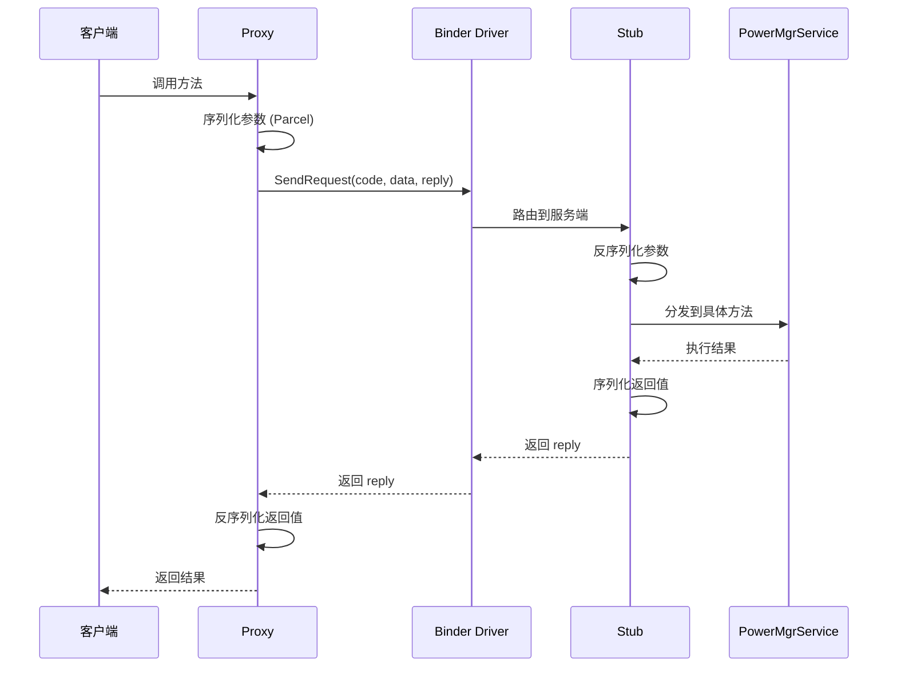
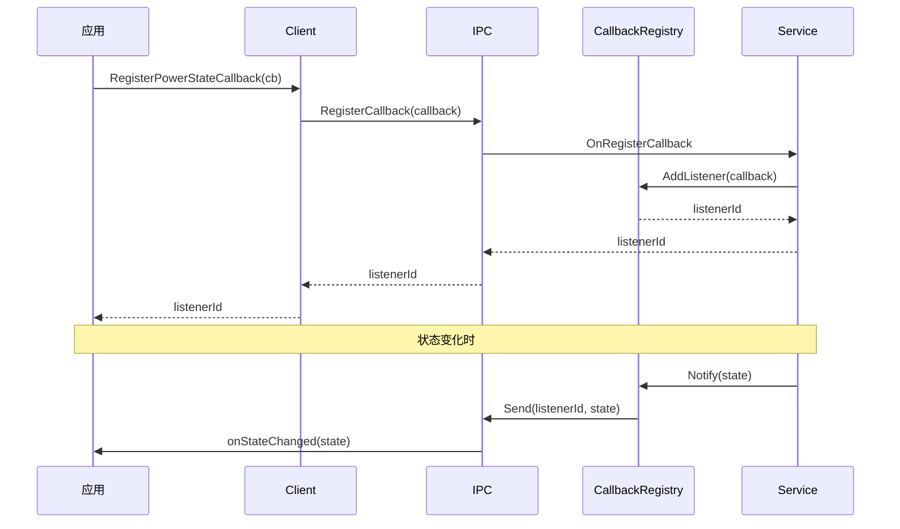

# SA/IPC 通信架构

本文档描述 Power Manager 模块的 System Ability (SA) 架构和 IPC 通信机制。

## 1. System Ability 概述

### 1.1 SA ID

| 属性 | 值 |
|------|-----|
| **SA ID** | `POWER_MANAGER_SERVICE_ID = 3301` |
| **进程名** | `powermgr` |
| **库文件** | `libpowermgrservice.z.so` |
| **启动方式** | 自动启动 (Auto-start) |

### 1.2 SA Profile

**配置文件**: `sa_profile/3301.json`

```json
{
  "name": "PowerMgrService",
  "libPath": "libpowermgrservice.z.so",
  "runOnCreate": true,
  "dumpLevel": 1
}
```

**关键属性**:
- `runOnCreate`: true - 系统启动时自动运行
- `dumpLevel`: 1 - 支持 dumpsys 命令

---

## 2. SA 注册与生命周期

### 2.1 服务注册

**代码位置**: `services/native/src/power_mgr_service.cpp:114`

```cpp
PowerMgrService::PowerMgrService() : SystemAbility(POWER_MANAGER_SERVICE_ID, true)
{
    // 配置是否在创建时运行
}

const bool G_REGISTER_RESULT = SystemAbility::MakeAndRegisterAbility(pms.GetRefPtr());
```

**注册流程**:
```
1. 构造函数调用 SystemAbility(SA_ID, true)
2. OnStart() 被调用
3. Init() 执行初始化
4. Publish() 发布服务
5. MakeAndRegisterAbility() 完成注册
```

### 2.2 生命周期方法

```cpp
class PowerMgrService : public SystemAbility
{
protected:
    void OnStart() override;           // 启动
    void OnStop() override;            // 停止
    void OnDump(const std::vector<std::string>& args,
                std::string& result) override; // 调试信息

    // IPC 适配器
    void OnRemoteRequest(uint32_t code,
        MessageParcel& data,
        MessageParcel& reply,
        MessageOption& option) override;
};
```

### 2.3 OnStart 初始化

**代码位置**: `services/native/src/power_mgr_service.cpp:118-151`

```cpp
void PowerMgrService::OnStart()
{
    if (ready_) {
        return;  // 已初始化
    }

    // 1. 扫描插件
    g_moduleMgr = ModuleMgrScan(POWER_PLUGIN_AUTORUN_PATH);

    // 2. 执行初始化
    if (!Init()) {
        return;
    }

    // 3. 监听其他 SA
    AddSystemAbilityListener(SUSPEND_MANAGER_SYSTEM_ABILITY_ID);
    AddSystemAbilityListener(DEVICE_STANDBY_SERVICE_SYSTEM_ABILITY_ID);
    AddSystemAbilityListener(DISPLAY_MANAGER_SERVICE_ID);
    AddSystemAbilityListener(DISPLAY_MANAGER_SERVICE_SA_ID);
    // ... 其他监听

    // 4. 注册 HDI 监听
    SystemSuspendController::GetInstance().RegisterHdiStatusListener();

    // 5. 发布服务
    if (!Publish(DelayedSpSingleton<PowerMgrService>::GetInstance())) {
        return;  // 发布失败
    }
}
```

---

## 3. IPC 通信架构

### 3.1 ZIDL 三层模式

```
┌─────────────────────────────────────────────────────────────────┐
│                    ZIDL IPC 通信架构                              │
│                                                                  │
│   ┌─────────────────────────────────────────────────────────┐  │
│   │                    Interface Layer                       │  │
│   │       IRemoteBroker (DECLARE_INTERFACE_DESCRIPTOR)      │  │
│   └────────────────────────┬──────────────────────────────────┘  │
│                            │                                     │
│            ┌───────────────┴───────────────┐                   │
│            ▼                               ▼                   │
│   ┌─────────────────────┐     ┌─────────────────────┐        │
│   │    Stub (服务端)    │     │   Proxy (客户端)    │        │
│   │  IRemoteStub<T>   │     │  IRemoteProxy<T>    │        │
│   │  OnRemoteRequest() │     │   SendRequest()     │        │
│   └─────────────────────┘     └─────────────────────┘        │
│                            │                                     │
│              ═══════════════╧═══════════════                   │
│                      Binder Driver                              │
└─────────────────────────────────────────────────────────────────┘
```

### 3.2 接口描述符

所有接口使用统一的描述符格式：

```cpp
// 格式
DECLARE_INTERFACE_DESCRIPTOR(u"ohos.powermgr.IInterfaceName");

// 示例
DECLARE_INTERFACE_DESCRIPTOR(u"ohos.powermgr.IPowerMgrAsync");
DECLARE_INTERFACE_DESCRIPTOR(u"ohos.powermgr.IPowerStateCallback");
DECLARE_INTERFACE_DESCRIPTOR(u"ohos.powermgr.IPowerModeCallback");
```

### 3.3 接口清单

| 接口名 | 描述 | Stub | Proxy |
|--------|------|------|-------|
| `IPowerMgrAsync` | 电源管理异步接口 | PowerMgrStubAsync | PowerMgrProxyAsync |
| `IPowerStateCallback` | 状态回调 | PowerStateCallbackStub | PowerStateCallbackProxy |
| `IPowerModeCallback` | 模式回调 | PowerModeCallbackStub | PowerModeCallbackProxy |
| `IPowerRunninglockCallback` | 运行锁回调 | PowerRunningLockCallbackStub | PowerRunningLockCallbackProxy |
| `IScreenOffPreCallback` | 灭屏前回调 | ScreenOffPreCallbackStub | ScreenOffPreCallbackProxy |
| `ISyncSleepCallback` | 同步休眠回调 | SyncSleepCallbackStub | SyncSleepCallbackProxy |
| `ISyncHibernateCallback` | 同步休眠回调 | SyncHibernateCallbackStub | SyncHibernateCallbackProxy |
| `ITakeOverSuspendCallback` | 接管挂起回调 | TakeOverSuspendCallbackStub | TakeOverSuspendCallbackProxy |
| `IAsyncShutdownCallback` | 异步关机回调 | AsyncShutdownCallbackStub | AsyncShutdownCallbackProxy |
| `ISyncShutdownCallback` | 同步关机回调 | SyncShutdownCallbackStub | SyncShutdownCallbackProxy |
| `ITakeOverShutdownCallback` | 接管关机回调 | TakeOverShutdownCallbackStub | TakeOverShutdownCallbackProxy |

---

## 4. 客户端连接

### 4.1 获取服务代理

**代码位置**: `frameworks/native/power_mgr_client.cpp`

```cpp
// 获取 SA 管理器
sptr<ISystemAbilityManager> sam = SystemAbilityManagerClient::GetInstance().GetSystemAbilityManager();

// 获取 PowerMgrService
sptr<IRemoteObject> remoteObject = sam->CheckSystemAbility(POWER_MANAGER_SERVICE_ID);

// 转换为代理
auto proxy_ = iface_cast<IPowerMgr>(remoteObject);
```

### 4.2 IPC 调用流程



---

## 5. OnRemoteRequest 处理

### 5.1 Stub 消息分发

**代码位置**: `services/zidl/src/power_state_callback_stub.cpp`

```cpp
int PowerStateCallbackStub::OnRemoteRequest(uint32_t code,
    MessageParcel& data, MessageParcel& reply, MessageOption& option)
{
    // 1. 接口令牌校验
    std::u16string descripter = PowerStateCallbackStub::GetDescriptor();
    std::u16string remoteDescripter = data.ReadInterfaceToken();
    if (descripter != remoteDescripter) {
        return E_GET_POWER_SERVICE_FAILED;
    }

    // 2. 根据 code 分发
    switch (code) {
        case static_cast<uint32_t>(IPowerStateCallback::ON_POWER_STATE_CHANGED):
            // 处理状态变化
            break;
        default:
            break;
    }

    return ERR_NONE;
}
```

### 5.2 IPC Code 定义

```cpp
// IPC 接口代码示例
enum class PowerStateCallbackInterfaceCode {
    ON_POWER_STATE_CHANGED = 0,
};
```

---

## 6. 回调注册机制

### 6.1 回调注册流程



### 6.2 回调注册方法

| 方法 | 参数 | 返回值 |
|------|------|--------|
| `RegisterPowerStateCallback` | IPowerStateCallback | callbackId |
| `RegisterPowerModeCallback` | IPowerModeCallback | callbackId |
| `RegisterShutdownCallback` | IShutdownCallback | callbackId |

---

## 7. 依赖的其他 SA

### 7.1 监听的 SA

```cpp
// services/native/src/power_mgr_service.cpp:132-142
AddSystemAbilityListener(SUSPEND_MANAGER_SYSTEM_ABILITY_ID);
AddSystemAbilityListener(DEVICE_STANDBY_SERVICE_SYSTEM_ABILITY_ID);
AddSystemAbilityListener(DISPLAY_MANAGER_SERVICE_ID);
AddSystemAbilityListener(DISPLAY_MANAGER_SERVICE_SA_ID);
#ifdef MSDP_MOVEMENT_ENABLE
AddSystemAbilityListener(MSDP_MOVEMENT_SERVICE_ID);
#endif
#ifdef POWER_PICKUP_ENABLE
AddSystemAbilityListener(MSDP_MOTION_SERVICE_ID);
#endif
AddSystemAbilityListener(COMMON_EVENT_SERVICE_ID);
```

### 7.2 SA ID 映射

| SA ID | 名称 | 用途 |
|-------|------|------|
| 3301 | PowerMgrService | **自身** |
| 3308 | DisplayManager | 屏幕状态 |
| 2801 | SuspendManager | 挂起管理 |
| 3801 | DeviceStandby | 设备待机 |
| - | CommonEventService | 公共事件 |

---

## 8. IPC 性能考量

### 8.1 异步操作

对于耗时操作，使用异步 IPC：

```cpp
// 异步 IPC 示例
void AsyncCall()
{
    auto callback = [&](int32_t result) {
        // 处理结果
    };
    proxy_->AsyncCall(params, callback);
}
```

### 8.2 批量操作

减少 IPC 调用次数：

```cpp
// 批量查询
auto info = proxy_->GetStateMachineInfo();
```

---

## 9. 错误处理

### 9.1 IPC 错误码

| 错误码 | 说明 |
|--------|------|
| 0 | 成功 |
| -1 | 失败 |
| 401 | 参数错误 |
| 4603001 | IPC 通信失败 |

### 9.2 断开连接处理

```cpp
// Death recipient
class PowerMgrDeathRecipient : public IRemoteObject::DeathRecipient
{
    void OnRemoteDied(const wptr<IRemoteObject>& remote)
    {
        // 服务断开，重连
        Reconnect();
    }
};
```

---

## 10. 关键文件

| 功能 | 文件路径 |
|------|----------|
| 服务主类 | `services/native/include/power_mgr_service.h` |
| 服务实现 | `services/native/src/power_mgr_service.cpp` |
| IPC 适配器 | `services/native/include/power_mgr_ipc_adapter.h` |
| Stub 基类 | `services/zidl/include/power_mgr_async_reply_stub.h` |
| Proxy 基类 | `services/zidl/include/power_mgr_async_reply_proxy.h` |
| 客户端连接 | `frameworks/native/power_mgr_client.cpp` |
| SA 配置 | `sa_profile/3301.json` |

---

## 11. 调试命令

```bash
# 查看 SA 状态
hdc shell sa_ps | grep powermgr

# dumpsys 查看服务状态
hdc shell dumpsys power

# 查看 IPC 调用
hdc shell cat /proc/power_mgr/ipc_log

# 调试模式启动
hdc shell power_mgr -d
```
